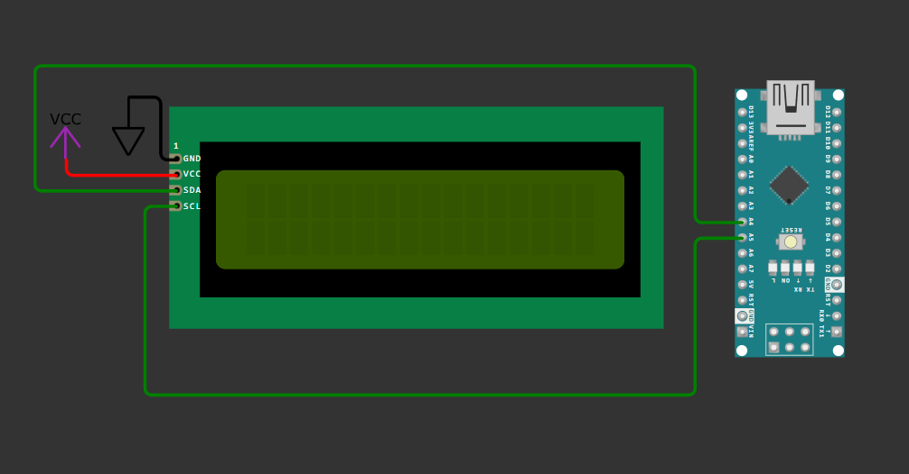

???+ Abstract "Table of Contents"

    [TOC]


## Abstract

In this article, we will learn how to interface a 16×2 I2C LCD display with an Arduino Nano. Unlike the traditional parallel LCD interface, the I2C LCD uses only **two communication wires**, making the wiring simple, clean, and ideal for compact projects.

By the end of this tutorial, you will be able to display text on a 16×2 LCD using the Arduino Nano, understand the hardware connections, write the Arduino program, and verify the output using hardware or simulation.

## :compass: Pre-Request

- OS : Windows / Linux / Mac / Chrome
- Arduino IDE 

## Hardware Required

<!-- Advertisement -->
--8<-- "includes/arduino-link-cta.md"


- Arduino Nano. 
- 16x2 I2C LCD display.
- Resistors.
- BreadBoard.
- Mini USB Cable.
- Connecting wires.
- 5V DC power supply (Optional)

| Components | Purchase Link |
| -- | -- |
| Arduino Nano | [link](#) |
| 16x2 I2C LCD | [link](https://amzn.to/47ASZ2e) |
| Mini USB Cable | [link](#) |
| BreadBoard | [large](https://amzn.to/4pgNX1c) : [small](https://amzn.to/47SMzvB)|
| Connecting Wires | [link](https://amzn.to/4pepr0H) |
| 5V DC Adaptor | [link](https://amzn.to/4m82t8D) |

!!! tip "Don't own a hardware :cry:"

    No worries,

    💡Still you can learn using simulation. check out simulation part :smiley:.

    💡Power your mission with reliable Arduino Kits. [Explore :simple-arduino: Hardware →](https://www.skilldisk.com/category/arduino){target="_blank"}

<!-- Nano Craft Advertisement -->
--8<-- "includes/nano-craft-cta.md"

### Understanding I2C LCD Display

An I2C LCD uses an onboard PCF8574 I/O expander, which converts I2C signals into parallel data for the LCD controller. This drastically reduces the number of pins required.

Advantages of I2C LCD

- Uses only 2 data lines (SDA & SCL)
- Saves GPIO pins on Arduino
- Clean wiring
- Ideal for scalable projects


### Connection Table

| I2C LCD Pin | Arduino Nano Pin |
| ----------- | ---------------- |
| VCC         | 5V               |
| GND         | GND              |
| SDA         | A4               |
| SCL         | A5               |


!!! Note
    💡 Most I2C LCD modules have a contrast adjustment potentiometer on the back.


/// caption
fig-Connection Diagram
///

## :open_file_folder: Code


!!! info
    Before writing the main program, it is important to know the I2C address of your LCD module (commonly 0x27 or 0x3F).


=== "main.py"
    ```arduino linenums="1"

    #include <Wire.h>
    #include <LiquidCrystal_I2C.h>

    // I2C address (change if required)
    LiquidCrystal_I2C lcd(0x27, 16, 2);

    void setup() {
      lcd.init();       // Initialize LCD
      lcd.backlight();  // Turn on backlight

      lcd.setCursor(0, 0);
      lcd.print("Welcome to");
      lcd.setCursor(0, 1);
      lcd.print("Aavishkarah");
      delay(3000);
    }

    void loop() {
      for(int i = 0; i < 10; i++) {
        lcd.clear();
        lcd.print(i);
        delay(1500);
      }
    }


    ```


### Code Explanation

Let’s break down the Arduino sketch **line by line** to clearly understand how the 16×2 I2C LCD works with the Arduino Nano.

:point_right: Imports


```cpp linenums="1"
#include <Wire.h>
#include <LiquidCrystal_I2C.h>

```

- `Wire.h`
    Enables I2C communication between the microcontroller and external devices.
- `LiquidCrystal_I2C.h`
    Provides easy-to-use functions to control a 16×2 LCD via I2C, such as printing text, clearing the screen, and moving the cursor.

💡 These libraries hide the low-level I2C complexity and make LCD control simple.

:point_right: Define LCD Pin Connections

```cpp linenums="5"
LiquidCrystal_I2C lcd(0x27, 16, 2);

```

* `0x27` → I2C address of the LCD module
  (Common addresses are `0x27` or `0x3F`)
* `16` → Number of columns
* `2` → Number of rows

This line creates an LCD object named **`lcd`**, which will be used to control the display throughout the program.

:point_right: Initialize the LCD

```cpp linenums="8"
  lcd.init();
  lcd.backlight();
```

* Initializes the LCD and internally:
    * Starts I2C communication
    * Configures the LCD controller
* This step is **mandatory** before using any LCD functions.
* Enables the LCD backlight so text becomes visible.

!!! Note:
    The I2C pins (SDA & SCL) are automatically handled by the `Wire` library.


:point_right: Display Content

```cpp linenums="11"
  lcd.setCursor(0, 0);
  lcd.print("Welcome to");
  lcd.setCursor(0, 1);
  lcd.print("Aavishkarah");
  delay(3000);

```

* `lcd.setCursor(0,0)` Positions the cursor at:
    * Column `0`
    * Row `0` (first row)
* LCD row numbering starts from **0**, not 1.
* `lcd.print` Displays the text **“Welcome to”** starting from the first column of the first row.
* `lcd.setCursor(0,1)` Moves the cursor to:
    * Column `0`
    * Row `1` (second row)
* `lcd.print`Displays **“Aavishkarah”** on the second line of the LCD.
* `delay(3000)` Pauses execution for **3000 milliseconds (3 seconds)**.
* Keeps the welcome message visible before entering the loop.


:point_right: Display 0-9 continuously

```cpp linenums="19"
  for(int i = 0; i < 10; i++) {
    lcd.clear();
    lcd.print(i);
    delay(1500);
  }
```

* `for` loop
    * Initializes a variable `i`
    * Counts from **0 to 9**
* `lcd.clear()`
    * Clears the entire LCD screen.
    * Prevents overlapping of previous characters.
* `lcd.print(i)`
    * Prints the current value of `i` on the LCD.
    * Numbers appear one by one (0 → 9).
* `delay(1500)`
    * Holds each number on the display for **1.5 seconds**.
* After displaying `9`, the loop restarts from `0`.
* Creates an **infinite counting display** on the LCD.

!!! tip "Try It"
    - Alter the output content on the display by passing your data argument to the `lcd.print()` method.

---

## :material-chart-bubble:{style="color:#ffaa00"} Simulation

!!! danger "Not able to view the simulation"
    - :fontawesome-solid-laptop: Desktop or Laptop : Reload this page ( ++ctrl+r++ )
    - :fontawesome-solid-mobile: Mobile : Use Landscape Mode and reload the page


<iframe style="height:calc(100vh - 200px); border-color:#00aaff;border-radius:1rem;min-height:400px" src="https://wokwi.com/projects/450769336751904769" frameborder="2px" width="100%" height="700px"></iframe>

<!-- Advertisement -->
--8<-- "includes/arduino-link-cta.md"

--8<-- "includes/nano-craft-cta.md"

---

## :material-web-plus: Extras

### Components details

- Arduino Nano [Data Sheet](../blink-an-led-on-arduino-nano/files/nano-datasheet.pdf){target="_blank"}
- 16x2 LCD Display [Data Sheet](https://components101.com/sites/default/files/component_datasheet/16x2%20LCD%20Datasheet.pdf){target="_blank"} 

### Modules / Libraries Used

- LiquidCrystal_I2C.h
    - It provides ready-to-use functions to control 16×2 I2C LCD displays such as `print()`, `clear()`, `setCursor()` etc.,
    - [More info](https://www.arduinolibraries.info/libraries/liquid-crystal-i2-c){target="_blank"} 
    - [Github Source Code](https://github.com/johnrickman/LiquidCrystal_I2C){target="_blank"} 