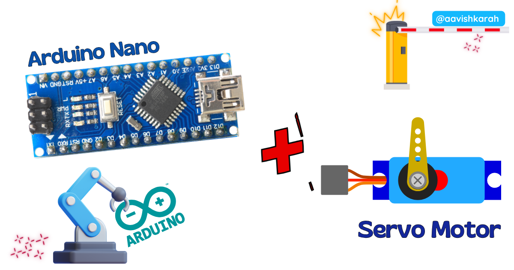
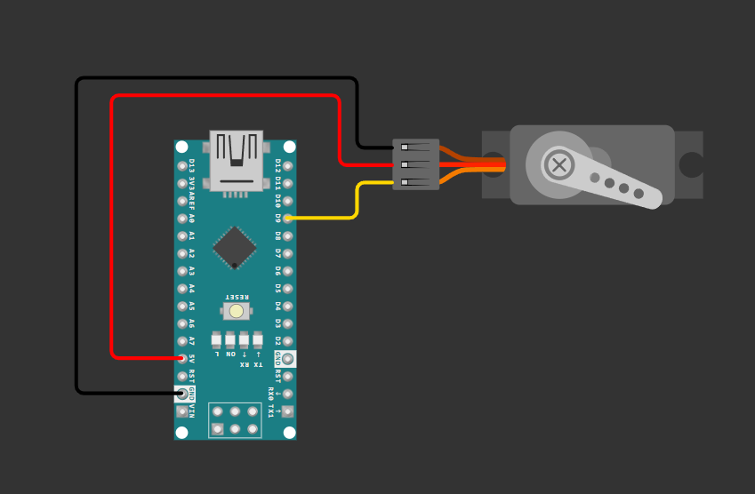

???+ Abstract "Table of Contents"

    [TOC]


## Abstract

Servo motors are precise, compact actuators widely used in robotics, automation, and DIY electronics projects. In this tutorial, you will learn how to interface a standard SG90/MG996R servo motor with an Arduino Nano using the Arduino IDE and the built-in `Servo.h` library. By the end, you will be able to control servo angle programmatically, create smooth motion sequences, and integrate servos into your own embedded projects.

## :compass: Pre-Request

- OS : Windows / Linux / Mac / Chrome
- Arduino IDE 

## Hardware Required

<!-- Advertisement -->
--8<-- "includes/arduino-link-cta.md"


- Arduino Nano. 
- Servo Motor (SG90)
- BreadBoard.
- Mini USB Cable.
- Connecting wires.
- 5V DC power supply (Optional)

| Components | Purchase Link |
| -- | -- |
| Arduino Nano | [link](https://www.skilldisk.com/product-page/pico-iot-spark-kit) |
| Servo Motor (SG90) | [link](https://www.skilldisk.com/product-page/pico-iot-spark-kit) |
| Mini USB Cable | [link](https://www.skilldisk.com/product-page/pico-iot-spark-kit) |
| BreadBoard | [large](https://amzn.to/4pgNX1c) : [small](https://amzn.to/47SMzvB)|
| Connecting Wires | [link](https://amzn.to/4pepr0H) |
| 5V DC Adaptor | [link](https://amzn.to/4m82t8D) |

!!! tip "Don't own a hardware :cry:"

    No worries,

    💡Still you can learn using simulation. check out simulation part :smiley:.

    💡Power your mission with reliable Arduino Kits. [Explore :simple-arduino: Hardware →](https://www.skilldisk.com/category/arduino){target="_blank"}

<!-- Nano Craft Advertisement -->
--8<-- "includes/nano-craft-cta.md"

## ⚡ Understanding Servo Motors (PWM Control)

A **servo motor** is a closed-loop actuator that uses **PWM (Pulse Width Modulation)** signals to control angular position precisely between 0° to 180° (standard servos) or 0° to 270° (continuous rotation variants).

📌 **Why Use Servo with Arduino Nano?**

- Precise angular control 🎯
- Simple 3-wire interface 🔌
- Built-in Arduino `Servo.h` library support 📚
- Ideal for robotic arms, camera gimbals, valve control 🤖
- Low cost and beginner friendly 💡

📌 **How PWM Controls Servo Angle:**

| Pulse Width | Approximate Angle |
|-------------|------------------|
| 1000 µs | 0° |
| 1500 µs | 90° (Neutral) |
| 2000 µs | 180° |

Arduino's `Servo` library abstracts PWM timing, letting you control angle directly with `servo.write(angle)`.

---

## 🧷 Connection / Wiring Guide (Arduino Nano to Servo)

Servo motors have 3 wires:

- 🔴 **Red** → VCC (5V)
- 🟤 **Brown/Black** → GND
- 🟡 **Orange/Yellow** → Signal (PWM Pin)

### 🔥 Arduino Nano to Servo Pin Mapping

| Servo Wire | Arduino Nano Pin | Description |
|------------|------------------|-------------|
| Red (VCC) | 5V (or External 5V) | Power supply |
| Brown (GND) | GND | Common ground |
| Orange (Signal) | D3, D5, D6, D9, D10, D11 | PWM-capable digital pin |

!!! warning "Power Consideration"
    Arduino Nano's 5V pin can supply ~500mA max. SG90 draws ~100-250mA (safe). MG996R can draw >1A under load — **use external 5V supply** and connect GNDs together.

!!! info 
    Use PWM-capable pins (~) for servo signal. Arduino Nano PWM pins: **D3, D5, D6, D9, D10, D11**. Pin **D9** is  used in this example.


/// caption
fig-Connection Diagram
///

## :open_file_folder: Code


!!! info
    Install Servo Library from Arduino Library Manager.


```arduino linenums="1"

#include <Servo.h>

// --- Configuration ---
#define SERVO_PIN     9           // PWM pin connected to servo signal wire
#define MIN_ANGLE     0           // Minimum servo angle (degrees)
#define MAX_ANGLE     180         // Maximum servo angle (degrees)
#define STEP_DELAY    500        // Delay between angle changes (milliseconds)
#define STEP_ANGLE    10         // Step Angle change (degrees)

// Create servo object
Servo myServo;

// ============================================
// Setup Function - Runs once at startup
// ============================================
void setup() {
  // Initialize serial communication for debugging
  Serial.begin(9600);
  Serial.println("=== Servo Motor Control Started ===");
  
  // Attach servo to the defined PWM pin
  myServo.attach(SERVO_PIN);
  Serial.println("Servo attached to pin " + String(SERVO_PIN));
  
  // Move servo to initial neutral position (90°)
  myServo.write(90);
  Serial.println("Servo moved to neutral position (90°)");
  delay(1000);  // Allow servo time to reach position
}

// ============================================
// Main Loop Function - Runs repeatedly
// ============================================
void loop() {
  // === Sweep Forward: MIN_ANGLE → MAX_ANGLE ===
  Serial.println("\n--- Sweeping Forward ---");
  for (int angle = MIN_ANGLE; angle <= MAX_ANGLE; angle = angle + STEP_ANGLE) {
    myServo.write(angle);                    // Set servo angle
    Serial.print("Angle: ");
    Serial.print(angle);
    Serial.println("°");
    delay(STEP_DELAY);                       // Wait for servo to reach position
  }
  
  // === Sweep Backward: MAX_ANGLE → MIN_ANGLE ===
  Serial.println("\n--- Sweeping Backward ---");
  for (int angle = MAX_ANGLE; angle >= MIN_ANGLE; angle = angle - STEP_ANGLE) {
    myServo.write(angle);                    // Set servo angle
    Serial.print("Angle: ");
    Serial.print(angle);
    Serial.println("°");
    delay(STEP_DELAY);                       // Wait for servo to reach position
  }
}

```


## 🧠 Code Explanation

Let's break down the code section by section.

:point_right: Include Servo Library

```cpp
#include <Servo.h>
```

- Imports Arduino's built-in `Servo` library for PWM-based servo control.
- Handles timing and pulse generation automatically.

:point_right: Configuration Macros

```cpp
#define SERVO_PIN     9
#define MIN_ANGLE     0
#define MAX_ANGLE     180
#define STEP_DELAY    1000
#define STEP_ANGLE    10        
```

| Macro | Purpose |
|-------|---------|
| `SERVO_PIN` | Digital PWM pin connected to servo signal wire |
| `MIN_ANGLE` / `MAX_ANGLE` | Defines servo rotation range |
| `STEP_DELAY` | Controls sweep speed (higher = slower motion) |
| `STEP_ANGLE` | Defines sweep angle |

:point_right: Servo Object Declaration

```cpp
Servo myServo;
```

- Creates an instance of the `Servo` class named `myServo`.
- This object provides methods like `.attach()`, `.write()`, `.detach()`.

:point_right: Setup Function

```cpp
void setup() {
  Serial.begin(9600);
  myServo.attach(SERVO_PIN);
  myServo.write(90);
  delay(500);
}
```

| Function | Description |
|----------|-------------|
| `Serial.begin(9600)` | Initializes serial communication for debugging output |
| `myServo.attach(pin)` | Binds servo object to hardware PWM pin |
| `myServo.write(90)` | Moves servo to neutral (90°) position at startup |
| `delay(500)` | Allows mechanical settling time |

:point_right: Loop Function - Angle Sweeping

```cpp
for (int angle = MIN_ANGLE; angle <= MAX_ANGLE; angle = angle + STEP_ANGLE) {
  myServo.write(angle);
  Serial.print("Angle: ");
  Serial.println(angle);
  delay(STEP_DELAY);
}
```

- Iterates angle from 0° → 180° (forward sweep with STEP_ANGLE)
- `myServo.write(angle)`: Sends appropriate PWM signal for target angle
- `Serial.println()`: Outputs current angle to Serial Monitor
- `delay()`: Controls motion smoothness and speed

!!! warning
    Rapid angle changes or mechanical obstruction can cause servo jitter, gear stripping, or overheating. Always test with conservative delays first.

---


## :material-chart-bubble:{style="color:#ffaa00"} Simulation

!!! danger "Not able to view the simulation"
    - :fontawesome-solid-laptop: Desktop or Laptop : Reload this page ( ++ctrl+r++ )
    - :fontawesome-solid-mobile: Mobile : Use Landscape Mode and reload the page


<iframe style="height:calc(100vh - 200px); border-color:#00aaff;border-radius:1rem;min-height:400px" src="https://wokwi.com/projects/458007618904872961" frameborder="2px" width="100%" height="700px"></iframe>

<!-- Advertisement -->
--8<-- "includes/arduino-link-cta.md"

--8<-- "includes/nano-craft-cta.md"

---

## 🛑 Troubleshooting (Common Issues & Fixes)

❌ **Issue 1: Servo Jitters or Doesn't Move**

✅ **Possible Causes:**
- Insufficient power supply from Arduino 5V pin
- Loose or disconnected signal wire
- Using non-PWM pin for servo signal

✅ **Solutions:**
- Use external 5V/2A power supply for high-torque servos
- Ensure GND is common between Arduino and external power supply
- Verify signal wire connects to PWM-capable pin: **D3, D5, D6, D9, D10, D11**

❌ **Issue 2: Servo Moves Erratically or Arduino Resets**

✅ **Possible Causes:**
- Voltage drop under servo load causing brownout
- Electrical noise coupling into signal line

✅ **Solutions:**
- Add 100µF–470µF electrolytic capacitor across servo VCC-GND
- Use separate regulated 5V supply with common ground
- Keep servo wires short and routed away from high-current paths
- Add ferrite bead on servo power line if noise persists

❌ **Issue 3: Angle Range Incorrect (e.g., only moves 0-90°)**

✅ **Possible Causes:**
- Servo mechanical stop variation between units
- Library default pulse width doesn't match servo specifications

✅ **Solutions:**
- Calibrate using `attach(pin, min, max)` with custom pulse widths:
```cpp
myServo.attach(9, 500, 2500);  // Adjust min/max pulse in microseconds
```
- Test extreme values with `writeMicroseconds()` to find actual servo limits

---

## :material-web-plus: Extras

### Components details

- Arduino Nano [Data Sheet](../blink-an-led-on-arduino-nano/files/nano-datasheet.pdf){target="_blank"}
- [Arduino Servo Library Reference](https://www.arduino.cc/reference/en/libraries/servo/)
- [SG90 Micro Servo Datasheet](https://cdn.sparkfun.com/datasheets/Robotics/SG90_Datasheet.pdf)

---

## 🏗️ Project Extensions / Next Steps

🔧 **Ideas to Expand This Project:**

1. **Potentiometer-Controlled Servo**  
   Map analog input (0-1023) to servo angle (0-180°) for manual positioning interface.

2. **Ultrasonic Radar Scanner**  
   Mount HC-SR04 ultrasonic sensor on servo to create a 180° distance-mapping radar display.

3. **Bluetooth Servo Control**  
   Integrate HC-05/HC-06 Bluetooth module to control servo angle via smartphone app.

4. **Multi-Servo Robotic Arm**  
   Combine 3-4 servos with basic inverse kinematics for pick-and-place automation.

5. **Web-Controlled Servo via ESP-01**  
   Bridge Arduino Nano with ESP8266 for IoT-based remote servo actuation over WiFi.

6. **Joystick Dual-Axis Control**  
   Use analog joystick to control two servos simultaneously for pan-tilt camera mount.

---

## Conclusion

Interfacing a servo motor with Arduino Nano is a foundational skill for robotics, automation, and interactive electronics projects. By leveraging Arduino's built-in `Servo.h` library, you can achieve precise angular control with minimal code and hardware complexity.

Using Wokwi simulation, students and developers can test designs before building physical circuits, making this project perfect for learning and prototyping.

🚀 **Next Step**: Combine this servo control with sensor input (potentiometer, ultrasonic, IMU, or Bluetooth) to create interactive, real-world embedded projects!