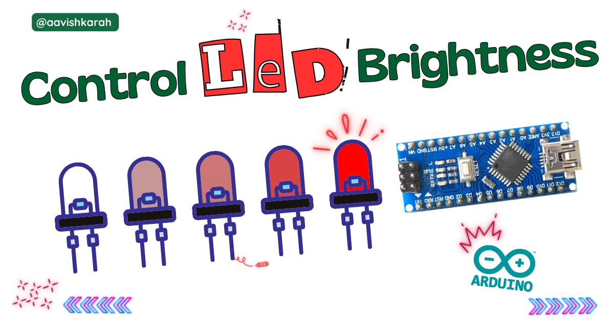

???+ Abstract "Table of Contents"

    [TOC]


## Abstract

In this article, we present a step-by-step guide to controlling the brightness of an LED using an Arduino Nano. By leveraging Pulse Width Modulation (PWM), you can smoothly vary the LED intensity — from dim glow to full brightness — rather than simply turning it on or off. This technique is a fundamental building block for more advanced projects such as LED dimmers, ambient lighting, and more.

## :compass: Pre-Request

- Arduino Nano board (or any Arduino with PWM-capable pins)
- USB cable to connect the Arduino Nano to your computer
- Arduino IDE (latest version recommended) installed on your system. 
- Interfacing external LED to Arduino Nano. [Learn More](../interfacing-led-to-arduino-nano/index.md){target="_blank"}

## Hardware Required

<!-- Advertisement -->
<div style="
  display:flex;
  gap:16px;
  align-items:center;
  padding:20px;
  margin:24px 0;
  border-radius:14px;
  background:var(--md-default-bg-color);
  box-shadow:0 6px 18px rgba(0,0,0,0.08);
">

  <div style="
    font-size:36px;
    line-height:1;
  ">
    🛠️
  </div>

  <div style="flex:1;">
    <strong>Get the right hardware kit</strong><br>
    <span style="color:var(--md-default-fg-color--light);">
      Arduino boards, sensors, and maker essentials—perfectly matched for your learning.
    </span>
  </div>

  <a href="https://www.skilldisk.com/category/arduino"
     target="_blank"
     style="
       padding:10px 18px;
       border-radius:10px;
       background:var(--md-primary-fg-color);
       color:white;
       text-decoration:none;
       font-weight:600;
       white-space:nowrap;
     ">
    Explore Hardware →
  </a>

</div>

- Arduino Nano. 
- LED.
- Resistors.
- BreadBoard.
- Mini USB Cable.
- Connecting wires.
- 5V DC power supply (Optional)

| Components | Purchase Link |
| -- | -- |
| Arduino Nano | [link](#) |
| LED | [link](https://amzn.to/3IaSVf2) |
| BreadBoard | [large](https://amzn.to/4pgNX1c) : [small](https://amzn.to/47SMzvB)|
| Connecting Wires | [link](https://amzn.to/4pepr0H) |
| Mini USB Cable | [link](#) |
| 5V DC Adaptor | [link](https://amzn.to/4m82t8D) |


!!! tip "Don't own a hardware :cry:"

    No worries,

    💡Still you can learn using simulation. check out simulation part :smiley:.

    💡Power your mission with reliable Arduino Kits. [Explore :simple-arduino: Hardware →](https://www.skilldisk.com/category/arduino){target="_blank"}

<div class="grid cards" markdown>
- [](https://www.skilldisk.com/product-page/nano-craft-spark-kit){target="_blank"}

- [](https://www.skilldisk.com/product-page/nano-craft-explorer-kit){target="_blank"}
</div>

### Connection Table


| Particular | GPIO | Remarks | 
| :-- | :--: | :-- | 
| LED  | 9 | LED Anode to GPIO 9 : High Logic |

!!! Note
    Using a current-limiting resistor (220 Ω to 330 Ω) is important to protect the LED and Arduino pin.


/// caption
fig-Connection Diagram
///

## :open_file_folder: Code


```arduino linenums="1"

#define ledPin 9         // PWM capable pin
int brightness = 0;      // current LED brightness
int fadeAmount = 3;      // how many points to fade the LED by

void setup() {
  // Set ledPin as OutPut Pin.
  pinMode(ledPin, OUTPUT);

}

void loop() {
  // Set the brightness of ledPin (GPIO 9)
  analogWrite(ledPin, brightness);
  
  // Change the brightness for the next loop
  brightness = brightness + fadeAmount;
  
  // Reverse the direction of the fading at the ends
  if (brightness <= 0 || brightness >= 255) {
    fadeAmount = -fadeAmount;
  }
  
  // Wait to see the dimming effect
  delay(10);

}

```

### How it works

- ledPin is set to 9, one of the PWM-capable pins on the Arduino Nano.
- In `setup()`, we configure this pin as OUTPUT.
- Inside `loop()`, we gradually increase the brightness variable from 0 to 255, calling `analogWrite()` on each step. This raises the duty cycle of the PWM signal, making the LED brighter.
- After reaching full brightness, the code reverses — decreasing brightness from 255 back to 0, causing the LED to dim.
- The `delay(10)` controls how smooth and slow the fade will be. You can adjust the delay value for faster or slower fades.


!!! danger "Important Note"
    1. Timer Groups:
        - Pins 5,6 → Timer 0 (affects delay(), millis())
        - Pins 9,10 → Timer 1
        - Pins 3,11 → Timer 2
    2. Side Effects: Changing Timer 0 affects delay(), millis(), and micros()
    3. Frequency Ranges: Each timer has limited frequency options based on prescalers
    4. Resolution: Lower frequencies typically allow for better resolution

### Code Explanation

- `analogWrite(pin, value)` — On Arduino, this function outputs a PWM signal on the given pin. The value can range from 0 (always off) to 255 (always on).

- Duty cycle → Brightness: PWM works by rapidly toggling the pin between HIGH and LOW. The fraction of time it stays HIGH (the duty cycle) determines the brightness perceived by the human eye. A higher duty cycle means more “on” time per cycle → brighter LED.

- Fade effect: By slowly increasing/decreasing the PWM duty cycle in small steps, the LED appears to fade in/out smoothly.


!!! tip "Try It"
    - Try connecting RGB LED with PWM.
    - DIY Arduino Nano Christmas Light Controller

---

## :material-chart-bubble:{style="color:#ffaa00"} Simulation

!!! danger "Not able to view the simulation"
    - :fontawesome-solid-laptop: Desktop or Laptop : Reload this page ( ++ctrl+r++ )
    - :fontawesome-solid-mobile: Mobile : Use Landscape Mode and reload the page


<iframe style="height:calc(100vh - 200px); border-color:#00aaff;border-radius:1rem;min-height:400px" src="https://wokwi.com/projects/448745386302446593" frameborder="2px" width="100%" height="700px"></iframe>


<!-- Advertisement -->
<div style="
  display:flex;
  gap:16px;
  align-items:center;
  padding:20px;
  margin:24px 0;
  border-radius:14px;
  background:var(--md-default-bg-color);
  box-shadow:0 6px 18px rgba(0,0,0,0.08);
">

  <div style="
    font-size:36px;
    line-height:1;
  ">
    🛠️
  </div>

  <div style="flex:1;">
    <strong>Get the right hardware kit</strong><br>
    <span style="color:var(--md-default-fg-color--light);">
      Arduino boards, sensors, and maker essentials—perfectly matched for your learning.
    </span>
  </div>

  <a href="https://www.skilldisk.com/category/arduino"
     target="_blank"
     style="
       padding:10px 18px;
       border-radius:10px;
       background:var(--md-primary-fg-color);
       color:white;
       text-decoration:none;
       font-weight:600;
       white-space:nowrap;
     ">
    Explore Hardware →
  </a>

</div>

<div class="grid cards" markdown>
- [](https://www.skilldisk.com/product-page/nano-craft-spark-kit){target="_blank"}

- [](https://www.skilldisk.com/product-page/nano-craft-explorer-kit){target="_blank"}
</div>

---

## :material-web-plus: Extras

### Why PWM for brightness?

Many microcontrollers, including Arduino, do not provide a true analog voltage output. PWM offers a clever workaround: by switching the output pin on and off very quickly (faster than the eye can detect), and controlling how long it stays ON vs OFF, you can simulate a varying voltage. This allows for analog-like control (brightness, motor speed, audio volume) using purely digital pins. 
Halvorsen Blog
+1

### Choosing the right PWM pin

On Arduino Nano, not all pins support PWM. Common PWM pins are `D3, D5, D6, D9, D10, D11`. Always connect your LED (or other load) to a PWM-capable pin when using `analogWrite()`.

### Components details

- Arduino Nano [Data Sheet](../blink-an-led-on-arduino-nano/files/nano-datasheet.pdf){target="_blank"}


### Modules / Libraries Used

NIL