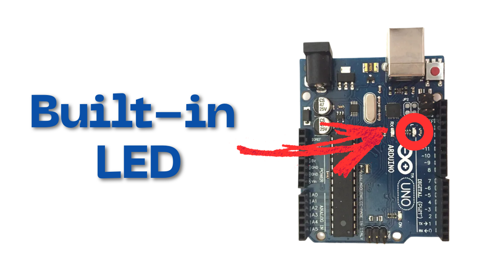

???+ Abstract "Table of Contents"

    [TOC]


## Abstract

Arduino UNO Development board is equipped with ATmega328p chip, which has 32K bytes of Flash program memory, 2k bytes of SRAM and 1K bytes of EEPROM. UNO board supports Embedded System C, Cpp and arduino code.  

In this article we go through.

- Accessing the built-in led (13) of the Arduino UNO board.
- Turning `on` and `off` built-in led using arduino code.
- Simulation using wokwi.
- Hardware demo.

## :compass: Pre-Request

- OS : Windows / Linux / Mac / Chrome
- Arduino IDE. 


## Hardware Required

<!-- Advertisement -->
<div style="
  display:flex;
  gap:16px;
  align-items:center;
  padding:20px;
  margin:24px 0;
  border-radius:14px;
  background:var(--md-default-bg-color);
  box-shadow:0 6px 18px rgba(0,0,0,0.08);
">

  <div style="
    font-size:36px;
    line-height:1;
  ">
    🛠️
  </div>

  <div style="flex:1;">
    <strong>Get the right hardware kit</strong><br>
    <span style="color:var(--md-default-fg-color--light);">
      Arduino boards, sensors, and maker essentials—perfectly matched for your learning.
    </span>
  </div>

  <a href="https://www.skilldisk.com/category/arduino"
     target="_blank"
     style="
       padding:10px 18px;
       border-radius:10px;
       background:var(--md-primary-fg-color);
       color:white;
       text-decoration:none;
       font-weight:600;
       white-space:nowrap;
     ">
    Explore Hardware →
  </a>

</div>

- Arduino UNO 
- Micro USB Cable.

| Components | Purchase Link |
| -- | -- |
| Arduino UNO | [Purchase Link](#) |
| Mini B USB Cable | [Purchase Link](#) |


!!! tip "Don't own a hardware :cry:"

    No worries,

    💡Still you can learn using simulation. check out simulation part :smiley:.

    💡Power your mission with reliable Arduino Kits. [Explore :simple-arduino: Hardware →](https://www.skilldisk.com/category/arduino){target="_blank"}

<!-- Advertisement -->
<div class="grid cards" markdown>
- [](https://www.skilldisk.com/product-page/uno-edge-spark-kit){target="_blank"}

- [](https://www.skilldisk.com/product-page/uno-edge-explorer-kit){target="_blank"}
</div>

### Connection Table

Built-in led of Arduino UNO is internally connected to GPIO 13.

| Particular | GPIO | Remarks | 
| :--: | :--: | :-- | 
| Built-in LED | 13 | Internally Connected |



## :open_file_folder: Code


```arduino linenums="1"

void setup() {
  // Initializing built-in LED as OUTPUT pin
  pinMode(LED_BUILTIN, OUTPUT);
  // pinMode(13, OUTPUT);

}

void loop() {
  
  // Turning ON built-in LED
  digitalWrite(LED_BUILTIN, HIGH);
  delay(1000);

  // Turning OFF built-in LED
  digitalWrite(LED_BUILTIN, LOW);
  delay(1000);

}


```

### Code Explanation


:point_right: Accessing built-in led of Arduino UNO board.

```arduino linenums="1"

void setup() {
  // Initializing built-in LED as OUTPUT pin
  pinMode(LED_BUILTIN, OUTPUT);
  // pinMode(13, OUTPUT);

}

```

- LED_BUILTIN (GPIO pin 13) is configured as `OUTPUT` pin (Line number 3) 
- You can alternatively use GPIO 13 in place of LED_BUILTIN.

:point_right: Blinking LED

```arduino linenums="8"

void loop() {
  
  // Turning ON built-in LED
  digitalWrite(LED_BUILTIN, HIGH);
  delay(1000);

  // Turning OFF built-in LED
  digitalWrite(LED_BUILTIN, LOW);
  delay(1000);

}
```

- Continuous loop is achieved using `loop` method.
- `digitalWrite` is used to change the state of GPIO pin.
- `digitalWrite(LED_BUILTIN, HIGH);` sets the value of GPIO 13 to `HIGH` or `1`, which in turn  turns ON the LED. (line number 11)
- Delay of `1` second is achieved through `delay(1000);` method. (line number 12 & 16) 
- `digitalWrite(LED_BUILTIN, LOW);` sets the value of GPIO 13 to `LOW` or `0`, which in turn  turns OFF the LED. (line number 15)


!!! tip "Try It"
    - Change the value in the sleep method and observe the change in the on and off time.
        - `delay(2000)`, `delay(4000)` , etc
    - the values in terms of milli seconds.
        - `delay(1000)` : 1000 ms or 1 s
        - `delay(500)`  : 500 ms or 0.5 s

---

## :material-chart-bubble:{style="color:#ffaa00"} Simulation

!!! danger "Not able to view the simulation"
    - :fontawesome-solid-laptop: Desktop or Laptop : Reload this page ( ++ctrl+r++ )
    - :fontawesome-solid-mobile: Mobile : Use Landscape Mode and reload the page


<iframe style="height:calc(100vh - 200px); border-color:#00aaff;border-radius:1rem;min-height:400px" src="https://wokwi.com/projects/448742558030058497" frameborder="2px" width="100%" height="700px"></iframe>

<!-- Advertisement -->
<div style="
  display:flex;
  gap:16px;
  align-items:center;
  padding:20px;
  margin:24px 0;
  border-radius:14px;
  background:var(--md-default-bg-color);
  box-shadow:0 6px 18px rgba(0,0,0,0.08);
">

  <div style="
    font-size:36px;
    line-height:1;
  ">
    🛠️
  </div>

  <div style="flex:1;">
    <strong>Get the right hardware kit</strong><br>
    <span style="color:var(--md-default-fg-color--light);">
      Arduino boards, sensors, and maker essentials—perfectly matched for your learning.
    </span>
  </div>

  <a href="https://www.skilldisk.com/category/arduino"
     target="_blank"
     style="
       padding:10px 18px;
       border-radius:10px;
       background:var(--md-primary-fg-color);
       color:white;
       text-decoration:none;
       font-weight:600;
       white-space:nowrap;
     ">
    Explore Hardware →
  </a>

</div>

<div class="grid cards" markdown>
- [](https://www.skilldisk.com/product-page/uno-edge-spark-kit){target="_blank"}

- [](https://www.skilldisk.com/product-page/uno-edge-explorer-kit){target="_blank"}
</div>

## Result

Above code turns ON LED for 1 second and OFF for 1 second. Similar to a square wave of `0.5 Hz` output connected to an LED.

---

## :material-web-plus: Extras

### Components details

- Arduino UNO [Data Sheet](./files/uno-datasheet.pdf){target="_blank"}


### Modules / Libraries Used

-Nil-