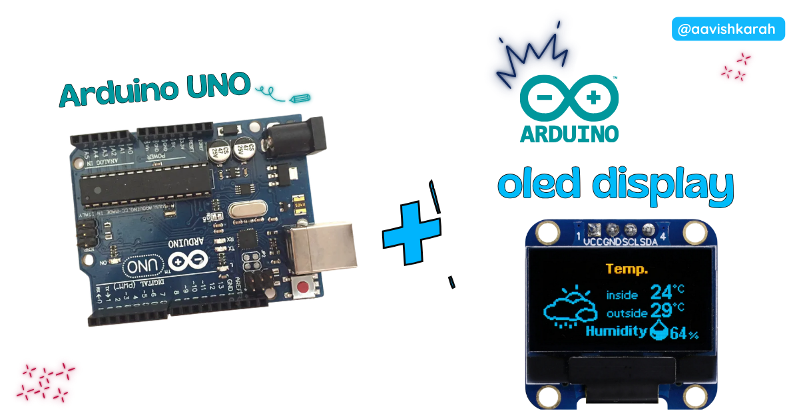
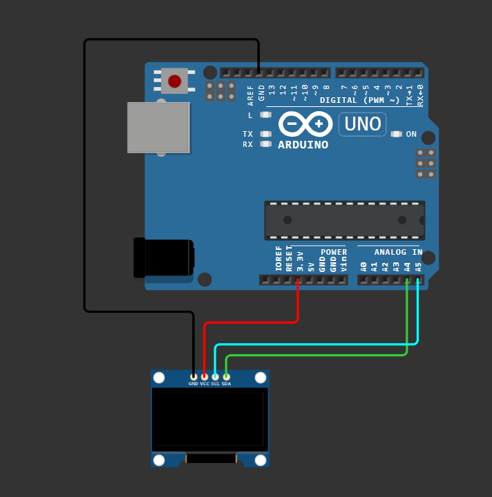

???+ Abstract "Table of Contents"

    [TOC]

## 🧾 Abstract

OLED displays are one of the best upgrades for Arduino projects because they are compact, clear, and power efficient. In this tutorial, you will learn how to interface a 128x64 SSD1306 OLED display with an Arduino Uno using the Arduino IDE. By the end, you will be able to display text, draw shapes, and create small dashboards for sensor projects.


## Hardware Required

<!-- Advertisement -->
--8<-- "includes/arduino-link-cta.md"

--8<-- "includes/uno-edge-cta.md"

| Component    | Specification                                | Quantity | Purchase Link                                |
| ------------ | -------------------------------------------- | -------- | -------------------------------------------- |
| Arduino Uno | ATmega328P                                   | 1        | [Buy Here](https://www.skilldisk.com/category/all-products) |
| OLED Display | SSD1306, 128x64, I2C                         | 1        | [Buy Here](https://www.skilldisk.com/category/all-products) |
| Breadboard   | Mini/Full Size                               | 1        | [Buy Here](https://amzn.to/4pgNX1c)   |
| Jumper Wires | Male-to-Male                                 | 5+       | [Buy Here](https://www.skilldisk.com/category/all-products)       |
| USB Cable    | Mini USB / Micro USB (depends on Uno model) | 1        | [Buy Here](https://www.skilldisk.com/category/all-products)    |


---

## ⚡ Understanding SSD1306 OLED (I2C Communication)

The **SSD1306** is a display controller used in many 0.96-inch OLED modules. It supports both **I2C** and **SPI**, but I2C is more popular because it requires fewer wires.

📌 **Why Use OLED with Arduino Uno?**

* Great for sensor dashboards 📊
* Very sharp text display ✨
* Low power usage 🔋
* Compact and beginner friendly
* Supports graphics and icons easily

---

## 🧷 Connection / Wiring Guide (Arduino Uno to OLED)

Arduino Uno uses dedicated I2C pins:

* **A4 = SDA**
* **A5 = SCL**

### 🔥 Arduino Uno to OLED Pin Mapping

| OLED Pin | Arduino Uno Pin | Description  |
| -------- | ---------------- | ------------ |
| VCC      | 5V (or 3.3V)     | Power supply |
| GND      | GND              | Ground       |
| SDA      | A4               | I2C Data     |
| SCL      | A5               | I2C Clock    |

!!! warning
    ⚠️ Some OLED modules are **3.3V-only**.
    If your OLED module does not have a regulator, power it using **3.3V**.

!!! tip
    Most SSD1306 modules sold for Arduino support **5V VCC** because they include onboard regulator.



/// caption
fig-Connection Diagram
///

---

## 🛠️ Step-by-Step Setup in Arduino IDE


✅ Step 1: Install Arduino IDE

✅ Step 2: Select Board and Port

!!! note
    If upload fails, try selecting **Old Bootloader**.


✅ Step 3: Install Required OLED Libraries

Go to:

📌 **Sketch → Include Library → Manage Libraries**

Search and install:

* **Adafruit SSD1306**
* **Adafruit GFX Library**

!!! tip
    The Adafruit SSD1306 library depends on Adafruit GFX.
    Always install both.

✅ Step 4: Verify OLED I2C Address

Most SSD1306 OLED modules use:

* `0x3C` (common)
* `0x3D` (rare)

You can verify using [I2C scanner code](#optional-i2c-scanner-code).

---

## :open_file_folder: Code

Create a new sketch and paste the following code.

```cpp linenums="1"
#include <Wire.h>
#include <Adafruit_GFX.h>
#include <Adafruit_SSD1306.h>

// --------------------------------------
// OLED Display Configuration
// --------------------------------------
#define SCREEN_WIDTH 128
#define SCREEN_HEIGHT 64

// OLED Reset pin (-1 if not used)
#define OLED_RESET -1

// OLED I2C Address (usually 0x3C)
#define SCREEN_ADDRESS 0x3C

// Create OLED display object
Adafruit_SSD1306 display(SCREEN_WIDTH, SCREEN_HEIGHT, &Wire, OLED_RESET);

// --------------------------------------
// Setup Function
// --------------------------------------
void setup() {
  Serial.begin(9600);

  // Initialize I2C + OLED Display
  if (!display.begin(SSD1306_SWITCHCAPVCC, SCREEN_ADDRESS)) {
    Serial.println("OLED allocation failed!");
    while (true); // Stop execution
  }

  Serial.println("OLED Initialized Successfully!");

  // Clear display buffer
  display.clearDisplay();

  // Display startup message
  display.setTextSize(1);
  display.setTextColor(SSD1306_WHITE);

  display.setCursor(32, 0);
  display.println("Arduino Uno");

  display.setCursor(35, 15);
  display.println("Welcome to");

  display.setCursor(30, 30);
  display.println("Aavishkaran");

  display.setCursor(0, 50);
  display.println("Loading...");

  display.display();
  delay(2000);

  // Run shapes demo once
  shapesDemo();
}

// --------------------------------------
// Main Loop Function
// --------------------------------------
void loop() {
  counterDemo();
}

// --------------------------------------
// Function: Counter Demo
// --------------------------------------
void counterDemo() {
  static int count = 0;

  display.clearDisplay();

  display.setTextSize(1);
  display.setCursor(0, 0);
  display.println("Counter");

  display.setCursor(0, 20);
  display.print("Count: ");
  display.println(count);

  display.setCursor(25, 45);
  display.println("Aavishkarah");

  display.display();

  count++;
  delay(1000);
}

// --------------------------------------
// Function: Shapes Demo
// --------------------------------------
void shapesDemo() {
  display.clearDisplay();

  // Draw border rectangle
  display.drawRect(0, 0, 128, 64, SSD1306_WHITE);

  // Draw filled rectangle
  display.fillRect(10, 10, 40, 20, SSD1306_WHITE);

  // Draw horizontal line
  display.drawLine(0, 35, 127, 35, SSD1306_WHITE);

  // Draw vertical line
  display.drawLine(64, 0, 64, 63, SSD1306_WHITE);

  display.setTextSize(1);
  display.setCursor(70, 10);
  display.println("Shapes");

  display.setCursor(75, 25);
  display.println("Demo");

  display.display();
  delay(3000);
}
```

---

## 🧠 Code Explanation

Let’s understand how this works.


:point_right: Required Libraries

```cpp
#include <Wire.h>
#include <Adafruit_GFX.h>
#include <Adafruit_SSD1306.h>
```

* `Wire.h` → Arduino I2C communication library
* `Adafruit_GFX` → provides graphics functions (text, lines, shapes)
* `Adafruit_SSD1306` → SSD1306 OLED driver

:point_right: OLED Configuration

```cpp
#define SCREEN_WIDTH 128
#define SCREEN_HEIGHT 64
#define OLED_RESET -1
#define SCREEN_ADDRESS 0x3C
```

* Sets display resolution
* Reset pin is unused (`-1`)
* OLED I2C address is set to `0x3C`

:point_right: Display Object Creation

```cpp
Adafruit_SSD1306 display(SCREEN_WIDTH, SCREEN_HEIGHT, &Wire, OLED_RESET);
```

This creates a display instance and connects it to the Arduino I2C bus.

:point_right: OLED Initialization

```cpp
if (!display.begin(SSD1306_SWITCHCAPVCC, SCREEN_ADDRESS)) {
  Serial.println("OLED allocation failed!");
  while (true);
}
```

This checks if OLED is responding correctly.

!!! warning
    If the OLED does not respond, Arduino will stop running forever inside `while(true)`.

:point_right: Printing Text on OLED

```cpp
display.setCursor(32, 0);
display.println("Arduino Uno");
```

* `setCursor(x,y)` sets text start position
* `println()` prints text to buffer

Then:

```cpp
display.display();
```

This pushes the buffer onto the OLED screen.

:point_right: Drawing Shapes

```cpp
display.drawRect(0, 0, 128, 64, SSD1306_WHITE);
display.fillRect(10, 10, 40, 20, SSD1306_WHITE);
```

* `drawRect()` draws outline rectangle
* `fillRect()` draws solid rectangle

:point_right: Counter Demo Loop

```cpp
static int count = 0;
count++;
delay(1000);
```

`static` ensures the value remains stored between loop runs.

---

## :material-chart-bubble:{style="color:#ffaa00"} Simulation

!!! danger "Not able to view the simulation"
    - :fontawesome-solid-laptop: Desktop or Laptop : Reload this page ( ++ctrl+r++ )
    - :fontawesome-solid-mobile: Mobile : Use Landscape Mode and reload the page


<iframe style="height:calc(100vh - 200px); border-color:#00aaff;border-radius:1rem;min-height:400px" src="https://wokwi.com/projects/456364409571512321" frameborder="2px" width="100%" height="700px"></iframe>

<!-- Advertisement -->
--8<-- "includes/arduino-link-cta.md"

--8<-- "includes/uno-edge-cta.md"


---

## 🧩 Extras (OLED Module Notes + Documentation)

📌 **OLED Module Types**

Most SSD1306 modules come in:

* **0.96 inch 128x64**
* **1.3 inch 128x64**

Both work similarly.


**OLED Power Notes**

!!! warning
    Some cheap OLED modules do not have voltage regulator.
    Supplying 5V may damage them permanently.

**Recommended Safe Approach**

* Power OLED using **3.3V** if unsure.
* Arduino Uno I2C logic is 5V, but most OLED modules tolerate it due to onboard resistors/regulator.

---

## 🚀 Advanced Tips & Alternative Approaches


💡 Tip 1: **Display Sensor Readings**

You can extend the same code to show:

* Temperature (DHT11 / LM35)
* Ultrasonic distance (HC-SR04)
* Potentiometer ADC value
* Battery voltage monitoring


💡 Tip 2: **Improve Display Refresh Speed**

Instead of clearing full screen every time:

* Update only changed areas
* Avoid unnecessary `clearDisplay()`


💡 Tip 3: **Use Custom Bitmaps / Icons**

You can display icons like WiFi, battery, or logos using bitmap arrays.

Example concept:

```cpp
display.drawBitmap(x, y, bitmap_array, width, height, SSD1306_WHITE);
```


---

## 🛑 Troubleshooting (Common Issues & Fixes)


❌ Issue 1: **OLED Screen is Blank**

✅ Causes:

* Wrong wiring (SDA/SCL swapped)
* Wrong I2C address
* OLED not powered properly

✅ Fix:

* Recheck wiring table
* Run I2C scanner code
* Try switching address:

```cpp
#define SCREEN_ADDRESS 0x3D
```

---

❌ Issue 2: **Upload Error (avrdude: stk500)**

✅ Cause:

* Wrong processor selected

✅ Fix:
Go to:

📌 Tools → Processor → **ATmega328P (Old Bootloader)**

---

❌ Issue 3: `SSD1306 allocation failed`

✅ Cause:

* OLED not detected
* Wrong address or loose wires

✅ Fix:

* Run I2C scanner
* Use proper VCC voltage
* Ensure GND is common

---

❌ Issue 4: **Random garbage pixels appear**

✅ Cause:

* Unstable power supply or loose wiring

✅ Fix:

* Use short jumper wires
* Use stable USB power
* Add 100µF capacitor between VCC and GND (optional)

---


## 🧪 Optional: I2C Scanner Code 

If OLED is not detected, upload this scanner sketch first.

```cpp linenums="1"
#include <Wire.h>

void setup() {
  Wire.begin();
  Serial.begin(9600);

  Serial.println("🔍 I2C Scanner Running...");
}

void loop() {
  byte error, address;
  int devices = 0;

  for (address = 1; address < 127; address++) {
    Wire.beginTransmission(address);
    error = Wire.endTransmission();

    if (error == 0) {
      Serial.print("✅ I2C Device Found at: 0x");
      if (address < 16) Serial.print("0");
      Serial.println(address, HEX);
      devices++;
    }
  }

  if (devices == 0) {
    Serial.println("❌ No I2C devices found!");
  } else {
    Serial.println("🎉 Scan complete.");
  }

  delay(5000);
}
```

!!! tip
    Open **Serial Monitor (9600 baud)** and check detected OLED address.


---

## 🏗️ Project Extensions / Next Steps

After OLED interfacing, try these awesome beginner projects 🚀

✅ 1. Mini Weather Station 🌦️

* DHT11 + OLED
* Display temperature and humidity

✅ 2. Digital Voltmeter 🔋

* Use analog pin A0
* Display measured voltage on OLED

✅ 3. Distance Meter 📏

* HC-SR04 + OLED
* Display distance in cm

!!! tip
    These are great student mini-projects for IoT and embedded portfolios.

---

## :material-web-plus: Extras

### Components details

- Arduino Uno [Data Sheet](../blink-an-led-on-arduino-uno/files/uno-datasheet.pdf){target="_blank"}

### 📄 SSD1306 Documentation

* SSD1306 Datasheet: [SSD1306 Datasheet](https://www.adafruit.com/datasheets/SSD1306.pdf)
* Adafruit SSD1306 Library: [Adafruit SSD1306](https://github.com/adafruit/Adafruit_SSD1306)
* Adafruit GFX Library: [Adafruit GFX](https://github.com/adafruit/Adafruit-GFX-Library)

---

## 🏁 Conclusion

You have successfully interfaced a **128x64 SSD1306 OLED display** with an **Arduino Uno** using the **Arduino IDE** 🎉. Now you can build interactive projects like sensor dashboards, mini clocks, counters, and IoT displays. OLED modules are simple to use but add a professional look to any Arduino project.
pare an **OLED Dashboard UI code** (battery + sensor layout + custom icons) specially designed for Arduino Uno projects 😄
