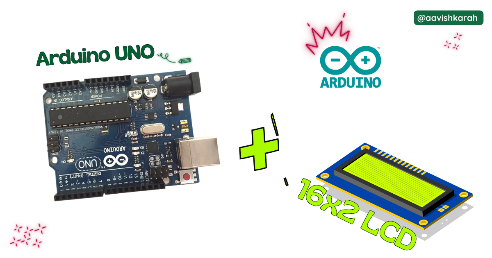
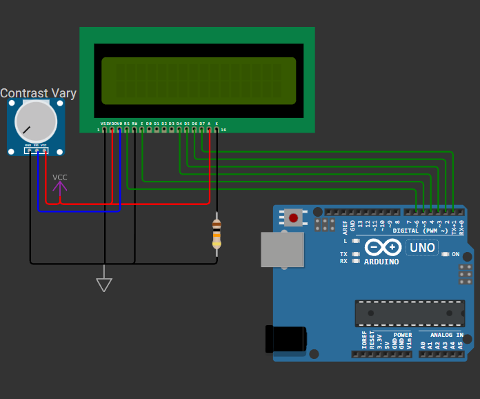

???+ Abstract "Table of Contents"

    [TOC]


## Abstract

In this article, you’ll learn a detailed, step-by-step method to interface a 16×2 LCD character display with the Arduino Uno using the Arduino IDE. By the end, you’ll be able to display text on the LCD — a fundamental building block for many microcontroller projects like menus, status readouts, timers, and sensors display.

## :compass: Pre-Request

- OS : Windows / Linux / Mac / Chrome
- Arduino IDE 

## Hardware Required

<!-- Advertisement -->
<div style="
  display:flex;
  gap:16px;
  align-items:center;
  padding:20px;
  margin:24px 0;
  border-radius:14px;
  background:var(--md-default-bg-color);
  box-shadow:0 6px 18px rgba(0,0,0,0.08);
">

  <div style="
    font-size:36px;
    line-height:1;
  ">
    🛠️
  </div>

  <div style="flex:1;">
    <strong>Get the right hardware kit</strong><br>
    <span style="color:var(--md-default-fg-color--light);">
      Arduino boards, sensors, and maker essentials—perfectly matched for your learning.
    </span>
  </div>

  <a href="https://www.skilldisk.com/category/arduino"
     target="_blank"
     style="
       padding:10px 18px;
       border-radius:10px;
       background:var(--md-primary-fg-color);
       color:white;
       text-decoration:none;
       font-weight:600;
       white-space:nowrap;
     ">
    Explore Hardware →
  </a>

</div>

- Arduino Uno. 
- 16x2 LCD display.
- Resistors.
- Potentiometer (10 kΩ)
- BreadBoard.
- Mini USB Cable.
- Connecting wires.
- 5V DC power supply (Optional)

| Components | Purchase Link |
| -- | -- |
| Arduino Uno | [link](#) |
| 16x2 LCD | [link](https://amzn.to/4m6ZgpI) |
| Mini USB Cable | [link](#) |
| Potentiometer (POT) | [link](https://amzn.to/4mb6VDH) |
| BreadBoard | [large](https://amzn.to/4pgNX1c) : [small](https://amzn.to/47SMzvB)|
| Connecting Wires | [link](https://amzn.to/4pepr0H) |
| 5V DC Adaptor | [link](https://amzn.to/4m82t8D) |

!!! tip "Don't own a hardware :cry:"

    No worries,

    💡Still you can learn using simulation. check out simulation part :smiley:.

    💡Power your mission with reliable Arduino Kits. [Explore :simple-arduino: Hardware →](https://www.skilldisk.com/category/arduino){target="_blank"}

<!-- Advertisement -->
<div class="grid cards" markdown>
- [](https://www.skilldisk.com/product-page/uno-edge-spark-kit){target="_blank"}

- [](https://www.skilldisk.com/product-page/uno-edge-explorer-kit){target="_blank"}
</div>

### Connection Table

16x2 LCD can be connected in _4 wire_ and _8 wire_ mode. In this article 4 wire mode is demonstrated, as 8 wire mode is rarely used now a days. 

!!! info
    With I2C LCD interface, we can interface 16x2 LCD display in 2 wire mode. [click here](#){target="_blank"} to know [how to interface 16x2 LCD display in serial mode using 2 wire system.](#){target="_blank"}


| LCD Pin | LCD Function         | Arduino Uno Pin | Notes                         |
| ------- | -------------------- | ---------------- | ----------------------------- |
| Pin 1   | VSS (GND)            | GND              | Ground                        |
| Pin 2   | VDD (+5 V)           | +5 V             | Power                         |
| Pin 3   | V0 (Contrast)        | Pot middle pin   | Adjust contrast               |
| Pin 4   | RS (Register Select) | **D6**           | Defined above                 |
| Pin 5   | RW (Read/Write)      | GND              | Always write                  |
| Pin 6   | Enable (E)           | **D5**           | Defined above                 |
| Pin 11  | D4                   | **D4**           | Defined above                 |
| Pin 12  | D5                   | **D3**           | Defined above                 |
| Pin 13  | D6                   | **D2**           | Defined above                 |
| Pin 14  | D7                   | **D1**           | Defined above                 |
| Pin 15  | LED + (Backlight)    | +5 V via 220 Ω   | Backlight (optional resistor) |
| Pin 16  | LED – (Backlight)    | GND              | Backlight                     |


!!! Note
    💡 Potentiometer between LCD V0 and GND/VDD lets you adjust contrast so text is visible 



/// caption
fig-Connection Diagram
///

## :open_file_folder: Code

=== "main.py"
    ```arduino linenums="1"

    #include <LiquidCrystal.h>

    //  Pin Definitions
    # define RS 6
    # define E 5
    # define D7 1
    # define D6 2
    # define D5 3
    # define D4 4


    // Initialize the LCD with the pins:
    // LiquidCrystal(rs, en, d4, d5, d6, d7)
    LiquidCrystal lcd(RS, E, D4, D5, D6, D7);

    void setup() {
        lcd.begin(16, 2);  // Set the LCD size to 16 columns and 2 rows
        lcd.print("Welcome to"); // Print first line
        lcd.setCursor(0, 1);  // Move cursor to second line
        lcd.print("Aavishkarah"); // Print Second line
        delay(3000); // Delay of 3 sec
    }

    void loop() {
        // Print 0 to 9 with a delay of 1.5 sec for an infinite loop    
        for (int i=0; i<10; i++){
            lcd.clear();
            lcd.print(i);
            delay(1500);
        }
    }


    ```


### Code Explanation

Let’s break down the Arduino sketch **line by line** to clearly understand how the 16×2 LCD works with the Arduino Uno.

:point_right: Imports


```cpp linenums="1"
#include <LiquidCrystal.h>
```

* This line includes the **LiquidCrystal library**.
* It provides ready-to-use functions to control 16×2 LCD displays such as `print()`, `clear()`, `setCursor()` etc.,

:point_right: Define LCD Pin Connections

```cpp linenums="3"
//  Pin Definitions
# define RS 6
# define E 5
# define D7 1
# define D6 2
# define D5 3
# define D4 4
```

* These `#define` statements assign **Arduino Uno pins** to the LCD control and data pins.
* **RS (Register Select)** chooses between command mode and data mode.
* **E (Enable)** triggers data transfer.
* **D4–D7** are data lines used in **4-bit mode**, reducing the number of pins required.

:point_right: Create the LCD Object

```cpp linenums="12"
// Initialize the LCD with the pins:
// LiquidCrystal(rs, en, d4, d5, d6, d7)
LiquidCrystal lcd(RS, E, D4, D5, D6, D7);
```

* This creates an LCD object named `lcd`.
* The pin order must be:
  **RS, Enable, D4, D5, D6, D7**
* From this point onward, all LCD operations are performed using the `lcd` object.

:point_right: Initialize the LCD in `setup()`

```cpp linenums="17"
  lcd.begin(16, 2);
```

* `lcd.begin(16, 2)` initializes the LCD with **16 columns and 2 rows**.
* This must be called before sending any data to the LCD.

:point_right: Display Static Text

```cpp linenums="18"
  lcd.print("Welcome to");
  lcd.setCursor(0, 1);
  lcd.print("Aavishkarah");
  delay(3000);
```

* `lcd.print("Welcome to")` prints text on the **first line**.
* `lcd.setCursor(0, 1)` moves the cursor to **column 0, row 1** (second line).
* `lcd.print("Aavishkarah")` displays text on the second line.
* `delay(3000)` pauses execution for **3 seconds**.
* This allows the welcome message to stay visible before moving to the loop section.


:point_right: Display Numbers 0 to 9 Repeatedly

```cpp linenums="26"
  for (int i=0; i<10; i++){
    lcd.clear();
    lcd.print(i);
    delay(1500);
  }
```

* The `loop()` function runs **continuously** after `setup()` completes.
* The `for` loop counts from **0 to 9**.
* `lcd.clear()` clears the LCD before printing the next number.
* `lcd.print(i)` displays the current number.
* `delay(1500)` holds each number on the display for **1.5 seconds**.
* After reaching 9, the loop restarts, creating an **infinite display cycle**.

!!! tip "Try It"
    - Alter the output content on the display by passing your data argument to the `lcd.print()` method.

---

## :material-chart-bubble:{style="color:#ffaa00"} Simulation

!!! danger "Not able to view the simulation"
    - :fontawesome-solid-laptop: Desktop or Laptop : Reload this page ( ++ctrl+r++ )
    - :fontawesome-solid-mobile: Mobile : Use Landscape Mode and reload the page


<iframe style="height:calc(100vh - 200px); border-color:#00aaff;border-radius:1rem;min-height:400px" src="https://wokwi.com/projects/450676824589150209" frameborder="2px" width="100%" height="700px"></iframe>

<!-- Advertisement -->
<div style="
  display:flex;
  gap:16px;
  align-items:center;
  padding:20px;
  margin:24px 0;
  border-radius:14px;
  background:var(--md-default-bg-color);
  box-shadow:0 6px 18px rgba(0,0,0,0.08);
">

  <div style="
    font-size:36px;
    line-height:1;
  ">
    🛠️
  </div>

  <div style="flex:1;">
    <strong>Get the right hardware kit</strong><br>
    <span style="color:var(--md-default-fg-color--light);">
      Arduino boards, sensors, and maker essentials—perfectly matched for your learning.
    </span>
  </div>

  <a href="https://www.skilldisk.com/category/arduino"
     target="_blank"
     style="
       padding:10px 18px;
       border-radius:10px;
       background:var(--md-primary-fg-color);
       color:white;
       text-decoration:none;
       font-weight:600;
       white-space:nowrap;
     ">
    Explore Hardware →
  </a>

</div>

<div class="grid cards" markdown>
- [](https://www.skilldisk.com/product-page/uno-edge-spark-kit){target="_blank"}

- [](https://www.skilldisk.com/product-page/uno-edge-explorer-kit){target="_blank"}
</div>

---

## :material-web-plus: Extras

### Components details

- Arduino Uno [Data Sheet](../blink-an-led-on-arduino-uno/files/uno-datasheet.pdf){target="_blank"}
- 16x2 LCD Display [Data Sheet](https://components101.com/sites/default/files/component_datasheet/16x2%20LCD%20Datasheet.pdf){target="_blank"} 

### Modules / Libraries Used

- LiquidCrystal.h
    - It provides ready-to-use functions to control 16×2 LCD displays such as `print()`, `clear()`, `setCursor()` etc.,
    - [More info](https://docs.arduino.cc/libraries/liquidcrystal/){target="_blank"} 
    - [Github Source Code](https://github.com/arduino-libraries/LiquidCrystal){target="_blank"} 