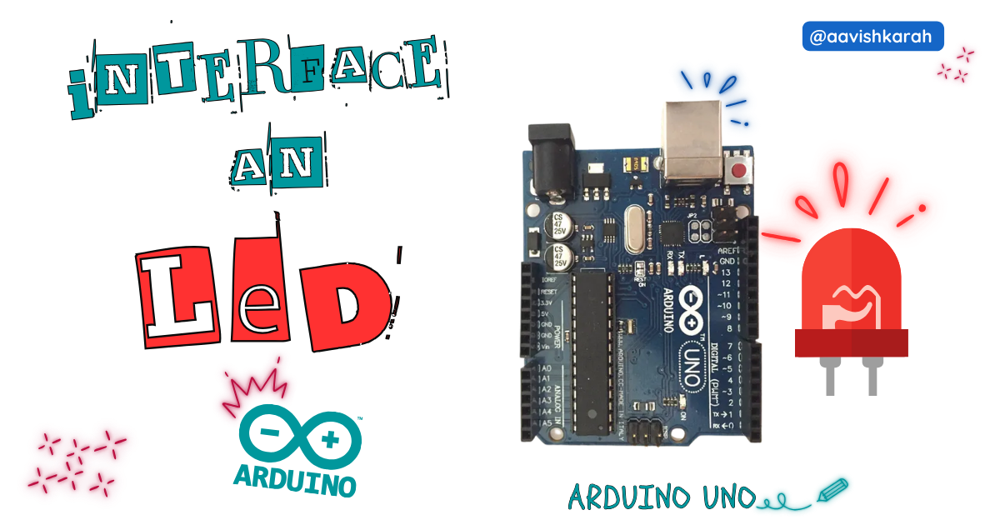

???+ Abstract "Table of Contents"

    [TOC]


## Abstract

 In this article, a comprehensive step-by-step guide to interface an external LED with Arduino UNO board using arduino code. This articles lays the foundation for more advanced embedded system and IoT projects.


## :compass: Pre-Request

- OS : Windows / Linux / Mac / Chrome
- Arduino IDE 


## Hardware Required

<!-- Advertisement -->
<div style="
  display:flex;
  gap:16px;
  align-items:center;
  padding:20px;
  margin:24px 0;
  border-radius:14px;
  background:var(--md-default-bg-color);
  box-shadow:0 6px 18px rgba(0,0,0,0.08);
">

  <div style="
    font-size:36px;
    line-height:1;
  ">
    🛠️
  </div>

  <div style="flex:1;">
    <strong>Get the right hardware kit</strong><br>
    <span style="color:var(--md-default-fg-color--light);">
      Arduino boards, sensors, and maker essentials—perfectly matched for your learning.
    </span>
  </div>

  <a href="https://www.skilldisk.com/category/arduino"
     target="_blank"
     style="
       padding:10px 18px;
       border-radius:10px;
       background:var(--md-primary-fg-color);
       color:white;
       text-decoration:none;
       font-weight:600;
       white-space:nowrap;
     ">
    Explore Hardware →
  </a>

</div>

- Arduino UNO. 
- LED.
- Resistors.
- BreadBoard.
- Mini USB Cable.
- Connecting wires.
- 5V DC power supply (Optional)

| Components | Purchase Link |
| -- | -- |
| Arduino UNO | [link](#) |
| LED | [link](https://amzn.to/3IaSVf2) |
| BreadBoard | [large](https://amzn.to/4pgNX1c) : [small](https://amzn.to/47SMzvB)|
| Connecting Wires | [link](https://amzn.to/4pepr0H) |
| Mini USB Cable | [link](#) |
| 5V DC Adaptor | [link](https://amzn.to/4m82t8D) |


!!! tip "Don't own a hardware :cry:"

    No worries,

    💡Still you can learn using simulation. check out simulation part :smiley:.

    💡Power your mission with reliable Arduino Kits. [Explore :simple-arduino: Hardware →](https://www.skilldisk.com/category/arduino){target="_blank"}

<!-- Advertisement -->
<div class="grid cards" markdown>
- [](https://www.skilldisk.com/product-page/uno-edge-spark-kit){target="_blank"}

- [](https://www.skilldisk.com/product-page/uno-edge-explorer-kit){target="_blank"}
</div>

### Connection Table


| Particular | GPIO | Remarks | 
| :-- | :--: | :-- | 
| LED 1  | 8 | LED-1 Anode to GPIO 8  : High Logic |
| LED 2  | 4 | LED-2 Cathode to GPIO 4  : Low Logic |

!!! info
    - LED-1 : HIGH Logic LED : ON for GPIO set to 1 : OFF for GPIO set to 0
    - LED-2 : Low Logic LED  : ON for GPIO set to 0 : OFF for GPIO set to 1
    - Best practice is to connect LED in low logic. 


/// caption
fig-Connection Diagram
///

## :open_file_folder: Code


```arduino linenums="1"

#define LED_1 8
#define LED_2 4

void setup() {
  // Initialize LED as output PIN
  pinMode(LED_1, OUTPUT);
  pinMode(LED_2, OUTPUT);

}

void loop() {
  // Turning ON External LED
  digitalWrite(LED_1, HIGH); // HIGH Logic
  digitalWrite(LED_2, LOW); // LOW Logic
  delay(2000);

  // Turning OFF External LED
  digitalWrite(LED_1, LOW);  // HIGH Logic
  digitalWrite(LED_2, HIGH); // LOW Logic
  delay(1000);

}
```

### Code Explanation


:point_right: Accessing LED's.

```arduino linenums="1"

#define LED_1 8
#define LED_2 4

void setup() {
  // Initialize LED as output PIN
  pinMode(LED_1, OUTPUT);
  pinMode(LED_2, OUTPUT);

}

```

- Define LED_1 to GPIO 8 & LED_2 to GPIO 4.
- GPIO pin 8 is configured as `OUTPUT` pin (Line number 6)
- GPIO pin 4 is configured as `OUTPUT` pin (Line number 7)

:point_right: Controlling LED

```arduino linenums="11"
void loop() {
  // Turning ON External LED
  digitalWrite(LED_1, HIGH); // HIGH Logic
  digitalWrite(LED_2, LOW); // LOW Logic
  delay(2000);

  // Turning OFF External LED
  digitalWrite(LED_1, LOW);
  digitalWrite(LED_2, HIGH);
  delay(1000);

}

```

- Continuous loop for blinking led is achieved using `loop` method.
- `digitalWrite(LED_1, HIGH)` sets the value of GPIO 8 to `HIGH` or `1`, it turns ON the LED-1. (line number 13)
- `digitalWrite(LED_2, LOW)` sets the value of GPIO 4 to `LOW` or `0`, it turns ON the LED-2. (line number 14)
- Delay is achieved through `delay(ms_value);` method. (line number 15 & 20) 
- `digitalWrite(LED_1, LOW)` sets the value of GPIO 8 to `LOW` or `0`, it turns OFF the LED-1. (line number 18)
- `digitalWrite(LED_2, HIGH)` sets the value of GPIO 4 to `HIGH` or `1`, it turns OFF the LED-2. (line number 19)


!!! tip "Try It"
    - Change the value in the `delay` method and observe the change in the on and off time.
        - `delay(2000)`, `delay(750)` , etc

---

## :material-chart-bubble:{style="color:#ffaa00"} Simulation

!!! danger "Not able to view the simulation"
    - :fontawesome-solid-laptop: Desktop or Laptop : Reload this page ( ++ctrl+r++ )
    - :fontawesome-solid-mobile: Mobile : Use Landscape Mode and reload the page


<iframe style="height:calc(100vh - 200px); border-color:#00aaff;border-radius:1rem;min-height:400px" src="https://wokwi.com/projects/448742646520474625" frameborder="2px" width="100%" height="700px"></iframe>

<!-- Advertisement -->
<div style="
  display:flex;
  gap:16px;
  align-items:center;
  padding:20px;
  margin:24px 0;
  border-radius:14px;
  background:var(--md-default-bg-color);
  box-shadow:0 6px 18px rgba(0,0,0,0.08);
">

  <div style="
    font-size:36px;
    line-height:1;
  ">
    🛠️
  </div>

  <div style="flex:1;">
    <strong>Get the right hardware kit</strong><br>
    <span style="color:var(--md-default-fg-color--light);">
      Arduino boards, sensors, and maker essentials—perfectly matched for your learning.
    </span>
  </div>

  <a href="https://www.skilldisk.com/category/arduino"
     target="_blank"
     style="
       padding:10px 18px;
       border-radius:10px;
       background:var(--md-primary-fg-color);
       color:white;
       text-decoration:none;
       font-weight:600;
       white-space:nowrap;
     ">
    Explore Hardware →
  </a>

</div>

<div class="grid cards" markdown>
- [](https://www.skilldisk.com/product-page/uno-edge-spark-kit){target="_blank"}

- [](https://www.skilldisk.com/product-page/uno-edge-explorer-kit){target="_blank"}
</div>


---

## :material-web-plus: Extras

### Components details

- Arduino UNO [Data Sheet](../blink-an-led-on-arduino-uno/files/uno-datasheet.pdf){target="_blank"}


### Modules / Libraries Used

NIL