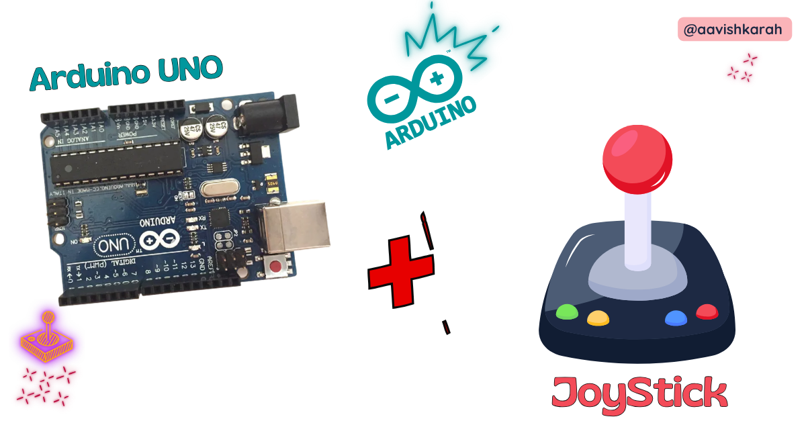
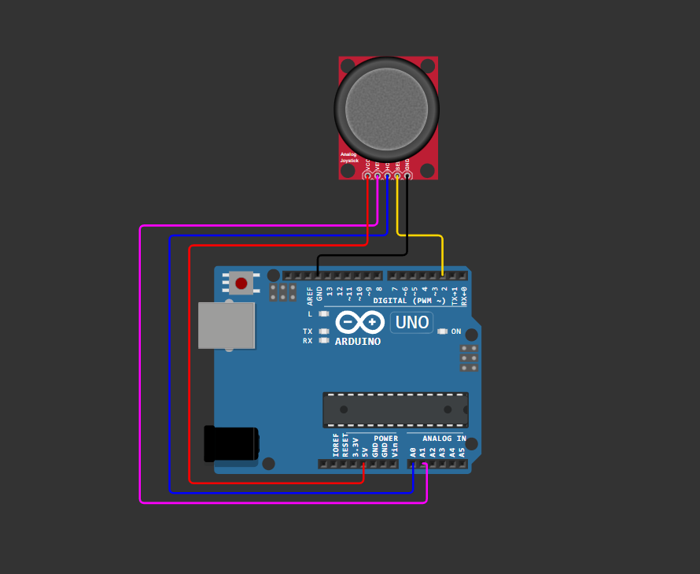

???+ Abstract "Table of Contents"

    [TOC]

## Abstract

Joystick modules are versatile input devices widely used in robotics, gaming controllers, RC vehicles, and human-machine interfaces due to their intuitive two-axis control and built-in push-button functionality. In this tutorial, you will learn how to interface a standard KY-023 dual-axis joystick module with an Arduino Uno microcontroller using the Arduino Framework. By the end, you will be able to read analog X/Y axis values, detect button presses, calibrate joystick centering, and integrate joystick input into your own embedded projects with confidence.

---

## Pre-Request

- **OS**: Windows / Linux / macOS
- **Arduino IDE** (v2.x recommended) or [Arduino Web Editor](https://create.arduino.cc/)
- **Arduino Uno** with CH340/FTDI drivers installed
- USB Cable (Mini-B for classic Uno, USB-C for newer variants)
- Basic understanding of C++ syntax and Arduino programming concepts

---

## Hardware Required

<!-- Advertisement -->
--8<-- "includes/arduino-link-cta.md"

- Arduino Uno (ATmega328P)
- KY-023 Dual-Axis Joystick Module
- Breadboard (mini or full-size)
- USB Mini-B Cable
- Jumper wires (M-M and M-F)
- Optional: 5V external power supply for high-current projects

| Components | Purchase Link |
| --- | --- |
| Arduino Uno | [link](https://www.skilldisk.com/product-page/pico-iot-spark-kit) |
| KY-023 Joystick Module | [link](https://www.skilldisk.com/product-page/pico-iot-spark-kit) |
| Mini USB Cable | [link](https://www.skilldisk.com/product-page/pico-iot-spark-kit) |
| BreadBoard | [large](https://amzn.to/4pgNX1c) : [small](https://amzn.to/47SMzvB)|
| Connecting Wires | [link](https://amzn.to/4pepr0H) |
| 5V DC Adaptor | [link](https://amzn.to/4m82t8D) |


!!! tip "Don't own a hardware :cry:"

    No worries,

    💡Still you can learn using simulation. check out simulation part :smiley:.

    💡Power your mission with reliable Arduino Kits. [Explore :simple-arduino: Hardware →](https://www.skilldisk.com/category/arduino){target="_blank"}

<!-- Uno Craft Advertisement -->
--8<-- "includes/uno-edge-cta.md"


!!! tip "🔋 Power Note" 
    
    The KY-023 joystick operates at 3.3V–5V and draws minimal current (<10mA), so it can be safely powered from the Arduino Uno's `5V` pin.

---

## ⚡ Understanding Joystick Module & Analog Input

The **KY-023** is a popular analog joystick module featuring two potentiometers (for X and Y axes) and a tactile push-button switch. Unlike digital buttons, joysticks output **variable analog voltages** proportional to their position, which the Arduino reads via its Analog-to-Digital Converter (ADC).

### 🔹 How Analog Joystick Works

| Joystick Position | X-Axis Voltage | Y-Axis Voltage | ADC Value (0–1023) |
| --- | --- | --- | --- |
| **Center (Neutral)** | ~2.5V | ~2.5V | ~512 |
| **Full Left** | ~0V | ~2.5V | ~0 (X), ~512 (Y) |
| **Full Right** | ~5V | ~2.5V | ~1023 (X), ~512 (Y) |
| **Full Up** | ~2.5V | ~0V | ~512 (X), ~0 (Y) |
| **Full Down** | ~2.5V | ~5V | ~512 (X), ~1023 (Y) |

#### ADC Resolution & Mapping

Arduino Uno features a **10-bit ADC** (0–1023 range) across 0–5V input. The `analogRead()` function converts analog voltage to digital values:

```cpp
int xValue = analogRead(A0); // Returns 0–1023
```

#### Button Switch Logic

The built-in push-button is **active-LOW**:
- **Not pressed**: Output = `HIGH` (5V via pull-up)
- **Pressed**: Output = `LOW` (0V, connected to GND)

---

## 🧷 Connection / Wiring Guide (Arduino Uno to Joystick Module)

### 🔥 Pin Mapping Table

| Joystick Pin | Label | Arduino Uno Pin | Description |
| --- | --- | --- | --- |
| **GND** | GND | `GND` | Common ground reference |
| **+5V** | VCC | `5V` | Power supply (3.3V–5V compatible) |
| **VRx** | X-Axis | `A0` | Analog output for horizontal movement |
| **VRy** | Y-Axis | `A1` | Analog output for vertical movement |
| **SW** | Button | `D2` | Digital output for push-button (with INPUT_PULLUP) |

!!! note "⚠️ Important"
    Always connect GND first to avoid floating inputs and erratic readings.

#### Wiring Diagram



/// caption
fig-Connection Diagram
///

!!! tip "💡 Pro Tip"
     Use the Arduino Uno's `A6` and `A7` for additional analog inputs if needed—they are analog-only pins (no digital functionality).

---

## :open_file_folder: Code


```cpp title="joystick_basic.ino"

// Pin Definitions
const int PIN_X = A0;        // X-axis analog input
const int PIN_Y = A1;        // Y-axis analog input
const int PIN_BTN = 2;       // Button digital input

// Calibration values (adjust for your module)
const int CENTER_THRESHOLD = 20;  // Deadzone around center
const int MIN_VAL = 0;
const int MAX_VAL = 1023;
const int CENTER_VAL = 512;

void setup() {
  // Initialize Serial communication
  Serial.begin(9600);
  while (!Serial); // Wait for Serial Monitor 

  // Configure button pin with internal pull-up
  pinMode(PIN_BTN, INPUT_PULLUP);

  Serial.println("🎮 Joystick Initialized");
  Serial.println("X\tY\tButton");
  Serial.println("--------------------");
}

void loop() {
  // Read analog values (0-1023)
  int xValue = analogRead(PIN_X);
  int yValue = analogRead(PIN_Y);
  
  // Read button state (LOW = pressed)
  bool buttonPressed = (digitalRead(PIN_BTN) == LOW);

  // Optional: Apply deadzone filtering for center position
  if (abs(xValue - CENTER_VAL) < CENTER_THRESHOLD) xValue = CENTER_VAL;
  if (abs(yValue - CENTER_VAL) < CENTER_THRESHOLD) yValue = CENTER_VAL;

  // Output to Serial Monitor
  Serial.print(xValue);
  Serial.print("\t");
  Serial.print(yValue);
  Serial.print("\t");
  Serial.println(buttonPressed ? "PRESSED" : "RELEASED");

  // Small delay for stable readings
  delay(100);
}
```

### Code Explanation

:point_right: Pin Definitions & Constants

```cpp
const int PIN_X = A0;
const int PIN_Y = A1;
const int PIN_BTN = 2;
```

- Defines Arduino pins connected to joystick module
- `A0`/`A1` are analog input pins; `D2` is digital for button

:point_right: Calibration Parameters

```cpp
const int CENTER_THRESHOLD = 20;
const int CENTER_VAL = 512;
```

- `CENTER_THRESHOLD`: Deadzone radius to ignore minor drift at neutral position
- `CENTER_VAL`: Expected ADC value at joystick center (~512 for 10-bit ADC)

:point_right: Setup Function

```cpp
void setup() {
  Serial.begin(9600);
  pinMode(PIN_BTN, INPUT_PULLUP);
}
```

- Initializes serial communication at 9600 baud
- Configures button pin with internal pull-up resistor (no external resistor needed)

:point_right: Main Loop: Reading & Filtering

```cpp
int xValue = analogRead(PIN_X);
int yValue = analogRead(PIN_Y);
bool buttonPressed = (digitalRead(PIN_BTN) == LOW);
```

- Reads raw analog values for X/Y axes (0–1023)
- Reads button state (active-LOW logic)

:point_right: Deadzone Filtering (Optional but Recommended)

```cpp
if (abs(xValue - CENTER_VAL) < CENTER_THRESHOLD) xValue = CENTER_VAL;
```

- Prevents "jitter" when joystick is near center by snapping values to neutral
- Adjust `CENTER_THRESHOLD` (10–30) based on your module's precision

:point_right: Serial Output

```cpp
Serial.print(xValue); Serial.print("\t"); ...
```

- Outputs tab-separated values for easy parsing or Serial Plotter visualization
- Use **Tools > Serial Plotter** in Arduino IDE for real-time graphing

---

## :material-chart-bubble:{style="color:#ffaa00"} Simulation

!!! danger "Not able to view the simulation"
    - :fontawesome-solid-laptop: Desktop or Laptop : Reload this page ( ++ctrl+r++ )
    - :fontawesome-solid-mobile: Mobile : Use Landscape Mode and reload the page


<iframe style="height:calc(100vh - 200px); border-color:#00aaff;border-radius:1rem;min-height:400px" src="https://wokwi.com/projects/461976721333249025" frameborder="2px" width="100%" height="700px"></iframe>

<!-- Advertisement -->
--8<-- "includes/arduino-link-cta.md"

--8<-- "includes/uno-edge-cta.md"

---

## 🛑 Troubleshooting (Common Issues & Fixes)

❌ **Issue 1: Joystick values stuck at 0 or 1023**

✅ **Causes:**
- Loose/broken jumper wires
- Incorrect pin connections (VRx to digital pin)
- Module powered with wrong voltage

✅ **Fix:**
```cpp
// Verify connections with a simple test
void setup() {
  Serial.begin(9600);
}
void loop() {
  Serial.println(analogRead(A0)); // Should vary 0-1023 when moving joystick
  delay(200);
}
```
- Double-check wiring against pin mapping table
- Measure voltage at VRx/VRy with multimeter (should be 0–5V)

* * *

❌ **Issue 2: Joystick drifts or doesn't return to center**

✅ **Cause:**
- Mechanical wear or low-quality potentiometer
- ADC noise without filtering

✅ **Fix:**
```cpp
// Implement software deadzone (already in main code)
if (abs(xValue - 512) < 25) xValue = 512;

// Optional: Add simple moving average filter
int readFiltered(int pin, int samples = 5) {
  long sum = 0;
  for(int i=0; i<samples; i++) sum += analogRead(pin);
  return sum / samples;
}
```
- Calibrate `CENTER_VAL` for your specific module (print raw values at rest)
- Add 0.1µF capacitor between VRx/VRy and GND for noise reduction

* * *

❌ **Issue 3: Button always reads as pressed**

✅ **Cause:**
- Missing `INPUT_PULLUP` configuration
- Short circuit on SW pin

✅ **Fix:**
```cpp
pinMode(PIN_BTN, INPUT_PULLUP); // Critical for active-LOW button
```
- Verify button wiring: SW → D2, no external resistor needed
- Test with multimeter: SW pin should read ~5V (not pressed) / 0V (pressed)

* * *

❌ **Issue 4: Serial Monitor shows garbled text**

✅ **Cause:**
- Baud rate mismatch between code and Serial Monitor
- USB communication issues

✅ **Fix:**
- Ensure `Serial.begin(9600)` matches Serial Monitor dropdown selection
- Try different USB cable or port
- Reset Arduino Uno after uploading code

---

## 🏁 Conclusion

You have successfully interfaced a **KY-023 joystick module** with an **Arduino Uno** using the **Arduino Framework** 🎉. You now understand:

- How analog potentiometers generate variable voltage signals for position sensing
- How to read and calibrate ADC values for reliable input detection
- Best practices for button debouncing, deadzone filtering, and noise reduction
- Techniques for debugging and validating sensor connections

With this foundation, you can build interactive projects like:
- 🤖 RC robot directional control
- 🎮 Custom game controller interfaces
- 🎚️ Pan-tilt camera positioners
- 🖱️ DIY mouse/trackball alternatives
- 🎛️ Menu navigation systems for OLED displays

### Next Steps

1. **Map joystick values** to servo motors or motor drivers for robotic control
2. **Add hysteresis** to button presses for debouncing in critical applications
3. **Combine with displays** (OLED, LCD) to create visual feedback interfaces
4. **Explore interrupts** for responsive button handling without polling
5. **Scale to I2C/SPI** joysticks for projects requiring multiple inputs

---

## Extras

### Components details

- **KY-023 Joystick Module**: [Datasheet](#) \| [Pinout Diagram](#)
- Arduino Uno [Data Sheet](../blink-an-led-on-arduino-uno/files/uno-datasheet.pdf){target="_blank"}
