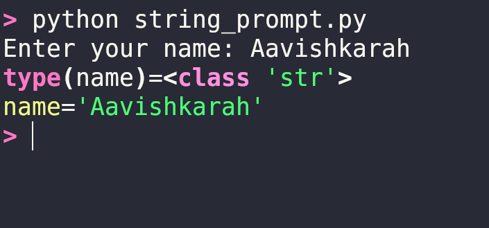
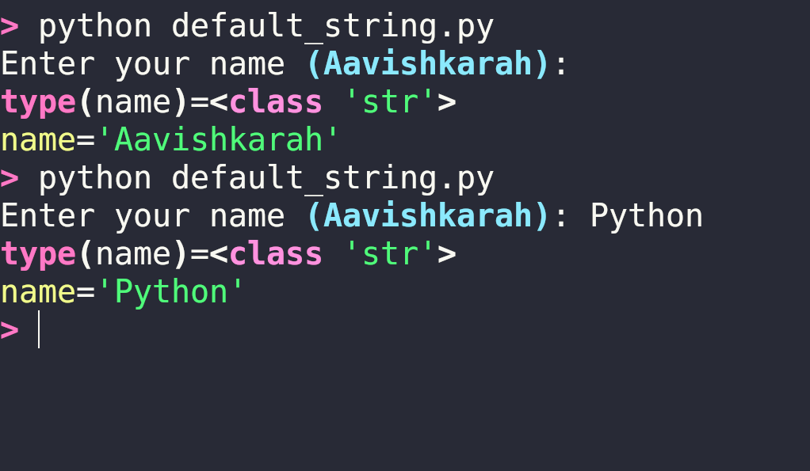
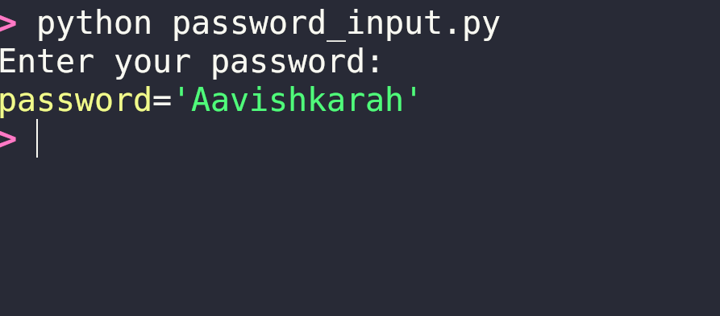
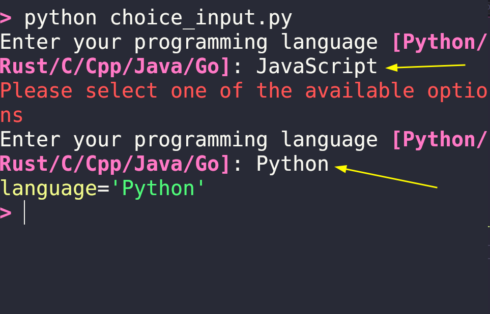
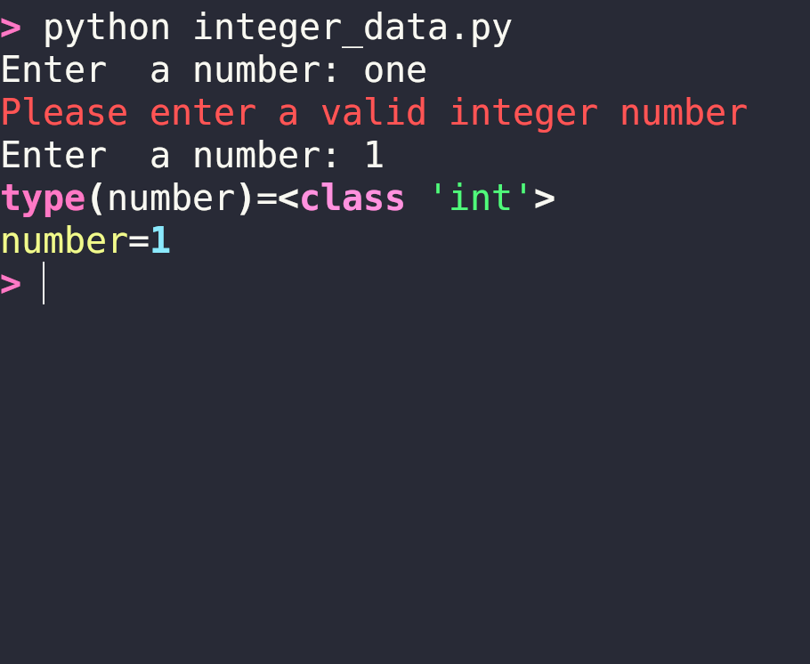
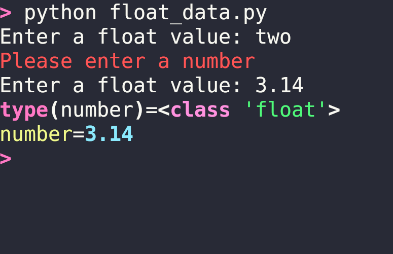
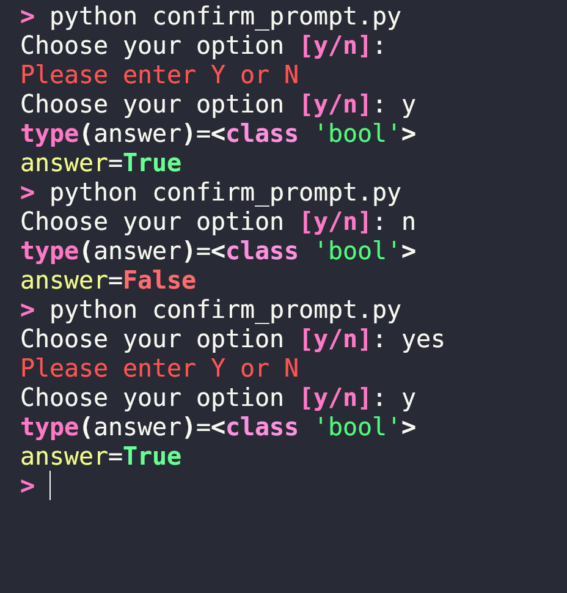

Still using `input()` in your python scripts ?, the same old input method without any data validation and  writing it all by yourself. No need to do that any more.

After going through this article, you will be able to validate data input like a PRO!. Thats right, in this article we will see how to validate data input, mask user input in stdio screen, accept data from choices and loop until a valid response is received using python library **Rich**.


???+ Abstract "Table of Contents"

    [TOC]


## Installation

Rich can be installed using `pip` from PyPI or your favorite package manager like rye, uv or poetry etc.


=== "pip"
    ```bash

    pip install rich

    ```
    


=== "rye"
    ```bash

    rye init --virtual
    rye add rich

    ```
    

=== "uv"
    ```bash

    uv init
    uv add rich

    ```
    


For using rich in  **Jupyter Notebook** or **Jupyter Lab**, install with additional dependencies using `rich[jupyter]`


=== "pip"
    ```bash

    pip install rich[jupyter]

    ```

=== "rye"
    ```bash

    rye init --virtual
    rye add rich[jupyter]

    ```

=== "uv"
    ```bash

    uv init
    uv add rich[jupyter]

    ```

Rich has a number of `Prompt` classes to ask user for input and loop until it is a valid response. It also provides options to specify default value, choose from a options, entering passwords etc.

| prompt        | Response type |
| ------------- | ------------- |
| `Prompt`      | String        |
| `IntPrompt`   | Integer       |
| `FloatPrompt` | Float         |
| `Confirm`     | Yes / No      |


## Prompt

`Prompt.ask()` method returns strings, 
- Set a default value, which will be returned if the user press enter or return key without entering any value. 
- Supply a list of choices, the prompt will loop until the user enters one of the choices.

```python title="string_prompt.py"
from rich.prompt import Prompt
from rich import print

name = Prompt.ask("Enter your name")
print(f"{type(name)=}")
print(f"{name=}")
```



### Default value

use `default` argument to return default value on pressing return key without entering any text.

```python title="default_string.py"
from rich.prompt import Prompt
from rich import print

name = Prompt.ask("Enter your name", default="Aavishkarah")
print(f"{type(name)=}")
print(f"{name=}")

```



### Password Input

By default `password` argument is set to `False` in  `prompt.ask()`, by setting it to `True`, the entered text can be hidden from the terminal.

```python title="password_input.py"
from rich.prompt import Prompt
from rich import print

password = Prompt.ask("Enter your password", password=True)
print(f"{password=}")

```



### Choices

By supplying the list of choices, the prompt will loop until the user enters one of the choices.

```python title="choice_input.py"
from rich.prompt import Prompt
from rich import print

programming_languages = [
    "Python",
    "Rust",
    "C",
    "Cpp",
    "Java",
    "Go",
]

language = Prompt.ask("Enter your programming language", choices=programming_languages)

print(f"{language=}")

```



!!! tip "Case Insensitive Choices"
    By default `case_sensitive` is `True`, by setting it to `False` choices can be case insensitive.

    ```python
    Prompt.ask("Enter your choice", 
        choices=choices_list,
        case_sensitive=False
    )  
    ```


!!! tip "Hide Choices"
    By default `show_choices` is `True`, by setting it to `False` you can hide choices list on the std output screen.

    ```python
    Prompt.ask("Enter your choice", 
        choices=choices_list,
        show_choices=False
    )  
    ```

## IntPrompt

By default `Prompt.ask()` return string. `IntPrompt.ask()` returns integer data and its keeps looping until an integer data is entered. So no need of converting input data in to integer and writing messy `try` and `except` blocks.


```python title="integer_data.py"
from rich.prompt import IntPrompt
from rich import print

number = IntPrompt.ask("Enter  a number")
print(f"{type(number)=}")
print(f"{number=}")
```




## FloatPrompt

Similar to `IntPrompt.ask()` returns integer data, `FloatPrompt.ask()` keeps looping until a float is entered.

```python title="float_data.py"
from rich.prompt import FloatPrompt
from rich import print

number = FloatPrompt.ask("Enter a float value")
print(f"{type(number)=}")
print(f"{number=}")
```




## Confirm

`Confirm.ask()` method is used to ask a `yes` or `no` question format.

```python title="confirm_prompt.py"
from rich.prompt import Confirm
from rich import print

answer = Confirm.ask("Choose your option")
print(f"{type(answer)=}")
print(f"{answer=}")
```

