Still using `print()` in your python scripts ?, the same old boring black & white text, no flair, no styles ?

After going through this article, you will print like a PRO!. Thats right, in this article we will see how to transform your boring terminal black & white output into a work of art using python library **Rich**.

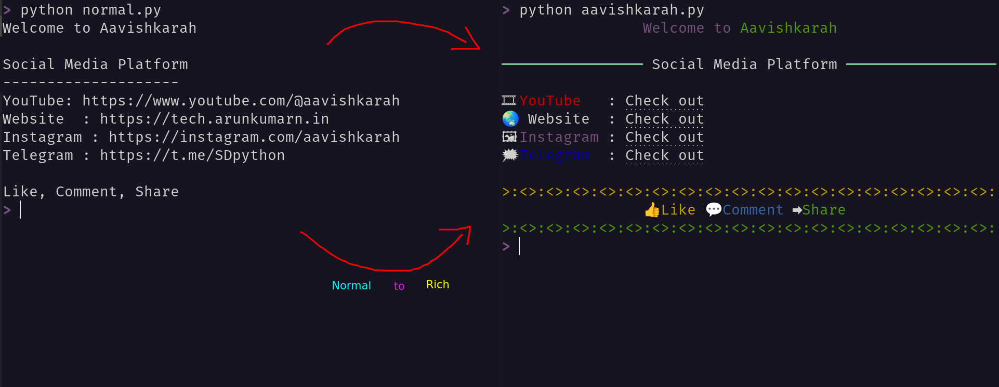
???+ Abstract "Table of Contents"

    [TOC]


## About Rich

It is a library for displaying rich text on the terminal and jupyter notebook. It also helps to render advanced contents such as tables, syntax highlighted code, progress bar, markdown files, json files etc.

## Installation

Rich can be installed using `pip` from PyPI or your favorite package manager like rye, uv or poetry etc.


=== "pip"
    ```bash

    pip install rich

    ```
    


=== "rye"
    ```bash

    rye init --virtual
    rye add rich

    ```
    

=== "uv"
    ```bash

    uv init
    uv add rich

    ```
    


For using rich in  **Jupyter Notebook** or **Jupyter Lab**, install with additional dependencies using `rich[jupyter]`


=== "pip"
    ```bash

    pip install rich[jupyter]

    ```

=== "rye"
    ```bash

    rye init --virtual
    rye add rich[jupyter]

    ```

=== "uv"
    ```bash

    uv init
    uv add rich[jupyter]

    ```

## Rich `print`

Rich print method is identical signature to the built-in `print` function with features included to add colors, formats, links and emojis using markup tags.


### Markup Tags

```markup
[ tag ] content [ /tag ]
```
Tags can be used to define the text colors, background color, text formats, underline, strike-through, blink, links etc.

**Text Color**

Color name or CSS color code can be used to represent the text color.

- `[red]Red text[/]`
- `[green]Green text[/]`
- `[#ffaa00]Orange text[/]`
- `[#0000ff]Blue text[/]`

**Background Color**
 
- `[red on yellow]Red text on Yellow background[/]`
- `[blue on white]Blue text on white background[/]`


```python title="color_text.py"
from rich import print

print("----Color Names----")
print("[red] Red Text [/]")
print("[green] Green Text [/]")
print("[magenta] Magenta Text [/]")
print("[yellow on red]Yellow Text on Red Background [/]")
print("----Color Codes----")
print("[#ffaa00] Orange Text [/]")
print("[#32CD32] Lime Green Text [/]")
print("[rgb(0,0,255)] Blue Text [/]")
```

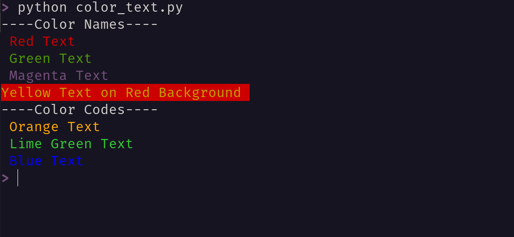


**Text Format**

- `[bold]Bold Text[/]`
- `[italic]Italic Text[/]`
- `[underline]Underlined Text[/]`
- `[strike]Text with line through it[/]`
- `[reverse]Background and foreground color reversed[/]`
- `[blink]Blink text[/]`


```python title="formatted_text.py"
from rich import print

print("[italic]Italic text[/]")
print("[bold]Bold text[/]")
print("[bold italic]Bold Italic text[/]")
print("[strike]Strikethrough text[/]")
print("[u]Underline text[/]")
print("[uu]Double Underline text[/]")
print("[blink]Blink text[/]")
```


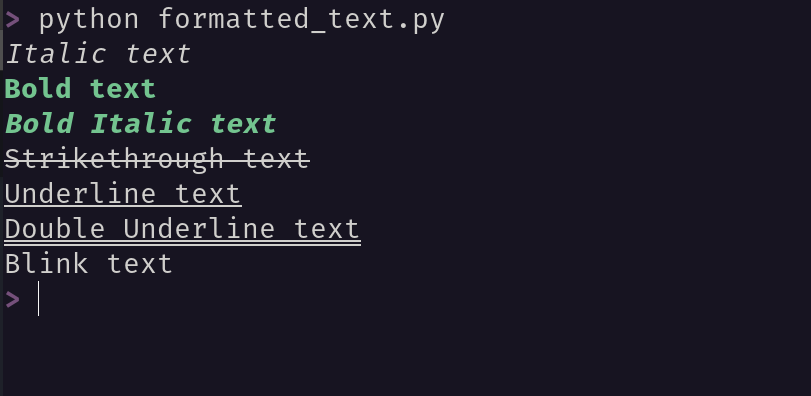

**Link**

- [link=https://tech.arunkumarn.in]Tech Resources[/link]

```python title="rich_link.py"
from rich import print

print("[link=https://tech.arunkumarn.in]Resource link[/link]")
print("[link=https://www.youtube.com/@aavishkarah]YouTube Channel[/link]")
```


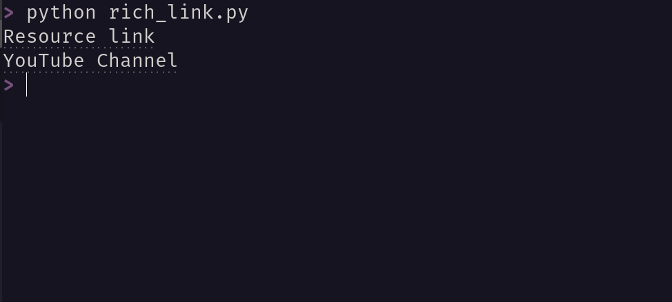

**Emoji**

Emoji can be inserted in the text using emoji code name surrounded by colons ++colon++ .

Examples:

| code               | emoji    |
| ------------------ | -------- |
| `:flag_for_india:` | 🇮🇳        |
| `:100:`            | 💯        |
| `:+1:`             | 👍        |
| `:-1:`             | 👎        |
| `:shield:`         | :shield: |
| `:heart:`          | :heart:  |

The list of emoji supported by rich library can be printed on the terminal by running following command.

```bash
python -m rich.emoji
```

```python title="rich_emoji.py"
from rich import print

print(":+1: :speech_balloon: :arrow_right: :ice_cream: :hundred_points:")
```

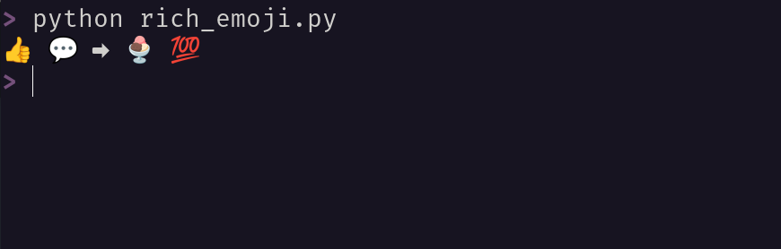


## Rich `Console`

To have complete control over the terminal formatting, rich provides `Console` class. The console object auto detects the capabilities of the terminal like **size**, **encoding**, **is_terminal** and **color_system**, using these details it convert colors and styles accordingly.

### `print` method

`print` method from Console class helps to render rich content to the terminal. It does heavy lifting works of pretty printing and styling python objects using `__str__` method.

Console object `print` method can also render Rich's built-in-objects such as `Table`, `Text`, `Syntax` or other custom objects.

#### Adding Styles

Console `print` method accepts `style` keyword argument to specify foreground, background color and text emphasis like bold, italic etc.

```python title="console_style.py"

from rich.console import Console

console = Console()

console.print("Welcome to Aavishkarah", 
                style="magenta")
console.print("White Background with Red Text", 
                style="red on white")
console.print("Blue bold text underlined with yellow background", 
                style="bold blue underline on yellow")

```

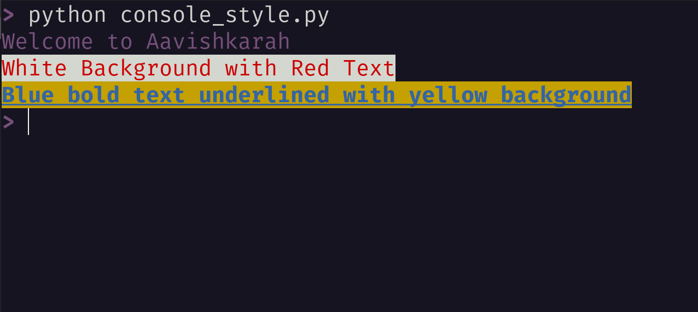


#### Justify or Alignment

Console `print` method supports justify argument. **justify** arguments accepts one of the four values _default_, _left_, _center_ and _right_. 

```python title="alignment.py"

from rich.console import Console

console = Console()

console.print("Default justify")
console.print("Left justify", justify="left")
console.print("Center justify", justify="center")
console.print("Right justify", justify="right")

```

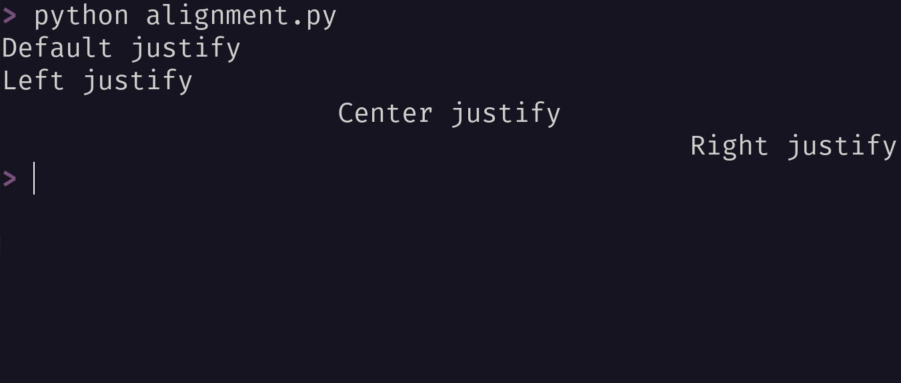

#### Overflow

When the space is restricted, and you need to print content larger than the available space, overflow happens.
`overflow` argument in `print` method helps to handel these type of scenarios. it accepts one of the three values _fold_ (default value), _crop_ and _ellipsis_.

| value    | description                                    |
| -------- | ---------------------------------------------- |
| fold     | excess characters on following lines.          |
| crop     | truncates text at the end of line.             |
| ellipsis | inserts `...` at the end of the text truncated |


```python title="overflow.py"
from rich.console import Console

console = Console(width=26)
url="https://tech.arunkumarn.in/blogs/python/Convert_Jupyter_Notebooks_into_Interactive_Slides/"

console.print("fold", style="magenta", justify="center")
console.print(url, overflow="fold")
print()

console.print("crop", style="magenta", justify="center")
console.print(url, overflow="crop")
print()

console.print("ellipsis", style="magenta", justify="center")
console.print(url, overflow="ellipsis")

```

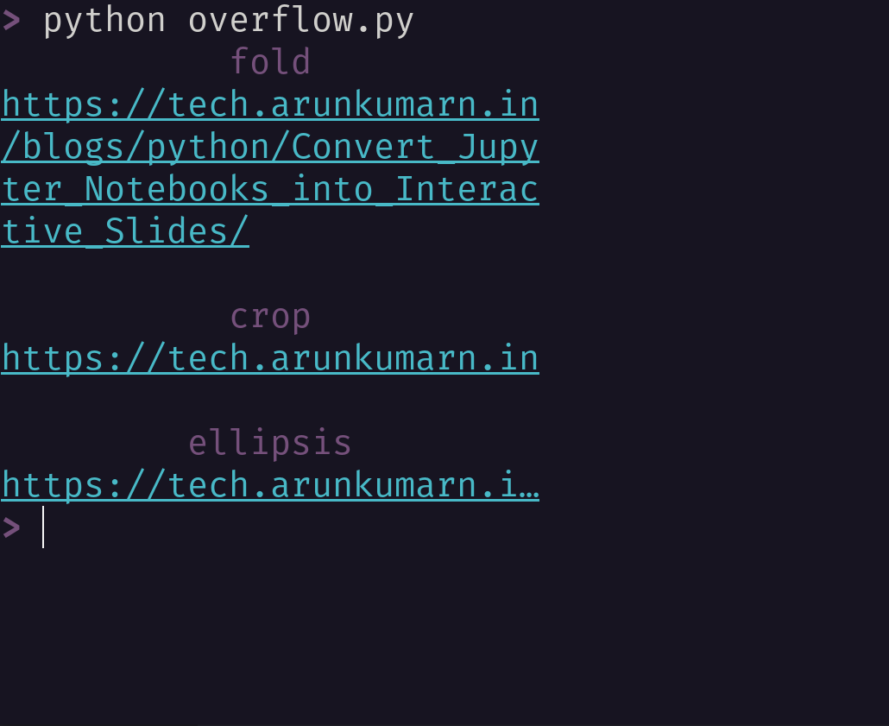


### `rule` method

`rule()` method draws a line with optional centered title. It can accept four optional arguments.

| arguments  | description                                                                        |
| ---------- | ---------------------------------------------------------------------------------- |
| title      | Text to render over the rule. Defaults to "".                                      |
| characters | Character(s) to form the line. Defaults to "─".                                    |
| style      | Style of line. Defaults to "rule.line".                                            |
| align      | How to align the title, one of "left", "center", or "right". Defaults to "center". |


```python title="rules.py"

from rich.console import Console

console = Console()

console.rule()
console.rule("Aavishkarah")
console.rule("Aavishkarah", style="red")
console.rule("Aavishkarah", align="right")
console.rule("Aavishkarah", characters="*")
console.rule("Aavishkarah", characters=">:<", align="left", style="magenta")


```

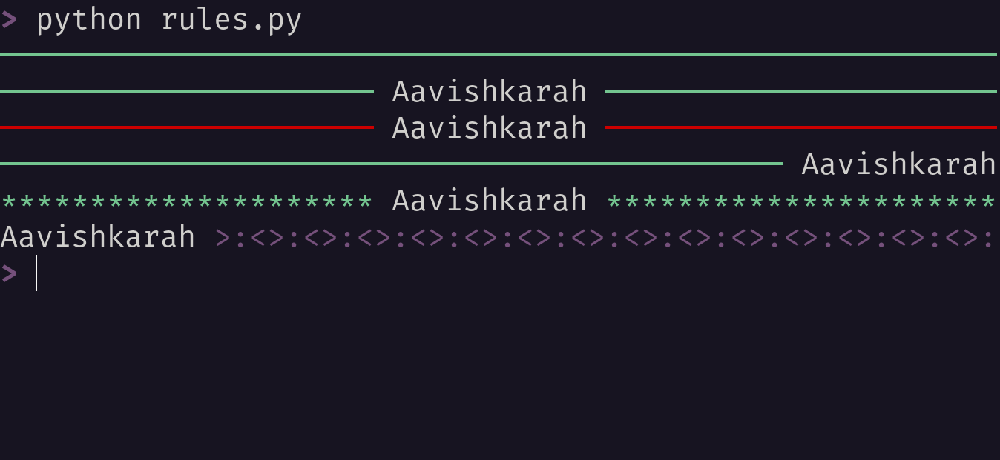


### Printing Json

`print_json` method is used to pretty print the JSON.

=== "Code"
    ```python title="json_format.py"
    import json
    from rich.console import Console

    console = Console()

    with open("aavishkarah.json") as f:
        data = f.read()


    console.rule("Normal Print",characters="~")
    print(data)
    print()
    console.rule("[magenta]Rich[/] [yellow]Print[/]", characters=">:~:<")
    console.print_json(data)

    ```

=== "json file"
    ```json title="aavishkarah.json"

    {"YouTube": "https://www.youtube.com/@aavishkarah?sub_confirmation=1","Instagram": "https://instagram.com/aavishkarah","Facebook": "https://facebook.com/people/Aavishkarah/61573021117727","Whatsapp": "https://whatsapp.com/channel/0029Vb5ddY75a24ASH3a4535","Telegram": "https://t.me/SDpython","Github": "https://github.com/aavishkarah","Website": "https://tech.arunkumarn.in/"}

    ```

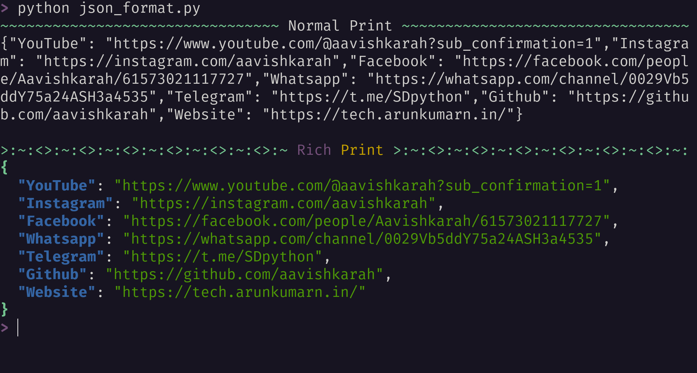


### Status Indication

while you are download a file or function is taking longer time to execute, it will be hard to indicate the status in the terminal. Now with the help of `status()` method, that problem is solved.

`status` method can display status messages with a `spinner` animation that won't interfere with regular console output. Use context manager to display the status message.

```python title="status.py"
from rich.console import Console
from time import sleep

console = Console()

def delay_task(n):
    for i in range(n):
        console.print(f"{i=}")
        sleep(2)
    
with console.status("Working....", spinner="monkey"):
    delay_task(5)

```

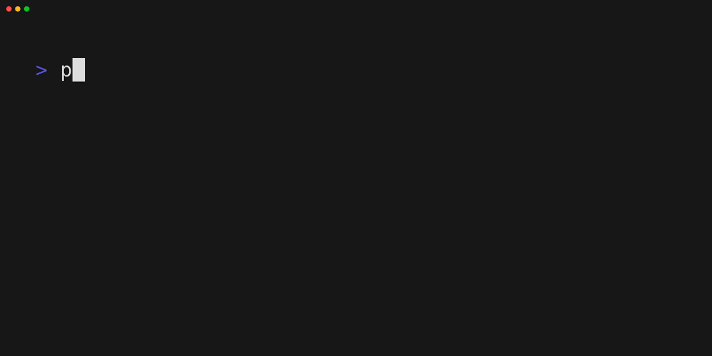

To list out all the `spinners` run the following command in terminal.

```bash
python -m rich.spinner
```

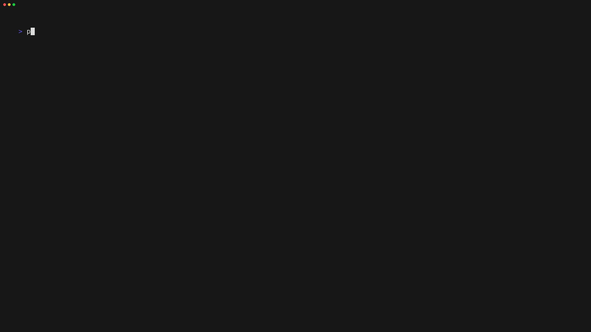


## Rich in REPL

While working in REPL to style the output, simply execute a line of code inside the interpreter, so that python data structures are automatically highlighted and pretty printed.

```python title="python interpreter"
>>> from rich import pretty
>>> pretty.install()
>>>
```
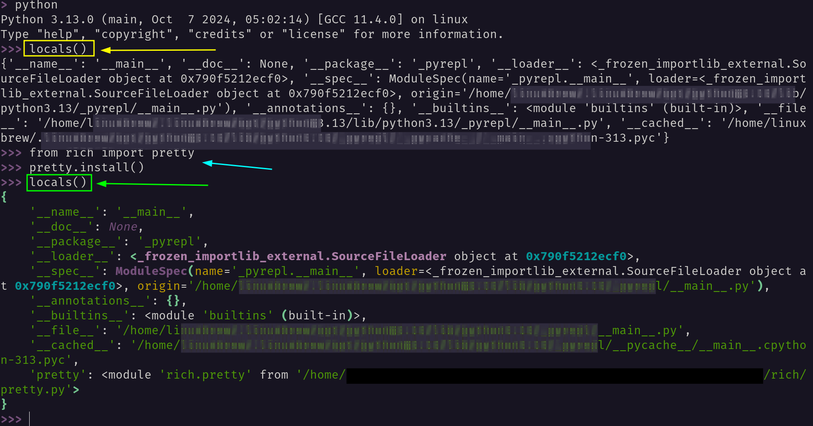
