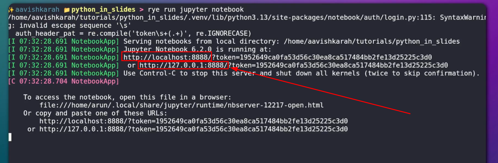
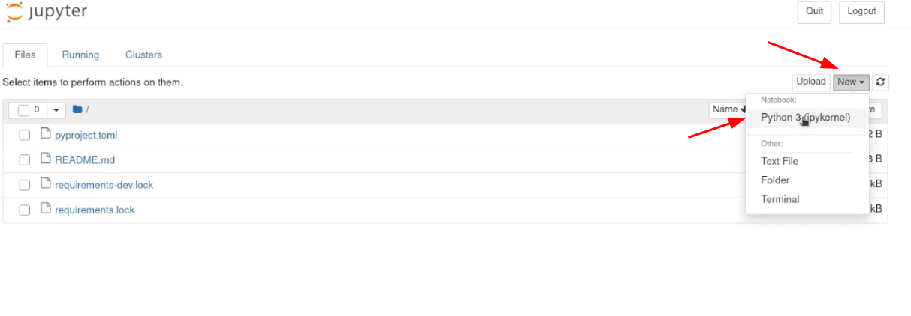
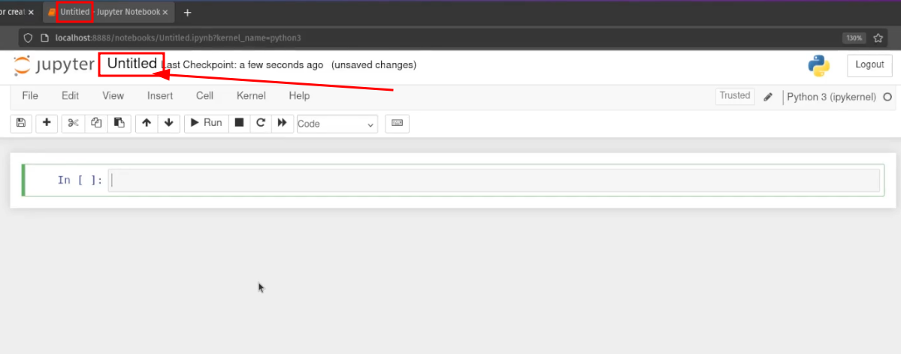
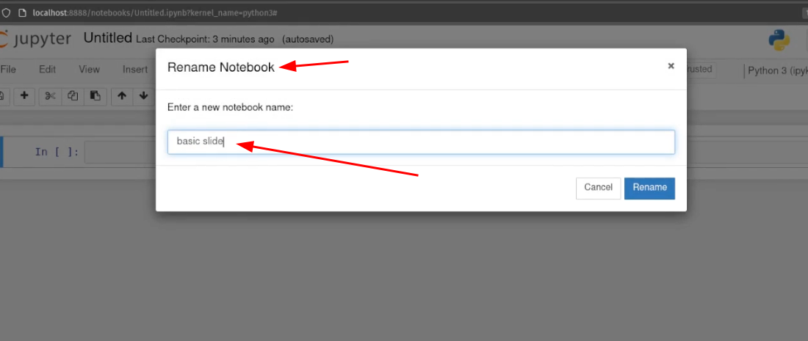
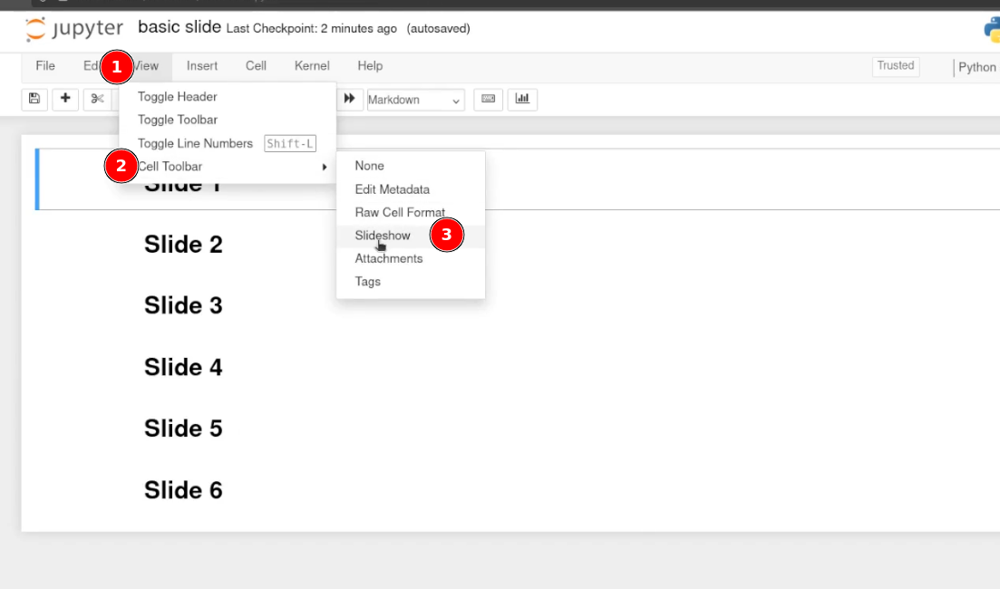
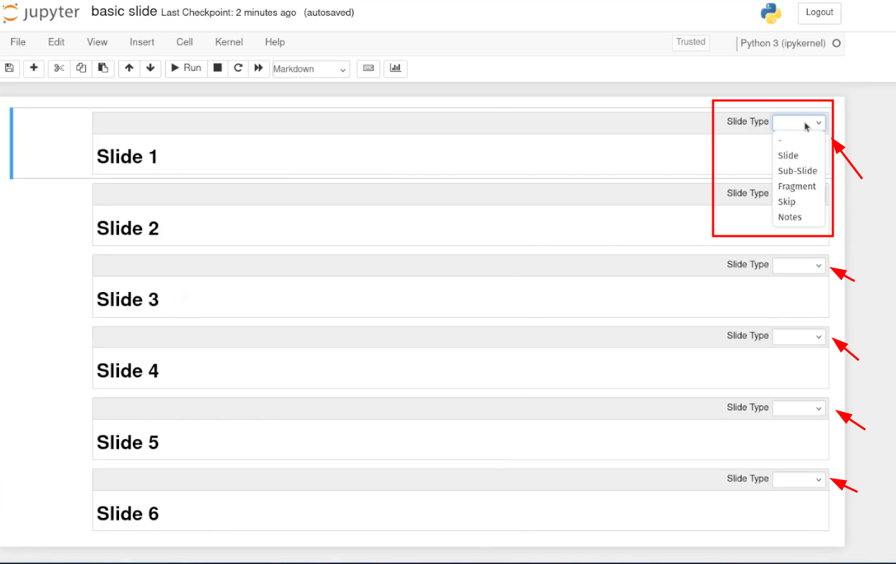
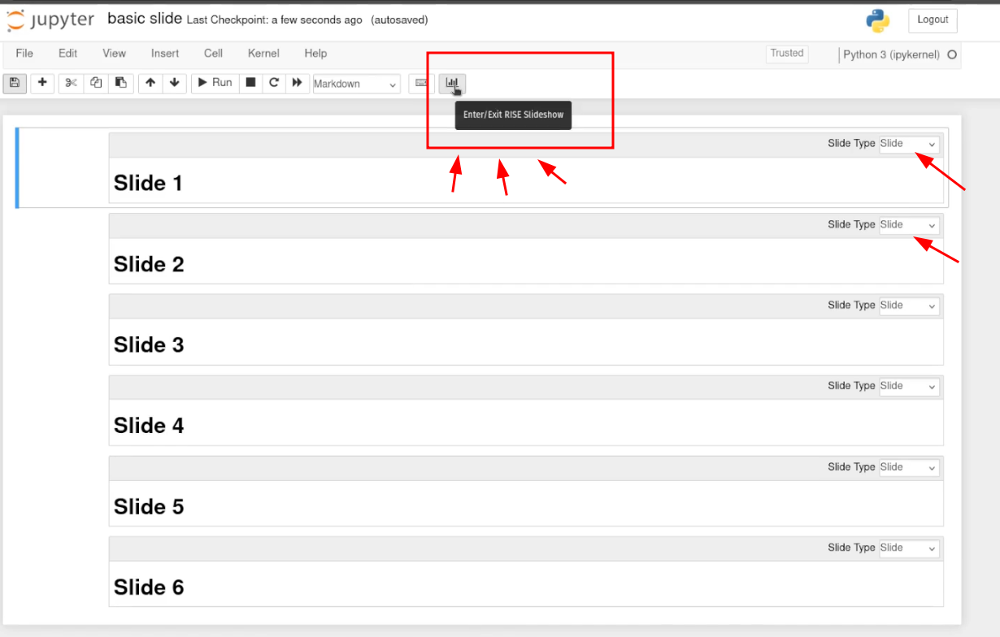

For educators, developers, and students who are looking for a way to present technical content in a more engaging and interactive way, RISE is the perfect tool.

Converting the Jupyter Notebook to Presentation slides, no need to export your notebook or switch tools, just install the RISE extension, open your notebook, and click on the `Enter/Exit RISE Slideshow` button. Your notebook instantly transforms into a slideshow, powered by the Reveal.js framework.

???+ Abstract "Table of Contents"

    [TOC]


## Pre-request

As a preliminary step, before you start, please ensure that you have Python 3.11 or a later version installed on your system and that it is correctly configured to be executable directly from your terminal or command line interface. Optional, you can have rye or uv installed.

!!! info 
    Check out [installing python](../../../python/installation.md) or [:simple-youtube: video](https://www.youtube.com/embed/dpNP-MN9X-4?si=7pLuRWWQtMlciU5D) for the tutorial.

## Setting up a python project


Create a directory for the project, open terminal or command prompt from the particular directory location and follow the steps.

1) Setting up virtual environment

=== "rye"
    ```bash

    rye init --virtual
    rye sync

    ```

=== "uv"
    ```bash

    uv init .
    uv sync

    ```

=== "Virtualenv Linux :fontawesome-brands-linux:"
    ```bash

    # installing virtual environment library
    $ python -m pip install virtualenv

    # Creating a new virtual environment
    # <venv_name> can be any user defined, here will say it as '.venv'
    $ python -m virtualenv <venv_name>

    # activating virtual environment 
    source .venv/bin/activate

    ```

=== "Virtualenv Win :fontawesome-brands-windows:"
    ```ps

    # installing virtual environment library
    C:\> python -m pip install virtualenv

    # Creating a new virtual environment
    # <venv_name> can be any user defined, here will say it as '.venv'
    C:\> python -m virtualenv <venv_name>
    
    
    # activating virtual environment 
    C:\> .venv\scripts\activate

    ```


    
2) Adding library to project


=== "rye"
    ```bash

    rye add notebook==6.2 setuptools rise==5.7.1

    ```

=== "uv"
    ```bash

    uv add notebook==6.2 setuptools rise==5.7.1

    ```

=== "Virtualenv  Linux :fontawesome-brands-linux:"
    ```bash

    # installing libraries
    (.venv)$ python -m pip install notebook==6.2 rise==5.7.1

    ```

=== "Virtualenv Win :fontawesome-brands-windows:"
    ```ps


    # installing libraries
    (.venv)C:\> python -m pip install notebook==6.2 rise==5.7.1

    ```

3) Starting a Jupyter Notebook Server

=== "rye"
    ```bash

    rye run jupyter notebook

    ```

=== "uv"
    ```bash

    uv run jupyter notebook

    ```

=== "Virtualenv Linux :fontawesome-brands-linux:"
    ```bash

    (.venv)$ jupyter notebook

    ```

=== "Virtualenv Win :fontawesome-brands-windows:"
    ```ps

    (.venv)C:\> jupyter notebook


    ```

!!! Note

      - Step 1 & 2 are required to run only once, to set up a new python project.
      - Once the project is set up, you can run the jupyter notebook server by directly from the project location.


!!! youtube-tutorial "Video tutorial"

    <iframe width="560" height="315" src="https://www.youtube.com/embed/jQ5q3GaXObw?si=s5VXgWFIa9w3vAGZ" title="YouTube video player" frameborder="0" allow="accelerometer; autoplay; clipboard-write; encrypted-media; gyroscope; picture-in-picture; web-share" referrerpolicy="strict-origin-when-cross-origin" allowfullscreen></iframe>

This should start a notebook server at localhost IP address `127.0.0.1` with default port set to `8888`.



If you have configured the default browser, jupyter dashboard will open directly, once the jupyter notebook server is started.


## Creating a new Notebook

With jupyter notebook dashboard open, click on `New` button, select `python 3`. This should create a new jupyter notebook with default file name `untitled.ipynb`.



Rename the file by clicking on the `untitled`, to the name that matches your concept.





Fill the content using :simple-markdown: Markdown, :simple-html5: HTML or :simple-latex: Latex in the cell. Every cell can be configured to be a slide or the fragment inside a slide.

## Structuring the presentation

Each individual cell within a Jupyter Notebook offers the flexibility to be designated as a `slide`, a `sub-slide`, a `fragment` of a slide, to be `skipped` entirely, or to serve as speaker’s `notes`, all through the strategic use of cell metadata. To set this up using the GUI, go to : `View` → `Cell Toolbar` → `Slideshow`. This adds a dropdown menu to every cell. (*fig: slide type selection*)





/// caption
fig: Slide type selection
///

**Slide Types**

| Option | Purpose| 
|--|--|
| Slide | Starts a new slide| 
| Sub-slide | Nested inside the current slide| 
| Fragment | Reveal gradually within the current slide| 
| Skip | Omit from presentation| 
| Notes | Speaker notes (not shown on screen)| 

Enter the slide show mode by clicking on a bar chart with a screen icon button in the toolbar, that says "Enter/Exit RISE Slideshow" on hover.



!!! tip "RISE Presentation Controls"

    - `Enter/Exit RISE with the button` or ++alt+r++
    - Navigation
        - Use arrow keys (++left++, ++right++, ++up++, ++down++ ).
        - ++space++ : next slide
        - ++shift+space++ : Previous slide
        - ++home++ jump to first slide
        - ++end++ jump to last slide
        - ++w++ toggle slide overview
    - ++question++ → Show help dialogue
    - ++slash++ → Black screen (pause)
    - ++comma++ → Show or hide buttons.

## Customization


### Adding Images, Videos, Links and Executing code 

<iframe width="560" height="315" src="https://www.youtube.com/embed/CBfxzxCwH9E?si=SssNZ4JQJTlCg69G" title="YouTube video player" frameborder="0" allow="accelerometer; autoplay; clipboard-write; encrypted-media; gyroscope; picture-in-picture; web-share" referrerpolicy="strict-origin-when-cross-origin" allowfullscreen></iframe>

### Customising theme, transition and enable chalkboard feature

<iframe width="560" height="315" src="https://www.youtube.com/embed/uQJmgs9HMec?si=-ZgCD0f7VF4osPUB" title="YouTube video player" frameborder="0" allow="accelerometer; autoplay; clipboard-write; encrypted-media; gyroscope; picture-in-picture; web-share" referrerpolicy="strict-origin-when-cross-origin" allowfullscreen></iframe>