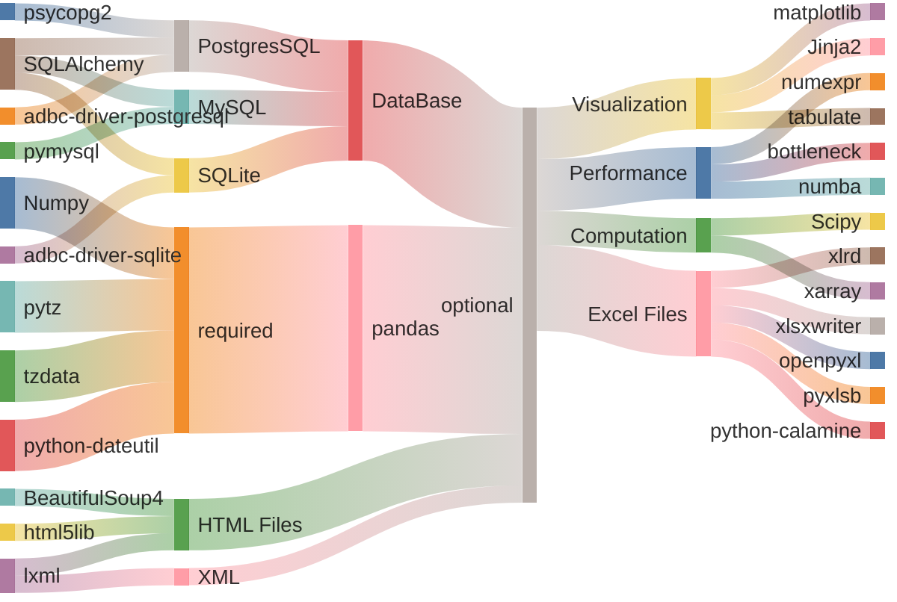
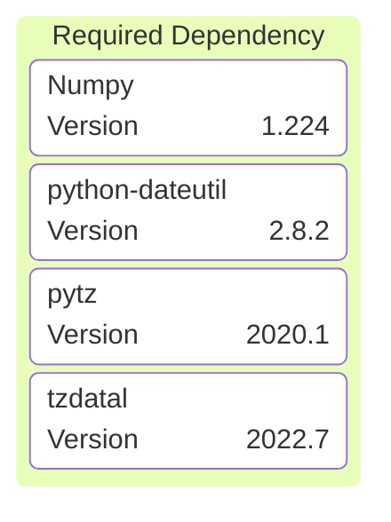
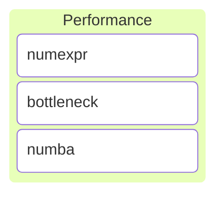
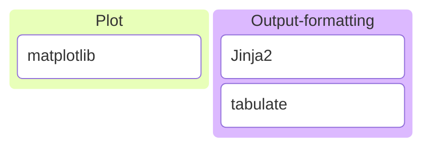
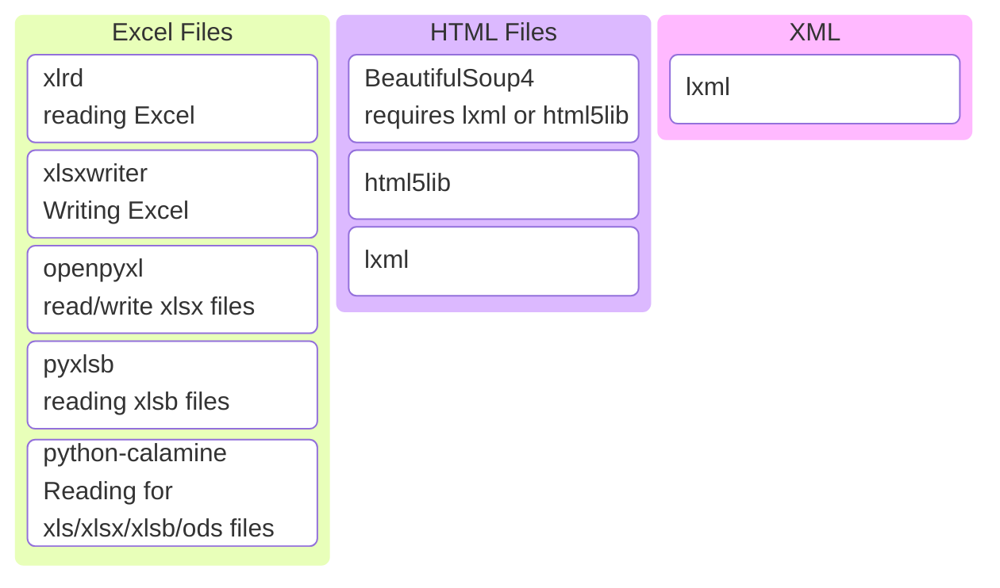
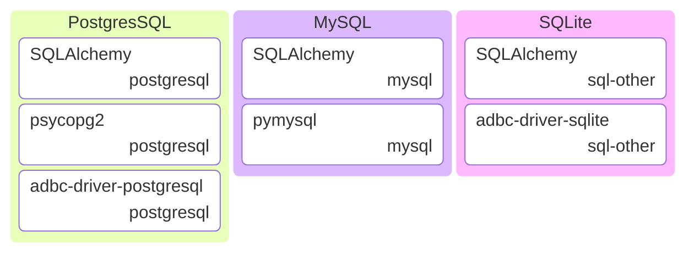

Pandas for Data Analysis

???+ Abstract "Table of Contents"

    [TOC]


## Why Pandas ?


## Time line


Pandas 

## Installation


=== "rye"
    ```bash

    $ rye init --virtual
    $ rye add pandas

    ```

=== "uv"
    ```bash

    $ uv init .
    $ uv pip install pandas

    ```

=== "pip"
    ```bash
    $ pip install pandas

    ```

=== "conda :simple-anaconda:"
    ```ps

    $ conda install pandas

    ```


### Dependencies 



### Required Dependencies

The list of packages gets installed along with Pandas for its operations.



### Optional Dependencies

It has many optional dependencies, to improvise the performance, visualization, accessing particular API's or methods.

#### Performance

While working with large files, it is advised to install performance dependencies for pandas using




=== "rye"
    ```bash
    $ rye add pandas[performance]
    ```

=== "uv"
    ```bash
    $ uv pip install pandas[performance]

    ```

=== "pip"
    ```bash
    $ pip install pandas[performance]
    ```

=== "conda :simple-anaconda:"
    ```ps
    $ conda install pandas[performance]
    ```

---

#### Visualization : Plotting & Formatting

For plotting graph using pandas api, optional dependency `matplotlib` can be installed along with pandas using pip-extra [`plot`] for visualization and for markdown and DataFrame styles using `output-formatting`.




=== "rye"
    ```bash
    $ rye add pandas[plot, output-formatting]
    ```

=== "uv"
    ```bash
    $ uv pip install pandas[plot, output-formatting]
    ```

=== "pip"
    ```bash
    $ pip install pandas[plot, output-formatting]
    ```

=== "conda :simple-anaconda:"
    ```ps
    $ conda install pandas[plot, output-formatting]
    ```

---

#### Computation

For N-dimensional data and statistical functions


=== "rye"
    ```bash
    $ rye add pandas[computation]
    ```

=== "uv"
    ```bash
    $ uv pip install pandas[computation]

    ```

=== "pip"
    ```bash
    $ pip install pandas[computation]
    ```

=== "conda :simple-anaconda:"
    ```ps
    $ conda install pandas[computation]
    ```

---

#### Excel files

To work with excel files, it necessary to install optional dependencies along with pandas.



=== "rye"
    ```bash
    $ rye add pandas[excel]
    ```

=== "uv"
    ```bash
    $ uv pip install pandas[excel]

    ```

=== "pip"
    ```bash
    $ pip install pandas[excel]
    ```

=== "conda :simple-anaconda:"
    ```ps
    $ conda install pandas[excel]
    ```

#### HTML file

=== "rye"
    ```bash
    $ rye add pandas[html]
    ```

=== "uv"
    ```bash
    $ uv pip install pandas[html]

    ```

=== "pip"
    ```bash
    $ pip install pandas[html]
    ```

=== "conda :simple-anaconda:"
    ```ps
    $ conda install pandas[html]
    ```

---





