Pandas for Data Analysis

???+ Abstract "Table of Contents"

    [TOC]


## Why Pandas ?


## Time line


Pandas 

## Installation


=== "rye"
    ```bash

    $ rye init --virtual
    $ rye add pandas

    ```

=== "uv"
    ```bash

    $ uv init .
    $ uv pip install pandas

    ```

=== "pip"
    ```bash
    $ pip install pandas

    ```

=== "conda :simple-anaconda:"
    ```ps

    $ conda install pandas

    ```


### Dependencies 

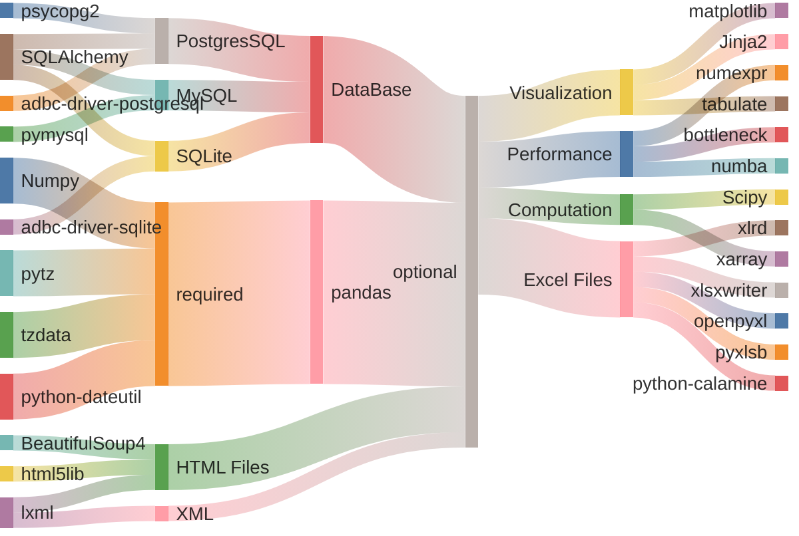

### Required Dependencies

The list of packages gets installed along with Pandas for its operations.

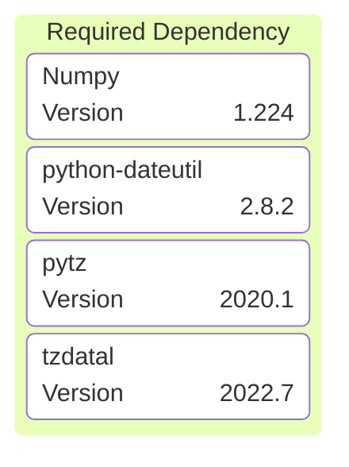

### Optional Dependencies

It has many optional dependencies, to improvise the performance, visualization, accessing particular API's or methods.

#### Performance

While working with large files, it is advised to install performance dependencies for pandas using

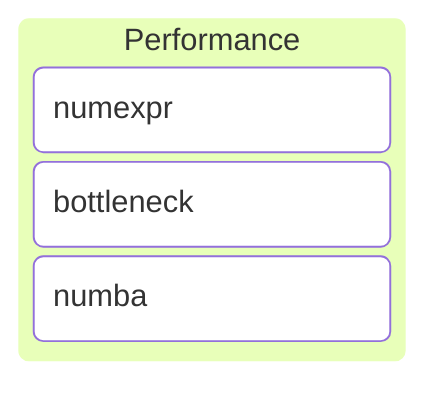


=== "rye"
    ```bash
    $ rye add pandas[performance]
    ```

=== "uv"
    ```bash
    $ uv pip install pandas[performance]

    ```

=== "pip"
    ```bash
    $ pip install pandas[performance]
    ```

=== "conda :simple-anaconda:"
    ```ps
    $ conda install pandas[performance]
    ```

---

#### Visualization : Plotting & Formatting

For plotting graph using pandas api, optional dependency `matplotlib` can be installed along with pandas using pip-extra [`plot`] for visualization and for markdown and DataFrame styles using `output-formatting`.


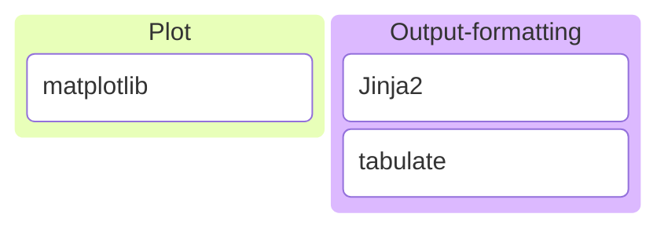

=== "rye"
    ```bash
    $ rye add pandas[plot, output-formatting]
    ```

=== "uv"
    ```bash
    $ uv pip install pandas[plot, output-formatting]
    ```

=== "pip"
    ```bash
    $ pip install pandas[plot, output-formatting]
    ```

=== "conda :simple-anaconda:"
    ```ps
    $ conda install pandas[plot, output-formatting]
    ```

---

#### Computation

For N-dimensional data and statistical functions


=== "rye"
    ```bash
    $ rye add pandas[computation]
    ```

=== "uv"
    ```bash
    $ uv pip install pandas[computation]

    ```

=== "pip"
    ```bash
    $ pip install pandas[computation]
    ```

=== "conda :simple-anaconda:"
    ```ps
    $ conda install pandas[computation]
    ```

---

#### Excel files

To work with excel files, it necessary to install optional dependencies along with pandas.

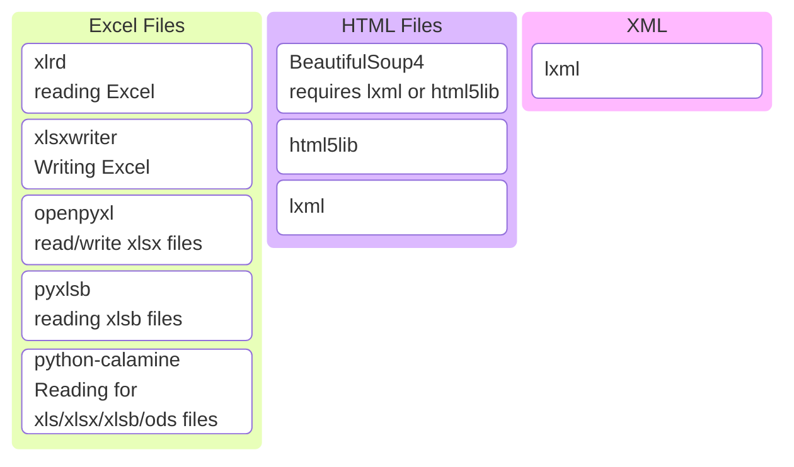

=== "rye"
    ```bash
    $ rye add pandas[excel]
    ```

=== "uv"
    ```bash
    $ uv pip install pandas[excel]

    ```

=== "pip"
    ```bash
    $ pip install pandas[excel]
    ```

=== "conda :simple-anaconda:"
    ```ps
    $ conda install pandas[excel]
    ```

#### HTML & XML file

=== "rye"
    ```bash
    $ rye add pandas[html]
    ```

=== "uv"
    ```bash
    $ uv pip install pandas[html]

    ```

=== "pip"
    ```bash
    $ pip install pandas[html]
    ```

=== "conda :simple-anaconda:"
    ```ps
    $ conda install pandas[html]
    ```

---

#### SQL databases

To access data from database files, it necessary to install optional dependencies along with pandas.

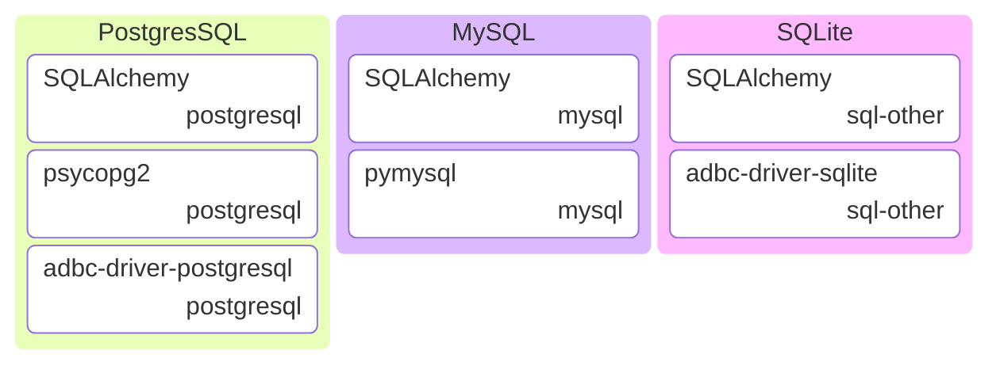

=== "rye"
    ```bash
    $ rye add pandas[postgresql, mysql, sql-other]
    ```

=== "uv"
    ```bash
    $ uv pip install pandas[postgresql, mysql, sql-other]

    ```

=== "pip"
    ```bash
    $ pip install pandas[postgresql, mysql, sql-other]
    ```

=== "conda :simple-anaconda:"
    ```ps
    $ conda install pandas[postgresql, mysql, sql-other]
    ```

---


!!! info
    All optional dependencies can be installed with
    
    === "rye"
        ```bash
        $ rye add pandas[all]
        ```

    === "uv"
        ```bash
        $ uv pip install pandas[all]

        ```

    === "pip"
        ```bash
        $ pip install pandas[all]
        ```

    === "conda :simple-anaconda:"
        ```ps
        $ conda install pandas[all]
        ```
    
    ---
    
    - Pandas is part of major Python distributions like Anaconda, ActiveState Python, WinPython etc.
    - Install from GitHub repository. [Pandas : Click here](https://github.com/pandas-dev/pandas)
    - For detailed information on Pandas installation, check out the [official link](https://pandas.pydata.org/docs/getting_started/install.html)


---

## Data Structure


1. Series
2. DataFrame

### Creating Pandas DataStructure

Pandas data structure comprises of rows and columns. Column represents the series data and Rows are represented by Index.

- A single column data structure is known as **Series**.
- Multi-column data structure is known as **DataFrame**.

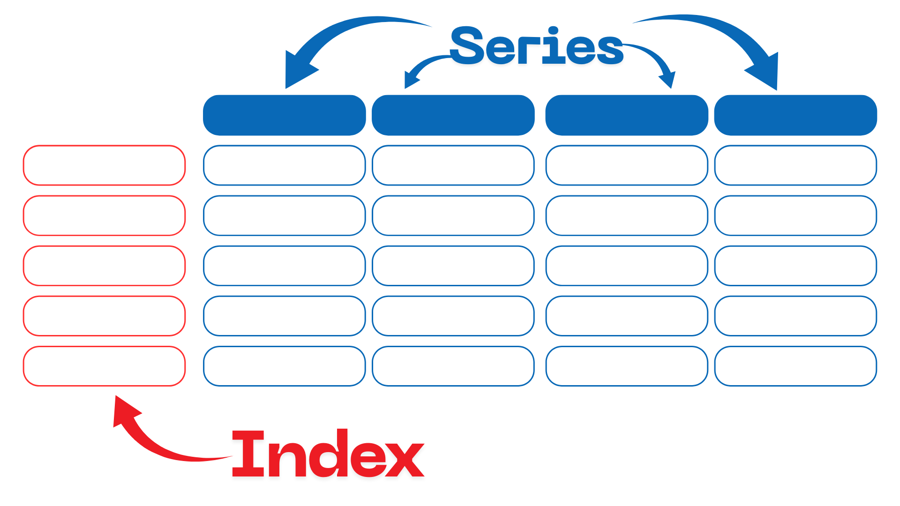

Pandas DataFrame can be created using python objects, flat files, databases, API requests etc. In this article will go through python objects and CSV file with some examples. The complete list of supported sources can be [found here](https://pandas.pydata.org/pandas-docs/stable/user_guide/io.html){target="_blank"}. 

### Series

```python

pd.Series(
    data=None,
    index=None,
    dtype: 'Dtype | None' = None,
    name=None,
    copy: 'bool | None' = None,
    fastpath: 'bool | lib.NoDefault' = <no_default>,
) 
```

`pd.Series` creates one-dimensional ndarray with axis labels including time series.

- Creating Series using python objects.
  - list.
  - tuple.
  - dictionary.

#### Using Python **List**

```python

import pandas as pd

even = [2, 4, 6, 8, 10, 12]

series_data = pd.Series(even)
print(series_data)

```

OUTPUT: 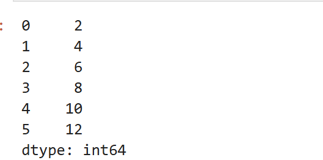

From the output we can draw out.

- Index of the series data is same as the index of the list data.
- `dtype` indicates the data type of the series.

We can name the series or column.
```python
series_data.name = "even"
print(series_data.info)
```

OUTPUT: 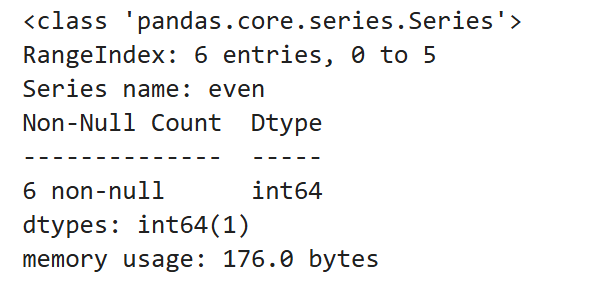

#### Using Python **Dictionary**

```python
import pandas as pd

student = {'name':"Kishore", 
            'age':20, 
            'place':"Bengaluru", 
            'email':"kishore@email.com",}
student_data = pd.Series(student)
print(student_data)
```
OUTPUT: 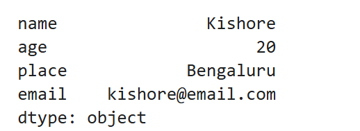

- Index of the series data is same as the key of the dictionary data.
- `dtype` indicates the data type of the series.
- The object supports both integer and label based indexing

### DataFrame

```python
pd.DataFrame(
    data=None,
    index: 'Axes | None' = None,
    columns: 'Axes | None' = None,
    dtype: 'Dtype | None' = None,
    copy: 'bool | None' = None,
)

```

DataFrame is a two-dimensional, size-mutable, tabular data. Similar to pandas Series, DataFrame can be created using python objects.

#### Using Python **List**

```python
import pandas as pd

students = [
    ['Kishore', 'Bengaluru'], # use list or tuple
    ['Vikram',  'Hyderabad'],
    ['Vinay',  'Chennai'],
    ['Adithya',  'Mumbai'],
    ['Kumar',  'Kochi'],
]

students_df = pd.DataFrame(students)
print(students_df)
```

OUTPUT: 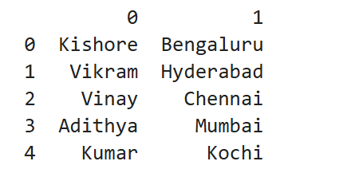

- `0,1,2,3,4` indicates the `index`
- `0` and `1` column indicates the Series. 
- More than one Series data makes it a DataFrame.


#### Using Python **Dictionary**

```python
import pandas as pd

students = {
    "name": ['Kishore', 'Vikram', 'Vinay', 'Adithya', 'Kumar'],
    "place": ['Bengaluru', 'Hyderabad', 'Chennai', 'Mumbai', 'Kochi']
}

students_df = pd.DataFrame(students)
print(students_df)
```

OUTPUT: 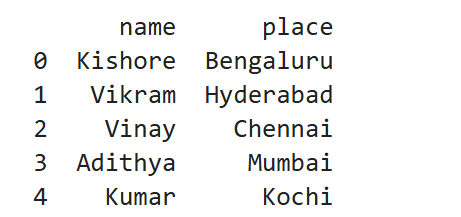

- `0,1,2,3,4` indicates the `index`
- `name` and `place` column indicates the Series. 
- More than one Series data makes it a DataFrame.
- Data structure also contains labelled axes (rows and columns)

---

## Reading CSV files

For this article, will use the `Major Commercial Crops of India` downloaded from the [RBI Database](https://data.rbi.org.in/#/dbie/home){target="_blank"}

To follow along with this article download the [crop data](./attachments/clean_data_crop.csv){target="_blank"}.

[CSV Crop Data :material-file-download:](./attachments/clean_data_crop.csv){.md-button .md-button--primary}


!!! tip "Launch in Binder |  No configuration or downloads required"
    No need to worry about configuring your system with libraries and data.

    You can run it online using binder. 
    
    [](https://mybinder.org/v2/gh/skilldisk/Python-Pandas-for-Real-World-Data-Data-Wrangling-Made-Easy/main?urlpath=%2Fdoc%2Ftree%2Fjune_22.ipynb)


`pd.read_csv()` method is used to read Comma-Separated Values (CSV) file into DataFrame. Reading CSV files doesn't require optional dependencies to be installed (`openpyxl` required to work with `xlsx` files).

```python
import pandas as pd

crop_info = pd.read_csv('./data/clean_data_crop.csv')

print(crop_info)
```

OUTPUT: 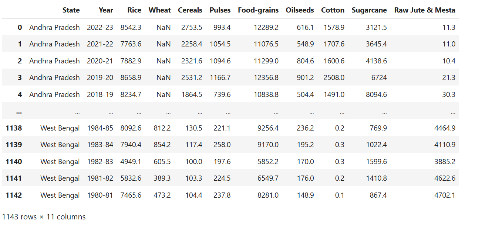


!!! info
    Working with other file formats like Excel, JSON, DataBase etc will be updated shortly in a new blog, link for the same will be listed over in this section.

---

## Inspecting

:point_right: Number of rows and columns

```python
crop_info.shape
```

OUTPUT: 

---

:point_right: Column names

```python
crop_info.columns
```

OUTPUT: 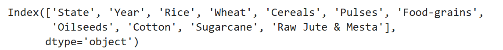

---

:point_right: Data Types

```python
crop_info.dtypes
```
OUTPUT: 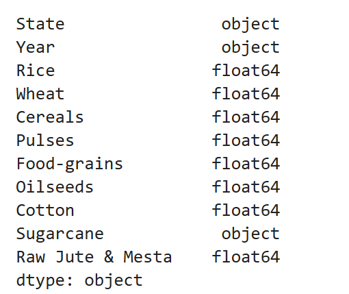

---

:point_right: Data overview can be seen with `head()` and `tail()` method.

```python
crop_info.head()
```

OUTPUT: 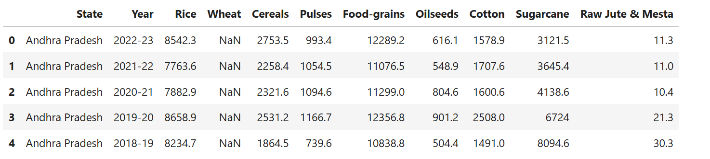


```python
crop_info.tail()
```

OUTPUT: 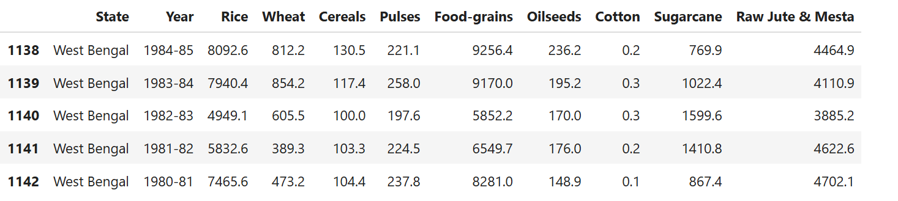

- `head()` method outputs top 5 rows content
- `tail()` method outputs last 5 row content

---

:point_right: Information on DataFrames.

```python
crop_info.info()
```

OUTPUT: 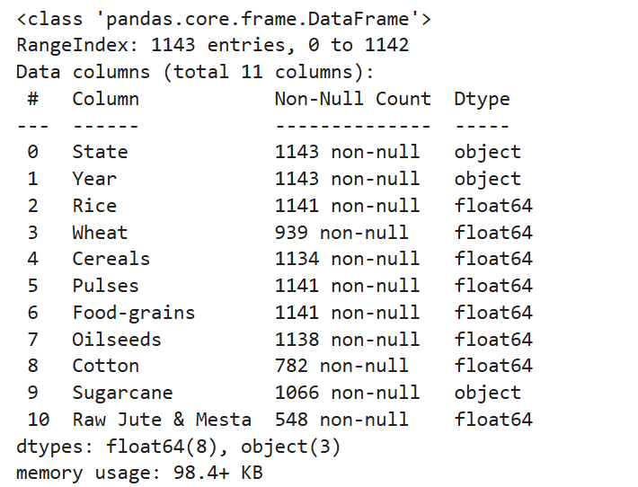


## Extracting Subsets

  
:point_right: Selecting a particular Column.

- Particular column can be selected using `.` notation or using index method `[Series Name | Column Name]`.

```python
crop_info.State
# or
# crop_info['State']

```

OUTPUT: 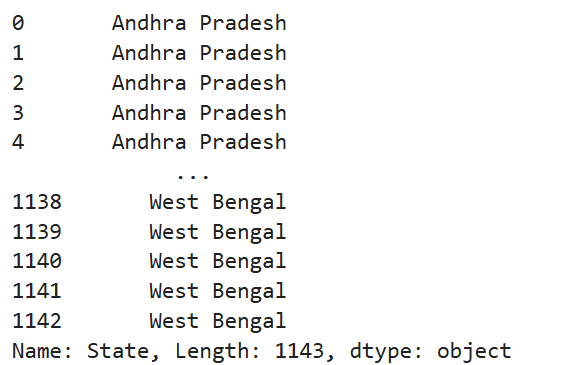

---

:point_right: Multiple Column Selection.

- Multiple Column can be selected, by passing it as a list of column or series names

```python
crop_info[['State','Year', 'Rice']]

```

OUTPUT: 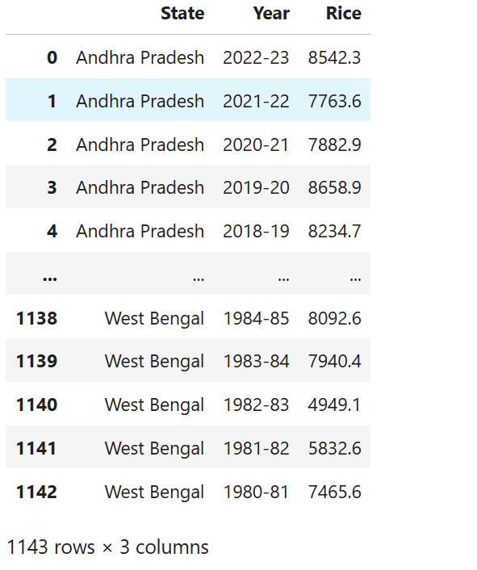

---
  
:point_right: Selecting Row Data's.

```python
crop_info[11:21]

```

OUTPUT: 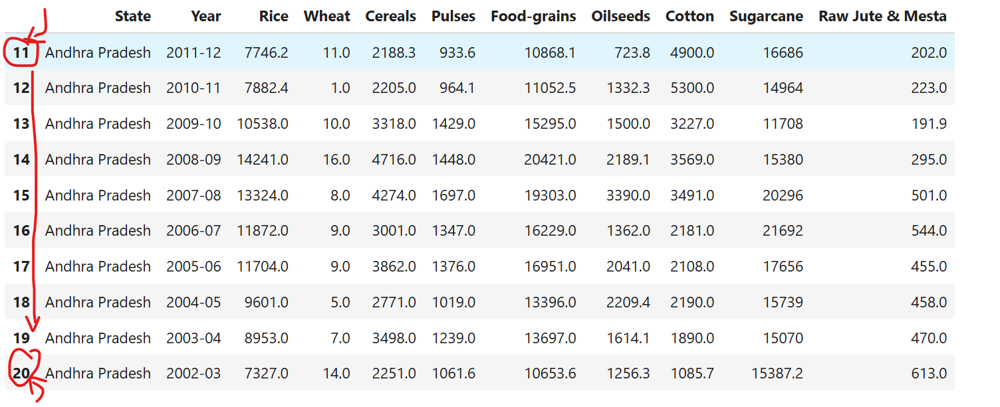

---
  
:point_right: Indexing.

- `iloc[]` by their position
- `loc[]` by their name


Accessing rows using index number
```python
crop_info.iloc[10:21]

```

OUTPUT: 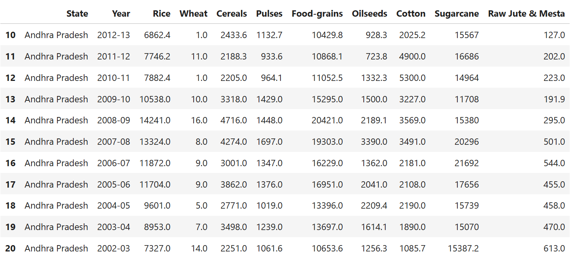

Accessing rows and columns using index number

- `pd.df[row_slicing , column_slicing ]`
```python
crop_info.iloc[30:35, 0:4]

```

OUTPUT: 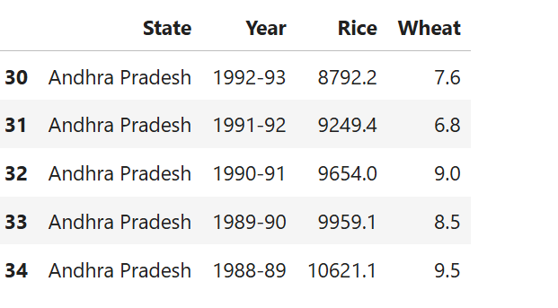


Accessing rows and columns using index names.
```python
crop_info.iloc[30:35, 'State':'Wheat']

```

OUTPUT: 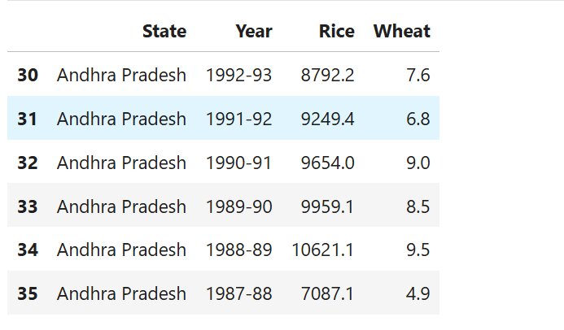

## Filtering

Data can be filtered based on true condition Using *Boolean Mask*. Boolean mask are created using a comparator operators, and using that mask, we can filter out the required data.

:point_right: Boolean Mask using comparison operator.
```python
crop_info['State'] == 'Karnataka'

```

OUTPUT: 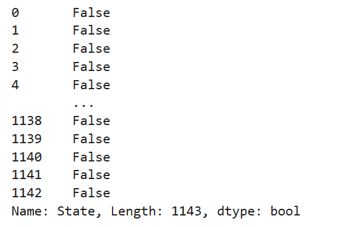

---

:point_right: Using Boolean Mask filtering data that contains values "Karnataka".
```python
crop_info[crop_info['State'] == 'Karnataka'] 

```

OUTPUT: 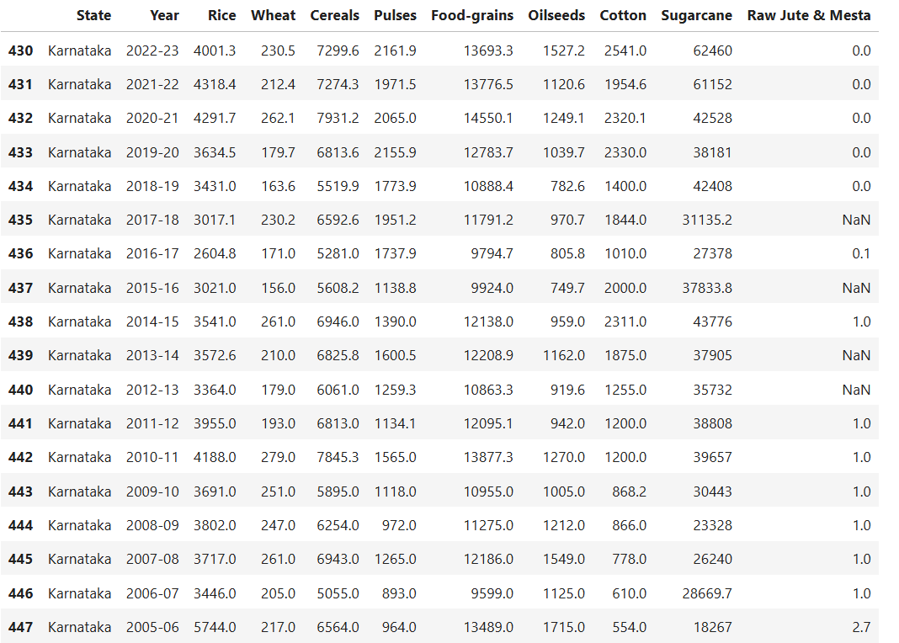
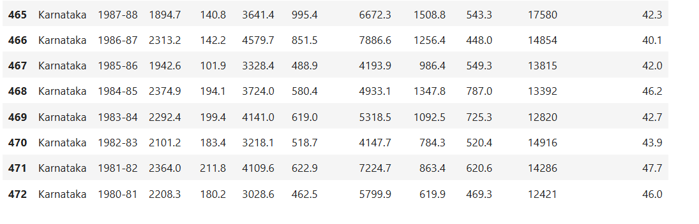
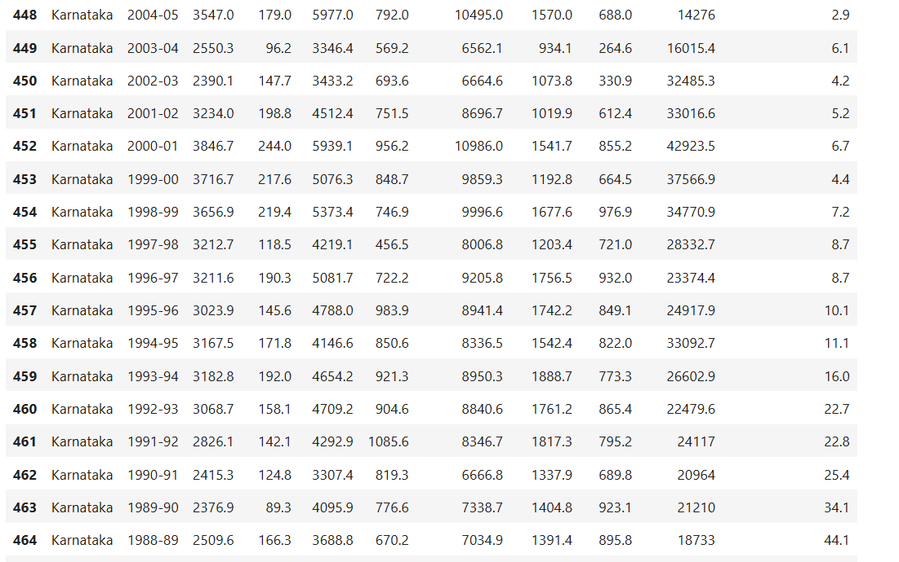

---

:point_right: Using Boolean Mask filtering data with rice value greater than 15000 and column data is limited to State, Year, Rice.

```python
crop_info[crop_info['Rice']>15000][['State', 'Year', 'Rice']]

```

OUTPUT: 


## Summary Statistics

:point_right: value_counts()

```python
crop_info.State.value_counts()

```

OUTPUT: 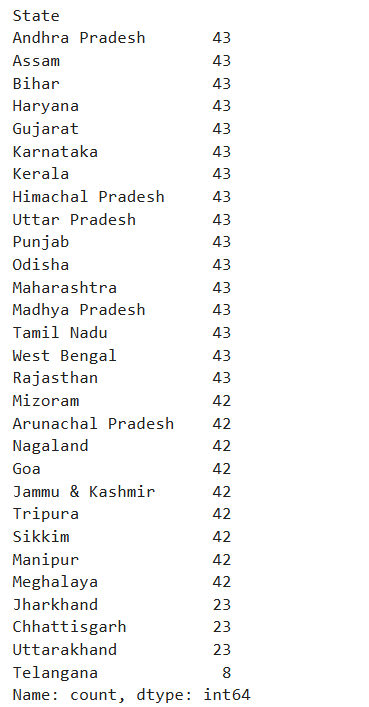

---

:point_right: unique()

```python
crop_info.State.unique()

```

OUTPUT: 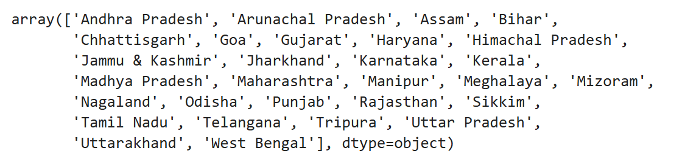

---

:point_right: nunique()

```python
crop_info.State.nunique()

```

OUTPUT: 

---

:point_right: describe()

```python
crop_info.State.describe()

```

OUTPUT: 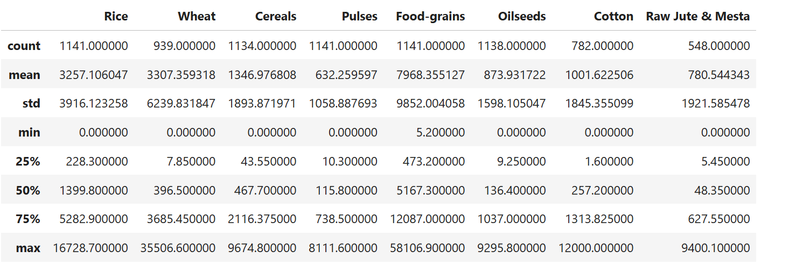


```python
crop_info.State.describe(include='all')

```

OUTPUT: 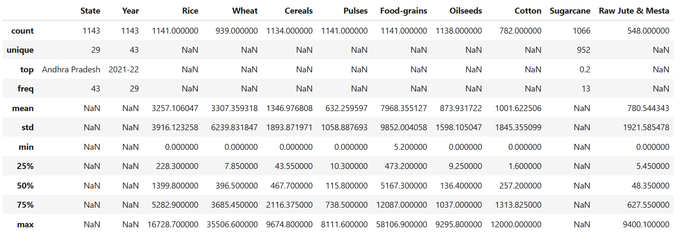

---


## Data Cleaning

:star: Will be Updated Shortly :star:


## Plotting

:star: Will be Updated Shortly :star: