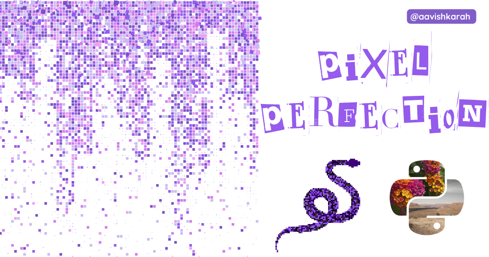

pixels into creative masterpieces using python pillow.

???+ Abstract "Table of Contents"

    [TOC]

## Raster Image

Pixels and Colors are the basic building blocks of raster images. 

The size of the image is defined in terms of pixels, like (1080 x 1080 px), (1920 x 1080 px), (100 x 100 px) etc.

Each pixels consists of color data, black & white or Gray scale or color info know as bands. For example, a PNG image has 4 band (R, G, B, A) for every pixel, representing the color value of Red (R), Green (G), Blue(B) and transparent value as A (Alpha).


## Pillow (PIL)

Pillow is one of the popular python library, to handle raster images. It adds extensive file format supports and image processing capability to python interpreter.

### Installation


=== "rye"
    ```bash
    rye init --virtual
    rye add pillow

    ```

=== "uv"
    ```bash
    uv init .
    uv sync
    uv add pillow

    ```

=== "PIP"
    ```bash
    python -m pip install pillow

    ```


