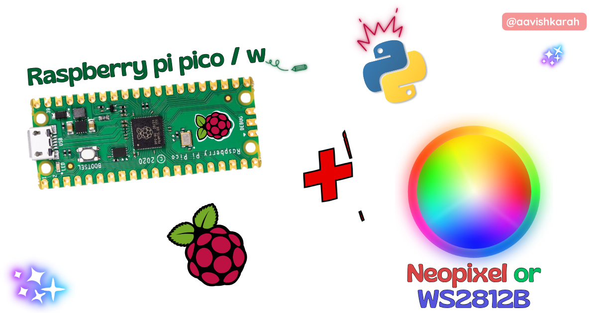
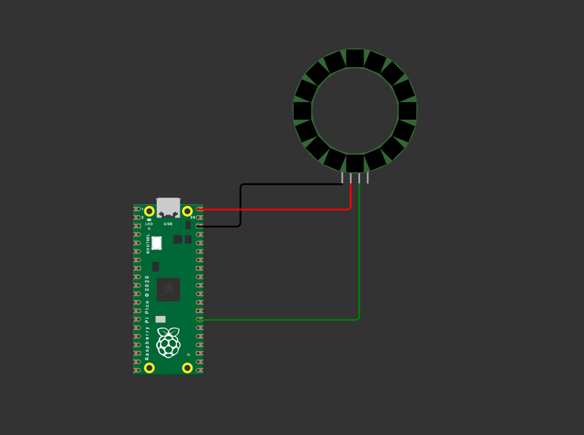

???+ Abstract "Table of Contents"

    [TOC]


## Abstract

In this beginner-friendly tutorial, you’ll learn how to connect and program NeoPixel RGB LEDs using the Raspberry Pi Pico. With the help of MicroPython and Wokwi simulation, we’ll walk through step-by-step code examples to control colors, patterns, and simple animations. By the end, you’ll be ready to add vibrant lighting effects to your own projects with ease.

 In this article, a comprehensive step-by-step guide to interface Analog data (Potentiometer) with Raspberry Pi Pico board using MicroPython. Raspberry Pi Pico has 4 different variants (Pico, Pico 2, Pico W, Pico 2W) supporting micro-python. This articles lays the foundation for more advanced embedded system and IoT projects.

## :compass: Pre-Request

- OS : Windows / Linux / Mac / Chrome
- Thonny IDE.
- MicroPython firmware in Raspberry Pi Pico / Pico 2 / Pico W / Pico 2W. 
    - For step by step procedure [click here](../installing-micropython/index.md){target="_blank"} . 


## Hardware Required

- Raspberry Pi Pico / Pico 2 / Pico W / Pico 2W. 
- NeoPixel / WS2812B.
- BreadBoard.
- Micro USB Cable.
- Connecting wires.
- 5V DC power supply (optional)

| Components | Purchase Link |
| -- | -- |
| Raspberry Pi Pico | [link](https://amzn.to/3JNpv7v) |
| Raspberry Pi Pico 2 | [link](#) |
| Raspberry Pi Pico W | [link](https://amzn.to/3KeWamg) |
| Raspberry Pi Pico 2W | [link](#) |
| NeoPixel | [16 LED](#) : [8 LED](#) |
| BreadBoard | [large](https://amzn.to/4pgNX1c) : [small](https://amzn.to/47SMzvB)|
| Connecting Wires | [link](https://amzn.to/4pepr0H) |
| Micro USB Cable | [link](https://amzn.to/4gfMgNa) |

!!! tip "Don't own a hardware :cry:"

    No worries,

    Still you can learn using simulation.
    check out simulation part :smiley:.

### Connection Table


| NeoPixel | GPIO | Remarks | 
| :--: | :--: | :-- | 
| GND | GND |  | 
| Vcc | +5 V | +5V of Board or External 5V DC Supply | 
| Din | 21 | Any GPIO pin can be used. |
| Dout | -- | No Connection |


!!! Note
    - While using External 5 V supply, make sure ground pin of External Supply and Pico board is connected. 


/// caption
fig-Connection Diagram
///

## :open_file_folder: Code

=== "main.py"
    ```python linenums="1"
    from machine import Pin
    import time
    from neopixel import NeoPixel

    pin = Pin(21, Pin.OUT)   # set GPIO 21 to output to drive NeoPixels
    np = NeoPixel(pin, 16)   # create NeoPixel driver on GPIO 21 for 16 pixels

    colors = [(255, 0 , 0), (0, 255, 0), (0, 0, 255), (255, 169, 0), (255, 255, 255)]

    for color in colors:
        for i in range(16):
            np[i] = color 
            np.write()
            time.sleep_ms(100)

        time.sleep(1)


    for color in colors:
        for i in range(15, -1, -1):
            np[i] = color 
            np.write()
            time.sleep_ms(100)

        time.sleep(1)
    ```


### Code Explanation

:point_right: Imports

```py linenums="1"

from machine import Pin
import time
from neopixel import NeoPixel

```

- `time` module for creating delay.
- `neopixel` module for interacting with WS2812 / NeoPixel LED.


:point_right: Initialize NeoPixel LED.

```py linenums="5"

pin = Pin(21, Pin.OUT)   # set GPIO 21 to output to drive NeoPixels
np = NeoPixel(pin, 16)   # create NeoPixel driver on GPIO 21 for 16 pixels

```

- GPIO `21` is connected to `Din` of NeoPixel LED.
- `16` NeoPixel LED's are used in the strip (`np = NeoPixel(pin, 16)`)


:point_right: Initializing list of Color values.

```py linenums="8"

colors = [(255, 0 , 0), (0, 255, 0), (0, 0, 255), (255, 169, 0), (255, 255, 255)]

```

- Color values are configured in RGB mode
- Each tuple represents a RGB color code
    - (R, G, B)
    - (255, 0, 0) --> Red 255, Green 0, Blue 0
- Each color value range from 0 to 255


:point_right: Setting the color.

```py linenums="12"

np[i] = color 
np.write()
```

- `np.fill(<color_r_g_b>)` : fills the color to all the led.
- `np[i]` : Set the color to the `i` i<sup>th</sup> LED
- `np.write()` : Use `write` method to observe the effect on the LED.
    - Only after execution of the `write` method, you can observe the changes in the LED color.
- `for` loop in the code is used to loop through the color on individual led in clockwise and anti-clockwise direction.
---

## :material-chart-bubble:{style="color:#ffaa00"} Simulation

!!! danger "Not able to view the simulation"
    - :fontawesome-solid-laptop: Desktop or Laptop : Reload this page ( ++ctrl+r++ )
    - :fontawesome-solid-mobile: Mobile : Use Landscape Mode and reload the page


<iframe style="height:calc(100vh - 200px); border-color:#00aaff;border-radius:1rem;min-height:400px" src="https://wokwi.com/projects/438371841319801857" frameborder="2px" width="100%" height="700px"></iframe>


---

## :material-web-plus: Extras

### Components details

- NeoPixel LED / WS2812B : [Data Sheet](#)
- Raspberry Pi Pico / Pico 2 : [Pin Diagram](../pico2-pico2-w-key-features-pin-config/index.md){target="_blank"}
- Raspberry Pi Pico : [Data Sheet](https://datasheets.raspberrypi.com/pico/pico-datasheet.pdf){target="_blank"}
- Raspberry Pi Pico 2 : [Data Sheet](https://datasheets.raspberrypi.com/pico/pico-2-datasheet.pdf){target="_blank"}
- Raspberry Pi Pico W : [Data Sheet](https://datasheets.raspberrypi.com/picow/pico-w-datasheet.pdf){target="_blank"}
- Raspberry Pi Pico 2 W : [Data Sheet](https://datasheets.raspberrypi.com/picow/pico-2-w-datasheet.pdf){target="_blank"}


### Modules / Libraries Used

- *machine*
    - `machine` module contains specific attributes and methods related to hardware on a particular board. Here class `ADC` is imported to configure the Analog pins. 
    - [More Details](https://docs.micropython.org/en/latest/library/machine.html){target="_blank"} 
- *time*
    - `time` module provides functions related to date & time, measuring time intervals and generating delays.
    - [More Details](https://docs.micropython.org/en/latest/library/time.html){target="_blank"} 

