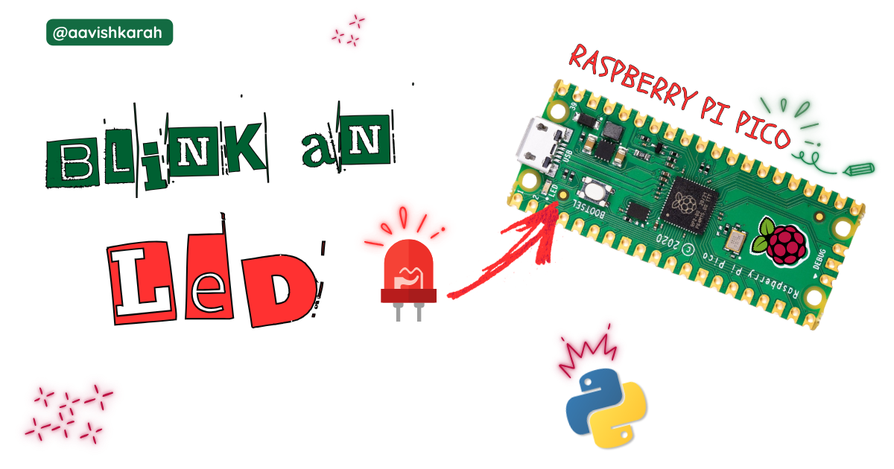
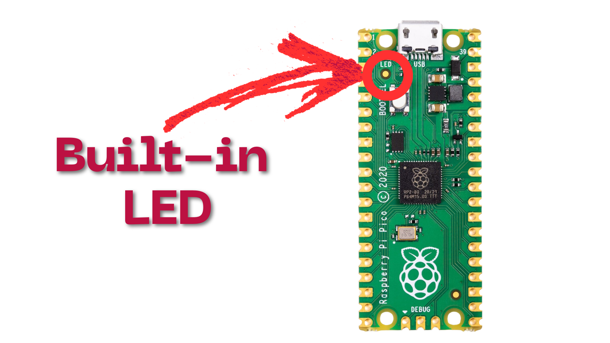

???+ Abstract "Table of Contents"

    [TOC]


## Abstract

Raspberry Pi Pico is a modern development board with Cortex-M0+, Dual core microcontroller supporting micro-python. Know the [key features](../pico2-pico2-w-key-features-pin-config/index.md){target="_blank"} and [comparison with Pico 2 version](../pico-vs-pico2/index.md){target="_blank"}. 

In this article we go through.

- Accessing the built-in led of the Raspberry Pi Pico board.
- Turning `on` and `off` built-in led using micro python.
- Simulation using wokwi.
- Hardware demo.

## :compass: Pre-Request

- OS : Windows / Linux / Mac / Chrome
- Thonny IDE.
- MicroPython firmware in Raspberry Pi Pico / Pico 2. 
    - For step by step procedure Click [here](../installing-micropython/index.md){target="_blank"} . 


## Hardware Required

- Raspberry Pi Pico / Pico 2. 
- Micro USB Cable.

| Components | Purchase Link |
| -- | -- |
| Raspberry Pi Pico | [link](#) |
| Raspberry Pi Pico 2 | [link](#) |
| Micro USB Cable | [link](#) |

!!! tip "Don't own a hardware :cry:"

    No worries,

    Still you can learn using simulation.
    check out simulation part :smiley:.

### Connection Table

Built-in led of Raspberry Pi Pico is internally connected to GPIO 25.

| Particular | GPIO | Remarks | 
| :--: | :--: | :-- | 
| Built-in LED | 25 | Internally Connected |



## :open_file_folder: Code


```python linenums="1"

from machine import Pin
import time

# Built-in LED is connected to GPIO 25
led = Pin(25, Pin.OUT)

while True:
    led.on()
    time.sleep(1)
    led.off()
    time.sleep(1)


```

### Code Explanation

:point_right: Imports

```py linenums="1"

from machine import Pin
import time

```

- Importing `Pin` class from machine module to control the GPIO pins.
- `time` module for creating delay between `on` and `off` state.

:point_right: Accessing built-in led of Raspberry Pi Pico / Pico 2 board.

```py linenums="4"

# Built-in LED is connected to GPIO 25
led = Pin(25, Pin.OUT)

```

- GPIO pin 25 is configured as `OUTPUT` pin (Line number 5) and assigned to a variable `led`

:point_right: Blinking LED

```py linenums="7"
while True:
    led.on()
    time.sleep(1)
    led.off()
    time.sleep(1)

```

- Continuous loop is achieved using `while True:`
- `led.on()` sets the value of GPIO 25 to `HIGH` or `1`, which in turn  turns ON the LED. (line number 8)
- Delay of `1` second is achieved through `time.sleep(1)` method. (line number 9 & 11) 
- `led.off()` sets the value of GPIO 25 to `LOW` or `0`, which in turn  turns OFF the LED. (line number 10)


!!! tip "Try It"
    - Change the value in the sleep method and observe the change in the on and off time.
        - `time.sleep(2)`, `time.sleep(4)` , etc
    - Use `time.sleep_ms()` method to set the values in terms of milli seconds.
        - `time.sleep_ms(1000)` : 1000 ms or 1 s
        - `time.sleep_ms(500)`  : 500 ms or 0.5 s

---

## :material-chart-bubble:{style="color:#ffaa00"} Simulation

!!! danger "Not able to view the simulation"
    - :fontawesome-solid-laptop: Desktop or Laptop : Reload this page ( ++ctrl+r++ )
    - :fontawesome-solid-mobile: Mobile : Use Landscape Mode and reload the page


<iframe style="height:calc(100vh - 200px); border-color:#00aaff;border-radius:1rem;min-height:400px" src="https://wokwi.com/projects/438357372184564737" frameborder="2px" width="100%" height="700px"></iframe>


## Result

Above code turns ON LED for 1 second and OFF for 1 second. Similar to a square wave of `0.5 Hz` output connected to an LED.

---

## :material-web-plus: Extras

### Components details

- Raspberry Pi Pico / Pico 2 : [Pin Diagram](../pico2-pico2-w-key-features-pin-config/index.md){target="_blank"}
- Raspberry Pi Pico [Data Sheet](./files/pico-datasheet.pdf){target="_blank"}


### Modules / Libraries Used

- *machine*
    - `machine` module contains specific attributes and methods related to hardware on a particular board. Here class `Pin` is imported to control the Input Output pins. 
    - [More Details](https://docs.micropython.org/en/latest/library/machine.html){target="_blank"} 

- *time*
    - `time` module provides functions related to date & time, measuring time intervals and generating delays.
    - [More Details](https://docs.micropython.org/en/latest/library/time.html){target="_blank"} 