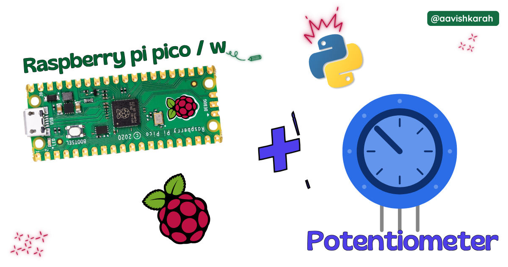
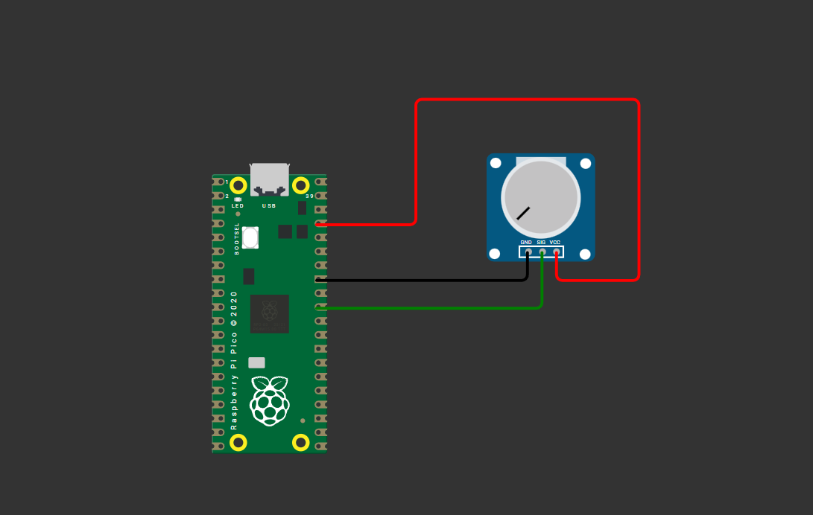

???+ Abstract "Table of Contents"

    [TOC]


## Abstract

 In this article, a comprehensive step-by-step guide to interface Analog data (Potentiometer) with Raspberry Pi Pico board using MicroPython. Raspberry Pi Pico has 4 different variants (Pico, Pico 2, Pico W, Pico 2W) supporting micro-python. This articles lays the foundation for more advanced embedded system and IoT projects.

## :compass: Pre-Request

- OS : Windows / Linux / Mac / Chrome
- Thonny IDE.
- MicroPython firmware in Raspberry Pi Pico / Pico 2 / Pico W / Pico 2W. 
    - For step by step procedure [click here](../installing-micropython/index.md){target="_blank"} . 


## Hardware Required

- Raspberry Pi Pico / Pico 2 / Pico W / Pico 2W. 
- Potentiometer (5k ohm or 10K ohm).
- BreadBoard.
- Micro USB Cable.
- Connecting wires.
- 3.3V DC power supply (optional)

| Components | Purchase Link |
| -- | -- |
| Raspberry Pi Pico | [link](https://amzn.to/3JNpv7v) |
| Raspberry Pi Pico 2 | [link](#) |
| Raspberry Pi Pico W | [link](https://amzn.to/3KeWamg) |
| Raspberry Pi Pico 2W | [link](#) |
| Potentiometer | [5k Ohm](#) : [10k ohm](#) |
| BreadBoard | [large](https://amzn.to/4pgNX1c) : [small](https://amzn.to/47SMzvB)|
| Connecting Wires | [link](https://amzn.to/4pepr0H) |
| Micro USB Cable | [link](https://amzn.to/4gfMgNa) |

!!! tip "Don't own a hardware :cry:"

    No worries,

    Still you can learn using simulation.
    check out simulation part :smiley:.

### Connection Table


| Potentiometer | GPIO | Remarks | 
| :--: | :--: | :-- | 
| T1 | +3.3 V | +3.3V of Board or External 3.3V DC Supply | 
| T2 | 26 (A0) | Any Analog pin (26, 27, 28) can be used | 
| T3 | GND | Ground |


!!! Note
    - T1 and T2 can be interchanged in physical potentiometer.
    - In Wokwi simulation, T1 is Vcc, T2 is Sig, T3 is GND.
    - While using External 3.3 V supply, make sure ground pin of External Supply and Pico board is connected. 


/// caption
fig-Connection Diagram
///

## :open_file_folder: Code

=== "main.py"
    ```python linenums="1"
    from machine import Pin, ADC
    import time

    time.sleep(1)

    # Potentiometer connected to GPIO 26 (ADC 0)
    # ADC PIN are GPIO 26, 27, 28.
    pot = ADC(Pin(26))

    while True:
        value = pot.read_u16()
        print(f"POT {value=}")

        position = (value / 65535) * 100
        print(f"{position=:0.2f} %")
        time.sleep(2)
    ```


### Code Explanation

:point_right: Imports

```py linenums="1"

from machine import Pin, ADC
import time

```

- `ADC` class to configure GPIO pins (26, 27, 28) into ADC pins.
- `time` module for creating delay.


:point_right: Initialize DHT 22 sensor.

```py linenums="8"

pot = ADC(Pin(26))

```

- GPIO `26` or `A0` is configured as Analog Input Pin.


:point_right: Continuous looping & measurement.

```py linenums="10"

while True:
    value = pot.read_u16()
    print(f"POT {value=}")

    position = (value / 65535) * 100
    print(f"{position=:0.2f} %")
    time.sleep(2)

```

- `while True` used for continuous looping. 
- `print` statement to display the information on the terminal.
- `time.sleep(2)` 2 second delay.


:point_right: Read ADC value.

```py linenums="11"

value = pot.read_u16()
```

- `pot.read_u16()` used to read the ADC value.
    - The output of `read_u16()` will be of 16 bit data
    - Value ranging from `0` to `65535` (i.e., 0b0000000000000000 to 0b1111111111111111) 
    - As Raspberry Pi Pico based boards microcontroller operates at 3.3V.
    - The Potentiometer terminal (T1 / Vcc) is connected to 3.3V supply
- `0` voltage corresponds to 0 value.
- `3.3` voltage corresponds to 65535 value. 

---

## :material-chart-bubble:{style="color:#ffaa00"} Simulation

!!! danger "Not able to view the simulation"
    - :fontawesome-solid-laptop: Desktop or Laptop : Reload this page ( ++ctrl+r++ )
    - :fontawesome-solid-mobile: Mobile : Use Landscape Mode and reload the page


<iframe style="height:calc(100vh - 200px); border-color:#00aaff;border-radius:1rem;min-height:400px" src="https://wokwi.com/projects/438371084160817153" frameborder="2px" width="100%" height="700px"></iframe>


---

## :material-web-plus: Extras

### Components details

- Raspberry Pi Pico / Pico 2 : [Pin Diagram](../pico2-pico2-w-key-features-pin-config/index.md){target="_blank"}
- Raspberry Pi Pico : [Data Sheet](https://datasheets.raspberrypi.com/pico/pico-datasheet.pdf){target="_blank"}
- Raspberry Pi Pico 2 : [Data Sheet](https://datasheets.raspberrypi.com/pico/pico-2-datasheet.pdf){target="_blank"}
- Raspberry Pi Pico W : [Data Sheet](https://datasheets.raspberrypi.com/picow/pico-w-datasheet.pdf){target="_blank"}
- Raspberry Pi Pico 2 W : [Data Sheet](https://datasheets.raspberrypi.com/picow/pico-2-w-datasheet.pdf){target="_blank"}


### Modules / Libraries Used

- *machine*
    - `machine` module contains specific attributes and methods related to hardware on a particular board. Here class `ADC` is imported to configure the Analog pins. 
    - [More Details](https://docs.micropython.org/en/latest/library/machine.html){target="_blank"} 
- *time*
    - `time` module provides functions related to date & time, measuring time intervals and generating delays.
    - [More Details](https://docs.micropython.org/en/latest/library/time.html){target="_blank"} 

