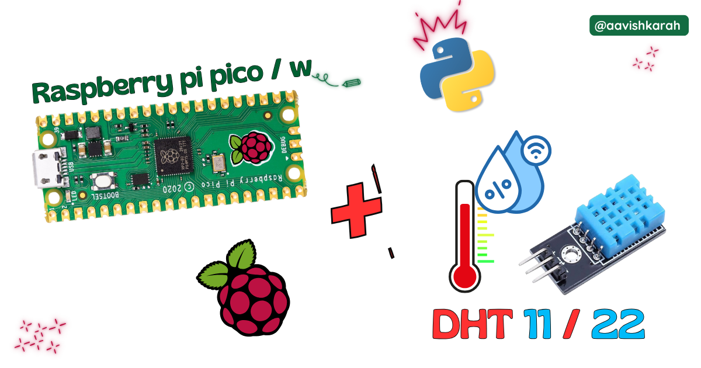
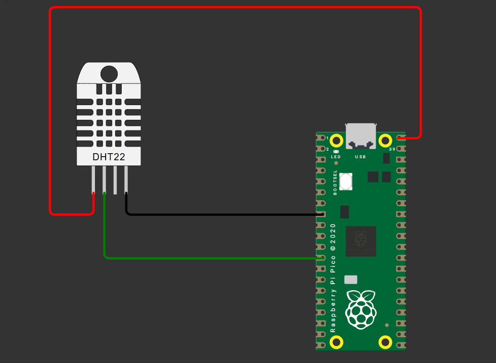

???+ Abstract "Table of Contents"

    [TOC]


## Abstract

 In this article, a comprehensive step-by-step guide to interface DHT 11/22 temperature and humidity sensor with Raspberry Pi Pico board using MicroPython. Raspberry Pi Pico has 4 different variants (Pico, Pico 2, Pico W, Pico 2W) supporting micro-python. This articles lays the foundation for more advanced embedded system and IoT projects.

## :compass: Pre-Request

- OS : Windows / Linux / Mac / Chrome
- Thonny IDE.
- MicroPython firmware in Raspberry Pi Pico / Pico 2 / Pico W / Pico 2W. 
    - For step by step procedure [click here](../installing-micropython/index.md){target="_blank"} . 


## Hardware Required

- Raspberry Pi Pico / Pico 2 / Pico W / Pico 2W. 
- DHT 11/22 sensor.
- BreadBoard.
- Micro USB Cable.
- Connecting wires.
- 5V DC power supply (Optional)

| Components | Purchase Link |
| -- | -- |
| Raspberry Pi Pico | [link](https://amzn.to/3JNpv7v) |
| Raspberry Pi Pico 2 | [link](#) |
| Raspberry Pi Pico W | [link](https://amzn.to/3KeWamg) |
| Raspberry Pi Pico 2W | [link](#) |
| DHT 11/22 sensor | [link](#) |
| BreadBoard | [large](https://amzn.to/4pgNX1c) : [small](https://amzn.to/47SMzvB)|
| Connecting Wires | [link](https://amzn.to/4pepr0H) |
| Micro USB Cable | [link](https://amzn.to/4gfMgNa) |
| 5V DC Adaptor | [link](https://amzn.to/4m82t8D) |

!!! tip "Don't own a hardware :cry:"

    No worries,

    Still you can learn using simulation.
    check out simulation part :smiley:.

### Connection Table


| DHT 11/22 | GPIO | Remarks | 
| :-- | :--: | :-- | 
| V<sub>CC</sub>  (1) | +5 V | +5V of Board or External 5V DC Supply | 
| Data  (2) | 9 | Any GPIO pin can be used | 
| NC (3) | - | No Connection | 
| GND  (4) | GND | Ground |


!!! Note
    - V<sub>CC</sub> (1) can be connected to external +5 V DC supply or to the VBUS pin number 40 of Raspberry Pi Pico Board.
    - While using External 5 V supply for DHT 11/22 sensor, make sure ground pin of External Supply and Pico board is connected. 


/// caption
fig-Connection Diagram
///

## :open_file_folder: Code

=== "main.py"
    ```python linenums="1"
    from machine import Pin
    import dht
    import time

    time.sleep_ms(1000) # Wait for USB to become ready

    sensor = dht.DHT22(Pin(9))

    while True:
        sensor.measure()
        temperature = sensor.temperature()
        humidity = sensor.humidity()

        print(f"Temp: {temperature:0.2f} C")
        print(f"Hum: {humidity:0.2f}")
        time.sleep_ms(2000)
    ```


### Code Explanation

:point_right: Imports

```py linenums="1"

from machine import Pin
import dht
import time

```

- `time` module for creating delay.
- `dht` module for interacting with dht 11 or 22 sensor.


:point_right: Initialize DHT 22 sensor.

```py linenums="7"

sensor = dht.DHT22(Pin(9))

```

- GPIO `9` is connected to DHT 22 sensor Data pin `2`.


:point_right: Continuous looping & measurement.

```py linenums="9"

while True:
    sensor.measure()
    temperature = sensor.temperature()
    humidity = sensor.humidity()

    print(f"Temp: {temperature:0.2f} C")
    print(f"Hum: {humidity:0.2f}")
    time.sleep_ms(2000)

```

- `while True` used for continuous looping. 
- `print` statement to display the measured temperature and humidity data on the terminal.
- `sleep_ms(2000)` 2 second delay.


:point_right: Read temperature and humidity data.

```py linenums="10"

sensor.measure()
temperature = sensor.temperature()
humidity = sensor.humidity()
```

- `sensor.measure()` used to initialize the sensor module to measure the parameters.
- `sensor.temperature()` reads temperature data from sensor. 
- `sensor.humidity()` reads humidity data from sensor. 


---

## :material-chart-bubble:{style="color:#ffaa00"} Simulation

!!! danger "Not able to view the simulation"
    - :fontawesome-solid-laptop: Desktop or Laptop : Reload this page ( ++ctrl+r++ )
    - :fontawesome-solid-mobile: Mobile : Use Landscape Mode and reload the page


<iframe style="height:calc(100vh - 200px); border-color:#00aaff;border-radius:1rem;min-height:400px" src="https://wokwi.com/projects/438370560162182145" frameborder="2px" width="100%" height="700px"></iframe>


---

## :material-web-plus: Extras

### Components details

- DHT 11 sensor : [Data Sheet](https://www.mouser.com/datasheet/2/758/DHT11-Technical-Data-Sheet-Translated-Version-1143054.pdf){target="_blank"}
- DHT 22 sensor : [Data Sheet](https://www.mouser.com/datasheet/2/737/dht-932870.pdf){target="_blank"}
- Raspberry Pi Pico / Pico 2 : [Pin Diagram](../pico2-pico2-w-key-features-pin-config/index.md){target="_blank"}
- Raspberry Pi Pico : [Data Sheet](https://datasheets.raspberrypi.com/pico/pico-datasheet.pdf){target="_blank"}
- Raspberry Pi Pico 2 : [Data Sheet](https://datasheets.raspberrypi.com/pico/pico-2-datasheet.pdf){target="_blank"}
- Raspberry Pi Pico W : [Data Sheet](https://datasheets.raspberrypi.com/picow/pico-w-datasheet.pdf){target="_blank"}
- Raspberry Pi Pico 2 W : [Data Sheet](https://datasheets.raspberrypi.com/picow/pico-2-w-datasheet.pdf){target="_blank"}


### Modules / Libraries Used

- *time*
    - `time` module provides functions related to date & time, measuring time intervals and generating delays.
    - [More Details](https://docs.micropython.org/en/latest/library/time.html){target="_blank"} 
- *dht*
    - To interact with DHT 11/22 sensor.
    - It is a built in library. 
    - [More Details](https://docs.micropython.org/en/latest/esp8266/tutorial/dht.html){target="_blank"} 
