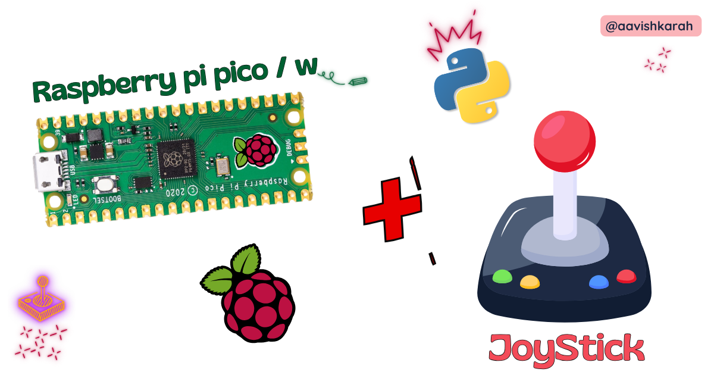
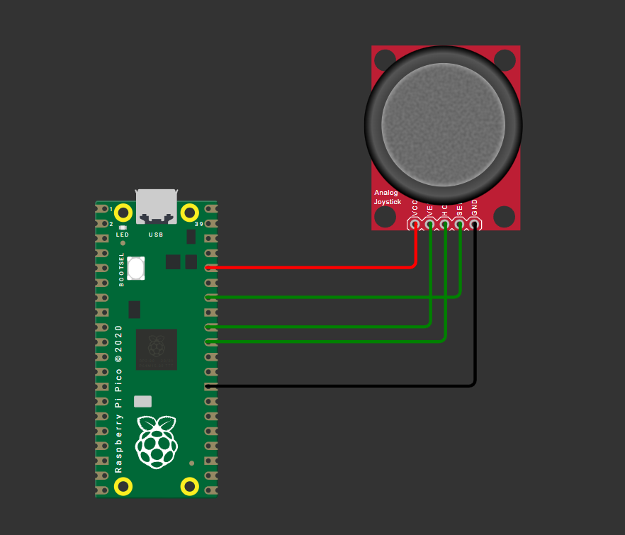

???+ Abstract "Table of Contents"

    [TOC]

## Abstract

Analog joystick modules are versatile input devices widely used in robotics, gaming controllers, and interactive embedded projects. In this comprehensive tutorial, you will learn how to interface a standard KY-023 dual-axis joystick module with a Raspberry Pi Pico microcontroller using MicroPython. By the end, you will be able to read analog X/Y axis values, detect button presses, implement debouncing logic, and integrate joystick input into your own embedded applications such as robot controllers, menu navigators, or pan-tilt camera systems.

---

## Pre-Request

- **OS**: Windows / Linux / Mac / ChromeOS
- **IDE**: Thonny IDE (recommended) or VS Code with Pymakr extension
- **Firmware**: MicroPython firmware flashed on Raspberry Pi Pico / Pico 2 / Pico W / Pico 2W
  - For step-by-step firmware installation, [click here](https://tech.arunkumarn.in/blogs/raspberry-pi-pico/installing-micropython/)

---

## Hardware Required

<!-- Advertisement -->
--8<-- "includes/pico-disk-link-cta.md"

- Raspberry Pi Pico / Pico 2 / Pico W / Pico 2W
- Analog Joystick Module (KY-023 or similar)
- Breadboard
- Micro USB Cable
- Jumper wires (M-F and M-M)
- 3.3V power source (Pico onboard regulator sufficient)

| Components | Purchase Link |
| --- | --- |
| Raspberry Pi Pico | [link](https://amzn.to/3JNpv7v) |
| Raspberry Pi Pico 2 | [link](https://www.skilldisk.com/product-page/pico-iot-spark-kit) |
| Raspberry Pi Pico W | [link](https://amzn.to/3KeWamg) |
| Raspberry Pi Pico 2W | [link](https://www.skilldisk.com/product-page/pico-iot-spark-kit) |
| Joystick Module KY-023 | [link](https://www.skilldisk.com/product-page/pico-iot-spark-kit) |
| BreadBoard | [large](https://amzn.to/4pgNX1c) : [small](https://amzn.to/47SMzvB)|
| Connecting Wires | [link](https://amzn.to/4pepr0H) |
| Micro USB Cable | [link](https://amzn.to/4gfMgNa) |

!!! tip "Don't own a hardware :cry:"

    No worries,

    Still you can learn using simulation.
    check out simulation part :smiley:.


---

## ⚡ Understanding Joystick Modules & ADC Reading

The **KY-023** is a popular analog joystick module featuring two potentiometers (for X and Y axes) and a momentary push-button (activated by pressing the stick down). Unlike digital inputs, the analog axes output variable voltage levels proportional to stick position, which the Raspberry Pi Pico reads using its built-in **Analog-to-Digital Converter (ADC)**.

### 🔹 How Analog Joystick Works

| Joystick Position | X-Axis Voltage | Y-Axis Voltage | ADC Value (16-bit scaled) |
| --- | --- | --- | --- |
| **Center (Neutral)** | ~1.65V | ~1.65V | ~32768 |
| **Left / Down** | 0V → 1.65V | 0V → 1.65V | 0 → 32768 |
| **Right / Up** | 1.65V → 3.3V | 1.65V → 3.3V | 32768 → 65535 |

#### ADC Resolution on RP2040

The Raspberry Pi Pico's ADC hardware is 12-bit, but MicroPython's `read_u16()` method **scales the result to 16-bit range (0–65535)** for cross-platform compatibility. We use this native 16-bit value directly in our code.


!!! note
     `read_u16()` returns a 16-bit scaled value (0–65535). Use this value directly for consistent MicroPython compatibility across boards.

#### Button Input (Digital)

The joystick's built-in switch connects to `SW` pin and outputs:
- **HIGH (3.3V)** when not pressed
- **LOW (0V)** when pressed (active-low)

Use a GPIO pin with internal pull-up resistor for reliable button detection.

---

## 🧷 Connection / Wiring Guide (Raspberry Pi Pico to Joystick Module)

### 🔥 Pin Mapping Table

| Joystick Pin | Label | Raspberry Pi Pico Pin | Description |
| --- | --- | --- | --- |
| **GND** | GND | `GND` (Pin 3, 8, 13, 18, 23, 28, 33, 38) | Common ground |
| **VCC** | +5V / +3.3V | `3V3` (Pin 36) | Power supply (3.3V recommended) |
| **VRx** | X-Axis | `GP26` (ADC0, Pin 31) | Analog X-axis input |
| **VRy** | Y-Axis | `GP27` (ADC1, Pin 32) | Analog Y-axis input |
| **SW** | Button | `GP28` (Digital, Pin 34) | Button press signal |



/// caption
fig-Connection Diagram
///


#### ADC-Capable Pins

Only **GP26, GP27, GP28, and GP29** support ADC input on Raspberry Pi Pico. Ensure X/Y axis wires connect to these pins. Update code accordingly if using alternative ADC pins.

#### Wiring Diagram

```
Joystick Module          Raspberry Pi Pico
─────────────          ───────────────────
GND       ───────────► GND (any)
VCC       ───────────► 3V3 (Pin 36)
VRx (X)   ───────────► GP26 / ADC0 (Pin 31)
VRy (Y)   ───────────► GP27 / ADC1 (Pin 32)
SW (Btn)  ───────────► GP28 (Pin 34)
```

!!! tip 
    Use short, shielded wires for analog signals to minimize noise interference.

---

## Code

### main.py

```python
from machine import Pin, ADC
from time import sleep

# Initialize ADC channels for X and Y axes
adc_x = ADC(Pin(26))  # GP26 -> ADC0
adc_y = ADC(Pin(27))  # GP27 -> ADC1

# Initialize button pin with internal pull-up
button = Pin(28, Pin.IN, Pin.PULL_UP)

# ADC reading: returns 16-bit scaled value (0-65535)
def read_adc(adc):
    return adc.read_u16()

# Debounced button read
def read_button():
    return not button.value()  # Active-low: pressed = False → return True

try:
    print("🎮 Joystick Ready! Press Ctrl+C to exit.")
    while True:
        # Read ADC values (16-bit scaled: 0-65535)
        x_raw = read_adc(adc_x)
        y_raw = read_adc(adc_y)
        
        # Optional: Map to -100 to +100 range for intuitive control
        x_norm = int((x_raw - 32768) * 100 // 32768)
        y_norm = int((y_raw - 32768) * 100 // 32768)
        
        # Read button state
        btn_pressed = read_button()
        
        # Output to console
        print(f"X: {x_raw:5d} ({x_norm:+4d}) | "
              f"Y: {y_raw:5d} ({y_norm:+4d}) | "
              f"Button: {'PRESSED' if btn_pressed else 'RELEASED'}", 
              end='\r')
        
        sleep(0.1)  # Small delay for stable reading

except KeyboardInterrupt:
    print("\n\n🛑 Joystick interface stopped.")
```

### Code Explanation

#### Imports & Initialization

```python
from machine import Pin, ADC
from time import sleep
```
- `machine.ADC`: For reading analog voltage from joystick axes
- `machine.Pin`: For configuring the button input with pull-up resistor
- `time.sleep`: For controlling read interval

#### ADC Setup

```python
adc_x = ADC(Pin(26))
adc_y = ADC(Pin(27))
```
- Initializes ADC channels on GPIO 26 and 27 (ADC0 and ADC1)
- These pins are ADC-exclusive; avoid using them for digital I/O simultaneously

#### Button Configuration

```python
button = Pin(28, Pin.IN, Pin.PULL_UP)
```
- Configures GP28 as input with internal pull-up resistor
- Joystick button is active-low: reads `0` when pressed, `1` when released

#### ADC Value Reading

```python
def read_adc(adc):
    return adc.read_u16()
```
- read_u16() returns a 16-bit scaled value (0–65535) directly
- No bit-shifting required — use the value as-is for calculations
- Ensures compatibility with other MicroPython boards that have native 16-bit ADCs

#### Normalizing Values (Optional)

```python
x_norm = int((x_raw - 32768) * 100 // 32768)
```

- Centers neutral position at 0 (32768 is mid-point of 0–65535)
- Maps full range to -100 (full left/down) to +100 (full right/up)
- Uses integer division // for efficient MicroPython execution

#### Main Loop & Output

```python
while True:
    # ... read values ...
    print(f"X: {x_raw:4d} ({x_norm:+4d}) | ...", end='\r')
    sleep(0.1)
```
- Continuously reads and prints joystick state
- `end='\r'` overwrites the same console line for clean real-time output
- `sleep(0.1)` prevents CPU overload and stabilizes readings

---

---

## :material-chart-bubble:{style="color:#ffaa00"} Simulation

!!! danger "Not able to view the simulation"
    - :fontawesome-solid-laptop: Desktop or Laptop : Reload this page ( ++ctrl+r++ )
    - :fontawesome-solid-mobile: Mobile : Use Landscape Mode and reload the page


<iframe style="height:calc(100vh - 200px); border-color:#00aaff;border-radius:1rem;min-height:400px" src="https://wokwi.com/projects/461807561210490881" frameborder="2px" width="100%" height="700px"></iframe>

---


<!-- Advertisement -->
--8<-- "includes/pico-disk-link-cta.md"
--8<-- "includes/pico-iot-cta.md"


---

## 🛑 Troubleshooting (Common Issues & Fixes)

❌ **Issue 1: ADC readings are noisy or unstable**

✅ **Causes:**
- Long/unshielded wires picking up EMI
- Power supply fluctuations
- Missing decoupling capacitor

✅ **Fix:**
```python
# Implement simple software averaging
def read_adc_avg(adc, samples=5):
    total = sum(adc.read_u16() >> 4 for _ in range(samples))
    return total // samples
```
- Add a **0.1µF capacitor** between ADC pin and GND near the Pico
- Keep analog wires short and away from PWM/high-current traces

* * *

❌ **Issue 2: Button registers multiple presses (bounce)**

✅ **Cause:**
- Mechanical switch bounce causing rapid HIGH/LOW transitions

✅ **Fix:**
```python
def read_button_debounced(pin, debounce_ms=50):
    state = pin.value()
    if state == 0:  # Press detected
        sleep_ms(debounce_ms)
        if pin.value() == 0:
            return True
    return False
```
- Use hardware debouncing (100nF capacitor across SW and GND) for critical applications

* * *

❌ **Issue 3: Joystick doesn't return to exact center (drift)**

✅ **Cause:**
- Potentiometer tolerance variations
- ADC reference voltage instability

✅ **Fix:**
```python
# Calibrate center values at startup (16-bit range)
CENTER_X = read_adc(adc_x)  # ~32768 at neutral
CENTER_Y = read_adc(adc_y)

# Use deadzone to ignore minor drift (adjust threshold for 16-bit)
DEADZONE = 1500  # ~±2.3% of 65535 range
if abs(x_raw - CENTER_X) < DEADZONE:
    x_norm = 0
```
- Implement software deadzone to ignore minor fluctuations around neutral

* * *

❌ **Issue 4: Pico resets when moving joystick vigorously**

✅ **Cause:**
- Rare: Current spike from module or wiring short

✅ **Fix:**
- Double-check wiring: VCC to 3V3 (not 5V), no shorts between pins
- Add ferrite bead or 10Ω resistor in series with VCC line for extra protection

---

## 🏁 Conclusion

You have successfully interfaced a **KY-023 analog joystick** with a **Raspberry Pi Pico** using **MicroPython** 🎉. You now understand:

- How analog joysticks output variable voltage via potentiometers
- How to read and scale 12-bit ADC values on the RP2040
- Best practices for button debouncing and noise reduction
- Techniques to normalize and calibrate joystick input for real-world applications

With this foundation, you can build interactive projects like:
- 🤖 Remote-controlled robot chassis with directional input
- 🎮 Custom USB HID game controller (using TinyUSB)
- 📡 Pan-tilt camera platform with smooth servo control
- 🧭 Menu navigation system for OLED/TFT displays

### Next Steps

- Combine joystick input with **PWM servo control** for robotic arms
- Add **I2C OLED display** to show real-time axis values
- Implement **USB HID** to make the Pico act as a PC gamepad
- Explore **interrupt-driven button handling** for responsive UIs
---

## Extras

### Components details

- **Joystick Module KY-023**: [Datasheet](#) | [Pinout Guide](#)
- Raspberry Pi Pico / Pico 2 : [Pin Diagram](../pico2-pico2-w-key-features-pin-config/index.md){target="_blank"}
- Raspberry Pi Pico : [Data Sheet](https://datasheets.raspberrypi.com/pico/pico-datasheet.pdf){target="_blank"}
- Raspberry Pi Pico 2 : [Data Sheet](https://datasheets.raspberrypi.com/pico/pico-2-datasheet.pdf){target="_blank"}
- Raspberry Pi Pico W : [Data Sheet](https://datasheets.raspberrypi.com/picow/pico-w-datasheet.pdf){target="_blank"}
- Raspberry Pi Pico 2 W : [Data Sheet](https://datasheets.raspberrypi.com/picow/pico-2-w-datasheet.pdf){target="_blank"}


