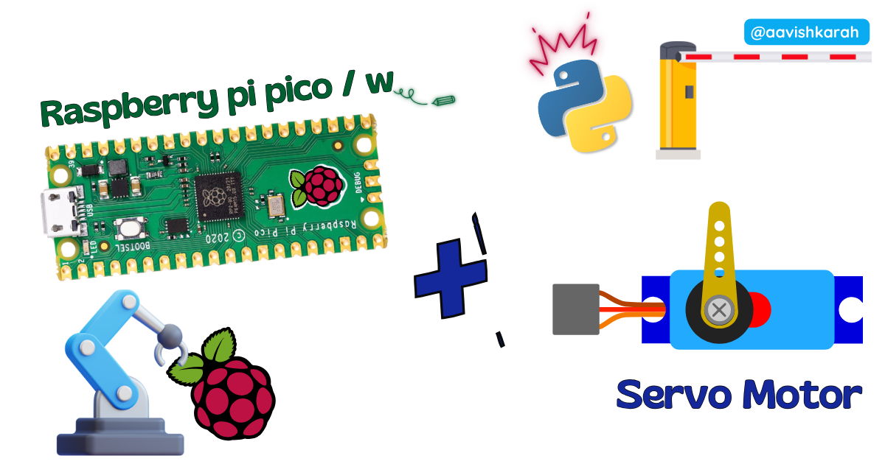
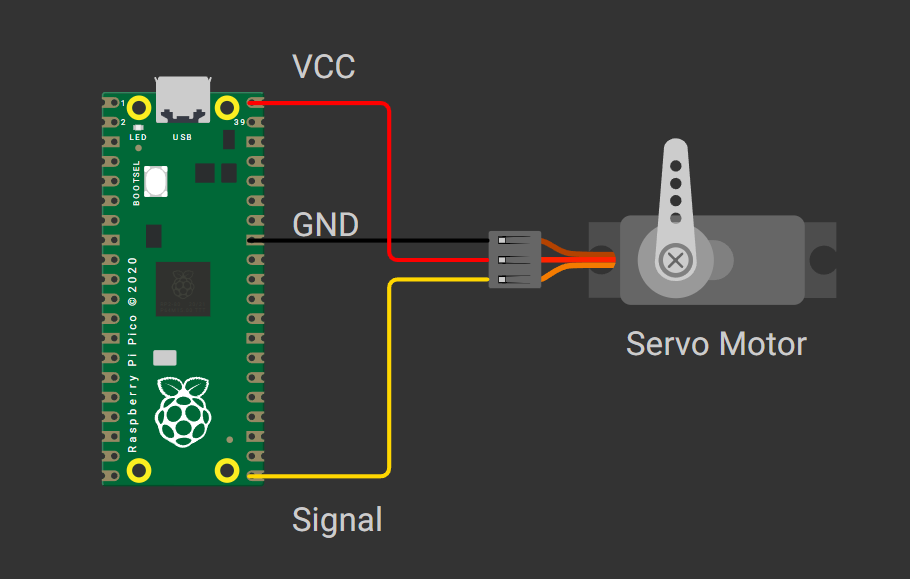

???+ Abstract "Table of Contents"

    [TOC]


## Abstract

Servo motors are essential components in robotics, automation, and DIY electronics projects due to their precise angular control and compact size. In this tutorial, you will learn how to interface a standard SG90 servo motor with a Raspberry Pi Pico microcontroller using MicroPython. By the end, you will be able to control servo position from 0° to 180°, understand PWM signal fundamentals, and integrate servo control into your own embedded projects.

## :compass: Pre-Request

- OS : Windows / Linux / Mac / Chrome
- Thonny IDE.
- MicroPython firmware in Raspberry Pi Pico / Pico 2 / Pico W / Pico 2W. 
    - For step by step procedure [click here](../installing-micropython/index.md){target="_blank"} . 


## Hardware Required

<!-- Advertisement -->
--8<-- "includes/pico-disk-link-cta.md"

- Raspberry Pi Pico / Pico 2 / Pico W / Pico 2W. 
- Servo Motor (SG90 or MG90).
- BreadBoard.
- Micro USB Cable.
- Connecting wires.
- 5V DC power supply (optional)

| Components | Purchase Link |
| -- | -- |
| Raspberry Pi Pico | [link](https://amzn.to/3JNpv7v) |
| Raspberry Pi Pico 2 | [link](https://www.skilldisk.com/product-page/pico-iot-spark-kit) |
| Raspberry Pi Pico W | [link](https://amzn.to/3KeWamg) |
| Raspberry Pi Pico 2W | [link](https://www.skilldisk.com/product-page/pico-iot-spark-kit) |
| Servo Motor | [SG90](https://www.skilldisk.com/product-page/pico-iot-spark-kit) : [MG90]( https://www.skilldisk.com/product-page/pico-iot-spark-kit) |
| BreadBoard | [large](https://amzn.to/4pgNX1c) : [small](https://amzn.to/47SMzvB)|
| Connecting Wires | [link](https://amzn.to/4pepr0H) |
| Micro USB Cable | [link](https://amzn.to/4gfMgNa) |

!!! tip "Don't own a hardware :cry:"

    No worries,

    Still you can learn using simulation.
    check out simulation part :smiley:.

---

## ⚡ Understanding Servo Motors & PWM Control

The **SG90** is a popular hobby servo motor controlled via **Pulse Width Modulation (PWM)**. Unlike standard DC motors, servos rotate to precise angular positions (typically 0°–180°) based on the width of an incoming PWM pulse.

### 🔹 How PWM Controls Servo Position

| Pulse Width | Servo Angle | Duty Cycle (50Hz) | RP2040 `duty_u16` Value |
|-------------|-------------|-------------------|-------------------------|
| ~0.5 ms | 0° | ~2.5% | ~1638 |
| ~1.45 ms | 90° | ~7.25% | ~4751 |
| ~2.4 ms | 180° | ~12% | ~7864 |

!!! note "PWM Frequency"
    Servo motors require a **50Hz PWM signal** (20ms period). The Raspberry Pi Pico's hardware PWM peripheral can generate this signal reliably on any GPIO pin.

!!! warning "Power Considerations"
    Small servos like the SG90 can be powered from the Pico's `5V` (VBUS) pin. However, for multiple servos or high-torque models, use an **external 5V supply** and connect its GND to the Pico's GND to avoid brownouts or regulator damage.

---

## 🧷 Connection / Wiring Guide (Raspberry Pi Pico to SG90 Servo)

### 🔥 Pin Mapping Table

| Servo Wire | Color | Raspberry Pi Pico Pin | Description |
|------------|-------|----------------------|-------------|
| **GND** | Brown | `GND`  | Common ground |
| **VCC** | Red | `5V` (VBUS, Pin 40) *or* External `5V` Power Supply | Power supply |
| **Signal** | Orange/Yellow | `GP16` *or any PWM-capable GPIO* | PWM control signal |

!!! tip "PWM-Capable Pins"
    **All GPIO pins** on the Raspberry Pi Pico support hardware PWM output. You can use any pin — just update the pin number in your code accordingly.



/// caption
fig-Connection Diagram
///

## :open_file_folder: Code

=== "main.py"
    ```python linenums="1"
    from machine import Pin, PWM
    from time import sleep

    # Initialize PWM on GPIO 16
    servo_pin = Pin(16)
    servo = PWM(servo_pin)

    ########## NOTE #################
    # Pulse range varies with manufacturer.
    # Check data sheet for the same

    # PWM Configuration for SG90 Servo
    FREQUENCY = 50  # 50Hz standard for servos
    MIN_DUTY = 1638  # ~0.5ms pulse → 0°
    MAX_DUTY = 7864  # ~2.4ms pulse → 180°

    servo.freq(FREQUENCY)

    def servo_angle(angle):
        """Map angle (0-180) to duty cycle (1638-7864)"""
        angle = max(0, min(180, angle))  # Clamp to valid range
        duty = MIN_DUTY + (angle / 180) * (MAX_DUTY - MIN_DUTY)
        servo.duty_u16(int(duty))

    try:
        while True:
            # Sweep: 0° → 90° → 180° → 90° → 0°
            for angle in [0, 90, 180, 90, 0]:
                servo_angle(angle)
                sleep(1)
                
    except KeyboardInterrupt:
        print("\nStopping servo...")
        servo.deinit()  # Disable PWM output
    ```


### Code Explanation

:point_right: Imports

```py linenums="1"

from machine import Pin, PWM
from time import sleep

```

- `time` module for creating delay.


:point_right: Initialize Servo Motor.

```py linenums="5"

servo_pin = Pin(16) # Any gpio pin with PWM feature can be used.
servo = PWM(servo_pin)

```

- GPIO `16` is connected to `Signal` of Servo Motor.


:point_right: PWM Configuration.

```py linenums="13"

# PWM Configuration for SG90 Servo
FREQUENCY = 50  # 50Hz standard for servos
MIN_DUTY = 1638  # ~0.5ms pulse → 0°
MAX_DUTY = 7864  # ~2.4ms pulse → 180°

servo.freq(FREQUENCY)
```

- Sets `50Hz` frequency (20ms period), standard for hobby servos
- Pico has 16-bit PWM resolution (0–65535)
- Values 1638 and 7864 correspond to ~0.5ms and ~2.4ms pulse widths respectively.


:point_right: Setting the color.

```py linenums="19"

def servo_angle(angle):
    """Map angle (0-180) to duty cycle (1638-7864)"""
    angle = max(0, min(180, angle))  # Clamp to valid range
    duty = MIN_DUTY + (angle / 180) * (MAX_DUTY - MIN_DUTY)
    servo.duty_u16(int(duty))
```

- Function to calculate duty_u16 value for the specified angle between 0 to 180 deg

:point_right: Sweep through the angle.

```py linenums="26"

    while True:
        # Sweep: 0° → 90° → 180° → 90° → 0°
        for angle in [0, 90, 180, 90, 0]:
            servo_angle(angle)
            sleep(1)

```
Continuously sweep through the set angle as per the list. ([0, 90, 180, 90, 0])

---

## :material-chart-bubble:{style="color:#ffaa00"} Simulation

!!! danger "Not able to view the simulation"
    - :fontawesome-solid-laptop: Desktop or Laptop : Reload this page ( ++ctrl+r++ )
    - :fontawesome-solid-mobile: Mobile : Use Landscape Mode and reload the page


<iframe style="height:calc(100vh - 200px); border-color:#00aaff;border-radius:1rem;min-height:400px" src="https://wokwi.com/projects/457997236483934209" frameborder="2px" width="100%" height="700px"></iframe>

---


<!-- Advertisement -->
--8<-- "includes/pico-disk-link-cta.md"
--8<-- "includes/pico-iot-cta.md"

---

## 🛑 Troubleshooting (Common Issues & Fixes)

❌ **Issue 1: Servo doesn't move or jitters**

✅ **Causes:**
- Incorrect PWM frequency (must be 50Hz)
- Weak power supply causing voltage drops
- Signal wire connected to non-PWM pin (rare on Pico)

✅ **Fix:**
```python
servo.freq(50)  # Ensure 50Hz
```
- Use a **stable 5V supply** for servos drawing >200mA.
- Add a **100µF capacitor** between servo VCC and GND near the motor.

* * *

❌ **Issue 2: Servo buzzes at 0° or 180°**

✅ **Cause:**
- Pulse width values outside servo's mechanical range.

✅ **Fix:**
```python
# Adjust these values incrementally
MIN_DUTY = 1600  # Was 1638
MAX_DUTY = 7900  # Was 7864
```
- Test with smaller angle ranges first (e.g., 10°–170°).

* * *

❌ **Issue 3: Raspberry Pi Pico resets during servo motion**

✅ **Cause:**
- Servo current spike exceeds Pico's regulator capacity (~300mA).

✅ **Fix:**
- Power servo from **external 5V supply**.
- Connect external supply GND to Pico GND (common ground).
- Keep signal wire connection intact.

---

## 🏁 Conclusion

You have successfully interfaced an **SG90 servo motor** with a **Raspberry Pi Pico** using **MicroPython** 🎉. You now understand:

- How PWM signals control servo angular position
- How to calculate duty cycle values for precise motion
- Best practices for power management and troubleshooting

With this foundation, you can build interactive projects like:
- 🤖 Robotic arm controllers
- 🚗 RC car steering systems
- 📡 Pan-tilt camera mounts
- 🎮 Game controller feedback mechanisms

!!! tip "Next Steps"
    Combine servo control with sensors (ultrasonic, potentiometer) or communication modules (WiFi, Bluetooth) to create smart, responsive embedded systems. Explore the [Raspberry Pi Pico MicroPython documentation](https://docs.micropython.org/en/latest/rp2/quickref.html) for advanced PWM features.

---

## :material-web-plus: Extras

### Components details

- Servo Motor : [Data Sheet](#)
- Raspberry Pi Pico / Pico 2 : [Pin Diagram](../pico2-pico2-w-key-features-pin-config/index.md){target="_blank"}
- Raspberry Pi Pico : [Data Sheet](https://datasheets.raspberrypi.com/pico/pico-datasheet.pdf){target="_blank"}
- Raspberry Pi Pico 2 : [Data Sheet](https://datasheets.raspberrypi.com/pico/pico-2-datasheet.pdf){target="_blank"}
- Raspberry Pi Pico W : [Data Sheet](https://datasheets.raspberrypi.com/picow/pico-w-datasheet.pdf){target="_blank"}
- Raspberry Pi Pico 2 W : [Data Sheet](https://datasheets.raspberrypi.com/picow/pico-2-w-datasheet.pdf){target="_blank"}

