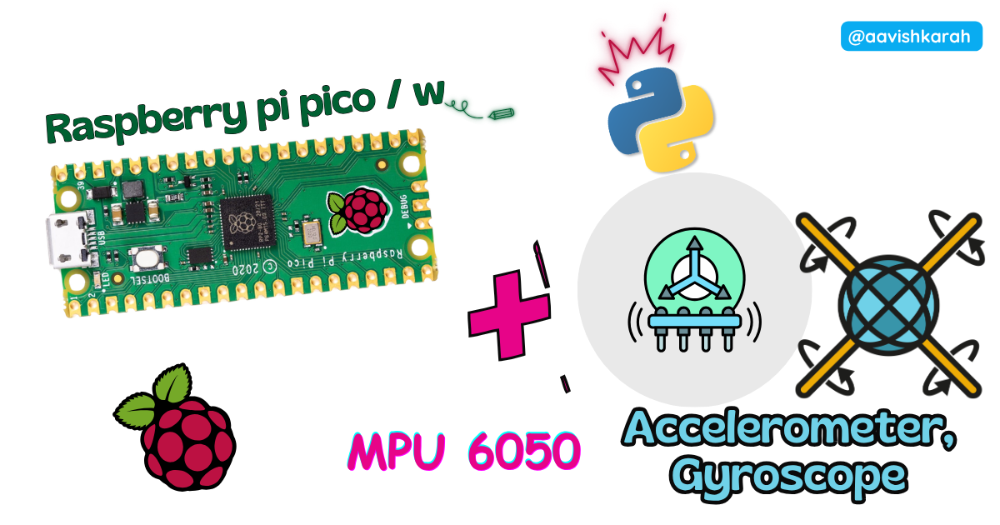
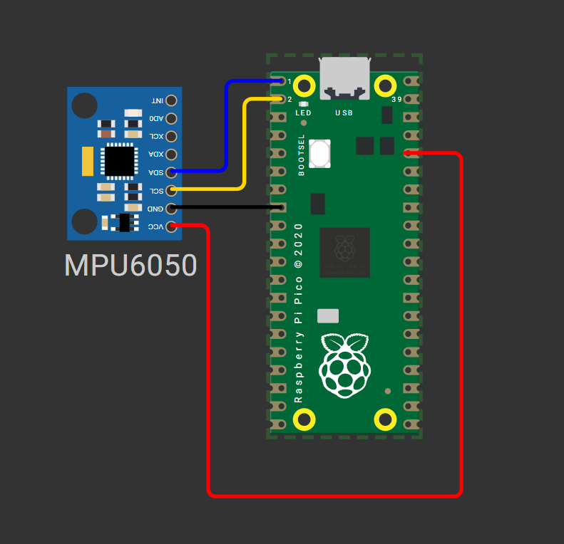

???+ Abstract "Table of Contents"

    [TOC]

## Abstract

The MPU6050 is a versatile 6-DoF (Degrees of Freedom) Inertial Measurement Unit (IMU) combining a 3-axis accelerometer and 3-axis gyroscope in a single compact module. In this tutorial, you will learn how to interface the MPU6050 sensor with a Raspberry Pi Pico microcontroller using MicroPython and the I2C communication protocol. By the end, you will be able to read real-time acceleration, angular velocity, and temperature data, understand I2C fundamentals, and integrate motion sensing into your embedded robotics and IoT projects.

---

## Pre-Request

- **OS**: Windows / Linux / Mac / ChromeOS
- **IDE**: Thonny IDE (recommended) or VS Code with Pymakr extension
- **Firmware**: MicroPython firmware flashed on Raspberry Pi Pico / Pico 2 / Pico W / Pico 2W
  - For step-by-step firmware installation, [click here](https://tech.arunkumarn.in/blogs/raspberry-pi-pico/installing-micropython/)

---

## Hardware Required

<!-- Advertisement -->
--8<-- "includes/pico-disk-link-cta.md"

- Raspberry Pi Pico / Pico 2 / Pico W / Pico 2W
- MPU6050 GY-521 Breakout Module
- Breadboard (optional, for prototyping)
- Micro USB Cable (for power and programming)
- Jumper wires (M-M or M-F)
- 3.3V logic level compatibility (MPU6050 supports 3.3V-5V VCC)


| Components | Purchase Link |
| --- | --- |
| Raspberry Pi Pico | [link](https://amzn.to/3JNpv7v) |
| Raspberry Pi Pico 2 | [link](https://www.skilldisk.com/product-page/pico-iot-spark-kit) |
| Raspberry Pi Pico W | [link](https://amzn.to/3KeWamg) |
| Raspberry Pi Pico 2W | [link](https://www.skilldisk.com/product-page/pico-iot-spark-kit) |
| MPU6050 Module | [link](https://www.skilldisk.com/product-page/pico-iot-spark-kit) |
| BreadBoard | [large](https://amzn.to/4pgNX1c) : [small](https://amzn.to/47SMzvB)|
| Connecting Wires | [link](https://amzn.to/4pepr0H) |
| Micro USB Cable | [link](https://amzn.to/4gfMgNa) |


!!! tip "Don't own a hardware :cry:"

    No worries,

    Still you can learn using simulation.
    check out simulation part :smiley:.

---

## ⚡ Understanding MPU6050 & I2C Communication

The **MPU6050** is a MEMS (Micro-Electro-Mechanical System) sensor that integrates a **3-axis accelerometer** and **3-axis gyroscope** with an onboard **Digital Motion Processor (DMP)**. Unlike analog sensors, the MPU6050 communicates digitally via the **I2C (Inter-Integrated Circuit)** protocol, making it ideal for microcontrollers like the Raspberry Pi Pico.

### 🔹 How I2C Controls MPU6050 Data Acquisition

| Parameter | Value | Description |
|-----------|-------|-------------|
| **I2C Address** | `0x68` (default) / `0x69` (if AD0=HIGH) | 7-bit slave address for bus communication |
| **Clock Speed** | 100kHz (standard) / 400kHz (fast mode) | I2C bus frequency for data transfer |
| **Data Format** | 16-bit two's complement | Raw sensor readings for acceleration (±2g to ±16g) and rotation (±250°/s to ±2000°/s) |
| **Update Rate** | Configurable up to 8kHz | Sample rate for accelerometer/gyroscope data |

#### I2C Protocol Overview

```
Pico (Master) ──[SCL]──► MPU6050 (Slave)
Pico (Master) ◄─[SDA]──► MPU6050 (Slave)
```

- **SCL (Serial Clock)**: Timing signal generated by the Pico to synchronize data transfer
- **SDA (Serial Data)**: Bidirectional line for sending commands and receiving sensor data
- The Pico initiates communication, sends register addresses, and reads back measurement values

#### Sensor Axes Convention

```
        +Y (forward)
          ↑
          │
    +X ←──┼──► -X (right-hand rule)
          │
          ▼
        -Y (backward)
        
+Z: Upward (perpendicular to board)
-Z: Downward (gravity direction when flat)
```

- **Accelerometer**: Measures linear acceleration (including gravity). When stationary, one axis will read ~1g (9.8 m/s²) due to Earth's gravity.
- **Gyroscope**: Measures angular velocity (rotation speed) around each axis in degrees per second (°/s).

---

## 🧷 Connection / Wiring Guide (Raspberry Pi Pico to MPU6050)

### 🔥 Pin Mapping Table

| MPU6050 Pin | Color (Typical) | Raspberry Pi Pico Pin | Description |
|-------------|-----------------|----------------------|-------------|
| **VCC** | Red | `3V3` (Pin 36) | Power supply (3.3V recommended) |
| **GND** | Black | `GND` (Pin 38) | Common ground reference |
| **SCL** | Blue | `GP1` (I2C0 SCL, Pin 2) | I2C clock signal |
| **SDA** | Green | `GP0` (I2C0 SDA, Pin 1) | I2C data signal |
| **AD0** | - | `GND` (optional) | Slave address select (LOW = 0x68) |
| **INT** | - | *Not connected* | Interrupt output (optional for advanced use) |

#### I2C Pin Flexibility on Raspberry Pi Pico

The RP2040 chip supports **two hardware I2C controllers** with multiple GPIO pin options:

| I2C Controller | SDA Pins | SCL Pins |
|----------------|----------|----------|
| **I2C0** | GP0, GP4, GP8, GP12, GP16, GP20 | GP1, GP5, GP9, GP13, GP17, GP21 |
| **I2C1** | GP2, GP6, GP10, MP14, GP18, GP26 | GP3, GP7, GP11, GP15, GP19, GP27 |

!!! tip "✅ Recommendation" 
    Use **I2C0 on GP0/GP1** for this tutorial. Update pin numbers in code if using alternative pins.


/// caption
fig-Connection Diagram
///

!!! warning "⚠️ **Power Note**" 
    While MPU6050 supports 5V input, use **3.3V** from Pico to ensure logic-level compatibility and avoid potential I2C communication issues.

---

## :open_file_folder: Code

### Required Libraries: `imu.py` and `vector3d.py`

Before running the main script, upload these two library files to your Pico's `/lib` directory using Thonny IDE:

=== "main.py"
    ```python
    # Upload after imu.py and vector3d.py are in /lib folder

    from imu import MPU6050
    from time import sleep
    from machine import Pin, I2C

    # Initialize I2C0 on GP0 (SDA) and GP1 (SCL) at 400kHz
    i2c = I2C(0, sda=Pin(0), scl=Pin(1), freq=400000)

    # Create MPU6050 instance
    imu = MPU6050(i2c)

    print("MPU6050 initialized. Reading sensor data...")
    print("ax(accel X)\tay(accel Y)\taz(accel Z)\tgx(gyro X)\tgy(gyro Y)\tgz(gyro Z)\tTemp(°C)")
    print("-" * 100)

    try:
        while True:
            # Read and round sensor values for clean output
            ax = round(imu.accel.x, 2)
            ay = round(imu.accel.y, 2)
            az = round(imu.accel.z, 2)
            gx = round(imu.gyro.x, 1)
            gy = round(imu.gyro.y, 1)
            gz = round(imu.gyro.z, 1)
            temp = round(imu.temperature, 2)
            
            # Print formatted data (carriage return for in-place update)
            print(f"{ax}\t{ay}\t{az}\t{gx}\t{gy}\t{gz}\t{temp}", end="\r")
            
            # Small delay to stabilize readings and reduce console spam
            sleep(0.2)
            
    except KeyboardInterrupt:
        print("\n\nSensor reading stopped by user.")
        # Optional: Deinitialize I2C if needed for power saving
        # i2c.deinit()
    ```

=== "vector3d.py"
    ```python
    # vector3d.py 3D vector class for use in inertial measurement unit drivers
    # Authors Peter Hinch, Sebastian Plamauer

    # V0.7 17th May 2017 pyb replaced with utime
    # V0.6 18th June 2015
    from utime import sleep_ms
    from math import sqrt, degrees, acos, atan2


    def default_wait():
        '''
        delay of 50 ms
        '''
        sleep_ms(50)


    class Vector3d(object):
        '''
        Represents a vector in a 3D space using Cartesian coordinates.
        Internally uses sensor relative coordinates.
        Returns vehicle-relative x, y and z values.
        '''
        def __init__(self, transposition, scaling, update_function):
            self._vector = [0, 0, 0]
            self._ivector = [0, 0, 0]
            self.cal = (0, 0, 0)
            self.argcheck(transposition, "Transposition")
            self.argcheck(scaling, "Scaling")
            if set(transposition) != {0, 1, 2}:
                raise ValueError('Transpose indices must be unique and in range 0-2')
            self._scale = scaling
            self._transpose = transposition
            self.update = update_function

        def argcheck(self, arg, name):
            '''
            checks if arguments are of correct length
            '''
            if len(arg) != 3 or not (type(arg) is list or type(arg) is tuple):
                raise ValueError(name + ' must be a 3 element list or tuple')

        def calibrate(self, stopfunc, waitfunc=default_wait):
            '''
            calibration routine, sets cal
            '''
            self.update()
            maxvec = self._vector[:]                # Initialise max and min lists with current values
            minvec = self._vector[:]
            while not stopfunc():
                waitfunc()
                self.update()
                maxvec = list(map(max, maxvec, self._vector))
                minvec = list(map(min, minvec, self._vector))
            self.cal = tuple(map(lambda a, b: (a + b)/2, maxvec, minvec))

        @property
        def _calvector(self):
            '''
            Vector adjusted for calibration offsets
            '''
            return list(map(lambda val, offset: val - offset, self._vector, self.cal))

        @property
        def x(self):                                # Corrected, vehicle relative floating point values
            self.update()
            return self._calvector[self._transpose[0]] * self._scale[0]

        @property
        def y(self):
            self.update()
            return self._calvector[self._transpose[1]] * self._scale[1]

        @property
        def z(self):
            self.update()
            return self._calvector[self._transpose[2]] * self._scale[2]

        @property
        def xyz(self):
            self.update()
            return (self._calvector[self._transpose[0]] * self._scale[0],
                    self._calvector[self._transpose[1]] * self._scale[1],
                    self._calvector[self._transpose[2]] * self._scale[2])

        @property
        def magnitude(self):
            x, y, z = self.xyz  # All measurements must correspond to the same instant
            return sqrt(x**2 + y**2 + z**2)

        @property
        def inclination(self):
            x, y, z = self.xyz
            return degrees(acos(z / sqrt(x**2 + y**2 + z**2)))

        @property
        def elevation(self):
            return 90 - self.inclination

        @property
        def azimuth(self):
            x, y, z = self.xyz
            return degrees(atan2(y, x))

        # Raw uncorrected integer values from sensor
        @property
        def ix(self):
            return self._ivector[0]

        @property
        def iy(self):
            return self._ivector[1]

        @property
        def iz(self):
            return self._ivector[2]

        @property
        def ixyz(self):
            return self._ivector

        @property
        def transpose(self):
            return tuple(self._transpose)

        @property
        def scale(self):
            return tuple(self._scale)
    ```

=== "imu.py"
    ```python
    # imu.py MicroPython driver for the InvenSense inertial measurement units
    # This is the base class
    # Adapted from Sebastian Plamauer's MPU9150 driver:
    # https://github.com/micropython-IMU/micropython-mpu9150.git
    # Authors Peter Hinch, Sebastian Plamauer
    # V0.2 17th May 2017 Platform independent: utime and machine replace pyb
    from utime import sleep_ms
    from machine import I2C
    from vector3d import Vector3d


    class MPUException(OSError):
        """
        Exception for MPU devices
        """

        pass


    def bytes_toint(msb, lsb):
        """
        Convert two bytes to signed integer (big endian)
        for little endian reverse msb, lsb arguments
        Can be used in an interrupt handler
        """
        if not msb & 0x80:
            return msb << 8 | lsb  # +ve
        return -(((msb ^ 255) << 8) | (lsb ^ 255) + 1)


    class MPU6050(object):
        """
        Module for InvenSense IMUs. Base class implements MPU6050 6DOF sensor, with
        features common to MPU9150 and MPU9250 9DOF sensors.
        """

        _I2Cerror = "I2C failure when communicating with IMU"
        _mpu_addr = (104, 105)  # addresses of MPU9150/MPU6050. There can be two devices
        _chip_id = 104

        def __init__(self, side_str, device_addr=None, transposition=(0, 1, 2), scaling=(1, 1, 1)):

            self._accel = Vector3d(transposition, scaling, self._accel_callback)
            self._gyro = Vector3d(transposition, scaling, self._gyro_callback)
            self.buf1 = bytearray(1)  # Pre-allocated buffers for reads: allows reads to
            self.buf2 = bytearray(2)  # be done in interrupt handlers
            self.buf3 = bytearray(3)
            self.buf6 = bytearray(6)

            sleep_ms(200)  # Ensure PSU and device have settled
            if isinstance(side_str, str):  # Non-pyb targets may use other than X or Y
                self._mpu_i2c = I2C(side_str)
            elif hasattr(side_str, "readfrom"):  # Soft or hard I2C instance. See issue #3097
                self._mpu_i2c = side_str
            else:
                raise ValueError("Invalid I2C instance")

            if device_addr is None:
                devices = set(self._mpu_i2c.scan())
                mpus = devices.intersection(set(self._mpu_addr))
                number_of_mpus = len(mpus)
                if number_of_mpus == 0:
                    raise MPUException("No MPU's detected")
                elif number_of_mpus == 1:
                    self.mpu_addr = mpus.pop()
                else:
                    raise ValueError("Two MPU's detected: must specify a device address")
            else:
                if device_addr not in (0, 1):
                    raise ValueError("Device address must be 0 or 1")
                self.mpu_addr = self._mpu_addr[device_addr]

            self.chip_id  # Test communication by reading chip_id: throws exception on error
            # Can communicate with chip. Set it up.
            self.wake()  # wake it up
            self.passthrough = True  # Enable mag access from main I2C bus
            self.accel_range = 0  # default to highest sensitivity
            self.gyro_range = 0  # Likewise for gyro

        # read from device
        def _read(
            self, buf, memaddr, addr
        ):  # addr = I2C device address, memaddr = memory location within the I2C device
            """
            Read bytes to pre-allocated buffer Caller traps OSError.
            """
            self._mpu_i2c.readfrom_mem_into(addr, memaddr, buf)

        # write to device
        def _write(self, data, memaddr, addr):
            """
            Perform a memory write. Caller should trap OSError.
            """
            self.buf1[0] = data
            self._mpu_i2c.writeto_mem(addr, memaddr, self.buf1)

        # wake
        def wake(self):
            """
            Wakes the device.
            """
            try:
                self._write(0x01, 0x6B, self.mpu_addr)  # Use best clock source
            except OSError:
                raise MPUException(self._I2Cerror)
            return "awake"

        # mode
        def sleep(self):
            """
            Sets the device to sleep mode.
            """
            try:
                self._write(0x40, 0x6B, self.mpu_addr)
            except OSError:
                raise MPUException(self._I2Cerror)
            return "asleep"

        # chip_id
        @property
        def chip_id(self):
            """
            Returns Chip ID
            """
            try:
                self._read(self.buf1, 0x75, self.mpu_addr)
            except OSError:
                raise MPUException(self._I2Cerror)
            chip_id = int(self.buf1[0])
            if chip_id != self._chip_id:
                print(f"Unexpected chip ID: 0x{chip_id:02x}. Possible clone chip?")
            return chip_id

        @property
        def sensors(self):
            """
            returns sensor objects accel, gyro
            """
            return self._accel, self._gyro

        # get temperature
        @property
        def temperature(self):
            """
            Returns the temperature in degree C.
            """
            try:
                self._read(self.buf2, 0x41, self.mpu_addr)
            except OSError:
                raise MPUException(self._I2Cerror)
            # MPU-6000 and MPU-6050 Register Map and Descriptions Revision 4.2:
            return bytes_toint(self.buf2[0], self.buf2[1]) / 340 + 36.53

        # passthrough
        @property
        def passthrough(self):
            """
            Returns passthrough mode True or False
            """
            try:
                self._read(self.buf1, 0x37, self.mpu_addr)
                return self.buf1[0] & 0x02 > 0
            except OSError:
                raise MPUException(self._I2Cerror)

        @passthrough.setter
        def passthrough(self, mode):
            """
            Sets passthrough mode True or False
            """
            if type(mode) is bool:
                val = 2 if mode else 0
                try:
                    self._write(val, 0x37, self.mpu_addr)  # I think this is right.
                    self._write(0x00, 0x6A, self.mpu_addr)
                except OSError:
                    raise MPUException(self._I2Cerror)
            else:
                raise ValueError("pass either True or False")

        # sample rate. Not sure why you'd ever want to reduce this from the default.
        @property
        def sample_rate(self):
            """
            Get sample rate as per Register Map document section 4.4
            SAMPLE_RATE= Internal_Sample_Rate / (1 + rate)
            default rate is zero i.e. sample at internal rate.
            """
            try:
                self._read(self.buf1, 0x19, self.mpu_addr)
                return self.buf1[0]
            except OSError:
                raise MPUException(self._I2Cerror)

        @sample_rate.setter
        def sample_rate(self, rate):
            """
            Set sample rate as per Register Map document section 4.4
            """
            if rate < 0 or rate > 255:
                raise ValueError("Rate must be in range 0-255")
            try:
                self._write(rate, 0x19, self.mpu_addr)
            except OSError:
                raise MPUException(self._I2Cerror)

        # Low pass filters. Using the filter_range property of the MPU9250 is
        # harmless but gyro_filter_range is preferred and offers an extra setting.
        @property
        def filter_range(self):
            """
            Returns the gyro and temperature sensor low pass filter cutoff frequency
            Pass:               0   1   2   3   4   5   6
            Cutoff (Hz):        250 184 92  41  20  10  5
            Sample rate (KHz):  8   1   1   1   1   1   1
            """
            try:
                self._read(self.buf1, 0x1A, self.mpu_addr)
                res = self.buf1[0] & 7
            except OSError:
                raise MPUException(self._I2Cerror)
            return res

        @filter_range.setter
        def filter_range(self, filt):
            """
            Sets the gyro and temperature sensor low pass filter cutoff frequency
            Pass:               0   1   2   3   4   5   6
            Cutoff (Hz):        250 184 92  41  20  10  5
            Sample rate (KHz):  8   1   1   1   1   1   1
            """
            # set range
            if filt in range(7):
                try:
                    self._write(filt, 0x1A, self.mpu_addr)
                except OSError:
                    raise MPUException(self._I2Cerror)
            else:
                raise ValueError("Filter coefficient must be between 0 and 6")

        # accelerometer range
        @property
        def accel_range(self):
            """
            Accelerometer range
            Value:              0   1   2   3
            for range +/-:      2   4   8   16  g
            """
            try:
                self._read(self.buf1, 0x1C, self.mpu_addr)
                ari = self.buf1[0] // 8
            except OSError:
                raise MPUException(self._I2Cerror)
            return ari

        @accel_range.setter
        def accel_range(self, accel_range):
            """
            Set accelerometer range
            Pass:               0   1   2   3
            for range +/-:      2   4   8   16  g
            """
            ar_bytes = (0x00, 0x08, 0x10, 0x18)
            if accel_range in range(len(ar_bytes)):
                try:
                    self._write(ar_bytes[accel_range], 0x1C, self.mpu_addr)
                except OSError:
                    raise MPUException(self._I2Cerror)
            else:
                raise ValueError("accel_range can only be 0, 1, 2 or 3")

        # gyroscope range
        @property
        def gyro_range(self):
            """
            Gyroscope range
            Value:              0   1   2    3
            for range +/-:      250 500 1000 2000  degrees/second
            """
            # set range
            try:
                self._read(self.buf1, 0x1B, self.mpu_addr)
                gri = self.buf1[0] // 8
            except OSError:
                raise MPUException(self._I2Cerror)
            return gri

        @gyro_range.setter
        def gyro_range(self, gyro_range):
            """
            Set gyroscope range
            Pass:               0   1   2    3
            for range +/-:      250 500 1000 2000  degrees/second
            """
            gr_bytes = (0x00, 0x08, 0x10, 0x18)
            if gyro_range in range(len(gr_bytes)):
                try:
                    self._write(
                        gr_bytes[gyro_range], 0x1B, self.mpu_addr
                    )  # Sets fchoice = b11 which enables filter
                except OSError:
                    raise MPUException(self._I2Cerror)
            else:
                raise ValueError("gyro_range can only be 0, 1, 2 or 3")

        # Accelerometer
        @property
        def accel(self):
            """
            Acceleremoter object
            """
            return self._accel

        def _accel_callback(self):
            """
            Update accelerometer Vector3d object
            """
            try:
                self._read(self.buf6, 0x3B, self.mpu_addr)
            except OSError:
                raise MPUException(self._I2Cerror)
            self._accel._ivector[0] = bytes_toint(self.buf6[0], self.buf6[1])
            self._accel._ivector[1] = bytes_toint(self.buf6[2], self.buf6[3])
            self._accel._ivector[2] = bytes_toint(self.buf6[4], self.buf6[5])
            scale = (16384, 8192, 4096, 2048)
            self._accel._vector[0] = self._accel._ivector[0] / scale[self.accel_range]
            self._accel._vector[1] = self._accel._ivector[1] / scale[self.accel_range]
            self._accel._vector[2] = self._accel._ivector[2] / scale[self.accel_range]

        def get_accel_irq(self):
            """
            For use in interrupt handlers. Sets self._accel._ivector[] to signed
            unscaled integer accelerometer values
            """
            self._read(self.buf6, 0x3B, self.mpu_addr)
            self._accel._ivector[0] = bytes_toint(self.buf6[0], self.buf6[1])
            self._accel._ivector[1] = bytes_toint(self.buf6[2], self.buf6[3])
            self._accel._ivector[2] = bytes_toint(self.buf6[4], self.buf6[5])

        # Gyro
        @property
        def gyro(self):
            """
            Gyroscope object
            """
            return self._gyro

        def _gyro_callback(self):
            """
            Update gyroscope Vector3d object
            """
            try:
                self._read(self.buf6, 0x43, self.mpu_addr)
            except OSError:
                raise MPUException(self._I2Cerror)
            self._gyro._ivector[0] = bytes_toint(self.buf6[0], self.buf6[1])
            self._gyro._ivector[1] = bytes_toint(self.buf6[2], self.buf6[3])
            self._gyro._ivector[2] = bytes_toint(self.buf6[4], self.buf6[5])
            scale = (131, 65.5, 32.8, 16.4)
            self._gyro._vector[0] = self._gyro._ivector[0] / scale[self.gyro_range]
            self._gyro._vector[1] = self._gyro._ivector[1] / scale[self.gyro_range]
            self._gyro._vector[2] = self._gyro._ivector[2] / scale[self.gyro_range]

        def get_gyro_irq(self):
            """
            For use in interrupt handlers. Sets self._gyro._ivector[] to signed
            unscaled integer gyro values. Error trapping disallowed.
            """
            self._read(self.buf6, 0x43, self.mpu_addr)
            self._gyro._ivector[0] = bytes_toint(self.buf6[0], self.buf6[1])
            self._gyro._ivector[1] = bytes_toint(self.buf6[2], self.buf6[3])
            self._gyro._ivector[2] = bytes_toint(self.buf6[4], self.buf6[5])
    ```


### Code Explanation

:point_right: Library Imports

```python
from imu import MPU6050      # Custom MPU6050 driver class
from time import sleep        # For timing delays between reads
from machine import Pin, I2C  # MicroPython hardware abstraction
```

- `machine.I2C`: Configures hardware I2C peripheral on the RP2040
- `machine.Pin`: Assigns GPIO pins for SDA/SCL signals

:point_right: I2C Initialization

```python
i2c = I2C(0, sda=Pin(0), scl=Pin(1), freq=400000)
```

| Parameter | Value | Meaning |
|-----------|-------|---------|
| `0` | I2C port ID | Selects I2C0 controller (use `1` for I2C1) |
| `sda=Pin(0)` | GPIO 0 | Data line pin assignment |
| `scl=Pin(1)` | GPIO 1 | Clock line pin assignment |
| `freq=400000` | 400 kHz | Fast-mode I2C speed for responsive reads |

:point_right: MPU6050 Object Creation

```python
imu = MPU6050(i2c)
```

- Instantiates the sensor driver with the configured I2C bus
- Automatically wakes the MPU6050 from sleep mode via `PWR_MGMT_1` register

:point_right: Data Reading Loop

```python
ax = round(imu.accel.x, 2)  # X-axis acceleration in m/s²
gx = round(imu.gyro.x, 1)   # X-axis rotation in °/s
temp = round(imu.temperature, 2)  # Chip temperature in °C
```

- Properties `accel`, `gyro`, and `temperature` trigger I2C register reads
- Values are scaled from raw 16-bit integers to physical units
- `round()` improves readability in the console output

:point_right: Output Formatting

```python
print(f"{ax}\t{ay}\t{az}\t{gx}\t{gy}\t{gz}\t{temp}", end="\r")
```

- `\t` (tab) aligns columns in the Thonny shell
- `end="\r"` returns cursor to line start for real-time value updates
- Press `Ctrl+C` to stop execution gracefully

---

## :material-chart-bubble:{style="color:#ffaa00"} Simulation

!!! danger "Not able to view the simulation"
    - :fontawesome-solid-laptop: Desktop or Laptop : Reload this page ( ++ctrl+r++ )
    - :fontawesome-solid-mobile: Mobile : Use Landscape Mode and reload the page


<iframe style="height:calc(100vh - 200px); border-color:#00aaff;border-radius:1rem;min-height:400px" src="https://wokwi.com/projects/462090770788786177" frameborder="2px" width="100%" height="700px"></iframe>


---


<!-- Advertisement -->
--8<-- "includes/pico-disk-link-cta.md"
--8<-- "includes/pico-iot-cta.md"


---

## 🛑 Troubleshooting (Common Issues & Fixes)

### ❌ Issue 1: `OSError: [Errno 121] EIO` or "No device at address 0x68"

✅ **Causes**:
- Incorrect I2C pin assignment or wiring
- MPU6050 not powered or AD0 pin floating
- I2C pull-up resistors missing (some modules lack onboard resistors)

✅ **Fix**:
```python
# Run I2C scanner to verify device detection
from machine import I2C, Pin
i2c = I2C(0, sda=Pin(0), scl=Pin(1))
print("Scanning I2C bus...")
devices = i2c.scan()
print("Found devices:", [hex(addr) for addr in devices])
```
- Ensure **SCL/SDA have 4.7kΩ pull-up resistors** to 3.3V if communication fails
- Double-check wiring: VCC→3.3V, GND→GND, SDA→GP0, SCL→GP1
- If AD0 pin is HIGH, address becomes `0x69` – update code accordingly

---

### ❌ Issue 2: Sensor readings are noisy or unstable

✅ **Causes**:
- Mechanical vibrations or loose mounting
- Insufficient sampling delay
- Unfiltered raw data

✅ **Fix**:
```python
# Add simple moving average filter (example for 5 samples)
def read_filtered(sensor_prop, samples=5):
    values = [getattr(sensor_prop, axis) for axis in ['x','y','z'] for _ in range(samples)]
    return [sum(values[i::3])/samples for i in range(3)]

# Usage in loop:
ax, ay, az = read_filtered(imu.accel)
```
- Mount MPU6050 securely with foam/damping material
- Increase `sleep()` delay to 0.5s for slower, stable reads
- Consider using the onboard DMP for sensor fusion (advanced)

---

### ❌ Issue 3: Accelerometer Z-axis reads ~0 instead of ~9.8 when flat

✅ **Causes**:
- Sensor orientation misunderstanding
- Calibration offset required
- Wrong full-scale range configuration

✅ **Fix**:
```python
# Verify orientation: Z-axis should read +9.8 m/s² when board faces up
# If inverted, apply sign correction:
az = -imu.accel.z  # Flip sign if needed

# For calibration: collect 100 stationary samples and compute offset
# Then subtract offset from future readings
```
- Place Pico flat on a stable surface during testing
- Remember: gravity always pulls "down" – the axis pointing upward reads +1g

---

### ❌ Issue 4: Pico resets or behaves erratically during reads

✅ **Causes**:
- I2C bus contention or clock stretching issues
- Power supply instability
- Library compatibility with MicroPython version

✅ **Fix**:
- Add **0.1µF ceramic capacitor** between MPU6050 VCC and GND
- Use `freq=100000` (100kHz) instead of 400kHz for more reliable communication
- Update to latest MicroPython firmware: [Download here](https://micropython.org/download/rp2-pico/)

---

## 🏁 Conclusion

We have successfully interfaced an **MPU6050 6-DoF IMU sensor** with a **Raspberry Pi Pico** using **MicroPython** 🎉. We now understand:

- How **I2C communication** enables digital sensor interfacing
- How to **read and interpret** accelerometer (m/s²) and gyroscope (°/s) data
- Best practices for **wiring, library management, and troubleshooting**

With this foundation, you can build advanced projects like:
- 🤖 Self-balancing robots and inverted pendulums
- 🚁 Drone flight stabilization systems
- 🎮 Motion-controlled gaming interfaces
- 📊 Vibration monitoring for predictive maintenance
- 🧭 Tilt-compensated compass systems (with added magnetometer)

### Next Steps

1. **Calibrate your sensor**: Implement offset correction for zero-g and zero-rate conditions
2. **Fuse sensor data**: Use complementary filters or Kalman filters to combine accel + gyro for stable orientation
3. **Add visualization**: Stream data to Thonny plotter, MQTT dashboard, or OLED display
4. **Explore DMP**: Leverage the MPU6050's onboard Digital Motion Processor for quaternion output (requires advanced library)

📚 **Further Reading**:
- [MPU6050 Register Map (InvenSense)](https://invensense.tdk.com/wp-content/uploads/2015/02/MPU-6000-Register-Map1.pdf)
- [MicroPython I2C Documentation](https://docs.micropython.org/en/latest/library/machine.I2C.html)
- [RP2040 Datasheet - I2C Peripheral](https://datasheets.raspberrypi.com/rp2040/rp2040-datasheet.pdf)

---

## Extras

### Components details

- Raspberry Pi Pico / Pico 2 : [Pin Diagram](../pico2-pico2-w-key-features-pin-config/index.md){target="_blank"}
- Raspberry Pi Pico : [Data Sheet](https://datasheets.raspberrypi.com/pico/pico-datasheet.pdf){target="_blank"}
- Raspberry Pi Pico 2 : [Data Sheet](https://datasheets.raspberrypi.com/pico/pico-2-datasheet.pdf){target="_blank"}
- Raspberry Pi Pico W : [Data Sheet](https://datasheets.raspberrypi.com/picow/pico-w-datasheet.pdf){target="_blank"}
- Raspberry Pi Pico 2 W : [Data Sheet](https://datasheets.raspberrypi.com/picow/pico-2-w-datasheet.pdf){target="_blank"}
- MPU6050 : [Datasheet](https://invensense.tdk.com/wp-content/uploads/2015/02/MPU-6000-Datasheet1.pdf)

### Library Sources

- `imu.py` & `vector3d.py`: [micropython-IMU GitHub Repository](https://github.com/micropython-IMU/micropython-mpu9x50)
- Alternative lightweight driver: [TimHanewich/MPU6050-MicroPython](https://github.com/TimHanewich/MicroPython-Collection/tree/master/MPU6050)

### Quick Reference: MPU6050 Register Map

| Register | Address | Purpose |
|----------|---------|---------|
| `WHO_AM_I` | `0x75` | Device ID verification (should return `0x68`) |
| `PWR_MGMT_1` | `0x6B` | Power management & wake-up control |
| `ACCEL_XOUT_H` | `0x3B` | Start of 14-bit accelerometer data block |
| `GYRO_XOUT_H` | `0x43` | Start of 14-bit gyroscope data block |
| `TEMP_OUT_H` | `0x41` | Temperature sensor output |

!!! tip "🔐 Pro Tip"
     Always read `WHO_AM_I` register during initialization to confirm successful I2C communication before proceeding with sensor reads.
