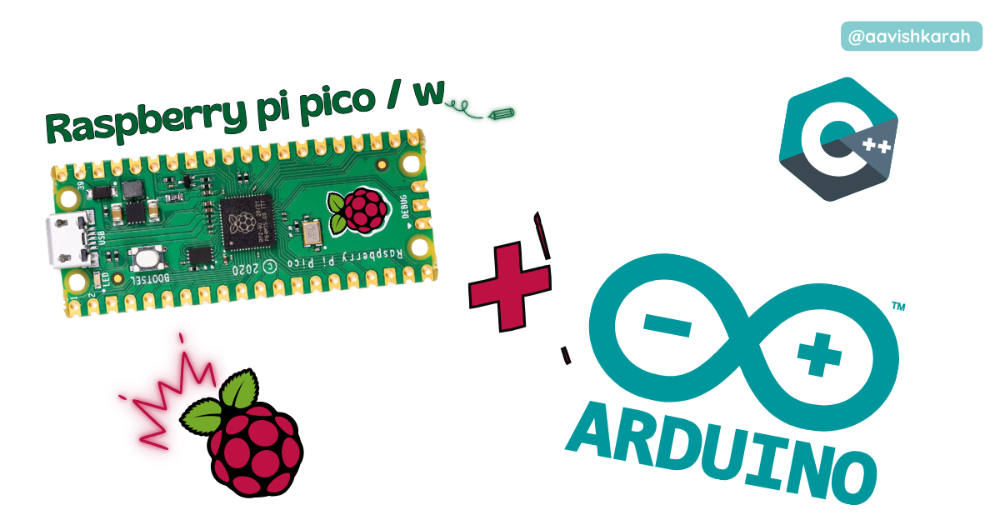
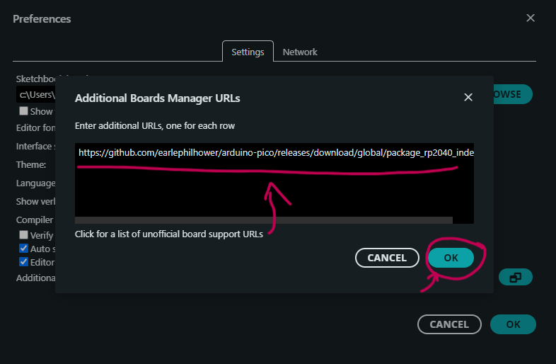
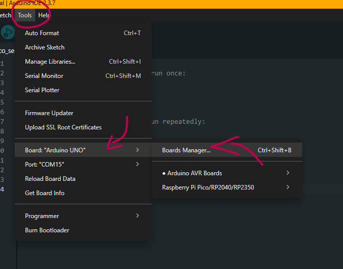
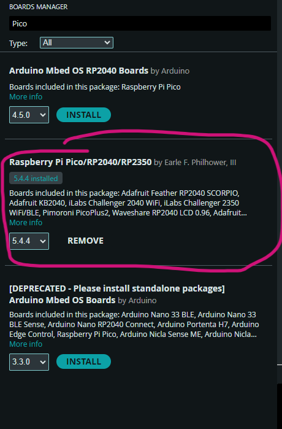

???+ Abstract "Table of Contents"

    [TOC]


## Abstract

The **Raspberry Pi Pico** is a powerful and affordable microcontroller board based on the RP2040 chip. Although it is most commonly used with **MicroPython** or **C/C++ SDK**, the Pico hardware also supports the **Arduino framework**, making it easier for millions of Arduino developers to write code using the familiar Arduino API.

In this tutorial, we explain how to set up the **Arduino framework for Raspberry Pi Pico** using **Arduino IDE**, explore the benefits, configuration steps, and sample code to help you get started quickly.

---

## Pre-Requisites

Before proceeding, ensure you have:

- **Arduino IDE (v2.3.1 or later)** installed : download [here](https://www.arduino.cc/en/software){target="_blank"}  
- Raspberry Pi Pico board with USB cable  
- Basic familiarity with Arduino IDE  
- Micro USB or USB-C cable (depending on your Pico board)

---

## What is the Arduino Framework for Raspberry Pi Pico?

The **Arduino framework on Raspberry Pi Pico** is an adaptation of the Arduino core that allows you to program the Pico using familiar Arduino functions like `setup()`, `loop()`, `digitalWrite()`, `analogRead()`, etc.

This enables:

- Seamless transition for Arduino developers  
- Use of many Arduino libraries on Pico  
- Familiar API for GPIO, PWM, I2C, SPI, Serial, etc.  
- Rapid prototyping and community support

The core is supported through the **Arduino Mbed RP2040 core**, maintained officially by Arduino.

---

## Benefits of Using Arduino Framework on Pico

| Feature              | Arduino Core | MicroPython | C/C++ SDK |
| -------------------- | ------------ | ----------- | --------- |
| Ease of Use          | ⭐⭐⭐⭐         | ⭐⭐⭐⭐⭐       | ⭐⭐        |
| Library Availability | ⭐⭐⭐⭐⭐        | ⭐⭐⭐⭐         | ⭐⭐⭐       |
| Beginner Friendly    | ⭐⭐⭐⭐         | ⭐⭐⭐⭐⭐       | ⭐⭐        |
| Hardware Control     | ⭐⭐⭐          | ⭐⭐⭐⭐        | ⭐⭐⭐⭐⭐     |

✔ Rapid prototyping  
✔ Large library ecosystem  
✔ Easy debugging with Serial Monitor

---

## Setting up Raspberry Pi Pico in Arduino IDE

### Step 1: Install Arduino IDE

Download from:
- [link](https://www.arduino.cc/en/software){target="_blank"} 
- https://www.arduino.cc/en/software

---

### Step 2: Open Boards Manager

In Arduino IDE:

`File → Preferences`

Add the following in **Additional Boards Manager URLs**:

```
https://github.com/earlephilhower/arduino-pico/releases/download/global/package_rp2040_index.json


```




---

### Step 3: Install RP2040 Boards

Go to:

`Tools → Board → Boards Manager`



Search for **Pico** and install:

> “Raspberry Pi Pico/RP2040/RP2350”


> Time of Installation


> After Installation



---

## Selecting Raspberry Pi Pico Board

After installation:

1. Go to `Tools → Board`
2. Scroll to **Raspberry Pi Pico/RP2040/RP2350**
3. Choose:
   - “Raspberry Pi Pico”
   - Or “Raspberry Pi Pico W” (if using wireless board)
   - Or “Raspberry Pi Pico 2” (if using RP2350 board)
   - Or “Raspberry Pi Pico 2W” (if using RP2350 wireless board)


---

## Configuring the Arduino IDE

After selecting the board:

| Setting   | Value                        |
| --------- | ---------------------------- |
| Board     | Raspberry Pi Pico            |
| Port      | (Choose the COM/Serial port) |


!!! info
    Make sure the correct **COM port** is selected before uploading code.

---

## First Example: Blink LED

!!! tip "Don't own a hardware :cry:"

    No worries,

    Still you can learn using simulation.
    check out simulation part :smiley:.

Create a new sketch and paste:


```cpp

void setup() {
  pinMode(25, OUTPUT);  // Onboard LED
}

void loop() {
  digitalWrite(25, HIGH);
  delay(500);
  digitalWrite(25, LOW);
  delay(500);
}
```

1. Save the sketch
2. Click **Upload**
3. Pico will blink its onboard LED

!!! Note
    🧪 The onboard LED on Raspberry Pi Pico is connected to **GPIO 25**.

---

## Uploading Without BOOTSEL (Drag-and-Drop)

If automatic programming fails:

1. Hold **BOOTSEL** button
2. Connect Pico to USB
3. It appears as mass storage
4. Drag the `.uf2` file from Arduino IDE output into the drive

---

## Common Issues & Troubleshooting

| Problem            | Solution                      |
| ------------------ | ----------------------------- |
| Upload not working | Press BOOTSEL while uploading |
| Wrong board        | Check Tools → Board selection |
| No Serial output   | Match Serial baud rate        |

---

## Arduino Libraries Support on Pico

Most Arduino libraries work on Pico, including:

* OLED libraries
* NeoPixel / WS2812 libraries
* DHT, BMP, BME sensors
* WiFi/LoRa modules (third-party)

📌 Just install via **Library Manager** and include normally.

---

## Conclusion

Using the **Arduino framework with Raspberry Pi Pico** brings the best of both worlds: the powerful RP2040 / RP2350 hardware and the **simple Arduino programming model**. Whether you are a beginner or advanced developer, this setup accelerates hardware prototyping and learning.

Now you can:
✔ Blink LEDs
✔ Read sensors
✔ Drive displays
✔ Use communication protocols
✔ Build complete IoT projects

All using the **Arduino IDE** you know and love.
