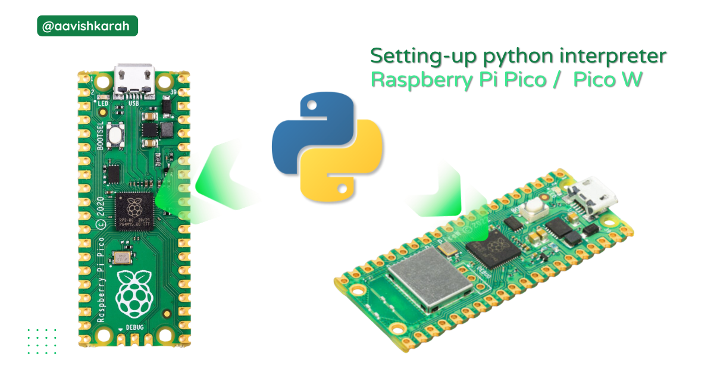

???+ Abstract "Table of Contents"

    [TOC]

## MicroPython firmware Download links

- [Raspberry Pi Pico :material-file-download: ](https://micropython.org/download/rp2-pico/rp2-pico-latest.uf2)
- [Raspberry Pi Pico W :material-file-download:](https://micropython.org/download/rp2-pico-w/rp2-pico-w-latest.uf2)
- [Raspberry Pi Pico 2 :material-file-download:](https://micropython.org/download/RPI_PICO2/RPI_PICO2-latest.uf2)
- [Raspbeery Pi Pico 2 W :material-file-download:](https://downloads.raspberrypi.com/micropython/mp_firmware_unofficial_latest.uf2)

## Drag & Drop

1. Download the respective **UF2** micropython firmware file for the board. (for this article, pico w board is selected)
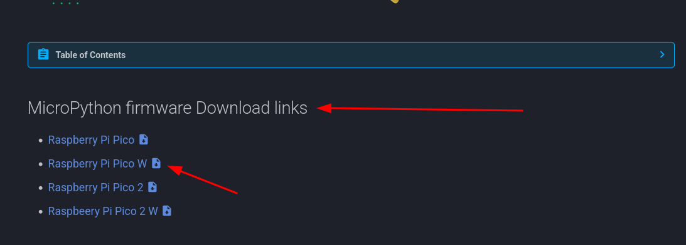
2. Connect Pico board to computer via USB, press and hold the `boot-select` button.
3. Release the boot-select button after pico appears as a storage device.
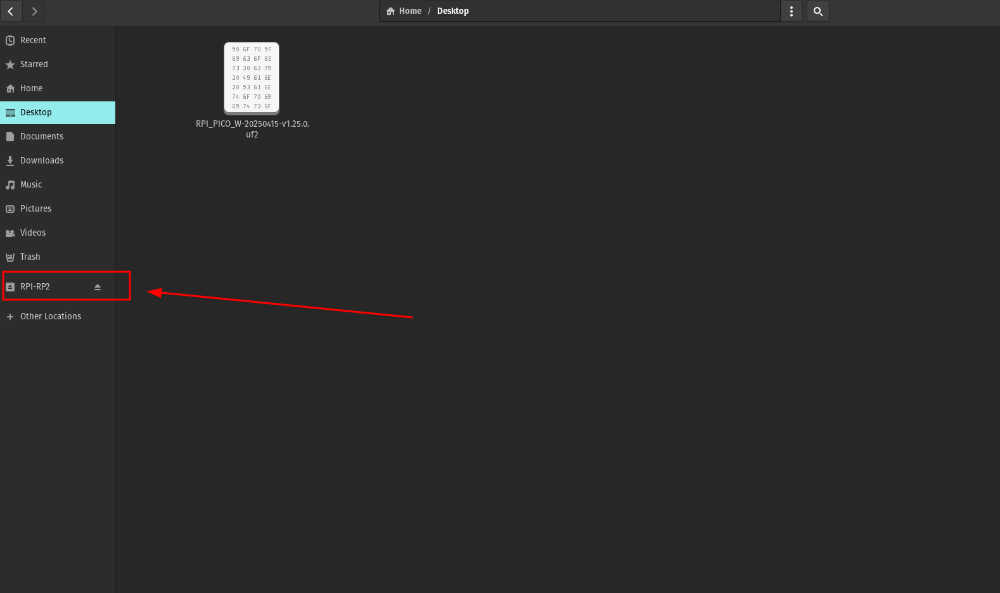
4. Copy and paste (drag & drop) the downloaded **UF2** file on to the device.
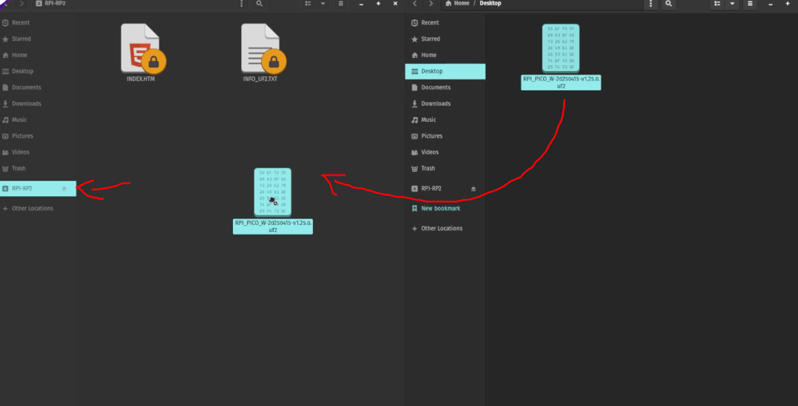
5. Pico board reboots, once the file transfer is completed.
6. Now your board is ready to start coding in micro python.

!!! warning "Troubleshooting"

    - Check the Micro USB cable used supports data transfer.

## Using Thonny Python IDE

1) Open the Thonny application

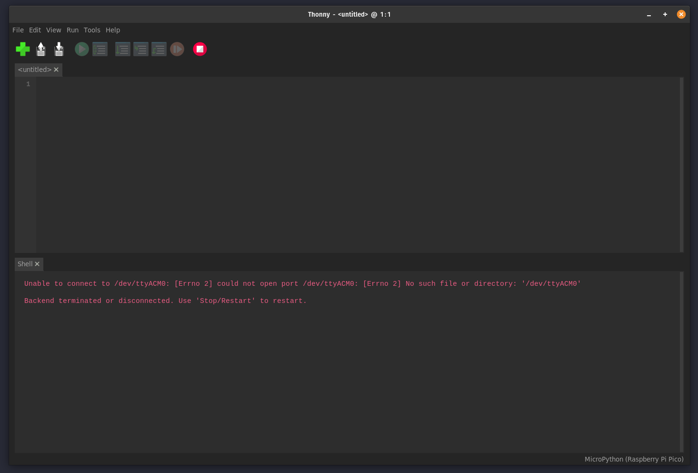
/// caption
Thonny editor
///

2) Connect Pico board to the computer via USB.

3) Choose the Interpreter from `Tools` > `Options` > `Interpreter`

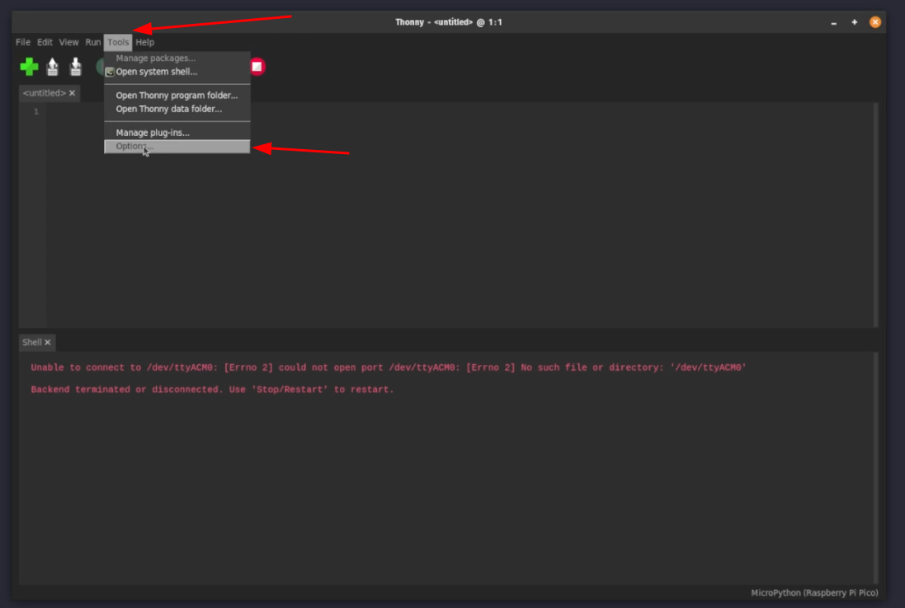

4) Select the firmware you want to install.

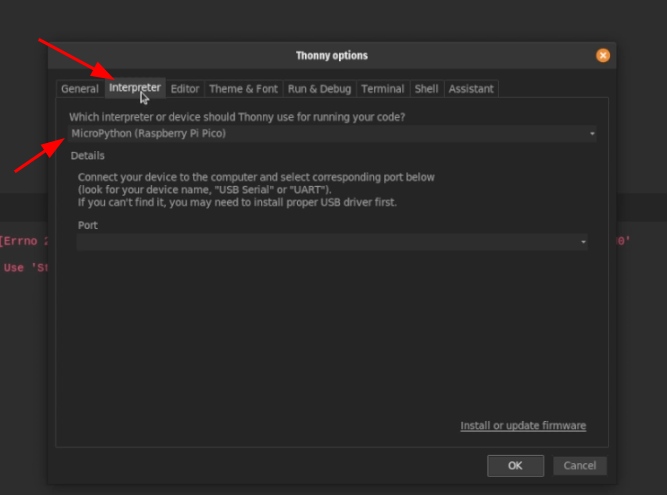

5) Choose `detect port automatically` option or the USB port, pico is connected.

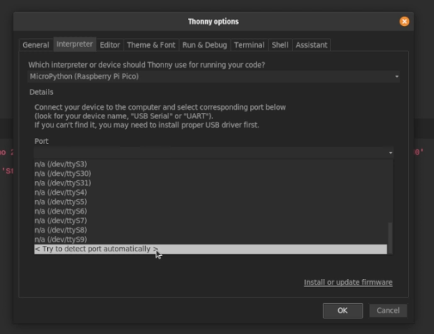

6) Click on `install or update firmware` option.

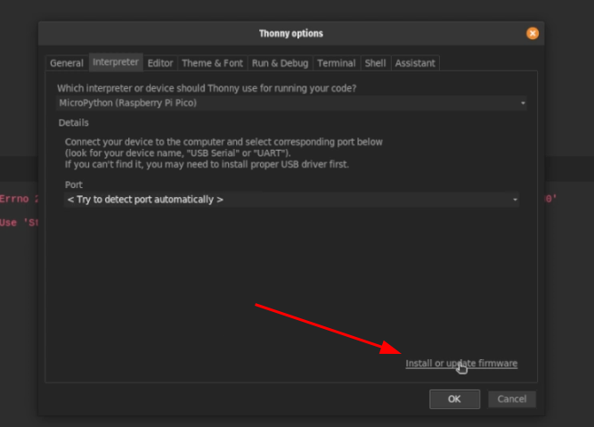

7) Check the target device location option and device model details.

8) Click on `Install` button. 

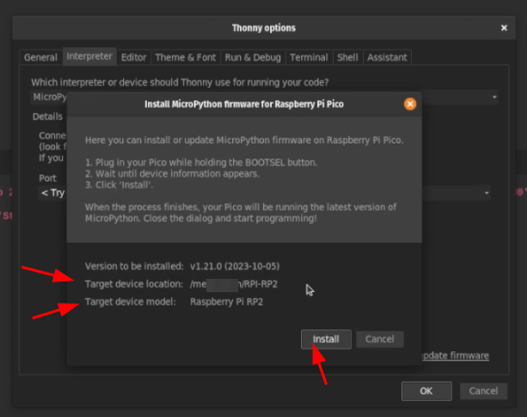

9) Once done installing firmware close the option menu and select the device model from the right bottom corner.

10) After successfully selecting the device, you will be greeted with the MicroPython Interpreter.  

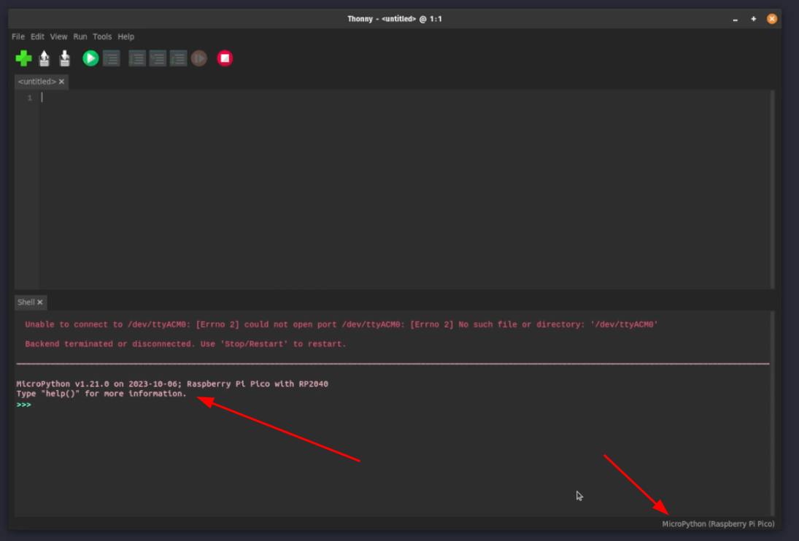