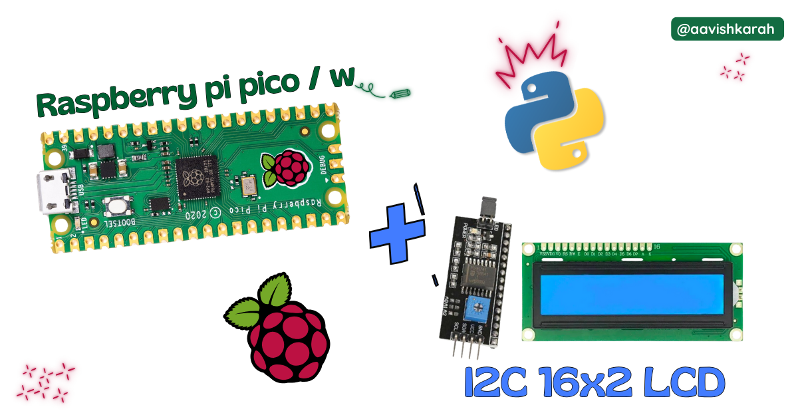
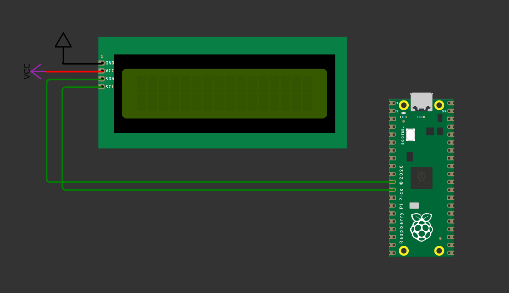

???+ Abstract "Table of Contents"

    [TOC]


## Abstract

 In this article, a comprehensive step-by-step guide to interface 16x2 I2C LCD display with Raspberry Pi Pico board using MicroPython. Raspberry Pi Pico has 4 different variants (Pico, Pico 2, Pico W, Pico 2W) supporting micro-python. This articles lays the foundation for more advanced embedded system and IoT projects.

## :compass: Pre-Request

- OS : Windows / Linux / Mac / Chrome
- Thonny IDE.
- MicroPython firmware in Raspberry Pi Pico / Pico 2 / Pico W / Pico 2W. 
    - For step by step procedure [click here](../installing-micropython/index.md){target="_blank"} . 


## Hardware Required

- Raspberry Pi Pico / Pico 2 / Pico W / Pico 2W. 
- 16x2 I2C LCD.
- BreadBoard.
- Micro USB Cable.
- Connecting wires.
- 5V DC power supply (Optional)

| Components | Purchase Link |
| -- | -- |
| Raspberry Pi Pico | [link](https://amzn.to/3JNpv7v) |
| Raspberry Pi Pico 2 | [link](#) |
| Raspberry Pi Pico W | [link](https://amzn.to/3KeWamg) |
| Raspberry Pi Pico 2W | [link](#) |
| 16x2 I2C LCD | [link](https://amzn.to/47ASZ2e) |
| BreadBoard | [large](https://amzn.to/4pgNX1c) : [small](https://amzn.to/47SMzvB)|
| Connecting Wires | [link](https://amzn.to/4pepr0H) |
| Micro USB Cable | [link](https://amzn.to/4gfMgNa) |
| 5V DC Adaptor | [link](https://amzn.to/4m82t8D) |

!!! tip "Don't own a hardware :cry:"

    No worries,

    Still you can learn using simulation.
    check out simulation part :smiley:.

### Connection Table


!!! info
    16x2 LCD can be connected in _4 wire_ and _8 wire_ mode. [click here](../interfacing-16x2-lcd-display-with-raspberry-pi-pico-and-micropython/){target="_blank"} to know [how to interface 16x2 LCD display in parallel mode using 4 wire or 8 wire system.](../interfacing-16x2-lcd-display-with-raspberry-pi-pico-and-micropython/){target="_blank"}


| 16x2 I2C LCD | GPIO | Remarks | 
| :-- | :--: | :-- | 
| GND  (1) | GND | Ground |
| V<sub>CC</sub>  (2) | +5 V | +5V of Board or External 5V DC Supply | 
| SDA  (3) | 8 | I2C0 series SDA pin | 
| SCL  (4) | 9 | I2C0 series SCL pin | 


!!! Note
    - V<sub>CC</sub> (2) can be connected to external +5 V DC supply or to the VBUS pin number 40 of Raspberry Pi Pico Board.
    - While using External 5 V supply for 16x2 LCD, make sure ground pin of External Supply and Pico board is connected. 



/// caption
fig-Connection Diagram
///

## :open_file_folder: Code

=== "main.py"
    ```python linenums="1"

    from machine import Pin, SoftI2C
    from pico_i2c_lcd import I2cLcd
    from time import sleep

    # LCD I2C address and dimensions
    I2C_ADDR = 0x27
    I2C_NUM_ROWS = 2
    I2C_NUM_COLS = 16

    # Initialize I2C 
    i2c = SoftI2C(sda=Pin(8), scl=Pin(9), freq=400000)

    # Initialize 16x2 LCD 
    lcd = I2cLcd(i2c, I2C_ADDR, I2C_NUM_ROWS, I2C_NUM_COLS)

    sleep(0.25)

    # Clear the LCD
    lcd.clear()

    # By default, it will start at (0,0) if the display is empty
    lcd.putstr("   Welcome to   ")
    sleep(1)

    # Starting at the second line (0, 1)
    lcd.move_to(0, 1)
    lcd.putstr("  Aavishkarah   ")
    sleep(4)

    # turn off baklight
    lcd.backlight_off()
    lcd.display_off()

    ```

=== "lcd_api.py"
    ```python linenums="1"

    # library from https://github.com/TexturedPolak/RPI-PICO-I2C-LCD
    import time

    class LcdApi:
        
        # Implements the API for talking with HD44780 compatible character LCDs.
        # This class only knows what commands to send to the LCD, and not how to get
        # them to the LCD.
        #
        # It is expected that a derived class will implement the hal_xxx functions.
        #
        # The following constant names were lifted from the avrlib lcd.h header file,
        # with bit numbers changed to bit masks.
        
        # HD44780 LCD controller command set
        LCD_CLR             = 0x01  # DB0: clear display
        LCD_HOME            = 0x02  # DB1: return to home position

        LCD_ENTRY_MODE      = 0x04  # DB2: set entry mode
        LCD_ENTRY_INC       = 0x02  # DB1: increment
        LCD_ENTRY_SHIFT     = 0x01  # DB0: shift

        LCD_ON_CTRL         = 0x08  # DB3: turn lcd/cursor on
        LCD_ON_DISPLAY      = 0x04  # DB2: turn display on
        LCD_ON_CURSOR       = 0x02  # DB1: turn cursor on
        LCD_ON_BLINK        = 0x01  # DB0: blinking cursor

        LCD_MOVE            = 0x10  # DB4: move cursor/display
        LCD_MOVE_DISP       = 0x08  # DB3: move display (0-> move cursor)
        LCD_MOVE_RIGHT      = 0x04  # DB2: move right (0-> left)

        LCD_FUNCTION        = 0x20  # DB5: function set
        LCD_FUNCTION_8BIT   = 0x10  # DB4: set 8BIT mode (0->4BIT mode)
        LCD_FUNCTION_2LINES = 0x08  # DB3: two lines (0->one line)
        LCD_FUNCTION_10DOTS = 0x04  # DB2: 5x10 font (0->5x7 font)
        LCD_FUNCTION_RESET  = 0x30  # See "Initializing by Instruction" section

        LCD_CGRAM           = 0x40  # DB6: set CG RAM address
        LCD_DDRAM           = 0x80  # DB7: set DD RAM address

        LCD_RS_CMD          = 0
        LCD_RS_DATA         = 1

        LCD_RW_WRITE        = 0
        LCD_RW_READ         = 1

        def __init__(self, num_lines, num_columns):
            self.num_lines = num_lines
            if self.num_lines > 4:
                self.num_lines = 4
            self.num_columns = num_columns
            if self.num_columns > 40:
                self.num_columns = 40
            self.cursor_x = 0
            self.cursor_y = 0
            self.implied_newline = False
            self.backlight = True
            self.display_off()
            self.backlight_on()
            self.clear()
            self.hal_write_command(self.LCD_ENTRY_MODE | self.LCD_ENTRY_INC)
            self.hide_cursor()
            self.display_on()

        def clear(self):
            # Clears the LCD display and moves the cursor to the top left corner
            self.hal_write_command(self.LCD_CLR)
            self.hal_write_command(self.LCD_HOME)
            self.cursor_x = 0
            self.cursor_y = 0

        def show_cursor(self):
            # Causes the cursor to be made visible
            self.hal_write_command(self.LCD_ON_CTRL | self.LCD_ON_DISPLAY |
                                self.LCD_ON_CURSOR)

        def hide_cursor(self):
            # Causes the cursor to be hidden
            self.hal_write_command(self.LCD_ON_CTRL | self.LCD_ON_DISPLAY)

        def blink_cursor_on(self):
            # Turns on the cursor, and makes it blink
            self.hal_write_command(self.LCD_ON_CTRL | self.LCD_ON_DISPLAY |
                                self.LCD_ON_CURSOR | self.LCD_ON_BLINK)

        def blink_cursor_off(self):
            # Turns on the cursor, and makes it no blink (i.e. be solid)
            self.hal_write_command(self.LCD_ON_CTRL | self.LCD_ON_DISPLAY |
                                self.LCD_ON_CURSOR)

        def display_on(self):
            # Turns on (i.e. unblanks) the LCD
            self.hal_write_command(self.LCD_ON_CTRL | self.LCD_ON_DISPLAY)

        def display_off(self):
            # Turns off (i.e. blanks) the LCD
            self.hal_write_command(self.LCD_ON_CTRL)

        def backlight_on(self):
            # Turns the backlight on.
            
            # This isn't really an LCD command, but some modules have backlight
            # controls, so this allows the hal to pass through the command.
            self.backlight = True
            self.hal_backlight_on()

        def backlight_off(self):
            # Turns the backlight off.

            # This isn't really an LCD command, but some modules have backlight
            # controls, so this allows the hal to pass through the command.
            self.backlight = False
            self.hal_backlight_off()

        def move_to(self, cursor_x, cursor_y):
            # Moves the cursor position to the indicated position. The cursor
            # position is zero based (i.e. cursor_x == 0 indicates first column).
            self.cursor_x = cursor_x
            self.cursor_y = cursor_y
            addr = cursor_x & 0x3f
            if cursor_y & 1:
                addr += 0x40    # Lines 1 & 3 add 0x40
            if cursor_y & 2:    # Lines 2 & 3 add number of columns
                addr += self.num_columns
            self.hal_write_command(self.LCD_DDRAM | addr)

        def putchar(self, char):
            # Writes the indicated character to the LCD at the current cursor
            # position, and advances the cursor by one position.
            if char == '\n':
                if self.implied_newline:
                    # self.implied_newline means we advanced due to a wraparound,
                    # so if we get a newline right after that we ignore it.
                    pass
                else:
                    self.cursor_x = self.num_columns
            else:
                self.hal_write_data(ord(char))
                self.cursor_x += 1
            if self.cursor_x >= self.num_columns:
                self.cursor_x = 0
                self.cursor_y += 1
                self.implied_newline = (char != '\n')
            if self.cursor_y >= self.num_lines:
                self.cursor_y = 0
            self.move_to(self.cursor_x, self.cursor_y)

        def putstr(self, string):
            # Write the indicated string to the LCD at the current cursor
            # position and advances the cursor position appropriately.
            for char in string:
                self.putchar(char)

        def custom_char(self, location, charmap):
            # Write a character to one of the 8 CGRAM locations, available
            # as chr(0) through chr(7).
            location &= 0x7
            self.hal_write_command(self.LCD_CGRAM | (location << 3))
            self.hal_sleep_us(40)
            for i in range(8):
                self.hal_write_data(charmap[i])
                self.hal_sleep_us(40)
            self.move_to(self.cursor_x, self.cursor_y)

        def hal_backlight_on(self):
            # Allows the hal layer to turn the backlight on.
            # If desired, a derived HAL class will implement this function.
            pass

        def hal_backlight_off(self):
            # Allows the hal layer to turn the backlight off.
            # If desired, a derived HAL class will implement this function.
            pass

        def hal_write_command(self, cmd):
            # Write a command to the LCD.
            # It is expected that a derived HAL class will implement this function.
            raise NotImplementedError

        def hal_write_data(self, data):
            # Write data to the LCD.
            # It is expected that a derived HAL class will implement this function.
            raise NotImplementedError

        def hal_sleep_us(self, usecs):
            # Sleep for some time (given in microseconds)
            time.sleep_us(usecs)


    ```

=== "pico_i2c_lcd.py"
    ```python linenums="1"
    # library from https://github.com/TexturedPolak/RPI-PICO-I2C-LCD
    import utime
    import gc

    from lcd_api import LcdApi
    from machine import I2C

    # PCF8574 pin definitions
    MASK_RS = 0x01       # P0
    MASK_RW = 0x02       # P1
    MASK_E  = 0x04       # P2

    SHIFT_BACKLIGHT = 3  # P3
    SHIFT_DATA      = 4  # P4-P7

    class I2cLcd(LcdApi):
        
        #Implements a HD44780 character LCD connected via PCF8574 on I2C

        def __init__(self, i2c, i2c_addr, num_lines, num_columns):
            self.i2c = i2c
            self.i2c_addr = i2c_addr
            self.i2c.writeto(self.i2c_addr, bytes([0]))
            utime.sleep_ms(20)   # Allow LCD time to powerup
            # Send reset 3 times
            self.hal_write_init_nibble(self.LCD_FUNCTION_RESET)
            utime.sleep_ms(5)    # Need to delay at least 4.1 msec
            self.hal_write_init_nibble(self.LCD_FUNCTION_RESET)
            utime.sleep_ms(1)
            self.hal_write_init_nibble(self.LCD_FUNCTION_RESET)
            utime.sleep_ms(1)
            # Put LCD into 4-bit mode
            self.hal_write_init_nibble(self.LCD_FUNCTION)
            utime.sleep_ms(1)
            LcdApi.__init__(self, num_lines, num_columns)
            cmd = self.LCD_FUNCTION
            if num_lines > 1:
                cmd |= self.LCD_FUNCTION_2LINES
            self.hal_write_command(cmd)
            gc.collect()

        def hal_write_init_nibble(self, nibble):
            # Writes an initialization nibble to the LCD.
            # This particular function is only used during initialization.
            byte = ((nibble >> 4) & 0x0f) << SHIFT_DATA
            self.i2c.writeto(self.i2c_addr, bytes([byte | MASK_E]))
            self.i2c.writeto(self.i2c_addr, bytes([byte]))
            gc.collect()
            
        def hal_backlight_on(self):
            # Allows the hal layer to turn the backlight on
            self.i2c.writeto(self.i2c_addr, bytes([1 << SHIFT_BACKLIGHT]))
            gc.collect()
            
        def hal_backlight_off(self):
            #Allows the hal layer to turn the backlight off
            self.i2c.writeto(self.i2c_addr, bytes([0]))
            gc.collect()
            
        def hal_write_command(self, cmd):
            # Write a command to the LCD. Data is latched on the falling edge of E.
            byte = ((self.backlight << SHIFT_BACKLIGHT) |
                    (((cmd >> 4) & 0x0f) << SHIFT_DATA))
            self.i2c.writeto(self.i2c_addr, bytes([byte | MASK_E]))
            self.i2c.writeto(self.i2c_addr, bytes([byte]))
            byte = ((self.backlight << SHIFT_BACKLIGHT) |
                    ((cmd & 0x0f) << SHIFT_DATA))
            self.i2c.writeto(self.i2c_addr, bytes([byte | MASK_E]))
            self.i2c.writeto(self.i2c_addr, bytes([byte]))
            if cmd <= 3:
                # The home and clear commands require a worst case delay of 4.1 msec
                utime.sleep_ms(5)
            gc.collect()

        def hal_write_data(self, data):
            # Write data to the LCD. Data is latched on the falling edge of E.
            byte = (MASK_RS |
                    (self.backlight << SHIFT_BACKLIGHT) |
                    (((data >> 4) & 0x0f) << SHIFT_DATA))
            self.i2c.writeto(self.i2c_addr, bytes([byte | MASK_E]))
            self.i2c.writeto(self.i2c_addr, bytes([byte]))
            byte = (MASK_RS |
                    (self.backlight << SHIFT_BACKLIGHT) |
                    ((data & 0x0f) << SHIFT_DATA))      
            self.i2c.writeto(self.i2c_addr, bytes([byte | MASK_E]))
            self.i2c.writeto(self.i2c_addr, bytes([byte]))
            gc.collect()


    ```

### Code Explanation

:point_right: Imports

```py linenums="1"

from machine import Pin, SoftI2C
from pico_i2c_lcd import I2cLcd
from time import sleep

```

- `time` module for creating delay.
- `pico_i2c_lcd` module for interacting with 16x2 I2C lcd display hardware.


:point_right: I2C address defnition.

```py linenums="5"

# LCD I2C address and dimensions
I2C_ADDR = 0x27
I2C_NUM_ROWS = 2
I2C_NUM_COLS = 16

```

- `0x27` is the address of I2C LCD module.
- Setting number of rows and columns of LCD display.


:point_right: Instance of LCD display object.

```py linenums="10"

# Initialize I2C 
i2c = SoftI2C(sda=Pin(8), scl=Pin(9), freq=400000)

# Initialize 16x2 LCD 
lcd = I2cLcd(i2c, I2C_ADDR, I2C_NUM_ROWS, I2C_NUM_COLS)

```

- Creating the instance of i2c communication object.
    - SDA pin to GPIO 8
    - SCL pin to GPIO 9
    - Depending upon your connection, change the GPIO pin numbers.
- Initialize the lcd Module `I2cLcd(i2c, I2C_ADDR, I2C_NUM_ROWS, I2C_NUM_COLS)`
    - no of rows (2) and columns (16) for 16x2 LCD display
    - if you are chosing 20x4 LCD module, change rows to 4 and column to 20


:point_right: Displaying the content

```py linenums="18"

# Clear the LCD
lcd.clear()

# By default, it will start at (0,0) if the display is empty
lcd.putstr("   Welcome to   ")
sleep(1)

# Starting at the second line (0, 1)
lcd.move_to(0, 1)
lcd.putstr("  Aavishkarah   ")
sleep(4)

# turn off baklight
lcd.backlight_off()
lcd.display_off()
```

- `lcd.clear()` clear the screen and set the cursor position to (Row 1 and Column 1)
- `lcd.putstr()` used to send data to lcd module for display. 
- `lcd.move_to(<column>, <row>)`
  - `lcd.move_to(0, 1)` place the cursor to second line(row) and first character(column) position.
- `lcd.backlight_off()` turns the backlight led off.
- `lcd.display_off()` turns the display off.


!!! tip "Try It"
    - Alter the output content on the display by passing your data argument to the `putstr` method.


---

## :material-chart-bubble:{style="color:#ffaa00"} Simulation

!!! danger "Not able to view the simulation"
    - :fontawesome-solid-laptop: Desktop or Laptop : Reload this page ( ++ctrl+r++ )
    - :fontawesome-solid-mobile: Mobile : Use Landscape Mode and reload the page


<iframe style="height:calc(100vh - 200px); border-color:#00aaff;border-radius:1rem;min-height:400px" src="https://wokwi.com/projects/438368705244686337" frameborder="2px" width="100%" height="700px"></iframe>


---

## :material-web-plus: Extras

### Components details

- Raspberry Pi Pico / Pico 2 : [Pin Diagram](../pico2-pico2-w-key-features-pin-config/index.md){target="_blank"}
- Raspberry Pi Pico : [Data Sheet](https://datasheets.raspberrypi.com/pico/pico-datasheet.pdf){target="_blank"}
- Raspberry Pi Pico 2 : [Data Sheet](https://datasheets.raspberrypi.com/pico/pico-2-datasheet.pdf){target="_blank"}
- Raspberry Pi Pico W : [Data Sheet](https://datasheets.raspberrypi.com/picow/pico-w-datasheet.pdf){target="_blank"}
- Raspberry Pi Pico 2 W : [Data Sheet](https://datasheets.raspberrypi.com/picow/pico-2-w-datasheet.pdf){target="_blank"}


### Modules / Libraries Used

- *time*
    - `time` module provides functions related to date & time, measuring time intervals and generating delays.
    - [More Details](https://docs.micropython.org/en/latest/library/time.html){target="_blank"} 
- *lcd_api*
    - To interact with 16x2 LCD display.
    - It is a third part library or user defined library. 
    - [More Details](https://github.com/TexturedPolak/RPI-PICO-I2C-LCD)
- *pico_i2c_lcd*
    - To interact with 16x2 I2C module.
    - It is a third part library or user defined library.
    - [More Details](https://github.com/TexturedPolak/RPI-PICO-I2C-LCD)