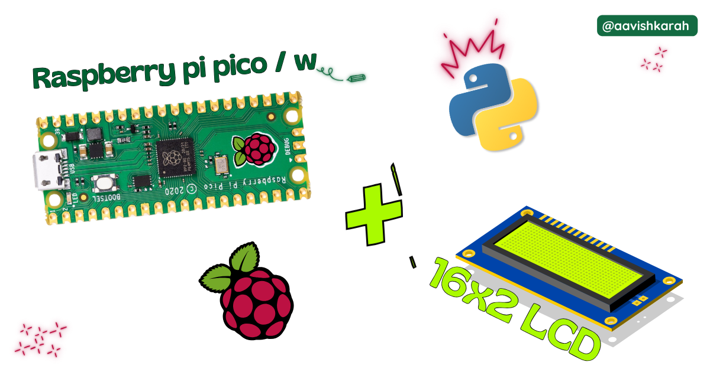
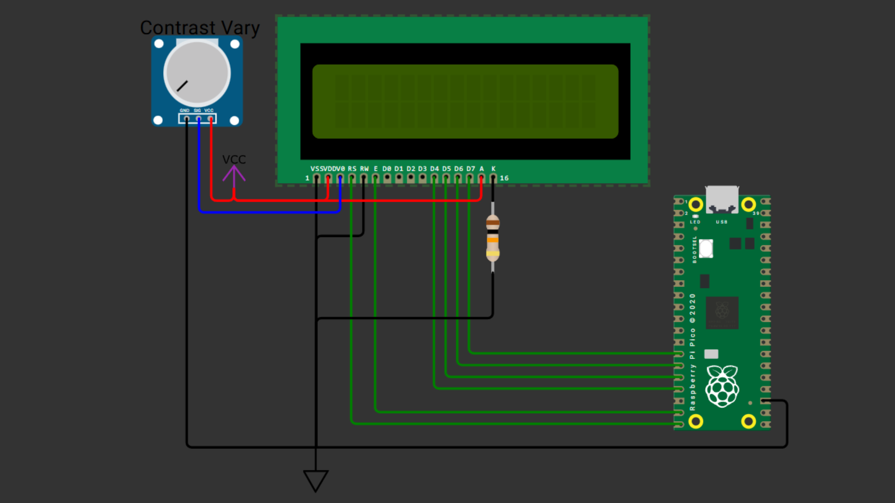

???+ Abstract "Table of Contents"

    [TOC]


## Abstract

 In this article, a comprehensive step-by-step guide to interface 16x2 LCD display with Raspberry Pi Pico board using MicroPython. Raspberry Pi Pico has 4 different variants (Pico, Pico 2, Pico W, Pico 2W) supporting micro-python. This articles lays the foundation for more advanced embedded system and IoT projects.

## :compass: Pre-Request

- OS : Windows / Linux / Mac / Chrome
- Thonny IDE.
- MicroPython firmware in Raspberry Pi Pico / Pico 2 / Pico W / Pico 2W. 
    - For step by step procedure [click here](../installing-micropython/index.md){target="_blank"} . 


## Hardware Required

- Raspberry Pi Pico / Pico 2 / Pico W / Pico 2W. 
- 16x2 LCD.
- Potentiometer (POT)
- Resistor.
- BreadBoard.
- Micro USB Cable.
- Connecting wires.
- 5V DC power supply (Optional)

| Components | Purchase Link |
| -- | -- |
| Raspberry Pi Pico | [link](https://amzn.to/3JNpv7v) |
| Raspberry Pi Pico 2 | [link](#) |
| Raspberry Pi Pico W | [link](https://amzn.to/3KeWamg) |
| Raspberry Pi Pico 2W | [link](#) |
| 16x2 LCD | [link](https://amzn.to/4m6ZgpI) |
| Potentiometer (POT) | [link](https://amzn.to/4mb6VDH) |
| BreadBoard | [large](https://amzn.to/4pgNX1c) : [small](https://amzn.to/47SMzvB)|
| Connecting Wires | [link](https://amzn.to/4pepr0H) |
| Micro USB Cable | [link](https://amzn.to/4gfMgNa) |
| 5V DC Adaptor | [link](https://amzn.to/4m82t8D) |

!!! tip "Don't own a hardware :cry:"

    No worries,

    Still you can learn using simulation.
    check out simulation part :smiley:.

### Connection Table

16x2 LCD can be connected in _4 wire_ and _8 wire_ mode. In this article 4 wire mode is demonstrated, as 8 wire mode is rarely used now a days. 

!!! info
    With I2C LCD interface, we can interface 16x2 LCD display in 2 wire mode. [click here](#){target="_blank"} to know [how to interface 16x2 LCD display in serial mode using 2 wire system.](#){target="_blank"}


| 16x2 LCD | GPIO | Remarks | 
| :-- | :--: | :-- | 
| V<sub>SS</sub>  (1) | GND | Ground |
| V<sub>CC</sub>  (2) | +5 V | +5V of Board or External 5V DC Supply | 
| V<sub>EE</sub> (3) | -- | POT variable terminal as shown in circuit | 
| RS (4)  | 15 | Register Select Pin  |
| RW (5) | GND | Read / Write Pin |
| E (6)  | 14 | Enable Pin  |
| D0 to D3  | -- | No connection (∵ 4 wire mode)  |
| D4 (11) | 13 | Data line 4  |
| D5 (12) | 12 | Data line 5  |
| D6 (13) | 11 | Data line 6  |
| D7 (14) | 10 | Data line 7  |
| A (15) | -- | +5V of Board or External 5V DC Supply   |
| K (16) | -- | Ground through Resistor  |

!!! Note
    - To control the backlight led programmatically. LCD Pin A(15) can be connected to GPIO.
    - V<sub>CC</sub> (2) can be connected to external +5 V DC supply or to the VBUS pin number 40 of Raspberry Pi Pico Board.
    - While using External 5 V supply for 16x2 LCD, make sure ground pin of External Supply and Pico board is connected. 



/// caption
fig-Connection Diagram
///

## :open_file_folder: Code

=== "main.py"
    ```python linenums="1"

    import utime
    from lcd_api import LCD_16x2_parallel


    # LCD_16x2_parallel(rs, e, d4, d5, d6, d7)
    lcd = LCD_16x2_parallel(15, 14, 13, 12, 11, 10)

    # Set cursor to Row 1, Column 1
    lcd.returnHome()
    lcd.display("  Aavishkarah   ")
    utime.sleep_ms(2000)

    # Move to LCD (2, 0) position 
    # Row 2 and Column 1 
    lcd.setCursor(2,0)
    lcd.display("---Simulation---" , 100)
    utime.sleep_ms(2000)


    # Clear the Screen
    lcd.clearScreen()
    lcd.display("Check Link for", 150)
    lcd.setCursor(2,0)
    lcd.display("more details" , 150)
    utime.sleep_ms(2000)

    ```

=== "lcd_api.py"
    ```python linenums="1"

    from machine import Pin
    import utime

    class LCD_16x2_parallel:
        
        def __init__(self, rs, e, d4, d5, d6, d7):
            self.rs = Pin(rs, Pin.OUT)
            self.e = Pin(e, Pin.OUT)
            self.d4 = Pin(d4, Pin.OUT)
            self.d5 = Pin(d5, Pin.OUT)
            self.d6 = Pin(d6, Pin.OUT)
            self.d7 = Pin(d7, Pin.OUT)
            self.setupLCD()

        def setupLCD(self):
            self.rs.value(0)
            self.send2LCD4(0b0011)
            self.send2LCD4(0b0011)
            self.send2LCD4(0b0011)
            self.send2LCD4(0b0010)
            self.send2LCD8(0b00101000)
            self.send2LCD8(0b00001100)#lcd on, blink off, cursor off.
            self.send2LCD8(0b00000110)#increment cursor, no display shift
            self.send2LCD8(0b00000001)#clear screen
            self.longDelay(2)#clear screen needs a long delay
            self.rs.value(1)

        def send2LCD4(self,BinNum):
            self.d4.value((BinNum & 0b00000001) >>0)
            self.d5.value((BinNum & 0b00000010) >>1)
            self.d6.value((BinNum & 0b00000100) >>2)
            self.d7.value((BinNum & 0b00001000) >>3)
            self.pulseE()

        def pulseE(self):
            self.e.value(1)
            utime.sleep_us(40)
            self.e.value(0)
            utime.sleep_us(40)
        
        def longDelay(self, t):
            utime.sleep_ms(t)

        def shortDelay(self,t):
            utime.sleep_us(t)
        
        def send2LCD4(self,BinNum):
            self.d4.value((BinNum & 0b00000001) >>0)
            self.d5.value((BinNum & 0b00000010) >>1)
            self.d6.value((BinNum & 0b00000100) >>2)
            self.d7.value((BinNum & 0b00001000) >>3)
            self.pulseE()
        
        def send2LCD8(self,BinNum):
            self.d5.value((BinNum & 0b00100000) >>5)
            self.d4.value((BinNum & 0b00010000) >>4)
            self.d6.value((BinNum & 0b01000000) >>6)
            self.d7.value((BinNum & 0b10000000) >>7)
            self.pulseE()
            self.d4.value((BinNum & 0b00000001) >> 0)
            self.d5.value((BinNum & 0b00000010) >> 1)
            self.d6.value((BinNum & 0b00000100) >> 2)
            self.d7.value((BinNum & 0b00001000) >> 3)
            self.pulseE()
        
        def setCursor(self, line, pos):
            b = 0
            if line==1:
                b=0
            elif line==2:
                b=40
            self.returnHome()
            for i in range(0, b+pos):
                self.moveCursorRight()
            
        def returnHome(self):
            self.rs.value(0)
            self.send2LCD8(0b00000010)
            self.rs.value(1)
            self.longDelay(2)

        def moveCursorRight(self):
            self.rs.value(0)
            self.send2LCD8(0b00010100)
            self.rs.value(1)

        def display(self, data, ms=0):
            for x in str(data):
                self.send2LCD8(ord(x))
                utime.sleep_ms(ms)

        def clearScreen(self):
            self.returnHome()
            self.display(" "*16)
            self.setCursor(2,0)
            self.display(" "*16)
            self.returnHome()


    ```

### Code Explanation

:point_right: Imports

```py linenums="1"

import utime
from lcd_api import LCD_16x2_parallel

```

- `time` module for creating delay.
- `lcd_api` module for interacting with 16x2 lcd display hardware.


:point_right: Instance of LCD display object.

```py linenums="5"

# LCD_16x2_parallel(rs, e, d4, d5, d6, d7)
lcd = LCD_16x2_parallel(15, 14, 13, 12, 11, 10)

```

- Creating the instance of LCD_16x2_parallel object.
- Depending upon your connection, change the GPIO pin numbers.
    - (rs, e, d4, d5, d6, d7)
    - As per the above connection table `LCD_16x2_parallel(15, 14, 13, 12, 11, 10)`


:point_right: Displaying the content

```py linenums="8"

# Set cursor to Row 1, Column 1
lcd.returnHome()
lcd.display("  Aavishkarah   ")
utime.sleep_ms(2000)

```

- `lcd.returnHome()` method sets the display cursor to Row 1 and Column 1
- The content to be displayed is passed to `lcd.display()` method.
    - :warning: Make sure, the content is less than or equal to 16 Characters.
- A delay of 2 seconds is given, so that the user can view the content before new content is displayed.


:point_right: Shifting the cursors and typewriting effect.

```py linenums="13"

# Move to LCD (2, 0) position 
# Row 2 and Column 1 
lcd.setCursor(2,0)
lcd.display("---Simulation---" , 100)
utime.sleep_ms(2000)


# Clear the Screen
lcd.clearScreen()
```

- Each row can display 16 characters.
- To continue the display content, we need to set the cursor to Row 2, Column 1
- Setting of cursor to Row 2 and Column 1 is achieved by `lcd.setCursor(2,0)` method.
- As discussed in the previous code section, display method takes the data to be displayed on the LCD screen.
- To have a **Typewriting** effect, 2nd argument of delay in milli seconds can be passed.
    - In line 16, a delay of 100 ms is passed.
    - This adds a delay of 100 ms delay between the display of the letters.
- Clearing1 the screen to display the new data is achieved by `lcd.clearScreen()` method. 
    - Using `clearScreen` method also brings the cursor to the starting position (Row 1 and Column 1)


!!! tip "Try It"
    - Alter the output content on the display by passing your data argument to the `display` method.
    - Observe the typing effect in the content display by altering the **delay** value of `display(<data>, <delay>)` method.

---

## :material-chart-bubble:{style="color:#ffaa00"} Simulation

!!! danger "Not able to view the simulation"
    - :fontawesome-solid-laptop: Desktop or Laptop : Reload this page ( ++ctrl+r++ )
    - :fontawesome-solid-mobile: Mobile : Use Landscape Mode and reload the page


<iframe style="height:calc(100vh - 200px); border-color:#00aaff;border-radius:1rem;min-height:400px" src="https://wokwi.com/projects/438365155467439105" frameborder="2px" width="100%" height="700px"></iframe>


---

## :material-web-plus: Extras

### Components details

- Raspberry Pi Pico / Pico 2 : [Pin Diagram](../pico2-pico2-w-key-features-pin-config/index.md){target="_blank"}
- Raspberry Pi Pico : [Data Sheet](https://datasheets.raspberrypi.com/pico/pico-datasheet.pdf){target="_blank"}
- Raspberry Pi Pico 2 : [Data Sheet](https://datasheets.raspberrypi.com/pico/pico-2-datasheet.pdf){target="_blank"}
- Raspberry Pi Pico W : [Data Sheet](https://datasheets.raspberrypi.com/picow/pico-w-datasheet.pdf){target="_blank"}
- Raspberry Pi Pico 2 W : [Data Sheet](https://datasheets.raspberrypi.com/picow/pico-2-w-datasheet.pdf){target="_blank"}


### Modules / Libraries Used

- *time*
    - `time` module provides functions related to date & time, measuring time intervals and generating delays.
    - [More Details](https://docs.micropython.org/en/latest/library/time.html){target="_blank"} 
- *lcd_api*
    - To interact with 16x2 LCD display.
    - It is a third part library or user defined library. 
