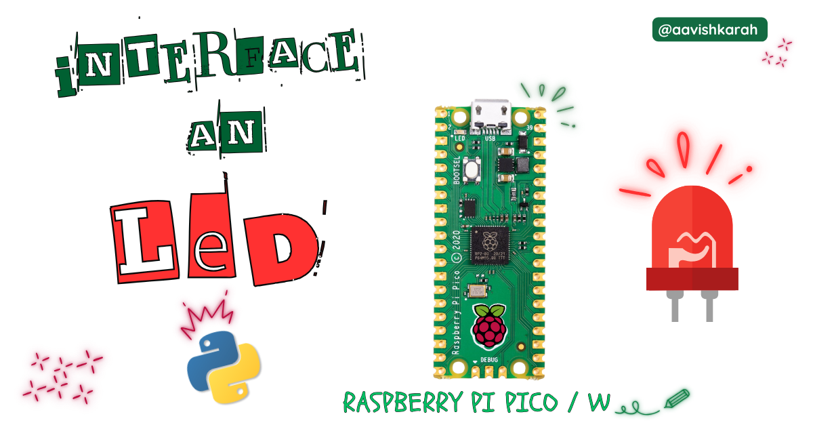
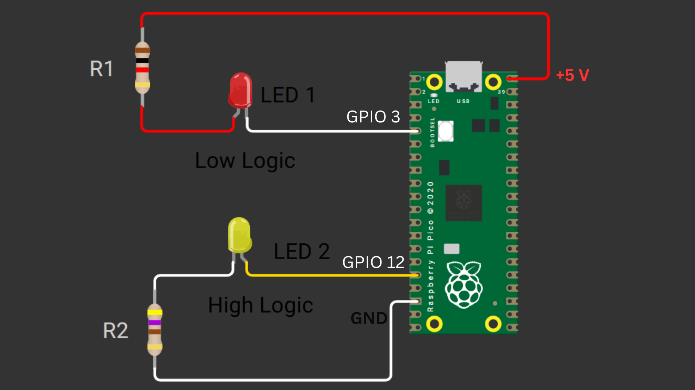

???+ Abstract "Table of Contents"

    [TOC]


## Abstract

 In this article, a comprehensive step-by-step guide to interface an external LED with Raspberry Pi Pico board using MicroPython. Raspberry Pi Pico has 4 different variants (Pico, Pico 2, Pico W, Pico 2W) supporting micro-python. This articles lays the foundation for more advanced embedded system and IoT projects.


## :compass: Pre-Request

- OS : Windows / Linux / Mac / Chrome
- Thonny IDE.
- MicroPython firmware in Raspberry Pi Pico / Pico 2 / Pico W / Pico 2W. 
    - For step by step procedure Click [here](../installing-micropython/index.md){target="_blank"} . 


## Hardware Required

- Raspberry Pi Pico / Pico 2 / Pico W / Pico 2W. 
- LED.
- Resistors.
- BreadBoard.
- Micro USB Cable.
- Connecting wires.
- 5V DC power supply (Optional)

| Components | Purchase Link |
| -- | -- |
| Raspberry Pi Pico | [link](#) |
| Raspberry Pi Pico 2 | [link](#) |
| Raspberry Pi Pico W | [link](#) |
| Raspberry Pi Pico 2W | [link](#) |
| LED | [link](#) |
| BreadBoard | [link](#) |
| Connecting Wires | [link](#) |
| Micro USB Cable | [link](#) |
| 5V DC Adaptor | [link](#) |

!!! tip "Don't own a hardware :cry:"

    No worries,

    Still you can learn using simulation.
    check out simulation part :smiley:.

### Connection Table


| Particular | GPIO | Remarks | 
| :-- | :--: | :-- | 
| LED 1  | 3 | LED-1 Cathode to GPIO 3 (Pin 5) : Low Logic |
| LED 2  | 12 | LED-2 Anode to GPIO 12 (Pin 16) : High Logic |

!!! info
    - LED-1 : Low Logic LED  : ON for GPIO set to 0 : OFF for GPIO set to 1
    - LED-2 : HIGH Logic LED : ON for GPIO set to 1 : OFF for GPIO set to 0
    - Best practice is to connect LED in low logic. 


/// caption
fig-Connection Diagram
///

## :open_file_folder: Code


```python linenums="1"

from machine import Pin
import time


# LED 1 connected to GPIO 3
led_1 = Pin(3, Pin.OUT)

# LED 2 connected to GPIO 12
led_2 = Pin(12, Pin.OUT)

while True:
  # Turning ON LED
  led_1.value(0) 
  led_2.value(1) 

  time.sleep_ms(1000)

  # Turning OFF LED
  led_1.value(1) 
  led_2.value(0) 

  time.sleep_ms(500)


```

### Code Explanation

:point_right: Imports

```py linenums="1"

from machine import Pin
import time

```

- Importing `Pin` class from machine module to control the GPIO pins.
- `time` module for creating delay between `on` and `off` state.

:point_right: Accessing LED's.

```py linenums="5"

# LED 1 connected to GPIO 3
led_1 = Pin(3, Pin.OUT)

# LED 2 connected to GPIO 12
led_2 = Pin(12, Pin.OUT)

```

- GPIO pin 3 is configured as `OUTPUT` pin (Line number 6) and assigned to a variable `led_1`
- GPIO pin 12 is configured as `OUTPUT` pin (Line number 9) and assigned to a variable `led_2`

:point_right: Controlling LED

```py linenums="11"
while True:
  # Turning ON LED
  led_1.value(0) 
  led_2.value(1) 

  time.sleep_ms(1000)

  # Turning OFF LED
  led_1.value(1) 
  led_2.value(0) 

  time.sleep_ms(500)

```

- Continuous loop for blinking led is achieved using `while True:`
- `led_1.value(0)` sets the value of GPIO 3 to `LOW` or `0`, it turns ON the LED-1. (line number 13)
- `led_2.value(1)` sets the value of GPIO 12 to `HIGH` or `1`, it turns ON the LED-2. (line number 14)
- Delay is achieved through `time.sleep_ms()` method. (line number 16 & 22) 
- `led_1.value(1)` sets the value of GPIO 3 to `HIGH` or `1`, it turns OFF the LED-1. (line number 19)
- `led_2.value(1)` sets the value of GPIO 12 to `LOW` or `0`, it turns OFF the LED-2. (line number 20)


!!! tip "Try It"
    - Change the value in the `sleep_ms` method and observe the change in the on and off time.
        - `time.sleep_ms(2000)`, `time.sleep_ms(750)` , etc
    - Use `led_1.on()` and `led_1.off()` method instead of `led_1.value` function, and observe the changes.

---

## :material-chart-bubble:{style="color:#ffaa00"} Simulation

!!! danger "Not able to view the simulation"
    - :fontawesome-solid-laptop: Desktop or Laptop : Reload this page ( ++ctrl+r++ )
    - :fontawesome-solid-mobile: Mobile : Use Landscape Mode and reload the page


<iframe style="height:calc(100vh - 200px); border-color:#00aaff;border-radius:1rem;min-height:400px" src="https://wokwi.com/projects/438363172466307073" frameborder="2px" width="100%" height="700px"></iframe>


---

## :material-web-plus: Extras

### Components details

- Raspberry Pi Pico / Pico 2 : [Pin Diagram](../pico2-pico2-w-key-features-pin-config/index.md){target="_blank"}
- Raspberry Pi Pico : [Data Sheet](https://datasheets.raspberrypi.com/pico/pico-datasheet.pdf){target="_blank"}
- Raspberry Pi Pico 2 : [Data Sheet](https://datasheets.raspberrypi.com/pico/pico-2-datasheet.pdf){target="_blank"}
- Raspberry Pi Pico W : [Data Sheet](https://datasheets.raspberrypi.com/picow/pico-w-datasheet.pdf){target="_blank"}
- Raspberry Pi Pico 2 W : [Data Sheet](https://datasheets.raspberrypi.com/picow/pico-2-w-datasheet.pdf){target="_blank"}


### Modules / Libraries Used

- *machine*
    - `machine` module contains specific attributes and methods related to hardware on a particular board. Here class `Pin` is imported to control the Input Output pins. 
    - [More Details](https://docs.micropython.org/en/latest/library/machine.html){target="_blank"} 

- *time*
    - `time` module provides functions related to date & time, measuring time intervals and generating delays.
    - [More Details](https://docs.micropython.org/en/latest/library/time.html){target="_blank"} 