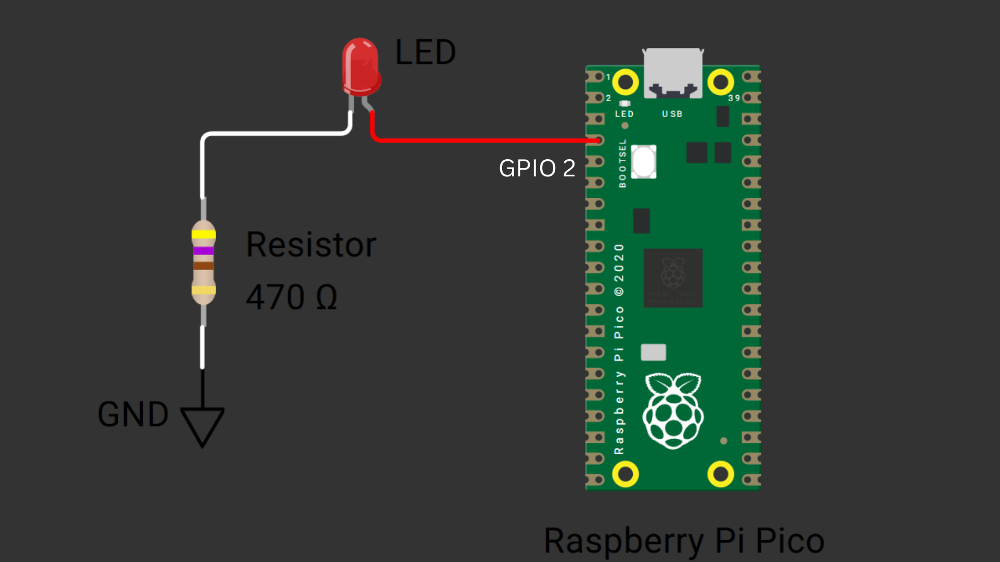

???+ Abstract "Table of Contents"

    [TOC]


## Abstract

 In this article, a comprehensive step-by-step guide to control the brightness of an LED using PWM (Pulse Width Modulation) with Raspberry Pi Pico board using MicroPython. Raspberry Pi Pico has 4 different variants (Pico, Pico 2, Pico W, Pico 2W) supporting micro-python. This articles lays the foundation for more advanced embedded system and IoT projects.

## :compass: Pre-Request

- OS : Windows / Linux / Mac / Chrome
- Thonny IDE.
- MicroPython firmware in Raspberry Pi Pico / Pico 2 / Pico W / Pico 2W. 
    - For step by step procedure [click here](../installing-micropython/index.md){target="_blank"} . 
- Interfacing external LED to Raspberry Pi Pico. [Learn More](../interfacing-led-to-raspberry-pi-pico-and-controlling-it-using-micropython/index.md){target="_blank"}

## Hardware Required

- Raspberry Pi Pico / Pico 2 / Pico W / Pico 2W. 
- LED.
- Resistors.
- BreadBoard.
- Micro USB Cable.
- Connecting wires.
- 5V DC power supply (Optional)

| Components | Purchase Link |
| -- | -- |
| Raspberry Pi Pico | [link](https://amzn.to/3JNpv7v) |
| Raspberry Pi Pico 2 | [link](#) |
| Raspberry Pi Pico W | [link](https://amzn.to/3KeWamg) |
| Raspberry Pi Pico 2W | [link](#) |
| LED | [link](https://amzn.to/3IaSVf2) |
| BreadBoard | [large](https://amzn.to/4pgNX1c) : [small](https://amzn.to/47SMzvB)|
| Connecting Wires | [link](https://amzn.to/4pepr0H) |
| Micro USB Cable | [link](https://amzn.to/4gfMgNa) |
| 5V DC Adaptor | [link](https://amzn.to/4m82t8D) |

!!! tip "Don't own a hardware :cry:"

    No worries,

    Still you can learn using simulation.
    check out simulation part :smiley:.

### Connection Table


| Particular | GPIO | Remarks | 
| :-- | :--: | :-- | 
| LED  | 2 | LED Anode to GPIO 2 (Pin 4) : High Logic |



/// caption
fig-Connection Diagram
///

## :open_file_folder: Code


```python linenums="1"

from machine import Pin, PWM
from time import sleep_ms

# Led is connected to GPIO 2
# setting PWM frequency to 1k Hz and duty cycle to 0
led = PWM(2, freq=1000, duty_u16=0)


while True:

    # Increasing the duty cyle value from 0% to 100%
    for i in range(65536):
        led.duty_u16(i)

    sleep_ms(1000)

    # Decreasing the duty cyle value from 0% to 100%
    for i in range(65535, -1, -1):
        led.duty_u16(i)
    
    sleep_ms(1000)

```

### Code Explanation

:point_right: Imports

```py linenums="1"

from machine import Pin, PWM
from time import sleep_ms

```

- Importing `PWM` class from machine module to generate PWM signal in specified GPIO.
- `time` module for creating delay.

:point_right: PWM pin configuration.

```py linenums="6"

led = PWM(2, freq=1000, duty_u16=0)

```

- `PWM( <Pin_Number> , freq=<value>, duty_u16=<value>)`
- GPIO pin 2 is configured as PWM
- Frequency of PWM set to 1000 Hz (1K Hz)
- Setting the duty cycle to 0 (Turning OFF LED)
- duty_u16 value range from **0 to 65535**. (16 bit PWM)

:point_right: Infinite Loop

```py linenums="9"
while True:

```

- Continuous loop for varying led brightness achieved using `while True:`

:point_right: Increasing the LED brightness

```py linenums="11"
    # Increasing the duty cyle value from 0% to 100%
    for i in range(65536):
        led.duty_u16(i)

```

- duty cycle value of PWM signal can be set using `pwm_pin.duty_u16(<value>)` method.
- `range(65536)` is set : duty_u16 value range from **0 to 65535** for 0% to 100%. (16 bit PWM)
- In the above code, pwm duty cycle value is increased from 0 to 65535.
- This increased the brightness of LED gradually from OFF state to ON state.

:point_right: Decreasing the LED brightness

```py linenums="17"
    # Decreasing the duty cyle value from 100% to 0%
    for i in range(65535, -1, -1):
        led.duty_u16(i)

```

- `range(65535, -1, -1)` is set to generate sequence of number from 65535 to 0, to reduce the brightness of led from 100% to 0% or ON state to OFF state gradually.


!!! tip "Try It"
    - Change the value of frequency to 10 Hz, 100 Hz, etc and observe the output.
    - Interface POT with microcontroller and try controlling the brightness of LED, depending on the position of Potentiometer.

---

## :material-chart-bubble:{style="color:#ffaa00"} Simulation

!!! danger "Not able to view the simulation"
    - :fontawesome-solid-laptop: Desktop or Laptop : Reload this page ( ++ctrl+r++ )
    - :fontawesome-solid-mobile: Mobile : Use Landscape Mode and reload the page


<iframe style="height:calc(100vh - 200px); border-color:#00aaff;border-radius:1rem;min-height:400px" src="https://wokwi.com/projects/438364312454157313" frameborder="2px" width="100%" height="700px"></iframe>


---

## :material-web-plus: Extras

### Components details

- Raspberry Pi Pico / Pico 2 : [Pin Diagram](../pico2-pico2-w-key-features-pin-config/index.md){target="_blank"}
- Raspberry Pi Pico : [Data Sheet](https://datasheets.raspberrypi.com/pico/pico-datasheet.pdf){target="_blank"}
- Raspberry Pi Pico 2 : [Data Sheet](https://datasheets.raspberrypi.com/pico/pico-2-datasheet.pdf){target="_blank"}
- Raspberry Pi Pico W : [Data Sheet](https://datasheets.raspberrypi.com/picow/pico-w-datasheet.pdf){target="_blank"}
- Raspberry Pi Pico 2 W : [Data Sheet](https://datasheets.raspberrypi.com/picow/pico-2-w-datasheet.pdf){target="_blank"}


### Modules / Libraries Used

- *machine*
    - `machine` module contains specific attributes and methods related to hardware on a particular board. Here class `PWM` is imported to configure the GPIO pins as Pulse Width Modulator. 
    - [More Details](https://docs.micropython.org/en/latest/library/machine.html){target="_blank"} 

- *time*
    - `time` module provides functions related to date & time, measuring time intervals and generating delays.
    - [More Details](https://docs.micropython.org/en/latest/library/time.html){target="_blank"} 