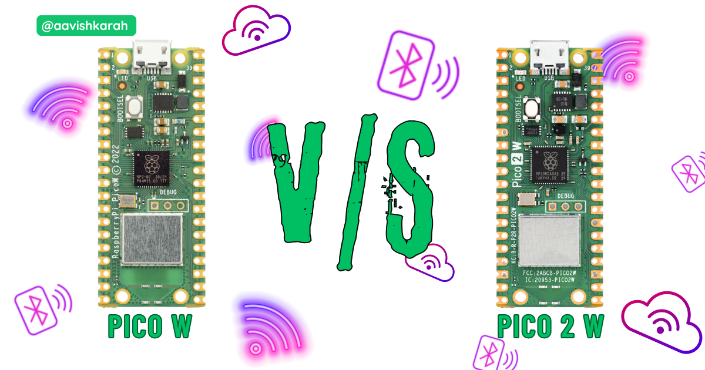

Pico 2 W is the latest, low cost IoT featured microcontroller available in market. with feature rich Upgrades from Cortex-M0+ processor to Cortex-M33 processor with higher SRAM capabilities and more. Let us do a point by point comparison in table format.

???+ Abstract "Table of Contents"

    [TOC]

## Comparison Table

| Feature                              | Pico W             | Pico 2 W           |
| ------------------------------------ | ------------------ | ------------------ |
| Processor                            | Cortex-M0+         | Cortex M33         |
| Controller                           | RP2040             | RP2350             |
| RISC-V Cores                         | None               | Hazard3            |
| Frequency                            | 133 MHz            | 150 MHz            |
| SRAM                                 | 264 kB (6 banks)   | 520 kB (10 banks)  |
| WiFi                                 | 802.11n, 2.4 GHz   | 802.11n, 2.4 GHz   |
| WiFi Security                        | WPA3               | WPA3               |
| WiFi Soft Access Points              | 4 clients          | 4 clients          |
| Bluetooth                            | 5.2                | 5.2                |
| BLE support                          | :white_check_mark: | :white_check_mark: |
| Bluetooth Classic                    | :white_check_mark: | :white_check_mark: |
| One Time Programmable Storage        | --                 | 8kB                |
| On-Board Flash                       | 2 MB               | 4 MB               |
| USB                                  | 1.1                | 1.1                |
| GPIO                                 | 30                 | 30                 |
| Analogue Input                       | 3(4)               | 3(4)               |
| ADC Resolution                       | 12 bit, 500 ksps   | 12 bit, 500 ksps   |
| PWM                                  | 16                 | 24                 |
| UART                                 | 2                  | 2                  |
| SPI                                  | 2                  | 2                  |
| I2C                                  | 2                  | 2                  |
| PIO state machines                   | 8                  | 12                 |
| HSTX (high-speed transmit periphera) | --                 | 1                  |
| Temperature Sensor (in-built)        | :white_check_mark: | :white_check_mark: |
| Serial Wire Debug (SWD)              | :white_check_mark: | :white_check_mark: |
| Languages                            | :simple-c: :simple-cplusplus: :simple-micropython: | :simple-c: :simple-cplusplus: :simple-micropython: |

!!! info "languages"

    - :simple-c: C Programming
    - :simple-cplusplus: C++
    - :simple-micropython: MicroPython

!!! tip

    Initially Pico W firmware was not supporting Bluetooth functionality.

    Bluetooth support was added to the Pico W board with the version `1.5.1 C SDK` and `version v1.21.0 MicroPython`

    [Check here to integrate micropython for pico boards](./../installing-micropython/index.md)

