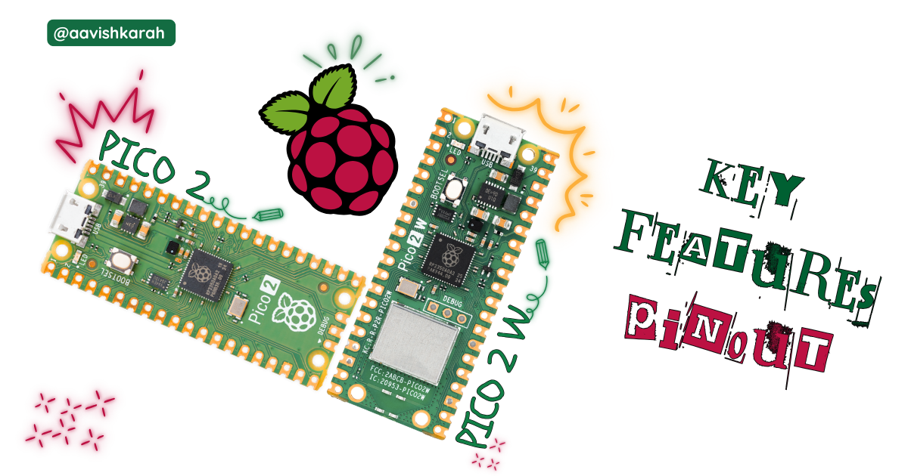
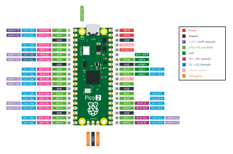
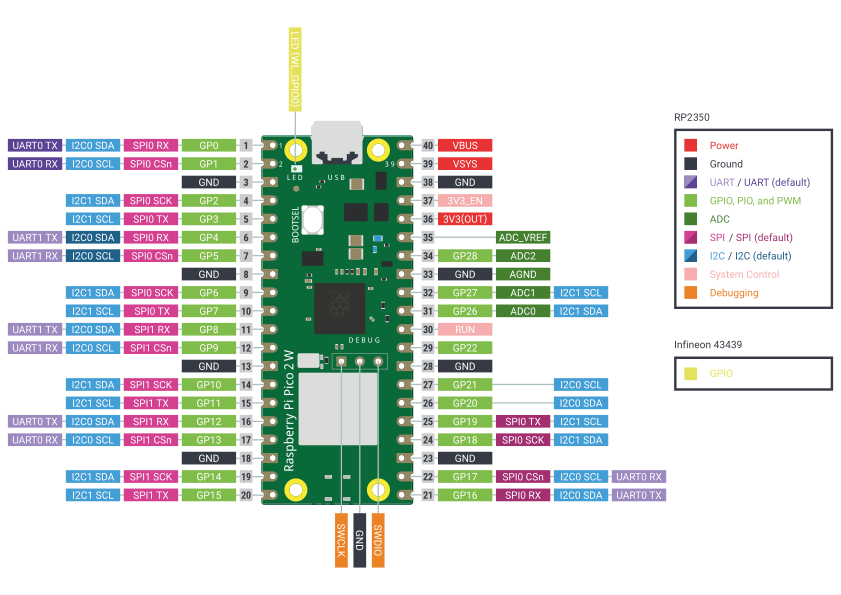
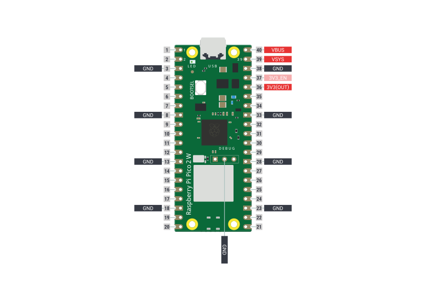
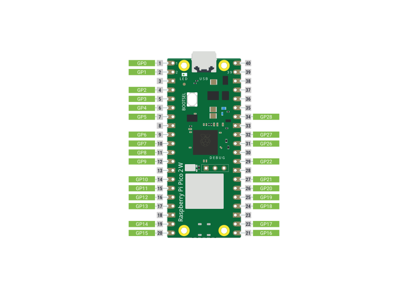
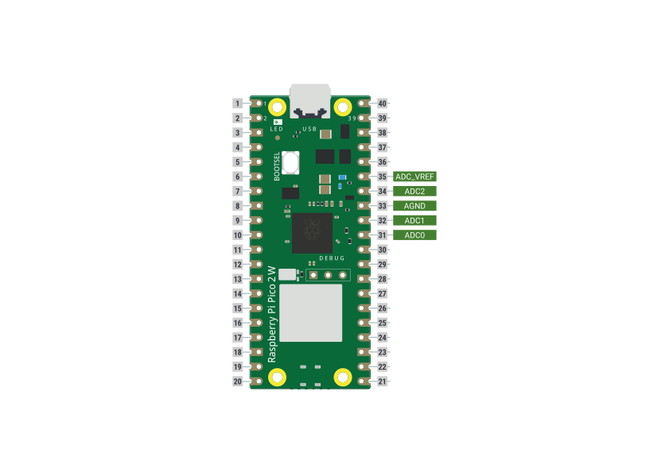
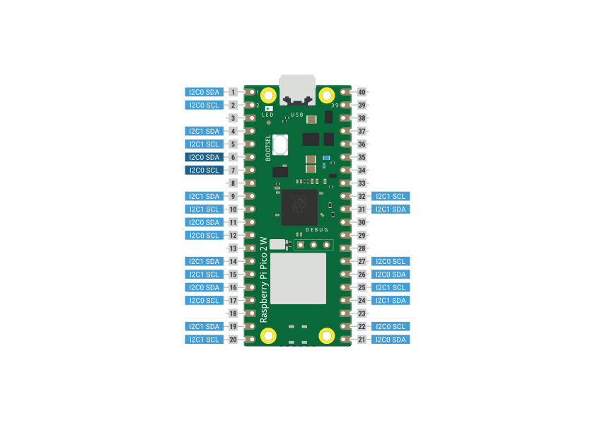
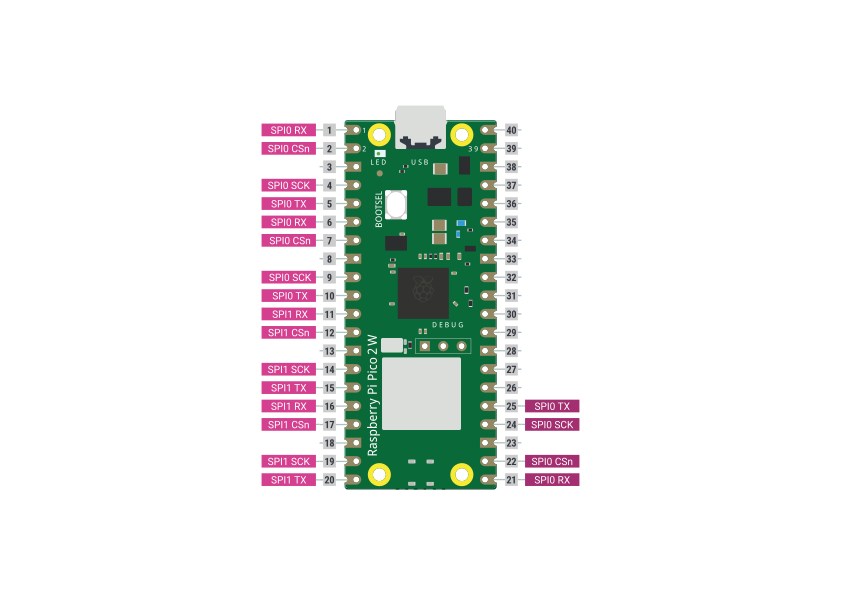
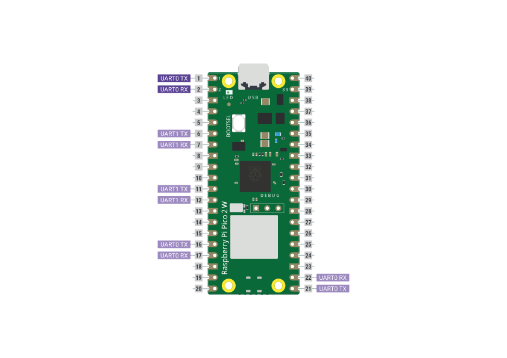

Pico 2 W is the latest, low cost IoT featured microcontroller available in market. with feature rich Upgrades from Cortex-M0+ processor to Cortex-M33 processor with higher SRAM capabilities and more. Let us do a point by point comparison in table format.

???+ Abstract "Table of Contents"

    [TOC]

## Raspberry Pi Pico 2

### Pin Configuration

### Key Features

- Raspberry Pi Pico 2 is powered by RP2350 microcontroller chip with 4 MB flash
- Dual Coretex-M33 or Hazard3 processor
- Support frequency up to 150 MHz
- Serial Wire Debug (SWG) 3-pin port
- SRAM of 560 kB
- On-board USB 1.1 for power and data
- 30 Multifunctional GPIO (General Purpose Input Output) pins
- 12-bit 500ksps ADC (Analogue to Digital Convertor) (A0, A1, A2)
- Serial Communication
  - 2 UART (Rx, Tx)
  - 2 I2C (Inter-Integrated Circuit) (SDA, SCL)
  - 2 SPI (Serial Peripheral Interface) (SCL, MISO, MOSI, SS)
- 24 PWM (Pulse Width Modulation) channels
- 2 Timers with 4 Alarms
- 3 Programmable IO (PIO) blocks, 12 state machines used for high-speed IO
- On-board buck-boost SMPS to generate 3.3V for microcontroller

[Raspberry Pi Pico 2 DataSheet :material-file-download:](https://datasheets.raspberrypi.com/pico/pico-2-datasheet.pdf){.md-button .md-button--primary}

## Raspberry Pi Pico 2 W

### Pin Configuration

/// caption
Pico 2 W Pin Configuration
///

/// caption
Pico 2 W Supply Pins
///

/// caption
Pico 2 W GPIO Pins
///

/// caption
Pico 2 W ADC Pins
///

/// caption
Pico 2 W I2C Pins
///

/// caption
Pico 2 W SPI Pins
///

/// caption
Pico 2 W UART Pins
///

### Key Features

- Raspberry Pi Pico 2 is powered by RP2350 microcontroller chip with 4 MB flash
- Dual Coretex-M33 or Hazard3 processor.
- Support frequency up to 150 MHz.
- On-board 2.4 GHz wireless interface (Infineon CYW43439) supporting
  - 802.11n wifi
  - Bluetooth 5.2
- Bluetooth
  - Supports bluetooth classic.
  - Support bluetooth LE central and peripheral roles.
- Serial Wire Debug (SWG) 3-pin port
- SRAM of 560 kB
- On-board USB 1.1 for power and data
- 30 Multifunctional GPIO (General Purpose Input Output) pins
- 12-bit 500ksps ADC (Analogue to Digital Convertor) (A0, A1, A2)
- Serial Communication
  - 2 UART (Rx, Tx)
  - 2 I2C (Inter-Integrated Circuit) (SDA, SCL)
  - 2 SPI (Serial Peripheral Interface) (SCL, MISO, MOSI, SS)
- 24 PWM (Pulse Width Modulation) channels
- 2 Timers with 4 Alarms
- 3 Programmable IO (PIO) blocks, 12 state machines used for high-speed IO
- On-board buck-boost SMPS to generate 3.3V for microcontroller

[Raspberry Pi Pico 2 W DataSheet :material-file-download:](https://datasheets.raspberrypi.com/picow/pico-2-w-datasheet.pdf){.md-button .md-button--primary}