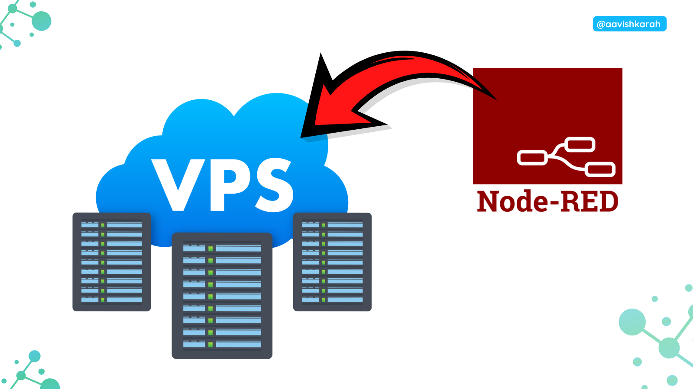
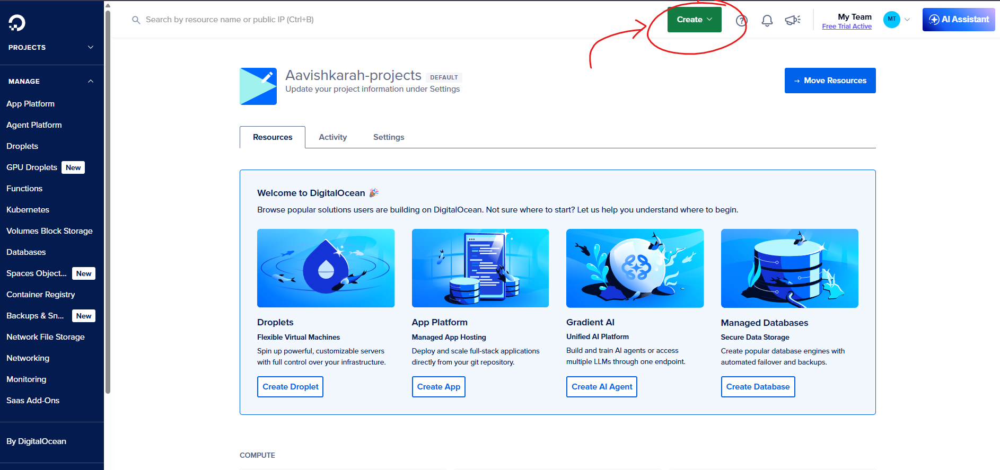
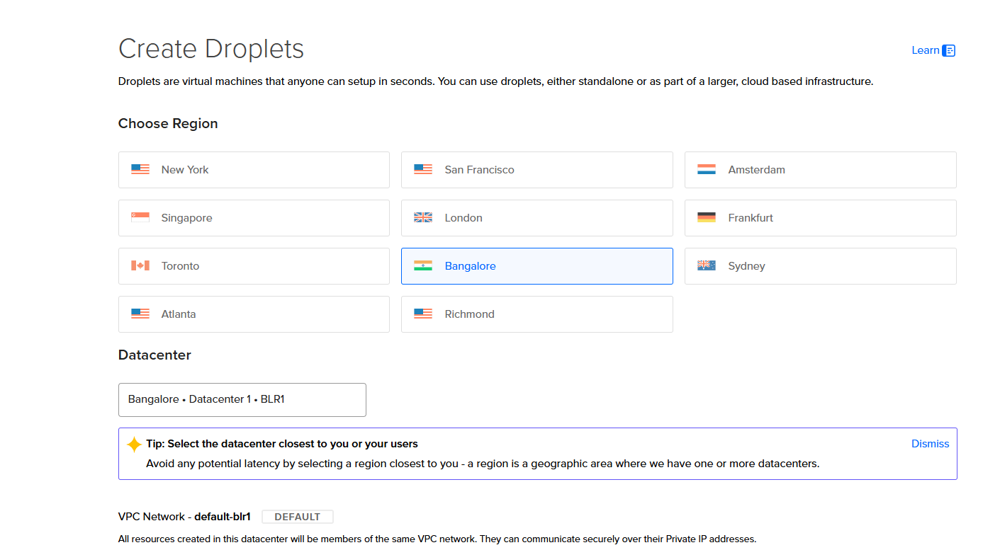
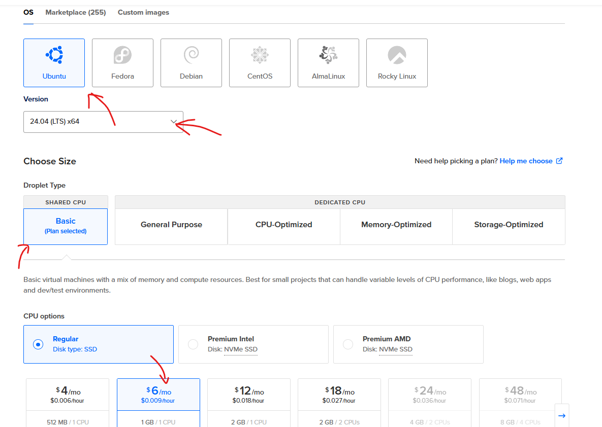
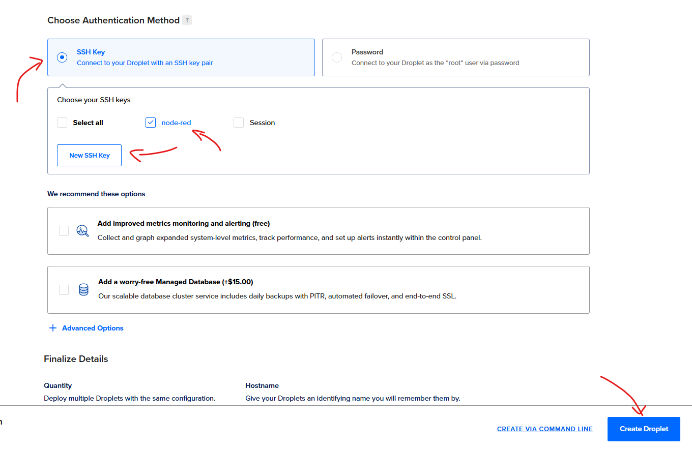
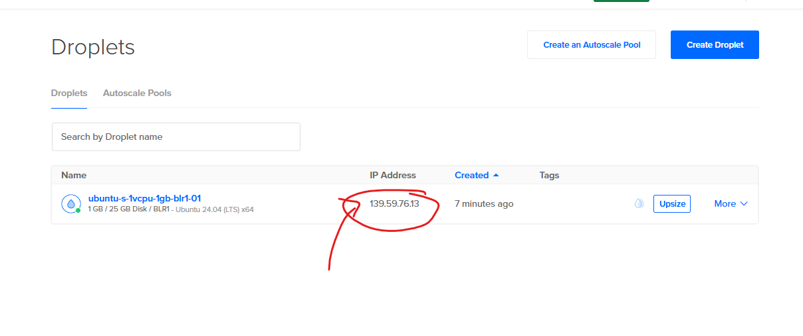
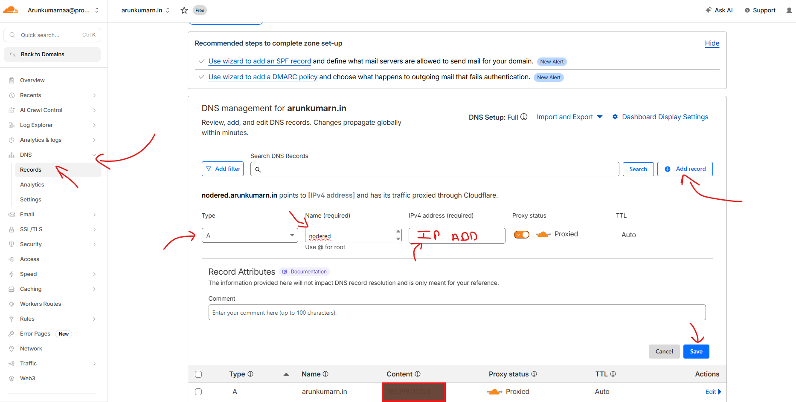

???+ Abstract "Table of Contents"

    [TOC]


## 🧾 Abstract

Node-RED is a powerful tool for wiring together hardware devices, APIs, and online services. While running it locally on a Raspberry Pi is great for prototyping, deploying it to the cloud ensures 24/7 availability and scalability. In this guide, you will learn how to deploy a production-ready **Node-RED** instance on a **DigitalOcean Droplet**, secured with **Nginx** as a reverse proxy, managed by **PM2**, and mapped to your custom domain `nodered.arunkumarn.in` using **Cloudflare**.

-----

## 📚 Prerequisites

Before starting, you should have:

  * Basic knowledge of the **Linux Command Line**.
  * SSH access to a remote server.

### ✅ Supported OS

| Platform | Supported |
| :--- | :--- |
| Ubuntu 22.04 / 24.04 LTS | ✅ Yes (Recommended) |
| Debian 11/12 | ✅ Yes |
| CentOS/RHEL | ✅ Yes |

-----

## 💰 Exclusive Offer: Get $200 Free Credit

Ready to deploy? Use the link below to create your DigitalOcean account and receive **$200 in free credit** to experiment with Node-RED and other cloud services.

<div style="
  display:flex;
  flex-wrap:wrap;
  gap:16px;
  align-items:center;
  padding:20px;
  margin:24px 0;
  border-radius:14px;
  background:var(--md-default-bg-color);
  box-shadow:0 6px 18px rgba(0,0,0,0.08);
">
  <div style="font-size:36px;">💰</div>

  <div style="flex:1 1 220px;">
    <strong>Limited Time Offer</strong><br>
    Enrol using the link to get $200 DigitalOcean credit
  </div>

  <a href="https://m.do.co/c/263255aa0152"
     target="_blank"
     style="
       padding:12px 18px;
       border-radius:10px;
       background:var(--md-accent-fg-color);
       color:#fff;
       font-weight:600;
       text-decoration:none;
       text-align:center;
       flex:1 1 160px;
     ">
    Click here for $200 Credit →
  </a>
</div>


-----

## 🏗️ Architecture Overview

For a scalable and secure deployment, we use the following stack:

1.  **DigitalOcean Droplet:** The virtual private server (VPS) hosting our environment.
2.  **Node-RED:** The core low-code engine.
3.  **PM2:** A process manager to ensure Node-RED restarts automatically if it crashes or the server reboots.
4.  **Nginx:** Acts as a reverse proxy to handle SSL and forward traffic to Node-RED.
5.  **Cloudflare:** Manages DNS records and provides an extra layer of security.

-----

## 🛠️ Step-by-Step Setup Instructions

### ✅ Step 1: Create a DigitalOcean Droplet

- Sign in to your DigitalOcean account.
- Click Create (top right) and select Droplets.

- Choose Region: Select the data center closest to you (e.g., Bangalore, NYC, or London).

- Choose Image: Select Ubuntu 24.04 LTS.
- Choose Size: Select the Basic plan. For Node-RED, the $4/month or $6/month (Regular SSD) is more than enough.

- Authentication: Choose SSH Keys (Recommended for security) or Password.
- Finalize and click Create Droplet.



Once created, copy the IP Address of your new Droplet.



### ✅ Step 2: Login to the Droplet

- SSH into your server:

```bash
ssh root@your_droplet_ip
```

- Update the system:

```bash
sudo apt update && sudo apt upgrade -y
```

### ✅ Step 3: Install Node.js and Node-RED

- Node-RED requires Node.js. Install the LTS version:

```bash
# Download and install nvm:
curl -o- https://raw.githubusercontent.com/nvm-sh/nvm/v0.40.4/install.sh | bash

# restarting the shell
\. "$HOME/.nvm/nvm.sh"

# Download and install Node.js:
nvm install 24

# Verify the Node.js version:
node -v # Should print "v24.14.0".

# Verify npm version:
npm -v # Should print "11.9.0".

```

- Now, install Node-RED globally:

```bash
sudo npm install -g --unsafe-perm node-red
```

### ✅ Step 4: Setup PM2 Process Manager

To keep Node-RED running in the background:

```bash
sudo npm install -g pm2
pm2 start /usr/bin/node-red -- -v
pm2 save
pm2 startup
```

### ✅ Step 5: Configure Nginx Reverse Proxy

- Install Nginx:

```bash
sudo apt install nginx -y
```

- Create a configuration file for your domain:

```bash
sudo nano /etc/nginx/sites-available/nodered.arunkumarn.in
```

- Paste the following configuration:

```nginx
server {
    listen 80;
    server_name nodered.arunkumarn.in;

    location / {
        proxy_pass http://localhost:1880;
        proxy_http_version 1.1;
        proxy_set_header Upgrade $http_upgrade;
        proxy_set_header Connection "upgrade";
        proxy_set_header Host $host;
        proxy_set_header X-Real-IP $remote_addr;
    }
}
```

- Enable the site and restart Nginx:

```bash
sudo ln -s /etc/nginx/sites-available/nodered.arunkumarn.in /etc/nginx/sites-enabled/
sudo nginx -t
sudo systemctl restart nginx
```

!!! Note
    replace the domain name `nodered.arunkumarn.in` with your custom domain name.

-----

### 🌐 DNS Configuration 

1.  Login to your DNS server 
    - Here **Cloudflare** is used.
2.  Select your domain `arunkumarn.in`.
3.  Go to **DNS Settings** \> **Add Record**.
4.  Type: `A`, Name: `nodered`, Content: `Your_Droplet_IP`.
5.  Ensure the **Proxy Status** is set to "Proxied" (Orange cloud) for automatic SSL handling.



-----

### 🔒 Install SSL Certificate

We will use **Certbot** to get a free SSL certificate from Let's Encrypt.

1.  **Install Certbot:**

    ```bash
    sudo apt install certbot python3-certbot-nginx -y
    ```

2.  **Run Certbot:**

    ```bash
    sudo certbot --nginx -d nodered.arunkumarn.in
    ```

    *Follow the prompts: Enter your email and agree to the terms. Certbot will automatically update your Nginx file to use SSL.*

3.  **Verify Auto-Renewal:**

    ```bash
    sudo certbot renew --dry-run
    ```

-----

## 🛑 Security Hardening

By default, Node-RED is open. You **must** enable authentication:

1.  Generate a password hash:
    ```bash
    node-red-admin hash-pw
    ```
2.  Edit the settings file:
    ```bash
    nano ~/.node-red/settings.js
    ```
3.  Find the `adminAuth` section, uncomment it, and replace the password hash with yours.
4.  Restart Node-RED: `pm2 restart node-red`.

-----

## 🚀 Advanced Tips

  * **Continuous Backups:** Use GitHub to version control your `flows.json`.
  * **Environment Variables:** Store sensitive API keys in a `.env` file instead of hardcoding them in nodes.
  * **Monitoring:** Use the `pm2 monit` command to watch CPU and memory usage in real-time.

-----

## 📌 References

  * [Node-RED Official Documentation](https://nodered.org/docs/)
  * [DigitalOcean Droplet Documentation](https://docs.digitalocean.com/products/droplets/)
  * [PM2 Quick Start](https://pm2.keymetrics.io/docs/usage/quick-start/)

-----

## 🏁 Conclusion

You now have a production-grade Node-RED instance running at your custom domain🎉. With PM2 managing the process and Nginx handling the traffic, your IoT automation flows are ready to scale with high availability. Happy wiring\!