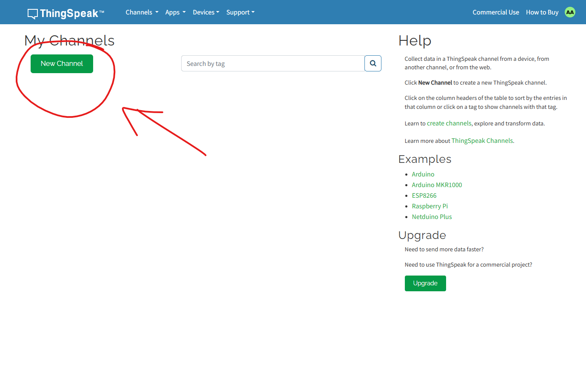

???+ Abstract "Table of Contents"

    [TOC]


## Abstract

In this project, we build an IoT-enabled smart climate monitoring system using Raspberry Pi Pico W, a temperature and humidity sensor, and a 16×2 I2C LCD display. The system shows real-time sensor readings locally on the LCD and remotely on the ThingSpeak cloud platform, enabling both on-device monitoring and cloud-based visualization,  making this system useful for home automation, weather tracking, and IoT learning applications.


<video controls autoplay>
  <source src="./videos/simulation_thingspeak.mp4" type="video/mp4">
  Your browser does not support the video tag.
</video>

## Hardware Required

<!-- Advertisement -->
--8<-- "includes/pico-disk-link-cta.md"

- Raspberry Pi Pico W / Pico 2W. 
- DHT 11/22 sensor.
- BreadBoard.
- Micro USB Cable.
- Connecting wires.
- 5V DC power supply (Optional)

| Components           | Purchase Link                                                       |
| -------------------- | ------------------------------------------------------------------- |
| Raspberry Pi Pico W  | [link](https://amzn.to/3KeWamg)                                     |
| Raspberry Pi Pico 2W | [link](#)                                                           |
| DHT 11/22 sensor     | [link](#)                                                           |
| 128x64 OLED display  | [link](#)                                                           |
| BreadBoard / PCB     | [large](https://amzn.to/4pgNX1c) : [small](https://amzn.to/47SMzvB) |
| Connecting Wires     | [link](https://amzn.to/4pepr0H)                                     |
| Micro USB Cable      | [link](https://amzn.to/4gfMgNa)                                     |
| 5V DC Adaptor        | [link](https://amzn.to/4m82t8D)                                     |

<!-- Advertisement -->
--8<-- "includes/pico-iot-cta.md"


### Connection Table


| DHT 11/22           | GPIO  | Remarks                               |
| :------------------ | :---: | :------------------------------------ |
| V<sub>CC</sub>  (1) | +5 V  | +5V of Board or External 5V DC Supply |
| Data  (2)           |  21   | Any GPIO pin can be used              |
| NC (3)              |   -   | No Connection                         |
| GND  (4)            |  GND  | Ground                                |


| 16x2 I2C LCD        | GPIO  | Remarks                               |
| :------------------ | :---: | :------------------------------------ |
| GND  (1)            |  GND  | Ground                                |
| V<sub>CC</sub>  (2) | +5 V  | +5V of Board or External 5V DC Supply |
| SCL  (3)            |   3   | I2C0 series SCL pin                   |
| SDA  (4)            |   2   | I2C0 series SDA pin                   |


!!! Note
    - Instead of a DHT11 or DHT22 sensor, you may use the **BME280** sensor for improved accuracy and additional environmental data. 
    - The **BME280** can measure:
        - Temperature
        - Humidity
        - Atmospheric Pressure
    - For simple projects you can also use **16x2 LCD** display.


/// caption
fig-Connection Diagram
///


## Setup ThingSpeak Channel

1. Create a ThingSpeak account and log in [:link: link](https://thingspeak.mathworks.com/login?).

2. Go to Channels → My Channels → New Channel.

3. Name your channel (e.g., “Smart Climate Monitor”).
4. Add fields for Temperature and Humidity.

5. Save and note down your Write API Key — you’ll need this in your code.


## :open_file_folder: Code

=== "main.py"
    ```python linenums="1"

    from machine import Pin, I2C
    import dht
    import time
    import json
    import framebuf

    from icons import pico_logo
    from ssd1306 import SSD1306_I2C


    # Display interface
    i2c=I2C(1,scl=Pin(3),sda=Pin(2),freq=400000)
    display = SSD1306_I2C(128, 64, i2c)

    # Sensor interface
    sensor = dht.DHT22(Pin(21))


    # Wifi Configeration
    ssid = "Wokwi-GUEST"      # replace with your wifi ssid
    password = "aavishkarah"  # replace with your wifi password
    wifi_connected = False

    # Thingspeak Configeration
    api_key = "API_KEY"        # replace with your Thingspeak API KEY
    host = "api.thingspeak.com"


    def erase_lines(y, line=1):
        display.rect(0,y, 128, 8*line, 0, True)


    def blink_display(n=1, delay=250):
        for _ in range(n):
            display.invert(1)
            display.contrast(100)
            display.show()
            time.sleep_ms(delay)
            display.invert(0)
            display.contrast(0)
            display.show()
            time.sleep_ms(delay)


    def display_datasent_status(status):
        erase_lines(40, 2)
        if status == "200":
            display.text("Data Sent", 24, 44)
        elif status == "400":
            display.text("400 ERROR", 24, 44)
            blink_display(2, 150)
        else:
            display.text("ERROR: Check WiFi", 0, 44)
            blink_display()
        display.show()
        time.sleep_ms(1000)
        erase_lines(40, 2)
        display.show()


    def do_connect(ssid, password):
        global wifi_connected

        import network
        time.sleep_ms(2000)
        sta_if = network.WLAN(network.STA_IF)
        wifi_connected = sta_if.isconnected()
        
        if not wifi_connected:
            sta_if.active(True)
            sta_if.connect(ssid, password)
            loc = 10
            for i in range(10):
                display.text("*",loc,45)
                display.show()
                time.sleep_ms(2500)
                wifi_connected = sta_if.isconnected()
                if wifi_connected:
                    display.fill(0)
                    display.text('Wifi Connected',10,30)
                    display.show()
                    time.sleep_ms(1000)
                    blink_display(4, 100)
                    break
                loc += 10
            if not wifi_connected:
                display.fill(0)
                display.text(" NO INTERNET ",0,20)
                display.show()
                time.sleep_ms(2000)
                blink_display(4, 100)

        else:
            display_wifi_connected()


    def send_data(temperature, humidity):
        try:
            import socket
            path = f"/update?api_key={api_key}&field1={temperature:0.2f}&field2={humidity:0.2f}"
            addr = socket.getaddrinfo(host, 80)[0][-1]
            s = socket.socket()
            s.connect(addr)
            s.send(bytes('GET /%s HTTP/1.0\r\nHost: %s\r\n\r\n' % (path, host), 'utf8'))
            
            while True:
                data = str(s.recv(1024)).replace('b','').replace("'", "")
                # print(data)
                if data:
                    if data.startswith("HTTP/"):
                        status_code = data.split()[1]
                else:
                    break
            s.close()

            display_datasent_status(status_code)
            
        except:
            display_datasent_status(False)
            global wifi_connected
            wifi_connected = False


    def welcome_message():
        # display Raspberry Pi Pico Logo
        display.fill(0)
        display.blit(pico_logo, 48, 0)
        display.show()
        time.sleep_ms(2500)

        # display Aavishkarah 
        display.text('Welcome to',25,34)
        display.show()
        time.sleep_ms(250)
        display.text("Aavishkarah",20,45)
        display.show()
        time.sleep_ms(2500)


    welcome_message()

    display.fill(0)
    display.text("Connecting to",10,20)
    display.text("Wifi",45,34)
    display.text("*",0,45)
    display.show()
    time.sleep_ms(50)

    # connect to wifi
    do_connect(ssid, password)

    # Clear the display
    display.fill(0)

    while True:
        sensor.measure()
        temperature = sensor.temperature()
        humidity = sensor.humidity()
        
        # display temperature & humidity
        erase_lines(12, 3)
        display.text("Temp. deg:", 0, 12)
        display.text("Humidity :", 0, 24)
        display.text(str(temperature), 85, 12)
        display.text(str(humidity), 85, 24)
        display.show()

        # Send data to thingspeak
        send_data(temperature, humidity)

        # Thingspeak accepts data for every 15 sec
        # 15 sec delay
        time.sleep_ms(15000)


    ```

=== "ssd1306.py"
    ```python linenums="1"
    # MicroPython SSD1306 OLED driver, I2C and SPI interfaces

    from micropython import const
    import framebuf


    # register definitions
    SET_CONTRAST = const(0x81)
    SET_ENTIRE_ON = const(0xA4)
    SET_NORM_INV = const(0xA6)
    SET_DISP = const(0xAE)
    SET_MEM_ADDR = const(0x20)
    SET_COL_ADDR = const(0x21)
    SET_PAGE_ADDR = const(0x22)
    SET_DISP_START_LINE = const(0x40)
    SET_SEG_REMAP = const(0xA0)
    SET_MUX_RATIO = const(0xA8)
    SET_IREF_SELECT = const(0xAD)
    SET_COM_OUT_DIR = const(0xC0)
    SET_DISP_OFFSET = const(0xD3)
    SET_COM_PIN_CFG = const(0xDA)
    SET_DISP_CLK_DIV = const(0xD5)
    SET_PRECHARGE = const(0xD9)
    SET_VCOM_DESEL = const(0xDB)
    SET_CHARGE_PUMP = const(0x8D)

    # Subclassing FrameBuffer provides support for graphics primitives
    # http://docs.micropython.org/en/latest/pyboard/library/framebuf.html
    class SSD1306(framebuf.FrameBuffer):
        def __init__(self, width, height, external_vcc):
            self.width = width
            self.height = height
            self.external_vcc = external_vcc
            self.pages = self.height // 8
            self.buffer = bytearray(self.pages * self.width)
            super().__init__(self.buffer, self.width, self.height, framebuf.MONO_VLSB)
            self.init_display()

        def init_display(self):
            for cmd in (
                SET_DISP,  # display off
                # address setting
                SET_MEM_ADDR,
                0x00,  # horizontal
                # resolution and layout
                SET_DISP_START_LINE,  # start at line 0
                SET_SEG_REMAP | 0x01,  # column addr 127 mapped to SEG0
                SET_MUX_RATIO,
                self.height - 1,
                SET_COM_OUT_DIR | 0x08,  # scan from COM[N] to COM0
                SET_DISP_OFFSET,
                0x00,
                SET_COM_PIN_CFG,
                0x02 if self.width > 2 * self.height else 0x12,
                # timing and driving scheme
                SET_DISP_CLK_DIV,
                0x80,
                SET_PRECHARGE,
                0x22 if self.external_vcc else 0xF1,
                SET_VCOM_DESEL,
                0x30,  # 0.83*Vcc
                # display
                SET_CONTRAST,
                0xFF,  # maximum
                SET_ENTIRE_ON,  # output follows RAM contents
                SET_NORM_INV,  # not inverted
                SET_IREF_SELECT,
                0x30,  # enable internal IREF during display on
                # charge pump
                SET_CHARGE_PUMP,
                0x10 if self.external_vcc else 0x14,
                SET_DISP | 0x01,  # display on
            ):  # on
                self.write_cmd(cmd)
            self.fill(0)
            self.show()

        def poweroff(self):
            self.write_cmd(SET_DISP)

        def poweron(self):
            self.write_cmd(SET_DISP | 0x01)

        def contrast(self, contrast):
            self.write_cmd(SET_CONTRAST)
            self.write_cmd(contrast)

        def invert(self, invert):
            self.write_cmd(SET_NORM_INV | (invert & 1))

        def rotate(self, rotate):
            self.write_cmd(SET_COM_OUT_DIR | ((rotate & 1) << 3))
            self.write_cmd(SET_SEG_REMAP | (rotate & 1))

        def show(self):
            x0 = 0
            x1 = self.width - 1
            if self.width != 128:
                # narrow displays use centred columns
                col_offset = (128 - self.width) // 2
                x0 += col_offset
                x1 += col_offset
            self.write_cmd(SET_COL_ADDR)
            self.write_cmd(x0)
            self.write_cmd(x1)
            self.write_cmd(SET_PAGE_ADDR)
            self.write_cmd(0)
            self.write_cmd(self.pages - 1)
            self.write_data(self.buffer)


    class SSD1306_I2C(SSD1306):
        def __init__(self, width, height, i2c, addr=0x3C, external_vcc=False):
            self.i2c = i2c
            self.addr = addr
            self.temp = bytearray(2)
            self.write_list = [b"\x40", None]  # Co=0, D/C#=1
            super().__init__(width, height, external_vcc)

        def write_cmd(self, cmd):
            self.temp[0] = 0x80  # Co=1, D/C#=0
            self.temp[1] = cmd
            self.i2c.writeto(self.addr, self.temp)

        def write_data(self, buf):
            self.write_list[1] = buf
            self.i2c.writevto(self.addr, self.write_list)


    class SSD1306_SPI(SSD1306):
        def __init__(self, width, height, spi, dc, res, cs, external_vcc=False):
            self.rate = 10 * 1024 * 1024
            dc.init(dc.OUT, value=0)
            res.init(res.OUT, value=0)
            cs.init(cs.OUT, value=1)
            self.spi = spi
            self.dc = dc
            self.res = res
            self.cs = cs
            import time

            self.res(1)
            time.sleep_ms(1)
            self.res(0)
            time.sleep_ms(10)
            self.res(1)
            super().__init__(width, height, external_vcc)

        def write_cmd(self, cmd):
            self.spi.init(baudrate=self.rate, polarity=0, phase=0)
            self.cs(1)
            self.dc(0)
            self.cs(0)
            self.spi.write(bytearray([cmd]))
            self.cs(1)

        def write_data(self, buf):
            self.spi.init(baudrate=self.rate, polarity=0, phase=0)
            self.cs(1)
            self.dc(1)
            self.cs(0)
            self.spi.write(buf)
            self.cs(1)
    ```

=== "icons.py"
    ```python linenums="1"
    import framebuf

    # Raspberry Pi logo as a 32x32 bytearray
    buffer = bytearray([
        0x00, 0x00, 0x00, 0x00, 0x00, 0x00, 0x00, 0x00, 0x00, 0x00, 0x00, 0x00, 0x00, 0x7C, 0x3F, 0x00,
        0x01, 0x86, 0x40, 0x80, 0x01, 0x01, 0x80, 0x80, 0x01, 0x11, 0x88, 0x80, 0x01, 0x05, 0xA0, 0x80,
        0x00, 0x83, 0xC1, 0x00, 0x00, 0x43, 0xE3, 0x00, 0x00, 0x7E, 0xFC, 0x00, 0x00, 0x4C, 0x27, 0x00,
        0x00, 0x9C, 0x11, 0x00, 0x00, 0xBF, 0xFD, 0x00, 0x00, 0xE1, 0x87, 0x00, 0x01, 0xC1, 0x83, 0x80,
        0x02, 0x41, 0x82, 0x40, 0x02, 0x41, 0x82, 0x40, 0x02, 0xC1, 0xC2, 0x40, 0x02, 0xF6, 0x3E, 0xC0,
        0x01, 0xFC, 0x3D, 0x80, 0x01, 0x18, 0x18, 0x80, 0x01, 0x88, 0x10, 0x80, 0x00, 0x8C, 0x21, 0x00,
        0x00, 0x87, 0xF1, 0x00, 0x00, 0x7F, 0xF6, 0x00, 0x00, 0x38, 0x1C, 0x00, 0x00, 0x0C, 0x20, 0x00,
        0x00, 0x03, 0xC0, 0x00, 0x00, 0x00, 0x00, 0x00, 0x00, 0x00, 0x00, 0x00, 0x00, 0x00, 0x00, 0x00
    ])   

    # Load the logo into a framebuffer
    pico_logo = framebuf.FrameBuffer(buffer, 32, 32, framebuf.MONO_HLSB)
    ```

---

## :material-chart-bubble:{style="color:#ffaa00"} Simulation

!!! danger "Not able to view the simulation"
    - :fontawesome-solid-laptop: Desktop or Laptop : Reload this page ( ++ctrl+r++ )
    - :fontawesome-solid-mobile: Mobile : Use Landscape Mode and reload the page


<iframe style="height:calc(100vh - 200px); border-color:#00aaff;border-radius:1rem;min-height:400px" src="https://wokwi.com/projects/439174187350871041" frameborder="2px" width="100%" height="700px"></iframe>


---

## Results and Visualization

<!-- Advertisement -->
--8<-- "includes/pico-disk-link-cta.md"
--8<-- "includes/pico-iot-cta.md"

After running the script:

- Your channel on ThingSpeak will start displaying live data graphs for temperature and humidity.
- These graphs update automatically as your Raspberry Pi Pico W sends new values.
- You can also embed or share the dashboard for remote monitoring.

<video controls >
  <source src="./videos/simulation_thingspeak.mp4" type="video/mp4">
  Your browser does not support the video tag.
</video>

## Applications

This system can be used for:

- Home environment monitoring
- Greenhouse condition tracking
- Weather station projects
- IoT learning and experimentation

This Project can be enhanced by integrating alerts, or adding additional sensors such as pressure or air quality units.