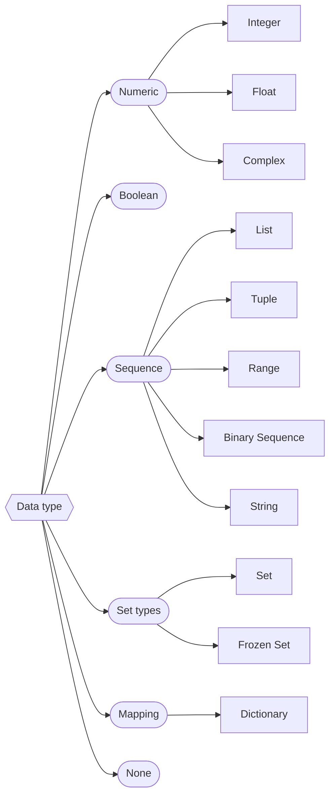

???+ Abstract "Table of Contents"

    [TOC]

In Python, everything is an object. Hence, in Python the data types are classes, and instances of these classes are nothing but variables.


## Classification

python provides some built in data types. The type of an object can be identified in python using a built-in function `type`


Basically data types are differentiated in to two types.

1. Primitive data type
2. Non-Primitive data type

## Primitive data type

Primitive data types in Python are the most basic types of data. They are the building blocks for data manipulation in Python and are typically immutable, meaning their value cannot change after they are created.


### Numbers

Python has three type of numbers.

1) Integer
   
Integers can be positive or negative, of any length; it is only limited by the memory available.

``` python
>>> a = 2
>>> type(a)
<class 'int'>
```

2) Float 

It can store number with a fractional part.

``` python
>>> pi = 3.14
>>> type(pi)
<class 'float'>

```

3) Complex 

Complex numbers are written in the form, x + yj, where x is the real part and y is the imaginary part.

```python
>>> c = 2 + 3j
>>> type(c)
<class 'complex'>
>>>
>>>
>>> m = 25 - 3.14j
>>> type(m)
<class 'complex'>
```

---

### Boolean

 A condition is really just a yes-or-no question, the answer to that question is a Boolean value, either `True` or `False`. The Boolean values, `True` and `False` are treated as reserved words.

 The built-in function `bool()` converts any value to a boolean. 

 bool is a subclass of int. In many numeric contexts, False and True behave like the integers 0 and 1, respectively.

```python
>>> condition = True
>>> type(condition)
<class 'bool'>
>>> # Boolean type has only two values. 
>>> # True False
```

---

### String

String is an ordered sequence of letters/characters. They are enclosed in single quotes ++single-quote++ or double ++double-quote++ and multiline strings are enclosed inside triple quote (3 single quote `'''`) or (3 double quote `"""`). The quotes are not part of string, they only tell the computer where the string constant begins and ends. They can have any character or sign, including ++space++ in them. 

In Python, Strings are arrays of bytes representing Unicode characters.

```python title="Single line string"
>>> name = "Aavishkarah"
>>> type(name)
<class 'str'>
>>>
>>>place = 'India'
>>> type(place)
<class 'str'>
>>>
```

```python title="Multiline string"

>>> quote = ''' 
... If you want to shine like a sun,
... First burn like a sun.
...
... APJ Abdul Kalam
... '''
>>> type(quote)
<class 'str'>
>>> # Multiline strings can be denoted using triple quotes, ''' or """.               

```

Strings are immutable data types. Immutable means that the contents of the string cannot be changed after it is created. Let us understand the concept of immutability with help of an example.

```python title="Immutable"
>>> place = 'india'
>>> place[0] = 'I'
TypeError: 'place' object does not support item assignment.

```

The error message indicated the string object is immutable.

---

### None

The Null object in python is returned by functions that don’t explicitly return a value.  It supports no special operations. There is exactly one null object, named None (a built-in name)

None is frequently used to represent the absence of a value.


```python
>>> x = None
>>> type(x)
<class 'NoneType'>
```


---

## Non-Primitive data type

Non-primitive data types, also known as complex or composite data types, are data types that are derived from primitive data types. They can store multiple values or more complex structures of data. Unlike primitive types, non-primitive data types are mutable, meaning their contents can be changed.


### List

List is an ordered set of values enclosed in square brackets `[ ]`. Values in the list can be modified, i.e. it is **mutable**. As it is set of values, we can use index in square brackets `[index_number]` to identify a value belonging to it. The values that make up a list are called its **elements**, and they can be of any type.

!!! Note "syntax"
    `list_variable = [element-1, element-2, element-3, ... , element-n ]`

```python title="syntax"

>>> fruits = ['Mango', 'Orange', 'Apple']
>>> even = [2, 4, 6, 8]
>>> 
>>> # elements can be of any data type
>>> student = ['Kishore', True, None, 1990]
>>>
>>> # empty list
>>> empty = [ ]

```

| list element   | 1^st^ | 2^nd^  | 3^rd^  | 4^th^  | --  | --  | N^th^ |
| -------------- | ----- | ------ | ------ | ------ | --- | --- | ----- |
| Positive index | 0     | 1      | 2      | 3      | --  | --  | N-1   |
| Negative index | -(N)  | -(N-1) | -(N-2) | -(N-3) | --  | -2  | -1    |

!!! example
    | fruits         | 'Mango' | 'Orange' | 'Apple' |
    | -------------- | :-----: | :------: | :-----: |
    | Positive index |    0    |    1     |    2    |
    | Negative index |   -3    |    -2    |   -1    |


It will provide the index value 0 to N in the list. Index here, has to be an integer value which can be positive or negative. Positive value of index means counting forward from beginning of the list and negative value means counting backward from end of the list. Remember the result of indexing a list is the value of type accessed from the list.


```python title="Accessing Element"
>>> # Positive Indexing 
>>> fruits[0]
'Mango'
>>> even[2]
6
>>> student[3] 
1990
>>> # Negative Indexing 
>>> student[-1] 
1990

```

!!! failure "ERROR"
    Raises `IndexError` trying to access list data out of range 
    ```python 
    >>> fruits[3]
    Traceback (most recent call last):
    File "<stdin>", line 1, in <module>
    IndexError: list index out of range

    ```

```python title="Replacing Element"
>>> print(fruits)
['Mango', 'Orange', 'Apple']
>>>
>>> # replace Orange with Banana 
>>> fruits[1] = 'Banana'
>>> print(fruits)
['Mango', 'Banana', 'Apple']

```

---


### Tuple

A tuple represents a sequence of any objects separated by commas and enclosed in parentheses `( )`. A tuple is an immutable object, which means it cannot be changed, and we use it to represent fixed collections of items.

!!! Note "syntax"
    `tuple_variable = (element-1, element-2, element-3, ... , element-n )`

```python title="syntax"

>>> fruits = ('Mango', 'Orange', 'Apple')
>>> # single element
>>> two = (2,)
>>>
>>> # empty tuple
>>> empty = ( )

```

```python title="Accessing Element"
>>> # Positive Indexing 
>>> fruits[1]
'Orange'
>>> two[0]
2
>>> # Negative Indexing 
>>> fruits[-1] 
'Apple'
```

!!! failure "ERROR"
    Raises `IndexError` trying to access tuple data out of range 
    ```python 
    >>> fruits[3]
    Traceback (most recent call last):
    File "<stdin>", line 1, in <module>
    IndexError: tuple index out of range

    ```


```python title="Replacing Element"
>>> print(fruits)
['Mango', 'Orange', 'Apple']
>>>
>>> # replace Orange with Banana raises TypeError
>>> fruits[1] = 'Banana'
Traceback (most recent call last):
  File "<stdin>", line 1, in <module>
TypeError: 'tuple' object does not support item assignment

```

!!! Warning

    - index must be an integer. 
    - Other than integer like float or complex etc raises `TypeError`.
  
---

### Dictionary

A Dictionary data separated by comma ++comma++ enclosed inside curly braces `{ }`. Every data is a `key`, `value` pair separated by ++colon++.

!!! Note "syntax"
    `dict_variable = {'key-1' : 'value-1', 'key-2' : 'value-2', 'key-3' : 'value-3', ..., 'key-n' : 'value-n' }`

python dictionary is an ordered collection (starting from Python 3.7) of items. It stores elements in key/value pairs. Here, keys are unique identifiers that are associated with each value.

Values in a dictionary can be of any data type and can be duplicated, whereas keys can’t be repeated and must be immutable. key cannot be list or set because both are mutable.

```python title="syntax"

>>> institute = {'name' : 'Skill Disk', 'phone' : 7829006066, 'email' : "info@skilldisk.com"}
>>> std_code = {'Delhi': 11, 'Mumbai': 22, 'Kolkata': 33, 'Chennai': 44, 'Hyderabad': 40, 'Bengaluru': 80, 'Pune': 20, 'Ahmedabad': 79}
>>> empty_dict = { }

```

```python title="Accessing Element"
>>> institute['name']
'Skill Disk'
>>> std_code['Bengaluru']
80
```

!!! failure "ERROR"
    Raises `KeyError` trying to access dict data with wrong key

    ```python 
    >>> institute['place']
    Traceback (most recent call last):
    File "<stdin>", line 1, in <module>
    KeyError: 'place'
    ```

---

### Set

Python’s built-in set type has the following characteristics:

- Sets are unordered.
- Set elements are unique (Duplicate elements are not allowed). 
- A set itself may be modified, but the elements contained in the set must be of an immutable type.

A set is created by placing all the items (elements) inside curly braces `{ }`, separated by comma ++comma++ or by using the built-in `set( )` function.

It can have any number of items and they may be of different types (integer, float, tuple, string etc.). But a set cannot have mutable elements like lists, sets or dictionaries as its elements.

!!! Note "syntax"
    `set_variable = {'value-1', 'value-2', 'value-3', ..., 'value-n' }`


## Difference between Primitive data types and Non-Primitive data types.

| Feature             | Primitive Data Types             | Non-Primitive Data Types             |
| ------------------- | -------------------------------- | ------------------------------------ |
| Mutability          | Immutable                        | Mutable                              |
| Data Representation | Represents a single value        | Can represent multiple values        |
| Example Types       | int, float, bool, str            | list,dict, set                       |
| Memory Allocation   | Less memory, as they are simpler | More memory, can store complex data  |
| Copying             | Copying creates new instances    | Can create shallow or deep copies    |
| Use Case            | Simple data, basic calculations  | Complex data structures, collections |
 
 
<!--                | Methods and Operations           | Limited operations and methods       | Rich set of methods and operations | --> 