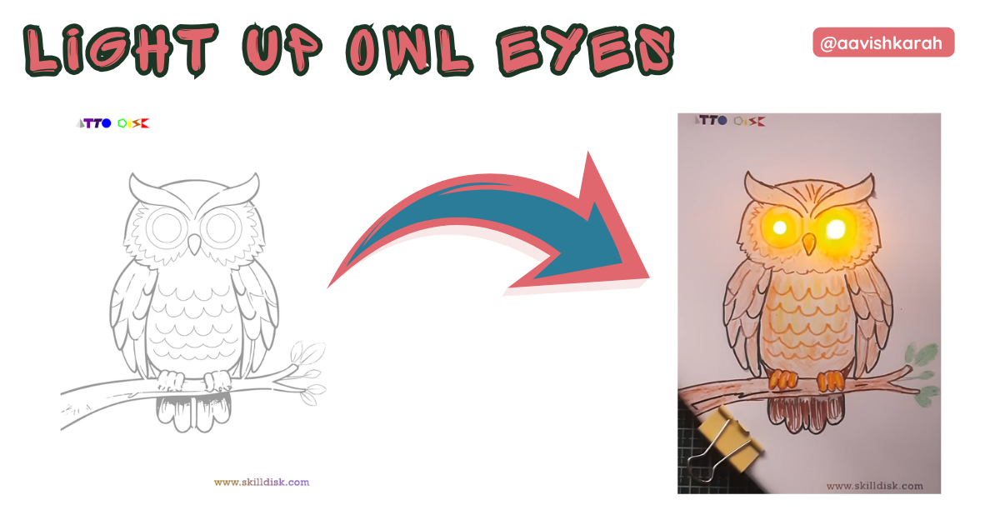
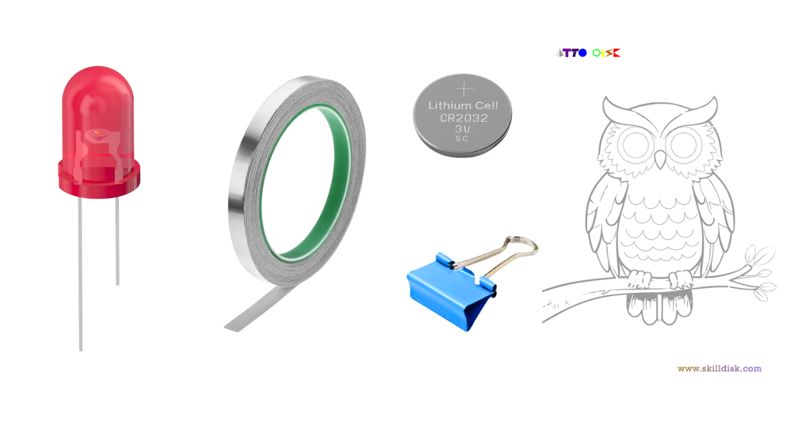
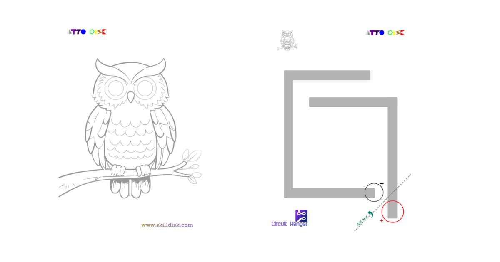
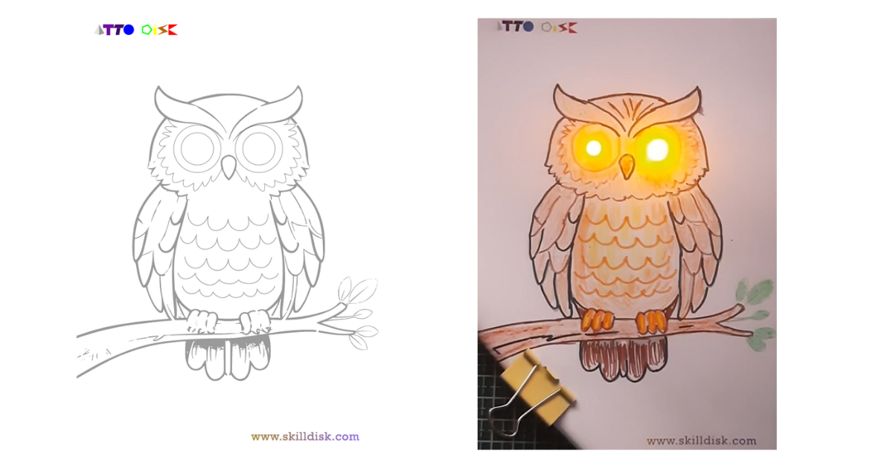

## Abstract

Welcome, young inventors! 🦉✨ Get ready to transform a simple owl coloring page into a magical, glowing masterpiece using the power of paper circuits! In this hands-on STEM activity, you'll learn how electricity flows while creating an adorable owl with eyes that literally light up. Perfect for curious minds aged 6-12, this project combines art, science, and a sprinkle of magic. Let's spark some creativity!

???- Abstract "Table of Contents"

    [TOC]

---

## What's the Mission?

Your mission, should you choose to accept it, is to build a working electrical circuit on paper that makes your owl's eyes glow! 

**Learning Objectives:**

- Understand the basics of electrical circuits
- Learn about conductors and insulators
- Practice fine motor skills and creativity
- Discover how real-world electronics work
- Have loads of fun while learning!

By the end of this adventure, you'll have a glowing owl art piece and a better understanding of how electricity powers the devices around you!

---

## The Inventor's Toolkit

Gather these materials before starting your project:

<!-- Advertisement -->
--8<-- "includes/circuit-ranger-link-cta.md"

### Essential Components:
- **Owl Art Template** 
- **LED Lights**: 2 pieces (any color you like!)
- **3V Coin Battery** (CR2032 works perfectly)
- **Aluminum Foil** or conductive copper tape
- **Binder Clip**: 1 piece (to hold the battery)
- **Scissors, and Pencil**

!!! tip "🔗 Get the Full Experience " 
    🛒 [**Circuit Ranger Scout: Circuit + Arts Kit**](https://www.skilldisk.com/product-page/circuit-ranger-scout-circuit-arts-hands-on-paper-circuit)  

    *Turn drawings into glowing tech-art with step-by-step activities designed for ages 6+!*

<!-- Advertisement -->
--8<-- "includes/circuit-ranger-cta.md"

The Circuit Ranger kit includes everything you need plus expertly designed templates, making your circuit-building journey smoother and more successful. It's specially crafted for young makers who want to explore electronics through art!

---

## Understanding Components

Let's meet your team of electronic heroes:

### 🔋 **3V Coin Battery**
This small, round battery is the POWERHOUSE of your project! It stores electrical energy and pushes it through your circuit. Think of it as the heart pumping energy to your owl's eyes.

### 💡 **LED Lights (Light Emitting Diodes)**
These tiny lights are the STARS of the show! LEDs only work when electricity flows through them in the right direction. They have two legs:
- **Longer leg** = Positive (+) 
- **Shorter leg** = Negative (-)

### 📎 **Binder Clip**
This isn't just for holding papers! The metal binder clip acts as a bridge, connecting your battery to the circuit and keeping everything snug and secure.

### **Aluminum Foil**
Aluminum is a CONDUCTOR, meaning electricity can flow through it easily! You'll create paths (like roads) for electricity to travel from the battery to the LEDs.

### 🦉 **The Owl Template**
Your canvas! The template shows exactly where to place your circuit paths (the gray lines in the second image) to make the magic happen.

---

## Step-by-Step Discovery

### Step 1: Prepare Your Canvas 🎨
- Print or trace the owl template on cardstock or thick paper
- Color your owl (but leave the eyes white for now!)
- Identify the circuit path shown in the template (the gray maze-like pattern)

### Step 2: Create Conductive Paths 🔌
- Cut strips of aluminum foil 
- Follow the circuit path template carefully:
  - One path goes from the battery area to the positive LED position
  - The second path connects to the negative LED
  - Make sure your paths don't touch each other 

**Pro Tip:** Smooth out any wrinkles in the foil for better conductivity!

### Step 3: Position Your LEDs 💡
- Poke two small holes where the owl's eyes should be
- Push the LED legs through from the front
- **Important:** Make sure the LONGER legs (positive) touch one circuit path and the SHORTER legs (negative) touch the other path
- Bend the legs flat against the back of the paper
- Secure with a small piece of tape

### Step 4: Install the Battery 🔋
- Place the 3V coin battery at the designated spot (marked with + and - on the template)
- The POSITIVE side (usually marked with +) should face UP
- Use the binder clip to hold the battery firmly in place
- The clip should touch both the battery and the foil paths

### Step 5: Test Your Circuit! ✨
- Once everything is connected, your owl's eyes should LIGHT UP!
- If they don't glow, check the "Oops! Guide" below

### Step 6: Decorate and Display 🌟
- Add final touches to your owl
- Show off your glowing creation to family and friends
- You're now a certified Circuit Ranger!

**Want more adventures?** Check out the complete **[Circuit Ranger Scout Kit](https://www.skilldisk.com/product-page/circuit-ranger-scout-circuit-arts-hands-on-paper-circuit)** with multiple projects and detailed guides!

---

## The "Oops!" Guide (Troubleshooting)

Uh oh! Is your owl being shy and not lighting up? Don't worry—every inventor faces challenges! Here's how to fix common problems:

### Problem 1: No Light At All 💔

**Possible Causes:**

- Battery is upside down (flip it so + faces up)
- Binder clip isn't touching both the battery & the foil
- Circuit path has a break or gap

**Fix:** Check all connections and make sure everything is touching!

### Problem 2: Only One Eye Lights Up 👁️

**Possible Causes:**

- One LED is connected backwards
- The foil path to one LED is broken

**Fix:** Remember, LEDs have direction! Make sure both LEDs have their long legs on the same path (positive).

### Problem 3: Dim or Flickering Light 💡

**Possible Causes:**
- Foil isn't making good contact
- Battery is loose
- Wrinkled or torn foil

**Fix:** Smooth out the foil, tighten the binder clip, and ensure all connections are flat and secure.

### Pro Troubleshooting Tips:

✅ Press down firmly on all foil connections  
✅ Make sure foil strips don't accidentally touch each other  
✅ Check that LED legs are touching the foil (not just near it)  
✅ Try a fresh battery if nothing works  

---

## Conclusion & Call-to-Action

🎉 **Congratulations, Circuit Ranger!** You've just built a working electrical circuit and learned the fundamentals of electronics—all while creating an adorable glowing owl!

### Ready for Your Next Adventure?

Don't stop here! The world of paper circuits is full of amazing projects waiting for you:

!!! info "✨ Upgrade Your Skills with Circuit Ranger!"  

    Ready for more glowing adventures? The **[Circuit Ranger Scout: Circuit + Arts Kit](https://www.skilldisk.com/product-page/circuit-ranger-scout-circuit-arts-hands-on-paper-circuit)** takes learning further with:

    - Multiple themed projects (greeting cards, bookmarks, posters)
    - Live video tutorials
    - Premium conductive materials
    - Expert tips and tricks
    - A community of young makers 

🛒 **Grab Your Kit Today**:  

<!-- Advertisement -->
--8<-- "includes/circuit-ranger-cta.md"

### Share Your Creation!
📸 Take a photo of your glowing owl and share it with us! Tag #CircuitRanger or #AttoDisk to inspire other young inventors.

**Happy Making! 🔬✨**
