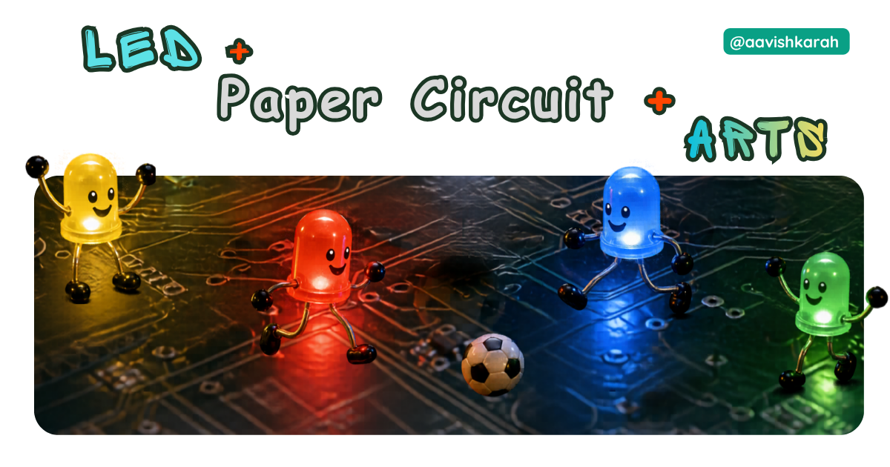
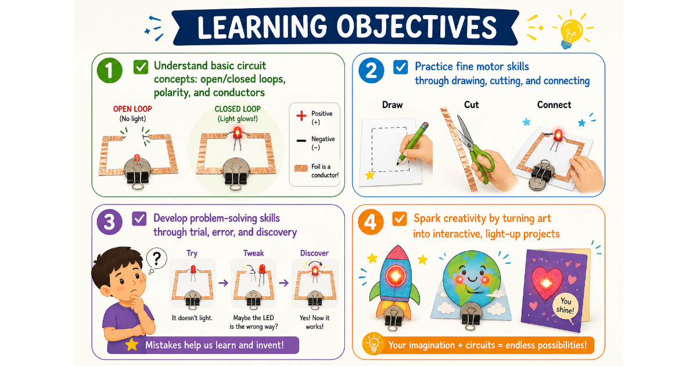
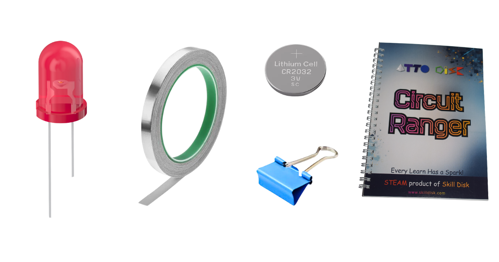
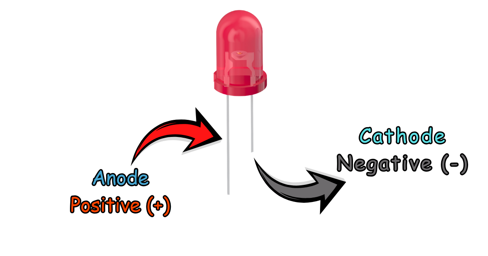
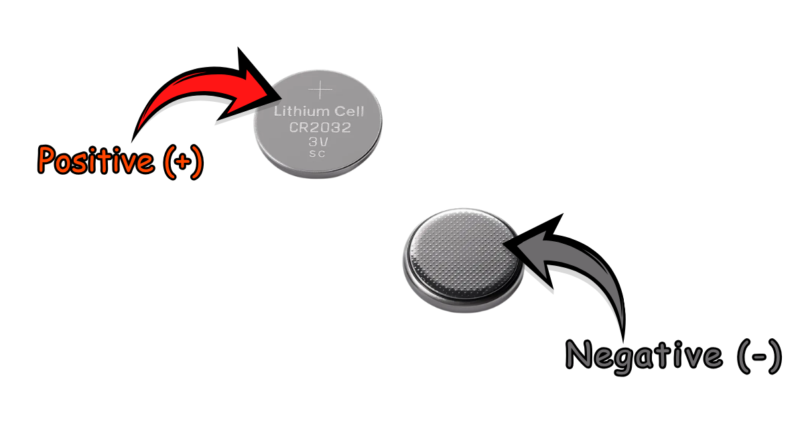
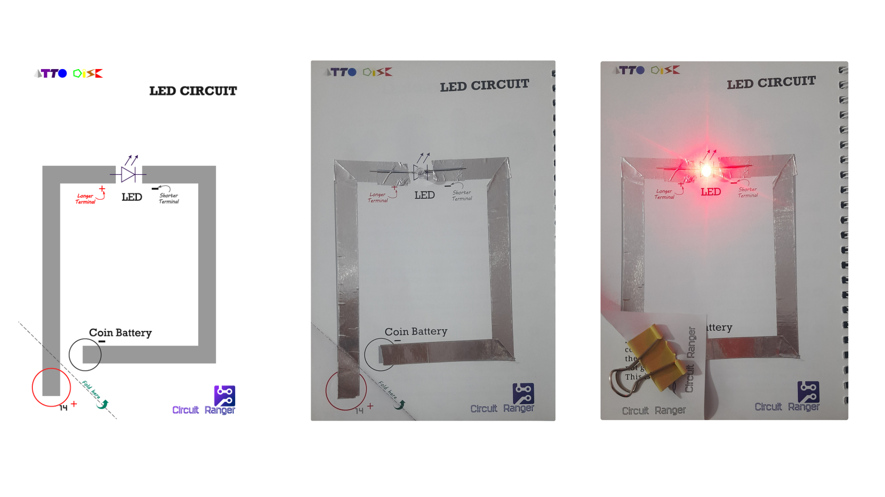
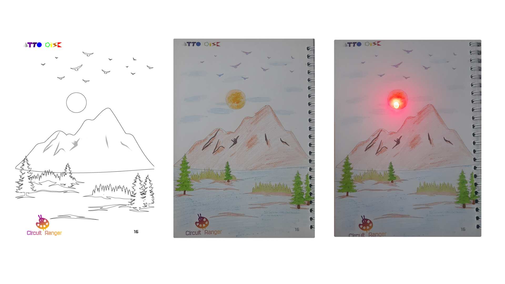

## Abstract  

Discover the magic of electricity with a simple, screen-free STEM activity! In this hands-on tutorial, kids will learn how to build a glowing LED circuit using everyday materials like paper, aluminum foil, and a coin battery. Perfect for curious young inventors ages 6+, this project blends creativity with core electronics concepts—no soldering or prior experience needed. Plus, with the **Circuit Ranger Scout** kit, learning becomes an artistic adventure that lights up both minds and paper!

<video controls autoplay loop>
  <source src="./videos/Led-Circuit.mp4" type="video/mp4">
  Your browser does not support the video tag.
</video>

???- Abstract "Table of Contents"

    [TOC]

---

## 🎯 What's the Mission?

**Goal:** Build a working LED circuit on paper to understand how electricity flows—and make something that *glows*! ✨

**Learning Objectives:**

- ✅ Understand basic circuit concepts: open/closed loops, polarity, and conductors
- ✅ Practice fine motor skills through drawing, cutting, and connecting
- ✅ Develop problem-solving skills through trial, error, and discovery
- ✅ Spark creativity by turning art into interactive, light-up projects

!!! tip "💡 Why paper circuits?" 
    They transform abstract science into visible, joyful results—making STEM feel like play!

---

## 🧰 The Inventor's Toolkit (Materials)

<!-- Advertisement -->
--8<-- "includes/circuit-ranger-link-cta.md"

| Item | Quantity | Why We Need It |
|------|----------|---------------|
| **Paper Circuit Book / Template** | 1 sheet | The "canvas" for your circuit |
| **LED (Light Emitting Diode)** | 1 No | The tiny light that glows when powered |
| **Aluminium Foil** | ~15 cm strip | A safe, accessible conductor  |
| **3V Coin Battery (CR2032)** | 1 No | Powers your circuit—safe low voltage for kids |
| **Binder Clip** | 1 No | Acts as a switch AND holds the battery in place |
| **✏️ Tape & Scissors** | As needed | For securing foil and shaping your design |
| **🌟 Circuit Ranger Scout Kit** | *Recommended* | All-in-one guided learning with templates, safety tips, and creative challenges! |

!!! tip "🔗 Get the Full Experience " 
    🛒 [**Circuit Ranger Scout: Circuit + Arts Kit**](https://www.skilldisk.com/product-page/circuit-ranger-scout-circuit-arts-hands-on-paper-circuit)  

    *Turn drawings into glowing tech-art with step-by-step activities designed for ages 6+!*

<!-- Advertisement -->
--8<-- "includes/circuit-ranger-cta.md"

---

## 🔍 Understanding Components

### 💡 LED (Light Emitting Diode)
- Has two legs: **Long leg = Positive (+)**, **Short leg = Negative (–)**  
- Only lights up when electricity flows the *right way* (that's *polarity*!)  
- Super efficient: Converts electricity directly into light—no heat waste!

### 🔋 3V Coin Battery (CR2032)
- Flat, silver, and safe for supervised kid projects  
- **Smooth side = Positive (+)**, **Textured side = Negative (–)**  
- ⚠️ *Adult supervision required*: Keep away from mouths—store safely after use!

### 🥈 Aluminum Foil
- A **conductor**: Lets electricity flow like a tiny highway!  
- Cut into strips to create "wires" on paper  
- Tip: Press firmly for best connection—no gaps!

### 📎 Binder Clip
- **Double-duty hero**:  
  1️⃣ Holds battery tightly against foil contacts  
  2️⃣ Acts as a manual switch—release to turn OFF, clamp to turn ON!

### 🌟 Why Circuit Ranger Scout Makes Learning Shine
Unlike generic kits, **Circuit Ranger** blends:  
✅ Pre-printed circuit-ready art templates  
✅ Progressive skill-building activities  
✅ Safety-first design with clear visual guides  
✅ STEAM focus: Where *art* meets *engineering*  

!!! info
    "Instead of learning circuits through theory alone, kids draw, paste, connect, and light up their own artwork."

---

## 🚀 Step-by-Step Discovery (The Activity)

### 📝 Prep Work (5 mins)
1. Use Circuit Ranger template or Draw a simple shape on paper (star, heart, robot—your choice!).    
2. Cut foil strips (~15 cm long).

### 🔌 Build Your Circuit (10 mins)

1. **Tape foil strips** from each LED leg to where the battery will sit:  
   - Strip 1: Long leg (+) → Battery's smooth side (+)  
   - Strip 2: Short leg (–) → Battery's textured side (–)  
2. **Place LED** : long leg on positive side, short on the negative side.
3. **Place the battery** between the foil ends.  
4. **Clip the binder clip** over the battery and foil to secure everything.  

!!! warning "Safety First"
    Always supervise children with small batteries. 
    Store coin cells out of reach, and dispose of used batteries responsibly.  

### 🎨 Make It Yours!
- Decorate around your circuit with markers, stickers, or cut-outs  
- Try folding paper into a card—your circuit becomes a surprise light-up message!  
- *Pro Tip from Circuit Ranger*: Use their themed templates (space, animals, festivals) for instant creative boosts!

!!! info "🔗 Level Up Your Project""  
    Explore mission activities in the [**Circuit Ranger Scout Kit**](https://www.skilldisk.com/product-page/circuit-ranger-scout-circuit-arts-hands-on-paper-circuit) — from glowing greeting cards to interactive paper puppets! ⚡

<!-- Advertisement -->
--8<-- "includes/circuit-ranger-link-cta.md"

!!! tip "📸 Share Your Glow-Up!" 
    Tag us with `#CircuitRanger` or `#AttoDisk` or `#PaperCircuitKids` — we love seeing young inventors shine! 💡

---

## 🛠️ The "Oops!" Guide (Troubleshooting)

Did it not light up? Don't worry—even the best engineers face this

- **Check the LED Legs:** Did you swap the long and short legs? LEDs are directional! Try flipping the LED around.
- **Battery Orientation:** Is the positive side of the battery touching the positive path? Try flipping the battery.
- **Foil Connection:** Are the foil strips touching where they shouldn't? Ensure there is a gap between the two paths.
- **Loose Contacts:** Is the binder clip tight enough? Make sure the foil is firmly touching the battery surface.

!!! info "💡 Circuit Ranger Pro Tip" 
    Their kit includes *troubleshooting cards* with visual clues—so kids learn to debug like real engineers!

---

## 🌈 Conclusion & Call-to-Action

You did it! 🎉 With just paper, foil, and a little curiosity, you've unlocked the fundamentals of electronics—and made something magical glow. This simple project is just the beginning of a lifelong journey in STEM, creativity, and confident problem-solving.

!!! info "✨ Keep the Spark Alive!"  

    Ready for more glowing adventures? The **[Circuit Ranger Scout: Circuit + Arts Kit](https://www.skilldisk.com/product-page/circuit-ranger-scout-circuit-arts-hands-on-paper-circuit)** takes learning further with:

    - 📘 20+ progressive, screen-free activities  
    - 🎨 Themed art templates (festivals, nature, space!)  
    - 🔒 Child-safe components & clear visual instructions  
    - 🌍 Perfect for classrooms, homeschool, or family fun nights  

🛒 **Grab Your Kit Today**:  

<!-- Advertisement -->
--8<-- "includes/circuit-ranger-cta.md"

---

📸 **Share Your Glow-Up!**  
Tag us with #CircuitRanger or #AttoDisk or #PaperCircuitKids — we love seeing young inventors shine! 💡

!!! warning "Safety First"
    Always supervise children with small batteries. 
    Store coin cells out of reach, and dispose of used batteries responsibly.  

